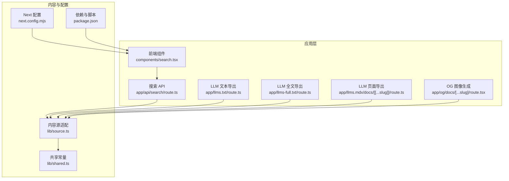
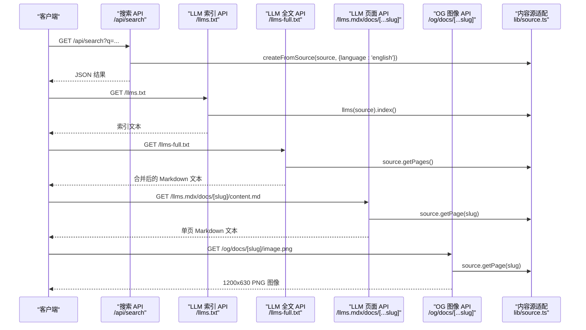
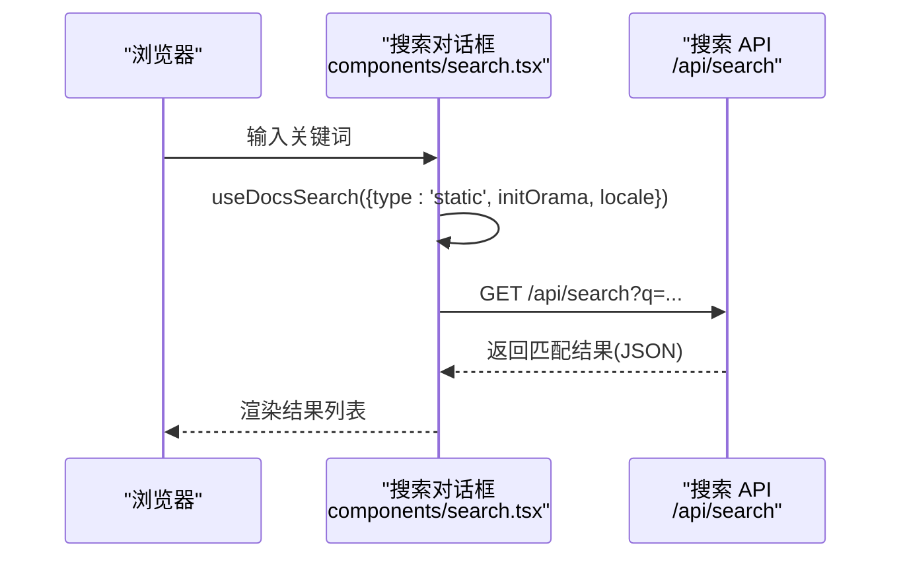
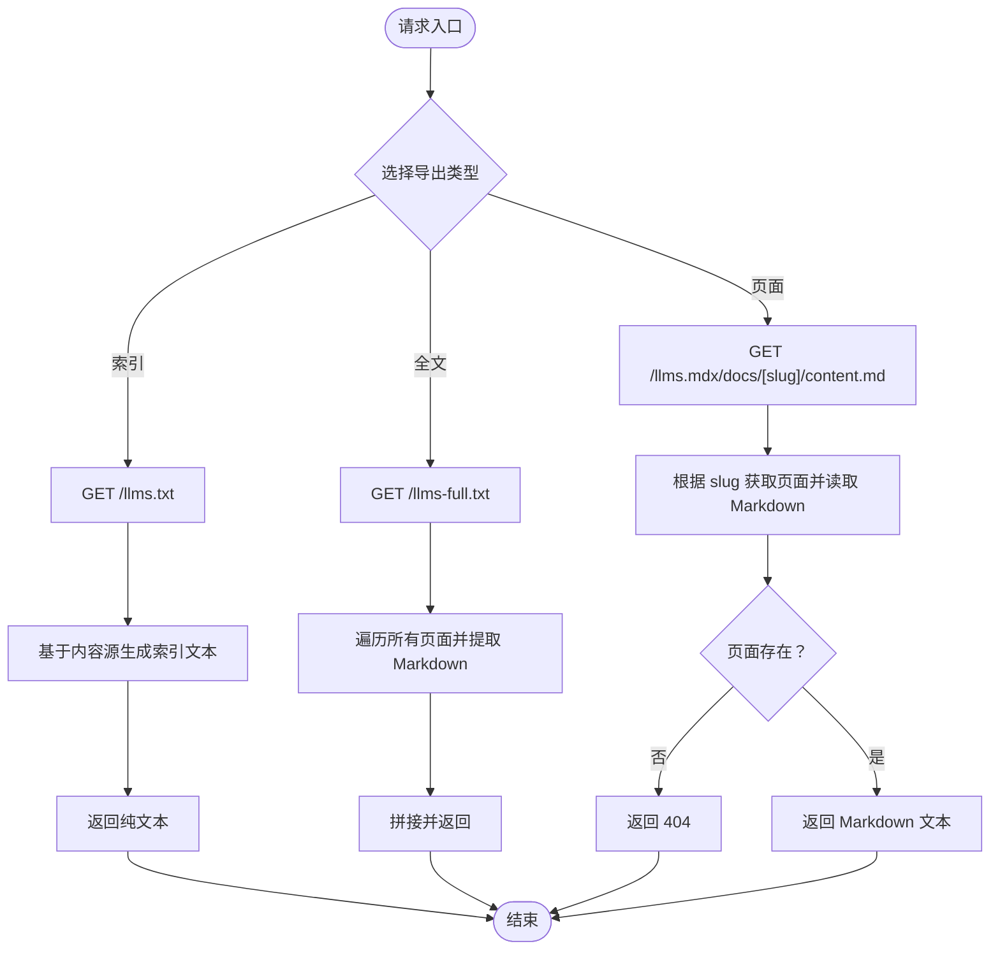
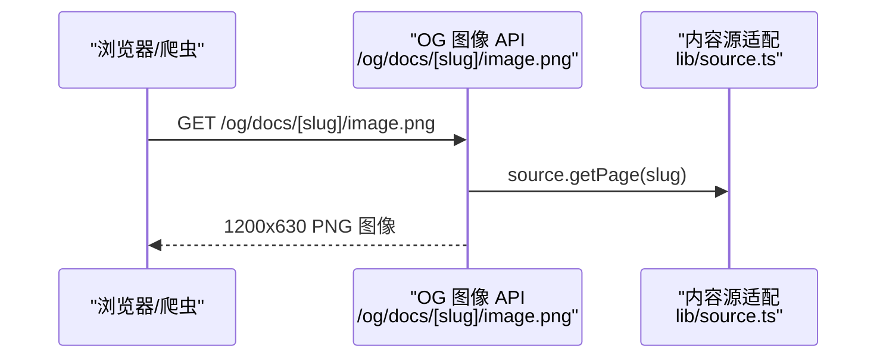
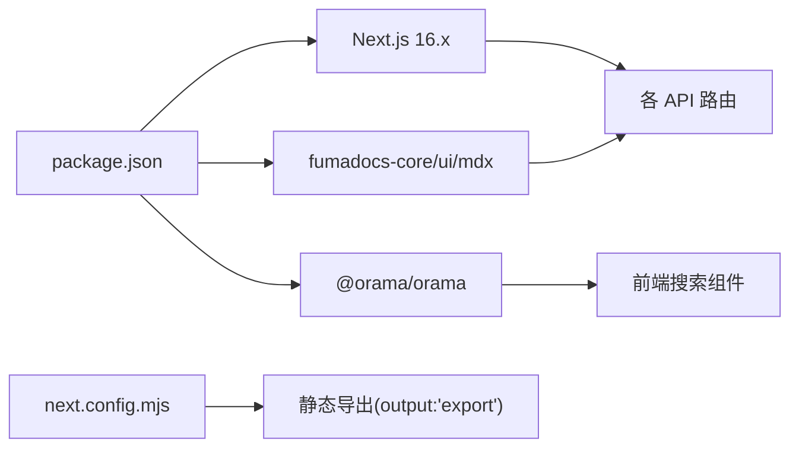

# API 接口参考

<cite>
**本文引用的文件**
- [app/api/search/route.ts](file://app/api/search/route.ts)
- [app/llms-full.txt/route.ts](file://app/llms-full.txt/route.ts)
- [app/llms.mdx/docs/[[...slug]]/route.ts](file://app/llms.mdx/docs/[[...slug]]/route.ts)
- [app/llms.txt/route.ts](file://app/llms.txt/route.ts)
- [app/og/docs/[...slug]/route.tsx](file://app/og/docs/[...slug]/route.tsx)
- [lib/source.ts](file://lib/source.ts)
- [lib/shared.ts](file://lib/shared.ts)
- [components/search.tsx](file://components/search.tsx)
- [next.config.mjs](file://next.config.mjs)
- [package.json](file://package.json)
- [README.md](file://README.md)
</cite>

## 目录
1. [简介](#简介)
2. [项目结构](#项目结构)
3. [核心组件](#核心组件)
4. [架构总览](#架构总览)
5. [详细组件分析](#详细组件分析)
6. [依赖分析](#依赖分析)
7. [性能考虑](#性能考虑)
8. [故障排查指南](#故障排查指南)
9. [结论](#结论)
10. [附录](#附录)

## 简介
本文件为 DocME 项目的 API 接口参考文档，面向第三方开发者，系统性说明以下 API 的规范与使用方式：
- 搜索 API：提供全文检索能力，支持静态索引与客户端本地 Orama 初始化。
- LLM 内容导出 API：按页面导出 Markdown 文本，用于大模型训练或检索增强。
- OG 图像生成 API：基于 Next.js OG 动态生成社交分享图（Open Graph）。

同时，文档涵盖认证方式、速率限制、版本控制、性能优化与监控建议、常见使用场景与客户端集成指导，以及错误处理策略与调试技巧。

## 项目结构
该应用采用 Next.js App Router，API 路由位于 app/api 与 app 下的专用目录中；内容来源通过 lib/source.ts 统一适配，共享常量在 lib/shared.ts 中定义；前端搜索组件在 components/search.tsx 中使用 fumadocs-core 提供的客户端搜索能力。

图表来源
- [components/search.tsx:1-47](file://components/search.tsx#L1-L47)
- [app/api/search/route.ts:1-10](file://app/api/search/route.ts#L1-L10)
- [app/llms.txt/route.ts:1-9](file://app/llms.txt/route.ts#L1-L9)
- [app/llms-full.txt/route.ts:1-11](file://app/llms-full.txt/route.ts#L1-L11)
- [app/llms.mdx/docs/[[...slug]]/route.ts:1-24](file://app/llms.mdx/docs/[[...slug]]/route.ts#L1-L24)
- [app/og/docs/[...slug]/route.tsx:1-29](file://app/og/docs/[...slug]/route.tsx#L1-L29)
- [lib/source.ts:1-37](file://lib/source.ts#L1-L37)
- [lib/shared.ts:1-12](file://lib/shared.ts#L1-L12)
- [next.config.mjs:1-15](file://next.config.mjs#L1-L15)
- [package.json:1-39](file://package.json#L1-L39)

章节来源
- [README.md:27-32](file://README.md#L27-L32)
- [next.config.mjs:1-15](file://next.config.mjs#L1-L15)
- [package.json:12-26](file://package.json#L12-L26)

## 核心组件
- 内容源适配器（lib/source.ts）
  - 通过 loader 将内容集合转换为可查询的数据源，并提供工具函数：getPageImage、getPageMarkdownUrl、getLLMText。
- 共享常量（lib/shared.ts）
  - 定义站点名称、文档路由前缀、OG 图像路由前缀、内容 Markdown 路由前缀等。
- 前端搜索组件（components/search.tsx）
  - 使用 fumadocs-core 的 useDocsSearch 与 Orama 在浏览器侧初始化本地索引，支持静态类型与语言设置。

章节来源
- [lib/source.ts:1-37](file://lib/source.ts#L1-L37)
- [lib/shared.ts:1-12](file://lib/shared.ts#L1-L12)
- [components/search.tsx:17-31](file://components/search.tsx#L17-L31)

## 架构总览
下图展示 API 与内容源、前端组件之间的交互关系：

图表来源
- [app/api/search/route.ts:6-9](file://app/api/search/route.ts#L6-L9)
- [app/llms.txt/route.ts:6-8](file://app/llms.txt/route.ts#L6-L8)
- [app/llms-full.txt/route.ts:5-10](file://app/llms-full.txt/route.ts#L5-L10)
- [app/llms.mdx/docs/[[...slug]]/route.ts:6-17](file://app/llms.mdx/docs/[[...slug]]/route.ts#L6-L17)
- [app/og/docs/[...slug]/route.tsx:9-21](file://app/og/docs/[...slug]/route.tsx#L9-L21)
- [lib/source.ts:6-10](file://lib/source.ts#L6-L10)

## 详细组件分析

### 搜索 API
- HTTP 方法与 URL
  - 方法：GET
  - 路径：/api/search
  - 查询参数：q（必填），可选 limit（未在实现中显式使用）
- 请求/响应
  - 请求：无请求体，查询字符串 q 作为关键词。
  - 响应：JSON 数组，每项包含匹配结果的元数据（如标题、URL、片段等）。具体字段由底层搜索引擎返回。
- 错误处理
  - 未找到内容时返回空数组或空结果集；未显式抛错。
- 语言与分词
  - 服务端初始化时指定语言为英语，确保英文检索效果。
- 客户端集成
  - 前端使用 useDocsSearch 与本地 Orama 初始化，支持静态类型与语言设置，适合离线或快速体验。

图表来源
- [components/search.tsx:25-31](file://components/search.tsx#L25-L31)
- [app/api/search/route.ts:6-9](file://app/api/search/route.ts#L6-L9)

章节来源
- [app/api/search/route.ts:1-10](file://app/api/search/route.ts#L1-L10)
- [components/search.tsx:17-31](file://components/search.tsx#L17-L31)

### LLM 内容导出 API
- 索引文本 API（/llms.txt）
  - 方法：GET
  - 路径：/llms.txt
  - 响应：纯文本，内容为基于内容源生成的索引文本。
  - 用途：便于外部系统直接消费索引进行二次处理。
- 全文导出 API（/llms-full.txt）
  - 方法：GET
  - 路径：/llms-full.txt
  - 响应：纯文本，合并所有页面的 Markdown 文本，每页之间以分隔符分隔。
  - 用途：用于大模型训练、RAG 数据准备或全文检索。
- 页面级导出 API（/llms.mdx/docs/[...slug]/content.md）
  - 方法：GET
  - 路径：/llms.mdx/docs/[slug]/content.md
  - 响应：纯文本（Content-Type: text/markdown），单页 Markdown 内容。
  - 用途：按需导出特定页面，便于增量更新或微调。
- 错误处理
  - 当 slug 对应页面不存在时，返回 404。
- 性能与体积
  - 全文导出会聚合所有页面文本，注意在大规模内容时的内存与传输开销。

图表来源
- [app/llms.txt/route.ts:6-8](file://app/llms.txt/route.ts#L6-L8)
- [app/llms-full.txt/route.ts:5-10](file://app/llms-full.txt/route.ts#L5-L10)
- [app/llms.mdx/docs/[[...slug]]/route.ts:6-17](file://app/llms.mdx/docs/[[...slug]]/route.ts#L6-L17)

章节来源
- [app/llms.txt/route.ts:1-9](file://app/llms.txt/route.ts#L1-L9)
- [app/llms-full.txt/route.ts:1-11](file://app/llms-full.txt/route.ts#L1-L11)
- [app/llms.mdx/docs/[[...slug]]/route.ts:1-24](file://app/llms.mdx/docs/[[...slug]]/route.ts#L1-L24)
- [lib/source.ts:30-36](file://lib/source.ts#L30-L36)

### OG 图像生成 API
- 动态图像 API（/og/docs/[...slug]/image.png）
  - 方法：GET
  - 路径：/og/docs/[slug]/image.png
  - 响应：1200x630 PNG 图像，包含页面标题、描述与站点名称。
  - 用途：用于社交媒体分享预览图，提升 SEO 与传播效果。
- 错误处理
  - 当 slug 对应页面不存在时，返回 404。
- 静态参数生成
  - 支持静态生成参数，便于构建阶段提前生成 OG 图像。

图表来源
- [app/og/docs/[...slug]/route.tsx:9-21](file://app/og/docs/[...slug]/route.tsx#L9-L21)
- [lib/source.ts:12-19](file://lib/source.ts#L12-L19)

章节来源
- [app/og/docs/[...slug]/route.tsx:1-29](file://app/og/docs/[...slug]/route.tsx#L1-L29)
- [lib/shared.ts:1-5](file://lib/shared.ts#L1-L5)

## 依赖分析
- 外部依赖与版本
  - Next.js 16.2.4（App Router、OG 图像、静态导出）
  - fumadocs-core、fumadocs-ui、fumadocs-mdx：内容源适配、UI 组件与 MDX 支持
  - @orama/orama：客户端本地搜索
- 配置影响
  - next.config.mjs 启用静态导出（output: 'export'），适合静态托管部署。
  - package.json 定义了开发与构建脚本，以及依赖版本。

图表来源
- [package.json:12-26](file://package.json#L12-L26)
- [next.config.mjs:6-12](file://next.config.mjs#L6-L12)

章节来源
- [package.json:1-39](file://package.json#L1-L39)
- [next.config.mjs:1-15](file://next.config.mjs#L1-L15)

## 性能考虑
- 缓存与重建
  - 所有 API 路由均设置 revalidate: false，表示不自动重建，适合静态导出场景。
- 搜索性能
  - 前端使用 Orama 在浏览器侧初始化本地索引，减少网络请求；服务端搜索使用英文语言配置，提升检索效率。
- 导出体积
  - 全文导出会聚合所有页面文本，建议在 CI 中按需触发，避免频繁全量导出。
- OG 图像
  - 固定尺寸 1200x630，建议配合静态生成减少运行时开销。
- 监控建议
  - 结合静态托管日志与 CDN 访问日志，观察各 API 的访问量与错误率。
  - 对于搜索与导出接口，建议在网关或反向代理层设置基础限流与健康检查。

[本节为通用性能建议，无需特定文件引用]

## 故障排查指南
- 404 场景
  - 搜索 API：关键词无匹配或内容源为空。
  - OG 图像 API：slug 不正确或页面不存在。
  - 页面导出 API：slug 不正确或页面不存在。
- 语言与分词问题
  - 若检索效果不佳，确认服务端语言配置是否为英语；前端 Orama 初始化语言也需一致。
- 导出内容异常
  - 全文导出为空：检查内容源是否正确加载，或页面是否存在。
  - 页面导出为空：确认页面 Markdown 是否存在且可读。
- 部署相关
  - 静态导出后，动态 API 可能无法在静态托管环境中运行；请确认部署方式与输出类型。

章节来源
- [app/og/docs/[...slug]/route.tsx:11-12](file://app/og/docs/[...slug]/route.tsx#L11-L12)
- [app/llms.mdx/docs/[[...slug]]/route.ts:10-10](file://app/llms.mdx/docs/[[...slug]]/route.ts#L10-L10)

## 结论
本项目提供了三类关键 API：搜索、LLM 内容导出与 OG 图像生成，配合前端本地搜索与静态导出能力，适合在静态托管环境下稳定运行。第三方开发者可依据本文档对接搜索与导出接口，并结合前端组件实现本地检索体验；OG 图像 API 则可直接用于社交分享预览。

[本节为总结性内容，无需特定文件引用]

## 附录

### API 规范速查
- 搜索 API
  - 方法：GET
  - 路径：/api/search
  - 查询参数：q（必填），limit（可选）
  - 响应：JSON 匹配结果
- LLM 索引 API
  - 方法：GET
  - 路径：/llms.txt
  - 响应：纯文本（索引）
- LLM 全文 API
  - 方法：GET
  - 路径：/llms-full.txt
  - 响应：纯文本（合并后的 Markdown）
- LLM 页面 API
  - 方法：GET
  - 路径：/llms.mdx/docs/[slug]/content.md
  - 响应：text/markdown
- OG 图像 API
  - 方法：GET
  - 路径：/og/docs/[slug]/image.png
  - 响应：1200x630 PNG

章节来源
- [app/api/search/route.ts:6-9](file://app/api/search/route.ts#L6-L9)
- [app/llms.txt/route.ts:6-8](file://app/llms.txt/route.ts#L6-L8)
- [app/llms-full.txt/route.ts:5-10](file://app/llms-full.txt/route.ts#L5-L10)
- [app/llms.mdx/docs/[[...slug]]/route.ts:6-17](file://app/llms.mdx/docs/[[...slug]]/route.ts#L6-L17)
- [app/og/docs/[...slug]/route.tsx:9-21](file://app/og/docs/[...slug]/route.tsx#L9-L21)

### 认证与安全
- 当前实现未包含认证头或令牌校验，适用于公开内容。
- 建议在生产环境通过网关或反向代理添加认证与速率限制。

[本节为通用建议，无需特定文件引用]

### 速率限制与版本控制
- 速率限制：未在代码中实现，建议在网关或反向代理层配置。
- 版本控制：当前 API 未包含版本号路径段，建议未来引入 /v1 前缀以兼容演进。

[本节为通用建议，无需特定文件引用]

### 客户端集成示例（步骤指引）
- 搜索集成
  - 在前端使用 useDocsSearch，type 设为 'static'，initOrama 中设置语言为 'english'。
  - 调用 /api/search?q=关键词 获取结果。
- LLM 导出集成
  - 拉取 /llms.txt 获取索引文本，或拉取 /llms-full.txt 获取全文。
  - 对于单页导出，调用 /llms.mdx/docs/[slug]/content.md。
- OG 图像集成
  - 在页面 meta 中使用 /og/docs/[slug]/image.png 作为 og:image。

章节来源
- [components/search.tsx:25-31](file://components/search.tsx#L25-L31)
- [app/api/search/route.ts:6-9](file://app/api/search/route.ts#L6-L9)
- [app/llms-full.txt/route.ts:5-10](file://app/llms-full.txt/route.ts#L5-L10)
- [app/llms.mdx/docs/[[...slug]]/route.ts:6-17](file://app/llms.mdx/docs/[[...slug]]/route.ts#L6-L17)
- [app/og/docs/[...slug]/route.tsx:9-21](file://app/og/docs/[...slug]/route.tsx#L9-L21)