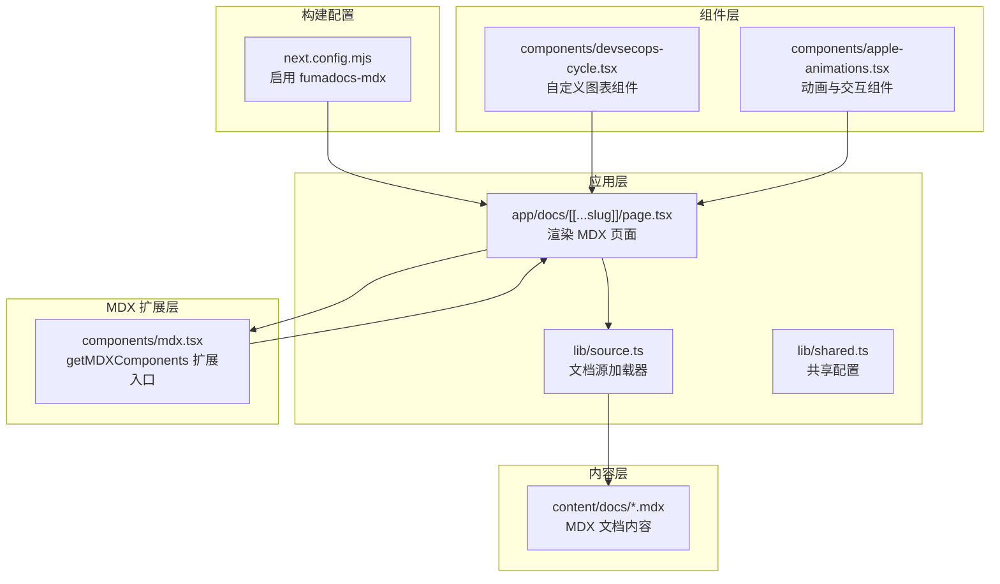
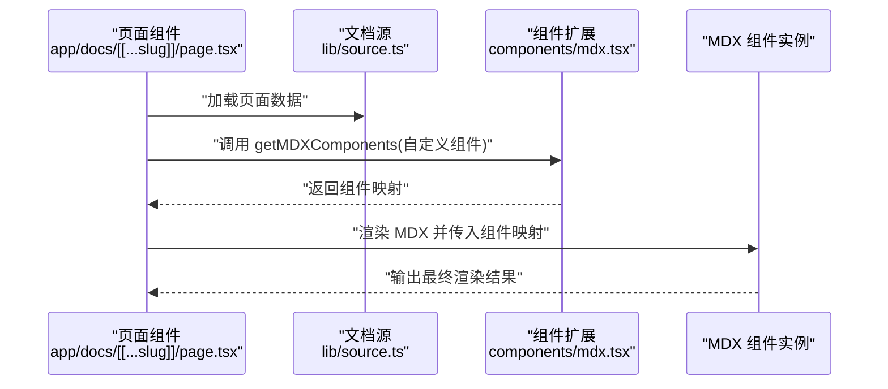
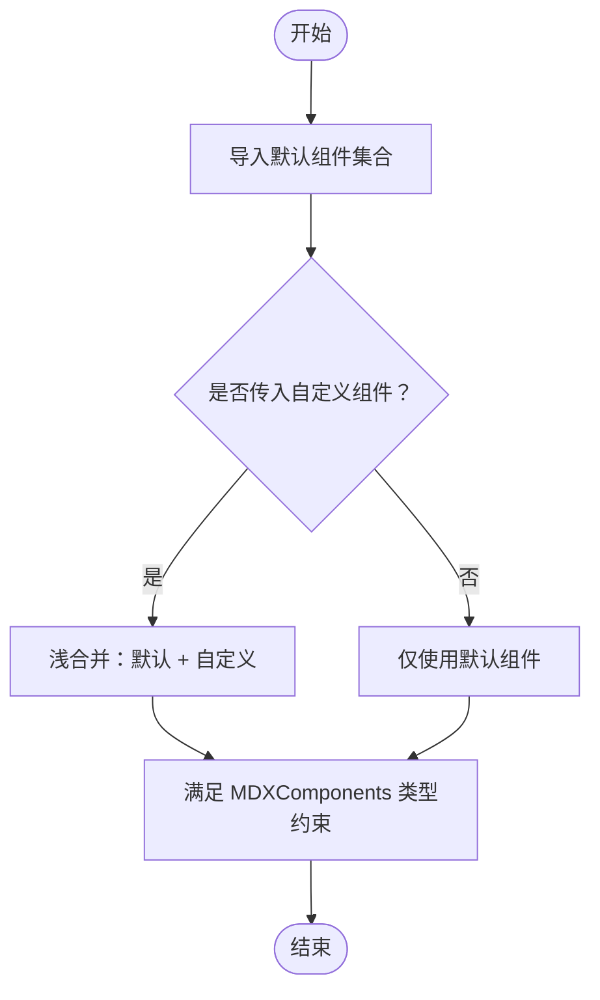
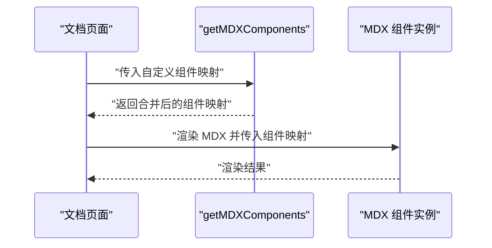
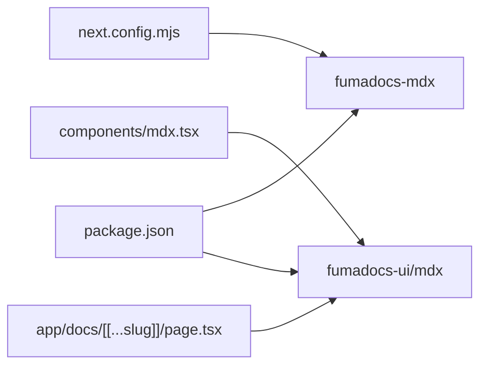

# MDX 组件扩展

<cite>
**本文引用的文件**
- [components/mdx.tsx](file://components/mdx.tsx)
- [app/docs/[[...slug]]/page.tsx](file://app/docs/[[...slug]]/page.tsx)
- [next.config.mjs](file://next.config.mjs)
- [lib/source.ts](file://lib/source.ts)
- [lib/shared.ts](file://lib/shared.ts)
- [components/devsecops-cycle.tsx](file://components/devsecops-cycle.tsx)
- [components/apple-animations.tsx](file://components/apple-animations.tsx)
- [content/docs/index.mdx](file://content/docs/index.mdx)
- [content/docs/test.mdx](file://content/docs/test.mdx)
- [package.json](file://package.json)
</cite>

## 目录
1. [简介](#简介)
2. [项目结构](#项目结构)
3. [核心组件](#核心组件)
4. [架构总览](#架构总览)
5. [详细组件分析](#详细组件分析)
6. [依赖分析](#依赖分析)
7. [性能考虑](#性能考虑)
8. [故障排查指南](#故障排查指南)
9. [结论](#结论)
10. [附录](#附录)

## 简介
本指南围绕 MDX 组件扩展展开，重点讲解以下内容：
- getMDXComponents 函数的实现原理与使用方式
- 如何扩展默认 MDX 组件（defaultMdxComponents）并添加自定义组件
- MDX 组件的注册机制与覆盖规则
- 常见组件（表格、代码块、图表等）的扩展示例
- 组件属性传递与事件处理机制
- 组件生命周期与渲染优化策略
- 组件测试与调试最佳实践

## 项目结构
该项目采用 Next.js App Router 架构，MDX 内容通过 fumadocs-mdx 进行编译，并在页面中以组件形式渲染。核心扩展点位于 components/mdx.tsx 中，用于统一注入和覆盖默认 MDX 组件。



**图表来源**
- [app/docs/[[...slug]]/page.tsx](file://app/docs/[[...slug]]/page.tsx#L16-L44)
- [components/mdx.tsx:1-15](file://components/mdx.tsx#L1-L15)
- [next.config.mjs:1-14](file://next.config.mjs#L1-L14)
- [lib/source.ts:1-37](file://lib/source.ts#L1-L37)
- [lib/shared.ts:1-12](file://lib/shared.ts#L1-L12)
- [content/docs/index.mdx:1-19](file://content/docs/index.mdx#L1-L19)
- [content/docs/test.mdx:1-18](file://content/docs/test.mdx#L1-L18)
- [components/devsecops-cycle.tsx:168-377](file://components/devsecops-cycle.tsx#L168-L377)
- [components/apple-animations.tsx:1-151](file://components/apple-animations.tsx#L1-L151)

**章节来源**
- [next.config.mjs:1-14](file://next.config.mjs#L1-L14)
- [components/mdx.tsx:1-15](file://components/mdx.tsx#L1-L15)
- [app/docs/[[...slug]]/page.tsx](file://app/docs/[[...slug]]/page.tsx#L16-L44)
- [lib/source.ts:1-37](file://lib/source.ts#L1-L37)
- [lib/shared.ts:1-12](file://lib/shared.ts#L1-L12)

## 核心组件
本节聚焦 getMDXComponents 的实现与用法，以及其在页面中的调用方式。

- 实现原理
  - 通过导入 fumadocs-ui 提供的默认 MDX 组件集合，将其作为基础集合
  - 将传入的自定义组件对象进行浅合并，实现“默认组件 + 自定义组件”的组合
  - 返回满足 MDXComponents 类型的对象，确保类型安全

- 使用方式
  - 在页面渲染 MDX 内容时，将 getMDXComponents 返回的组件映射传给 MDX 组件实例
  - 可在调用时传入自定义组件，例如为链接组件 a 注入相对路径跳转逻辑

- 覆盖规则
  - 合并策略为浅合并，后传入的同名键会覆盖默认组件
  - 若仅需部分覆盖，可只传入需要替换的组件键值对

- 类型声明
  - 通过全局类型声明导出 MDXProvidedComponents，便于在其他模块中复用类型

**章节来源**
- [components/mdx.tsx:1-15](file://components/mdx.tsx#L1-L15)
- [app/docs/[[...slug]]/page.tsx](file://app/docs/[[...slug]]/page.tsx#L36-L41)

## 架构总览
MDX 渲染流程的关键节点如下：
- 构建阶段：通过 fumadocs-mdx 对 MDX 文件进行编译
- 运行阶段：页面读取文档内容，调用 getMDXComponents 获取组件映射
- 渲染阶段：将 MDX 组件与组件映射一起渲染，实现默认组件与自定义组件的统一



**图表来源**
- [app/docs/[[...slug]]/page.tsx](file://app/docs/[[...slug]]/page.tsx#L16-L44)
- [components/mdx.tsx:4-8](file://components/mdx.tsx#L4-L8)
- [lib/source.ts:1-37](file://lib/source.ts#L1-L37)

## 详细组件分析

### getMDXComponents 扩展机制
- 默认组件来源：来自 fumadocs-ui/mdx，包含标题、段落、列表、代码块、表格等常用组件
- 自定义组件注入：通过传入 MDXComponents 对象，实现按需覆盖或新增
- 类型约束：返回值满足 MDXComponents 类型，避免运行期类型错误



**图表来源**
- [components/mdx.tsx:4-8](file://components/mdx.tsx#L4-L8)

**章节来源**
- [components/mdx.tsx:1-15](file://components/mdx.tsx#L1-L15)

### 页面中的组件扩展用法
- 在文档页面中，通过 getMDXComponents 注入自定义链接组件 a，使其支持相对路径跳转
- 将生成的组件映射传入 MDX 组件实例，完成渲染



**图表来源**
- [app/docs/[[...slug]]/page.tsx](file://app/docs/[[...slug]]/page.tsx#L36-L41)
- [components/mdx.tsx:4-8](file://components/mdx.tsx#L4-L8)

**章节来源**
- [app/docs/[[...slug]]/page.tsx](file://app/docs/[[...slug]]/page.tsx#L36-L41)

### 自定义组件示例

#### 表格组件
- 场景：在 MDX 中使用原生 HTML 表格标签
- 实现思路：无需额外注册，fumadocs-ui 默认已提供表格组件；如需样式或行为定制，可在自定义组件中覆盖默认表格组件
- 注意事项：保持表头与单元格的语义正确性，避免破坏可访问性

#### 代码块组件
- 场景：在 MDX 中使用代码围栏（如 ```js），默认由 fumadocs-ui 提供高亮与复制能力
- 实现思路：若需自定义样式或交互，可通过覆盖默认 code 组件实现；也可在 getMDXComponents 中传入自定义 code 组件
- 示例参考：content/docs/test.mdx 中的代码块用法

#### 图表组件
- 场景：在 MDX 中嵌入复杂 SVG 图表或可视化组件
- 实现思路：将自定义图表组件注册到 getMDXComponents 返回的映射中，然后在 MDX 中以 JSX 形式使用
- 示例参考：DevSecOps 循环图组件，可在 MDX 中以 <DevSecOpsCycle /> 形式使用

```mermaid
classDiagram
class MDXComponents {
"+table : React.ComponentType"
"+code : React.ComponentType"
"+pre : React.ComponentType"
"+a : React.ComponentType"
"+其他默认组件..."
}
class getMDXComponents {
"+getMDXComponents(components?) : MDXComponents"
}
class DevSecOpsCycle {
"+render() : ReactNode"
}
getMDXComponents --> MDXComponents : "返回"
DevSecOpsCycle ..> MDXComponents : "可作为自定义组件注入"
```

**图表来源**
- [components/mdx.tsx](file://components/mdx.tsx#L1-L15)
- [components/devsecops-cycle.tsx](file://components/devsecops-cycle.tsx#L168-L377)
- [content/docs/test.mdx](file://content/docs/test.mdx#L8-L10)

**章节来源**
- [content/docs/test.mdx](file://content/docs/test.mdx#L8-L10)
- [components/devsecops-cycle.tsx](file://components/devsecops-cycle.tsx#L168-L377)

### 属性传递与事件处理
- 属性传递：自定义组件接收父级传入的 props，如 className、children 等；在 getMDXComponents 中传入的组件将获得这些属性
- 事件处理：对于交互组件（如按钮、链接），可在自定义组件内部绑定事件处理器；注意在客户端组件中使用事件时，确保组件标记为客户端组件
- 动画与交互：可借助外部库（如 framer-motion）实现平滑过渡与视口触发效果

**章节来源**
- [components/apple-animations.tsx](file://components/apple-animations.tsx#L1-L151)

### 生命周期与渲染优化
- 客户端组件：自定义组件若包含副作用或浏览器 API，需标记为客户端组件，避免在服务端渲染时报错
- 惰性渲染：对大型图表或动画组件，建议结合视口可见性检测（如 whileInView）实现首次进入视口再渲染
- 性能优化：避免在组件内执行昂贵计算；合理拆分组件，减少不必要的重渲染

**章节来源**
- [components/apple-animations.tsx](file://components/apple-animations.tsx#L1-L151)
- [components/devsecops-cycle.tsx](file://components/devsecops-cycle.tsx#L168-L377)

## 依赖分析
- 构建依赖：fumadocs-mdx 用于 MDX 编译；next.config.mjs 中通过 createMDX 启用
- 运行时依赖：fumadocs-ui 提供默认 MDX 组件与工具函数（如 createRelativeLink）
- 类型依赖：@types/mdx 提供 MDX 类型支持



**图表来源**
- [next.config.mjs:1-14](file://next.config.mjs#L1-L14)
- [components/mdx.tsx:1-2](file://components/mdx.tsx#L1-L2)
- [app/docs/[[...slug]]/page.tsx](file://app/docs/[[...slug]]/page.tsx#L1-L13)
- [package.json:12-26](file://package.json#L12-L26)

**章节来源**
- [next.config.mjs:1-14](file://next.config.mjs#L1-L14)
- [package.json:12-26](file://package.json#L12-L26)

## 性能考虑
- 代码分割：将大型自定义组件拆分为独立模块，按需加载
- 视口懒加载：对非首屏组件使用视口可见性检测，减少初始渲染压力
- 缓存策略：对静态内容与图片资源使用合适的缓存策略
- 构建优化：利用 Next.js 的输出导出模式与严格模式提升构建稳定性

## 故障排查指南
- MDX 编译失败
  - 检查 next.config.mjs 是否正确启用 fumadocs-mdx
  - 确认 package.json 中相关依赖版本兼容
- 组件未生效
  - 确认在渲染 MDX 时传入了 getMDXComponents 返回的组件映射
  - 检查自定义组件是否正确导出并被页面引入
- 链接跳转异常
  - 确认 createRelativeLink 的参数与文档源配置一致
  - 检查页面 slug 与目标路径的匹配关系
- 客户端组件报错
  - 确保自定义组件标记为客户端组件
  - 避免在服务端访问浏览器 API

**章节来源**
- [next.config.mjs:1-14](file://next.config.mjs#L1-L14)
- [app/docs/[[...slug]]/page.tsx](file://app/docs/[[...slug]]/page.tsx#L36-L41)
- [lib/source.ts:1-37](file://lib/source.ts#L1-L37)
- [lib/shared.ts:7-11](file://lib/shared.ts#L7-L11)

## 结论
通过 getMDXComponents，项目实现了对默认 MDX 组件的统一扩展与覆盖。配合 fumadocs-mdx 的构建支持与页面渲染逻辑，开发者可以灵活地注入自定义组件，满足文档站点的多样化需求。建议在扩展过程中遵循类型约束、客户端组件规范与性能优化原则，确保组件的可维护性与用户体验。

## 附录

### 常见组件扩展示例清单
- 表格：覆盖默认 table 组件，实现自定义样式或交互
- 代码块：覆盖默认 code/pre 组件，增强复制、高亮或行号显示
- 图表：注册自定义 SVG 或可视化组件，如 DevSecOps 循环图
- 动画与交互：使用客户端组件与动画库实现滚动触发效果

**章节来源**
- [components/devsecops-cycle.tsx:168-377](file://components/devsecops-cycle.tsx#L168-L377)
- [components/apple-animations.tsx:1-151](file://components/apple-animations.tsx#L1-L151)
- [content/docs/test.mdx:8-10](file://content/docs/test.mdx#L8-L10)