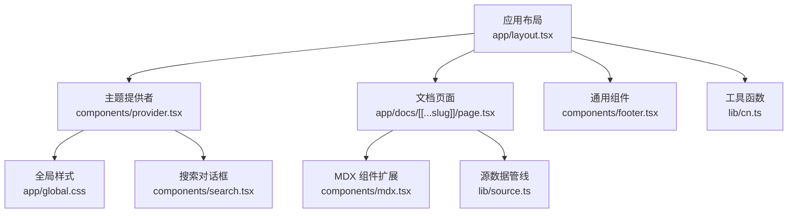
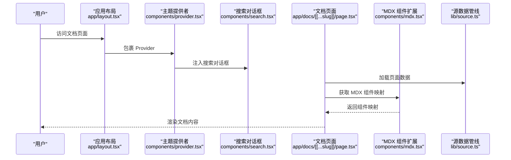
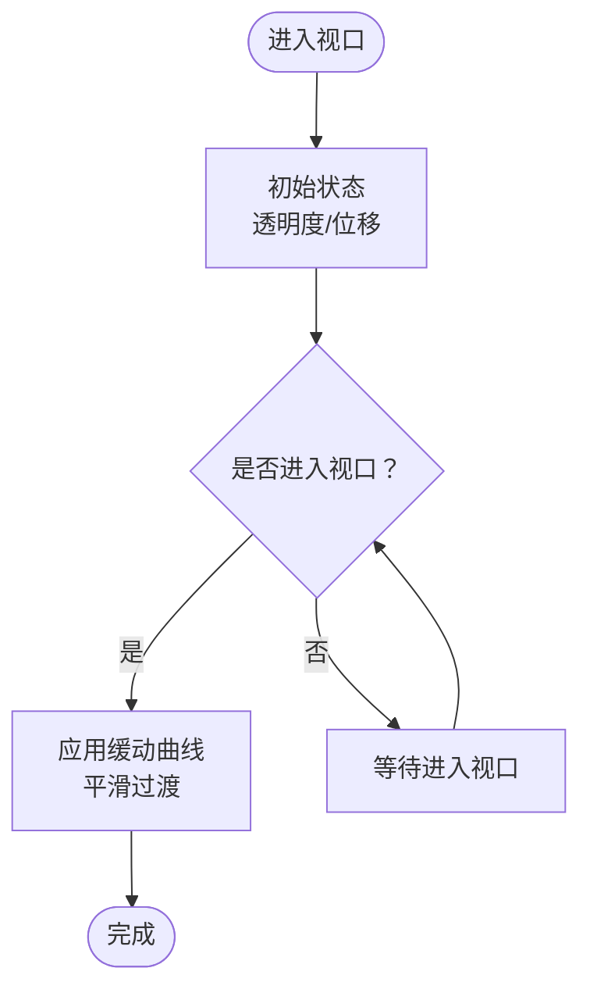
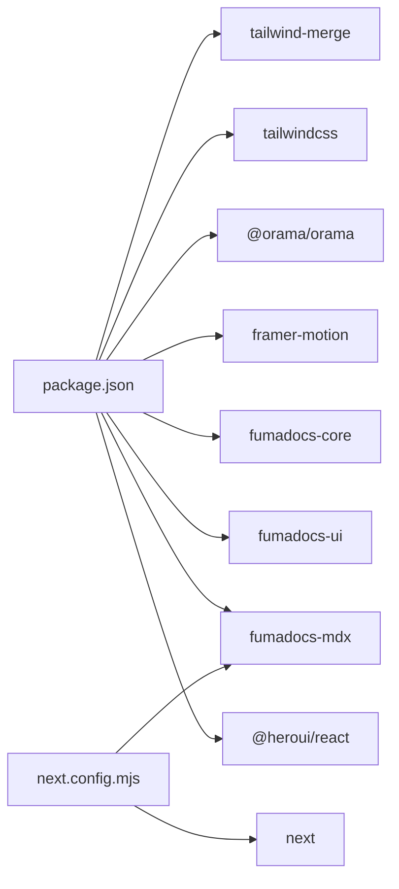

# UI 组件系统

<cite>
**本文引用的文件**
- [components/mdx.tsx](file://components/mdx.tsx)
- [components/provider.tsx](file://components/provider.tsx)
- [components/apple-animations.tsx](file://components/apple-animations.tsx)
- [components/search.tsx](file://components/search.tsx)
- [components/footer.tsx](file://components/footer.tsx)
- [lib/cn.ts](file://lib/cn.ts)
- [lib/layout.shared.tsx](file://lib/layout.shared.tsx)
- [lib/shared.ts](file://lib/shared.ts)
- [lib/source.ts](file://lib/source.ts)
- [app/layout.tsx](file://app/layout.tsx)
- [app/docs/[[...slug]]/page.tsx](file://app/docs/[[...slug]]/page.tsx)
- [app/global.css](file://app/global.css)
- [next.config.mjs](file://next.config.mjs)
- [package.json](file://package.json)
- [content/docs/test.mdx](file://content/docs/test.mdx)
- [content/blog/202501150930-welcome-to-docme.mdx](file://content/blog/202501150930-welcome-to-docme.mdx)
</cite>

## 目录
1. [简介](#简介)
2. [项目结构](#项目结构)
3. [核心组件](#核心组件)
4. [架构总览](#架构总览)
5. [详细组件分析](#详细组件分析)
6. [依赖关系分析](#依赖关系分析)
7. [性能考量](#性能考量)
8. [故障排查指南](#故障排查指南)
9. [结论](#结论)
10. [附录](#附录)

## 简介
本项目采用基于 HeroUI 与自定义组件的 UI 架构，结合 Fumadocs 生态与 MDX 扩展机制，提供文档站点的组件化解决方案。系统通过 Provider 统一注入主题、国际化与搜索能力；通过 MDX 组件扩展机制在文档中嵌入自定义组件；通过 Apple 风格动画库增强交互体验；并通过 Tailwind CSS 与 CSS 变量实现一致的样式架构与深浅主题支持。

## 项目结构
项目采用 Next.js App Router 结构，核心 UI 组件位于 components 目录，样式集中在 app/global.css，并通过 next.config.mjs 集成 MDX 支持。文档内容由 Fumadocs 的 source 管线加载，页面通过 getMDXComponents 注入自定义组件映射。

图表来源
- [app/layout.tsx:1-13](file://app/layout.tsx#L1-L13)
- [components/provider.tsx:1-36](file://components/provider.tsx#L1-L36)
- [app/docs/[[...slug]]/page.tsx:1-64](file://app/docs/[[...slug]]/page.tsx#L1-L64)
- [components/mdx.tsx:1-16](file://components/mdx.tsx#L1-L16)
- [lib/source.ts:1-37](file://lib/source.ts#L1-L37)
- [components/search.tsx:1-47](file://components/search.tsx#L1-L47)
- [components/footer.tsx:1-107](file://components/footer.tsx#L1-L107)
- [lib/cn.ts:1-2](file://lib/cn.ts#L1-L2)

章节来源
- [app/layout.tsx:1-13](file://app/layout.tsx#L1-L13)
- [next.config.mjs:1-15](file://next.config.mjs#L1-L15)

## 核心组件
- 主题提供者 Provider：封装 fumadocs-ui 的 RootProvider，注入中文翻译、搜索对话框、主题配置（系统主题、默认主题、属性名等），作为全局上下文根节点。
- MDX 组件扩展：通过 getMDXComponents 合并默认组件与自定义组件映射，支持在 MDX 中使用自定义标签与相对链接生成器。
- Apple 风格动画：提供 ScrollReveal、AppleCard、ParallaxSection、FadeInStagger 系列组件，统一使用 Apple 缓动曲线与视口触发。
- 搜索对话框：基于 fumadocs-ui 的搜索组件与 Orama 引擎，提供静态索引与国际化支持。
- 全局样式：引入 HeroUI、Fumadocs UI 样式与 Apple 风格变量，定义排版、按钮、卡片、导航等工具类与暗色主题变量。
- 工具函数：cn 使用 tailwind-merge 合并类名，避免冲突。

章节来源
- [components/provider.tsx:1-36](file://components/provider.tsx#L1-L36)
- [components/mdx.tsx:1-16](file://components/mdx.tsx#L1-L16)
- [components/apple-animations.tsx:1-151](file://components/apple-animations.tsx#L1-L151)
- [components/search.tsx:1-47](file://components/search.tsx#L1-L47)
- [app/global.css:1-285](file://app/global.css#L1-L285)
- [lib/cn.ts:1-2](file://lib/cn.ts#L1-L2)

## 架构总览
系统以 Provider 为中心，贯穿主题、国际化、搜索与 MDX 渲染链路。文档页面通过 source 获取页面内容，渲染 DocsPage 并注入 MDX 组件映射，最终在浏览器端完成组件渲染与交互。

图表来源
- [app/layout.tsx:1-13](file://app/layout.tsx#L1-L13)
- [components/provider.tsx:1-36](file://components/provider.tsx#L1-L36)
- [components/search.tsx:1-47](file://components/search.tsx#L1-L47)
- [app/docs/[[...slug]]/page.tsx:1-64](file://app/docs/[[...slug]]/page.tsx#L1-L64)
- [components/mdx.tsx:1-16](file://components/mdx.tsx#L1-L16)
- [lib/source.ts:1-37](file://lib/source.ts#L1-L37)

## 详细组件分析

### 主题提供者 Provider
- 功能概述
  - 注入搜索对话框组件，统一搜索 UI。
  - 国际化：提供中文翻译键值，覆盖搜索、目录、更新时间、主题选择等文案。
  - 主题：启用系统主题检测，默认使用系统主题，通过 class 属性切换明暗。
- 关键配置
  - 搜索：传入自定义 SearchDialog 组件。
  - 国际化：translations 对象包含常用文案键。
  - 主题：enableSystem、defaultTheme、attribute。
- 使用建议
  - 在根布局中包裹 Provider，确保全局生效。
  - 如需多语言，可扩展 translations 并在页面中切换语言。

章节来源
- [components/provider.tsx:1-36](file://components/provider.tsx#L1-L36)

### MDX 组件扩展 getMDXComponents
- 功能概述
  - 基于 fumadocs-ui 默认 MDX 组件，合并用户自定义组件映射。
  - 提供 useMDXComponents 别名，便于在文档页面中直接使用。
  - 通过 createRelativeLink 生成相对链接，提升文档内跳转体验。
- 使用方式
  - 在文档页面中调用 getMDXComponents，并传入自定义组件或链接处理器。
  - 可在 MDX 中直接使用自定义标签（如 Cards、Card）。
- 最佳实践
  - 将常用组件集中导出，保持映射简洁。
  - 自定义组件应遵循 React 组件规范，支持 className 与 children。

章节来源
- [components/mdx.tsx:1-16](file://components/mdx.tsx#L1-L16)
- [app/docs/[[...slug]]/page.tsx:1-64](file://app/docs/[[...slug]]/page.tsx#L1-L64)
- [content/docs/test.mdx:1-18](file://content/docs/test.mdx#L1-L18)

### Apple 风格动画组件
- 组件族
  - ScrollReveal：滚动进入视口时从指定方向淡入，支持延迟与方向。
  - AppleCard：卡片容器，带悬停抬起与滚动淡入。
  - ParallaxSection：视差滚动区域，根据滚动进度偏移。
  - FadeInStagger/FadeInStaggerItem：子元素依次淡入，支持交错延迟。
- 设计理念
  - 统一使用 Apple 缓动曲线，保证动效一致性。
  - 通过 viewport 与 useScroll/useTransform 实现视口触发与滚动驱动。
- 使用建议
  - 合理设置 viewport.margin 与 once，避免重复触发动画。
  - 在移动端谨慎使用重动画，优先考虑性能。

图表来源
- [components/apple-animations.tsx:13-44](file://components/apple-animations.tsx#L13-L44)
- [components/apple-animations.tsx:77-99](file://components/apple-animations.tsx#L77-L99)
- [components/apple-animations.tsx:104-127](file://components/apple-animations.tsx#L104-L127)
- [components/apple-animations.tsx:132-150](file://components/apple-animations.tsx#L132-L150)

章节来源
- [components/apple-animations.tsx:1-151](file://components/apple-animations.tsx#L1-L151)

### 搜索对话框 SearchDialog
- 能力概述
  - 基于 fumadocs-ui 的搜索对话框组件集合。
  - 使用 Orama 初始化静态索引，支持英文分词与国际化。
  - 通过 useDocsSearch 管理查询状态与加载状态。
- 集成要点
  - 在 Provider 中注册为搜索入口。
  - 文案与行为由 Provider 的 i18n 配置统一管理。
- 扩展建议
  - 可替换为云端搜索或自定义索引方案。
  - 支持多语言索引与本地化提示语。

章节来源
- [components/search.tsx:1-47](file://components/search.tsx#L1-L47)
- [components/provider.tsx:19-35](file://components/provider.tsx#L19-L35)

### 全局样式与 Apple 风格变量
- 样式来源
  - 引入 HeroUI、Fumadocs UI 的预设与中性色。
  - 定义 Apple 风格 CSS 变量：背景、文本、蓝色、边框等。
- 工具类
  - 排版：display、headline、body、caption 等。
  - 导航：粘性导航与毛玻璃效果。
  - 按钮：主次按钮与悬停态。
  - 卡片：圆角、边框、悬停抬升。
  - 动画：淡入上浮、浮动等。
- 响应式策略
  - 使用 clamp 与媒体查询实现流式排版。
  - 在不同断点下调整内边距与网格布局。

章节来源
- [app/global.css:1-285](file://app/global.css#L1-L285)

### 工具函数 cn
- 作用
  - 使用 tailwind-merge 合并类名，避免重复与冲突。
- 使用场景
  - 在组件内部动态拼接 className 时，确保最终类名整洁有效。

章节来源
- [lib/cn.ts:1-2](file://lib/cn.ts#L1-L2)

### 文档页面与布局选项
- 页面渲染
  - 通过 source 获取页面元数据与内容，渲染 DocsPage、DocsTitle、DocsBody 等。
  - 注入 MDX 组件映射与相对链接生成器。
- 布局选项
  - baseOptions/docsOptions 提供基础导航、链接与 GitHub 地址配置。
  - 支持在 docs 子路由隐藏导航链接。

章节来源
- [app/docs/[[...slug]]/page.tsx:1-64](file://app/docs/[[...slug]]/page.tsx#L1-L64)
- [lib/layout.shared.tsx:1-36](file://lib/layout.shared.tsx#L1-L36)
- [lib/shared.ts:1-12](file://lib/shared.ts#L1-L12)

### 示例与最佳实践
- 在 MDX 中使用自定义组件
  - 在文档页面中调用 getMDXComponents，并传入自定义组件映射。
  - 示例文档展示了如何在 MDX 中使用 Cards 与 Card 标签。
- 动画组件使用
  - 使用 ScrollReveal 为段落或卡片添加进入动画。
  - 使用 FadeInStagger 为列表项添加依次出现的动画。
- 样式与主题
  - 使用 Apple 风格工具类快速搭建一致的视觉风格。
  - 通过 CSS 变量与深色主题类名实现主题切换。

章节来源
- [content/docs/test.mdx:1-18](file://content/docs/test.mdx#L1-L18)
- [components/apple-animations.tsx:13-44](file://components/apple-animations.tsx#L13-L44)
- [app/global.css:48-178](file://app/global.css#L48-L178)

## 依赖关系分析
- 核心依赖
  - HeroUI：提供 UI 组件与样式基底。
  - Fumadocs UI/Core/MDX：提供文档布局、组件、MDX 扩展与搜索能力。
  - Framer Motion：提供滚动与动画能力。
  - Orama：提供全文搜索索引。
  - Tailwind CSS 与 tailwind-merge：提供原子化样式与类名合并。
- 配置与构建
  - next.config.mjs 通过 createMDX 集成 MDX 支持，输出静态站点。
  - package.json 定义脚本与依赖版本。

图表来源
- [package.json:12-26](file://package.json#L12-L26)
- [next.config.mjs:1-15](file://next.config.mjs#L1-L15)

章节来源
- [package.json:1-39](file://package.json#L1-L39)
- [next.config.mjs:1-15](file://next.config.mjs#L1-L15)

## 性能考量
- 动画性能
  - 使用 viewport.once 与合理的 margin，避免重复触发动画。
  - 在移动端减少复杂动画，优先使用 transform 与 opacity。
- 搜索性能
  - 使用静态索引（Orama）减少运行时开销，按需加载。
- 样式性能
  - 使用原子化类名与 tailwind-merge，减少无效样式。
  - 合理使用媒体查询与 clamp，降低重排与重绘。
- 构建优化
  - 输出静态站点（export），减少首屏渲染时间。

## 故障排查指南
- MDX 组件未生效
  - 检查 getMDXComponents 是否正确传入组件映射。
  - 确认 MDX 文件中使用的标签名称与映射一致。
- 搜索无结果
  - 确认 useDocsSearch 的 initOrama 与 schema 正确。
  - 检查语言配置与索引构建流程。
- 主题切换异常
  - 确认 Provider 的 theme 配置与 attribute 设置一致。
  - 检查深色类名是否正确挂载到 html 或 body。
- 动画不触发
  - 检查 viewport.margin 与 once 设置。
  - 确认组件在视口范围内且未被其他元素遮挡。

章节来源
- [components/mdx.tsx:4-9](file://components/mdx.tsx#L4-L9)
- [components/search.tsx:27-31](file://components/search.tsx#L27-L31)
- [components/provider.tsx:26-30](file://components/provider.tsx#L26-L30)
- [components/apple-animations.tsx:37-38](file://components/apple-animations.tsx#L37-L38)

## 结论
本 UI 组件系统以 Provider 为核心，结合 HeroUI 与 Fumadocs 生态，提供了完整的文档站点组件化方案。通过 MDX 组件扩展机制，可在文档中灵活嵌入自定义组件；通过 Apple 风格动画增强交互体验；通过全局样式与 CSS 变量实现一致的主题与排版。整体架构清晰、扩展性强，适合设计师与开发者协作使用。

## 附录
- 响应式断点与排版
  - 使用 clamp 与媒体查询实现流式排版，常见断点在 768px 及以上。
  - 导航采用粘性定位与毛玻璃效果，兼顾可用性与美观。
- 无障碍访问
  - 使用语义化标签与合适的颜色对比度，确保深浅主题下的可读性。
  - 动画提供禁用选项（如 reduce-motion），尊重用户偏好。
- 定制与扩展
  - 可在 Provider 中扩展 i18n 翻译与主题配置。
  - 可在 getMDXComponents 中新增自定义组件映射。
  - 可在全局样式中扩展 Apple 风格变量与工具类。

章节来源
- [app/global.css:213-221](file://app/global.css#L213-L221)
- [components/provider.tsx:6-17](file://components/provider.tsx#L6-L17)
- [components/mdx.tsx:4-9](file://components/mdx.tsx#L4-L9)