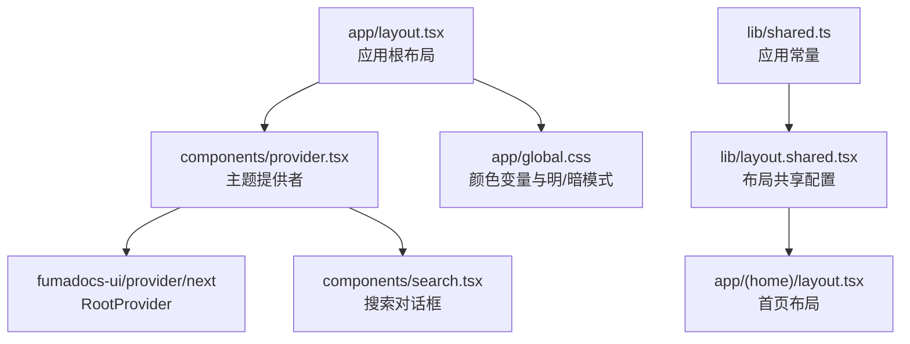
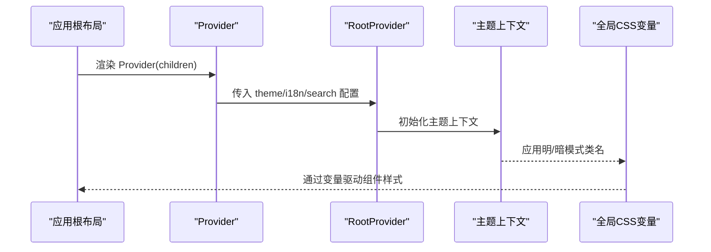
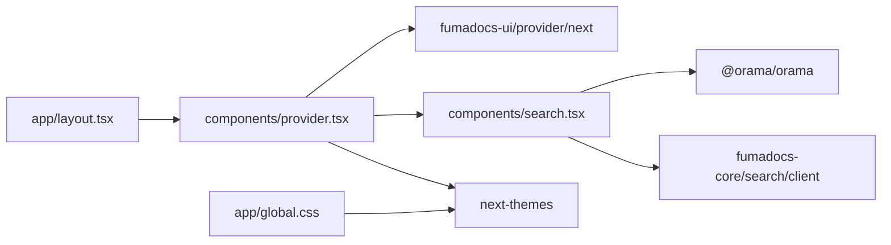

# 主题提供者

<cite>
**本文引用的文件**
- [components/provider.tsx](file://components/provider.tsx)
- [app/layout.tsx](file://app/layout.tsx)
- [app/global.css](file://app/global.css)
- [components/search.tsx](file://components/search.tsx)
- [lib/layout.shared.tsx](file://lib/layout.shared.tsx)
- [lib/shared.ts](file://lib/shared.ts)
- [package.json](file://package.json)
- [README.md](file://README.md)
</cite>

## 目录
1. [简介](#简介)
2. [项目结构](#项目结构)
3. [核心组件](#核心组件)
4. [架构总览](#架构总览)
5. [详细组件分析](#详细组件分析)
6. [依赖关系分析](#依赖关系分析)
7. [性能考量](#性能考量)
8. [故障排查指南](#故障排查指南)
9. [结论](#结论)
10. [附录](#附录)

## 简介
本文件围绕主题提供者（ThemeProvider）进行系统化说明，目标是帮助设计师与开发者快速理解并正确使用本项目的主题系统。内容涵盖：
- 主题提供者的功能与配置项
- 明/暗主题切换机制与状态管理
- 主题配置的继承与覆盖规则
- 颜色系统设计原则与变量定义
- 主题持久化与存储策略
- 主题定制示例与最佳实践
- 与组件系统的集成方式
- 性能优化与懒加载策略
- 多主题支持与动态主题切换的技术实现

## 项目结构
本项目基于 Next.js 与 Fumadocs 生态，主题系统通过根级 Provider 将主题、国际化与搜索能力注入到应用中，并通过全局 CSS 定义颜色变量与明/暗模式切换。

图表来源
- [app/layout.tsx:19-27](file://app/layout.tsx#L19-L27)
- [components/provider.tsx:19-35](file://components/provider.tsx#L19-L35)
- [app/global.css:1-46](file://app/global.css#L1-L46)
- [lib/layout.shared.tsx:1-36](file://lib/layout.shared.tsx#L1-L36)

章节来源
- [app/layout.tsx:1-28](file://app/layout.tsx#L1-L28)
- [components/provider.tsx:1-36](file://components/provider.tsx#L1-L36)
- [app/global.css:1-284](file://app/global.css#L1-L284)
- [lib/layout.shared.tsx:1-36](file://lib/layout.shared.tsx#L1-L36)
- [lib/shared.ts:1-12](file://lib/shared.ts#L1-L12)

## 核心组件
- 主题提供者 Provider：负责注入主题、国际化与搜索能力，统一管理主题状态与切换行为。
- RootProvider：来自 fumadocs-ui/provider/next，提供主题、搜索与国际化等上下文。
- 全局样式 global.css：定义颜色变量与明/暗模式切换规则，确保组件与页面一致的主题表现。
- 搜索组件 DefaultSearchDialog：基于 Orama 的静态搜索，配合 Provider 注入的 i18n 与主题上下文。

章节来源
- [components/provider.tsx:19-35](file://components/provider.tsx#L19-L35)
- [components/search.tsx:25-47](file://components/search.tsx#L25-L47)
- [app/global.css:1-46](file://app/global.css#L1-L46)

## 架构总览
主题系统采用“根 Provider 注入 + 全局 CSS 变量驱动”的架构。Provider 负责：
- 主题配置：启用系统主题、默认主题为系统、属性使用 class。
- 国际化：注入中文翻译映射。
- 搜索：注入自定义搜索对话框组件。

RootProvider 将这些能力传递给子树，组件通过 CSS 变量与类名实现明/暗模式切换。

图表来源
- [components/provider.tsx:19-35](file://components/provider.tsx#L19-L35)
- [app/layout.tsx:19-27](file://app/layout.tsx#L19-L27)
- [app/global.css:1-46](file://app/global.css#L1-L46)

## 详细组件分析

### Provider 组件
- 功能概述
  - 注入主题上下文：启用系统主题检测、默认主题为系统、使用 class 属性承载主题状态。
  - 注入国际化：提供中文翻译映射，包括搜索、目录、分页、编辑等文案。
  - 注入搜索：提供自定义搜索对话框组件 DefaultSearchDialog。
- 关键配置项
  - theme.enableSystem：启用系统主题检测。
  - theme.defaultTheme：默认主题为 system。
  - theme.attribute：主题状态写入到 html/body 的 class 属性。
  - i18n.translations：中文文案映射。
  - search.SearchDialog：自定义搜索对话框组件。
- 状态管理
  - 通过 RootProvider 提供的主题上下文管理主题状态，组件通过 CSS 变量读取当前主题。
- 继承与覆盖
  - Provider 作为根级上下文，其配置对整个应用生效；子组件可通过自身样式或主题 API 覆盖局部样式，但不改变全局主题状态。

章节来源
- [components/provider.tsx:6-17](file://components/provider.tsx#L6-L17)
- [components/provider.tsx:19-35](file://components/provider.tsx#L19-L35)

### RootProvider 与主题上下文
- RootProvider 来自 fumadocs-ui/provider/next，负责：
  - 管理主题状态（light/dark/system）。
  - 提供国际化上下文。
  - 提供搜索上下文与组件。
- 主题状态持久化
  - 默认使用 localStorage 存储用户选择的主题偏好，实现刷新后保持。
  - 当启用系统主题时，会监听系统主题变化并在必要时同步到用户偏好。

章节来源
- [components/provider.tsx:3](file://components/provider.tsx#L3)
- [package.json:20](file://package.json#L20)
- [package.json:25](file://package.json#L25)

### 全局样式与颜色系统
- 颜色变量定义
  - Fumadocs 主题色覆盖：主色与强调色变量在 :root 与 .dark 中分别定义，适配明/暗模式。
  - Apple 风格配色：背景、文本、边框等变量在 :root 与 .dark 中分别定义，形成统一的 Apple 风格配色体系。
  - 通用语义变量：accent、foreground、muted、border、surface、surface-secondary 等变量在 :root 与 .dark 中分别定义，便于组件复用。
- 切换机制
  - 通过在 html/body 上添加 class="dark" 实现明/暗模式切换。
  - 组件通过 CSS 变量读取颜色值，无需重新渲染即可响应主题变化。

章节来源
- [app/global.css:6-15](file://app/global.css#L6-L15)
- [app/global.css:17-36](file://app/global.css#L17-L36)
- [app/global.css:267-284](file://app/global.css#L267-L284)

### 搜索对话框与主题集成
- DefaultSearchDialog
  - 使用 fumadocs-ui 的搜索组件与 hooks，结合 useI18n 获取当前语言。
  - 通过 useDocsSearch 配置静态搜索，初始化 Orama 引擎。
  - 在 Provider 注入的 i18n 与主题上下文中渲染，确保与整体风格一致。

章节来源
- [components/search.tsx:25-47](file://components/search.tsx#L25-L47)
- [components/search.tsx:17-23](file://components/search.tsx#L17-L23)

### 布局与主题联动
- baseOptions/docsOptions
  - 提供导航标题、链接与 GitHub 地址等共享配置，保证不同路由下的主题一致性。
- 首页与文档页
  - 首页使用 HomeLayout，文档页使用 DocsLayout，两者均在 Provider 包裹下运行，确保主题上下文贯穿所有页面。

章节来源
- [lib/layout.shared.tsx:4-24](file://lib/layout.shared.tsx#L4-L24)
- [lib/layout.shared.tsx:27-35](file://lib/layout.shared.tsx#L27-L35)
- [app/(home)/layout.tsx:5-7](file://app/(home)/layout.tsx#L5-L7)
- [app/docs/layout.tsx:5-12](file://app/docs/layout.tsx#L5-L12)

## 依赖关系分析
- 主题相关依赖
  - fumadocs-ui：提供 RootProvider、UI 组件与布局。
  - next-themes：提供主题上下文与持久化能力。
- 搜索相关依赖
  - @orama/orama：全文搜索引擎。
  - fumadocs-core：搜索客户端钩子与数据处理。
- 样式相关依赖
  - tailwindcss、@heroui/styles、fumadocs-ui/css：基础样式与预设。

图表来源
- [components/provider.tsx:3](file://components/provider.tsx#L3)
- [components/search.tsx:13-15](file://components/search.tsx#L13-L15)
- [package.json:12-31](file://package.json#L12-L31)

章节来源
- [package.json:12-31](file://package.json#L12-L31)
- [components/provider.tsx:19-35](file://components/provider.tsx#L19-L35)
- [components/search.tsx:25-47](file://components/search.tsx#L25-L47)

## 性能考量
- 主题切换性能
  - 通过 CSS 变量与 class 切换实现，避免重排与重绘，切换流畅。
- 搜索性能
  - 使用静态搜索与本地索引，减少网络请求与服务器压力。
  - Orama 初始化在客户端执行，建议在首次打开搜索时触发，避免阻塞首屏。
- 样式体积
  - 全局样式按需引入，避免重复与冗余。
- 首屏优化
  - Provider 放置于根布局，确保主题上下文尽早可用，减少闪烁。

章节来源
- [components/search.tsx:17-23](file://components/search.tsx#L17-L23)
- [app/layout.tsx:19-27](file://app/layout.tsx#L19-L27)

## 故障排查指南
- 主题未生效
  - 检查 html/body 是否存在 class="dark" 或其他主题类名。
  - 确认全局 CSS 中的颜色变量是否正确覆盖。
- 切换无效
  - 确认 Provider 的 theme 配置是否正确（enableSystem、defaultTheme、attribute）。
  - 检查浏览器 localStorage 是否被禁用或清理。
- 搜索无结果
  - 确认 useDocsSearch 的 static 类型与 initOrama 初始化逻辑。
  - 检查 i18n 语言设置是否与搜索数据匹配。
- 国际化文案缺失
  - 确认 i18n.translations 是否完整覆盖所需文案键。

章节来源
- [components/provider.tsx:26-30](file://components/provider.tsx#L26-L30)
- [components/search.tsx:27-31](file://components/search.tsx#L27-L31)
- [components/search.tsx:6-17](file://components/search.tsx#L6-L17)

## 结论
本主题系统以 Provider 为核心，结合 RootProvider、next-themes 与全局 CSS 变量，实现了简洁高效的明/暗主题切换与持久化。通过统一的颜色变量与类名切换机制，组件无需感知具体主题值即可获得一致的视觉体验。配合静态搜索与布局共享配置，整体具备良好的可维护性与扩展性。

## 附录

### 主题配置选项速查
- theme.enableSystem：启用系统主题检测
- theme.defaultTheme：默认主题（light/dark/system）
- theme.attribute：主题状态写入属性（class/id）
- i18n.translations：中文文案映射
- search.SearchDialog：自定义搜索对话框组件

章节来源
- [components/provider.tsx:26-30](file://components/provider.tsx#L26-L30)
- [components/provider.tsx:6-17](file://components/provider.tsx#L6-L17)

### 主题定制示例与最佳实践
- 自定义颜色变量
  - 在全局 CSS 中新增或覆盖变量，确保 :root 与 .dark 均有对应定义。
- 覆盖主色与强调色
  - 修改 Fumadocs 主题色变量，保持明/暗模式一致性。
- 语义变量统一
  - 使用 accent、foreground、muted、border、surface 等语义变量，提升组件复用性。
- 持久化策略
  - 依赖 next-themes 的 localStorage，默认即可满足大多数场景；如需自定义存储，可在 RootProvider 外层封装自定义上下文。
- 多主题支持
  - 可通过扩展 Provider 的 theme 配置与 CSS 变量，实现除明/暗之外的其他主题（如蓝调、绿意），并在 UI 中暴露切换入口。
- 动态主题切换
  - 通过 RootProvider 提供的主题 API 触发切换，组件通过 CSS 变量自动响应，无需手动重渲染。

章节来源
- [app/global.css:6-15](file://app/global.css#L6-L15)
- [app/global.css:17-36](file://app/global.css#L17-L36)
- [app/global.css:267-284](file://app/global.css#L267-L284)
- [components/provider.tsx:26-30](file://components/provider.tsx#L26-L30)

### 与组件系统的集成方式
- Provider 位于根布局，确保所有页面与组件均可访问主题上下文。
- 组件通过 CSS 变量读取颜色值，无需直接依赖主题 API。
- 搜索、导航、布局等组件均在 Provider 包裹下运行，保证主题一致性。

章节来源
- [app/layout.tsx:19-27](file://app/layout.tsx#L19-L27)
- [lib/layout.shared.tsx:4-24](file://lib/layout.shared.tsx#L4-L24)
- [app/docs/layout.tsx:5-12](file://app/docs/layout.tsx#L5-L12)