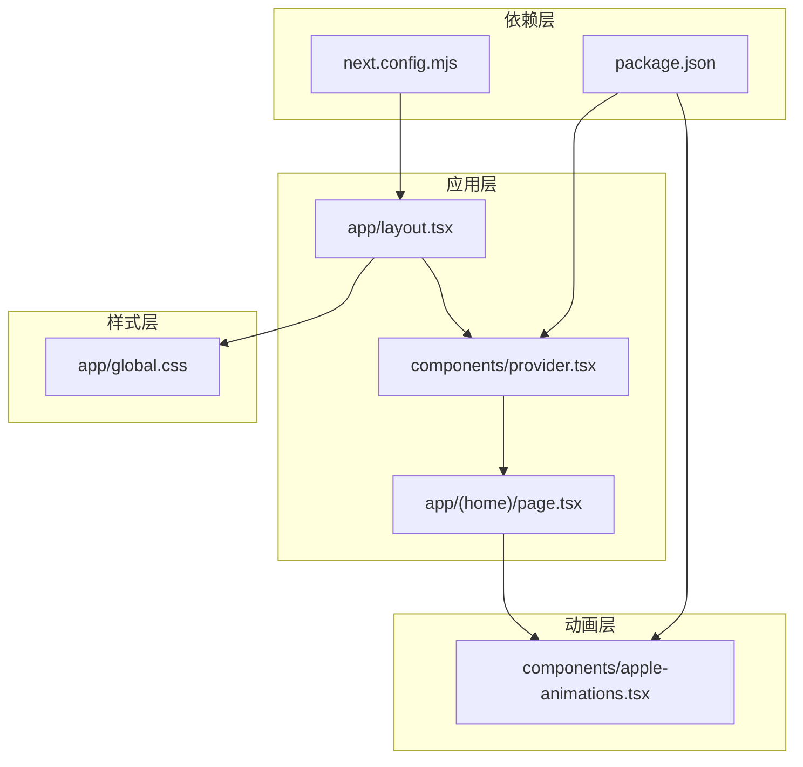
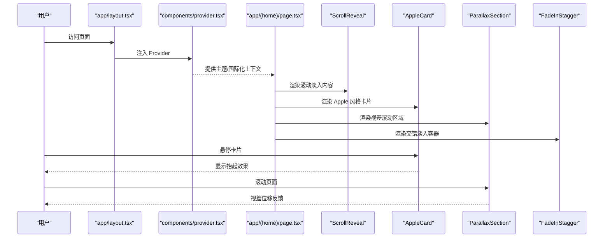
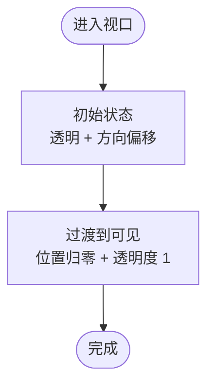
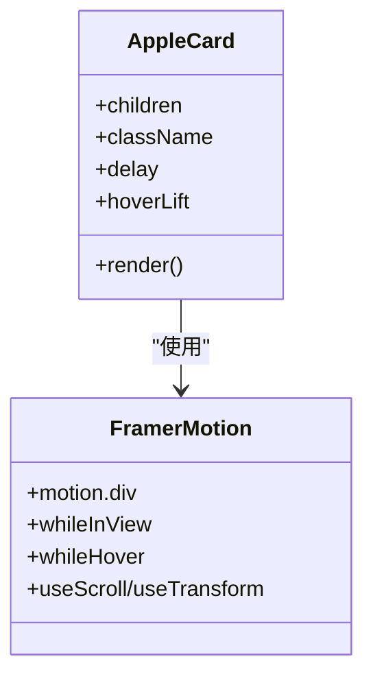
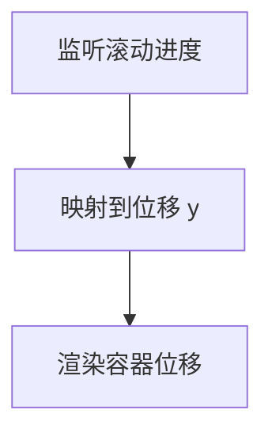
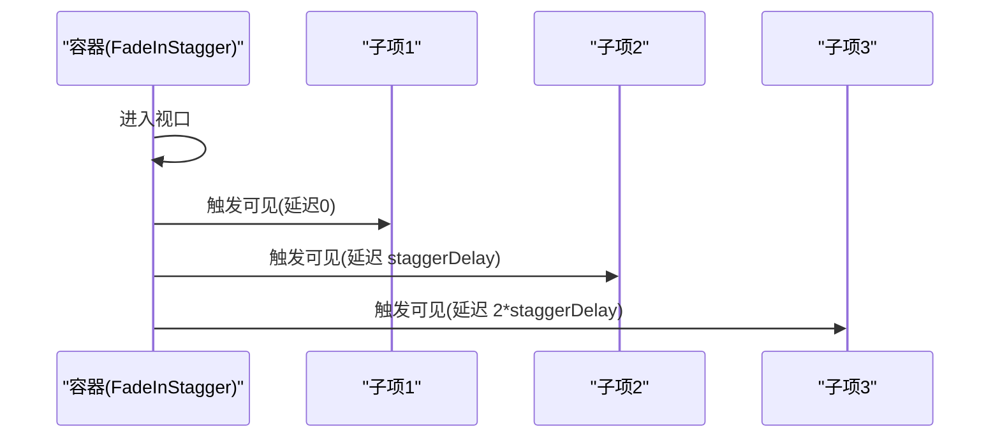
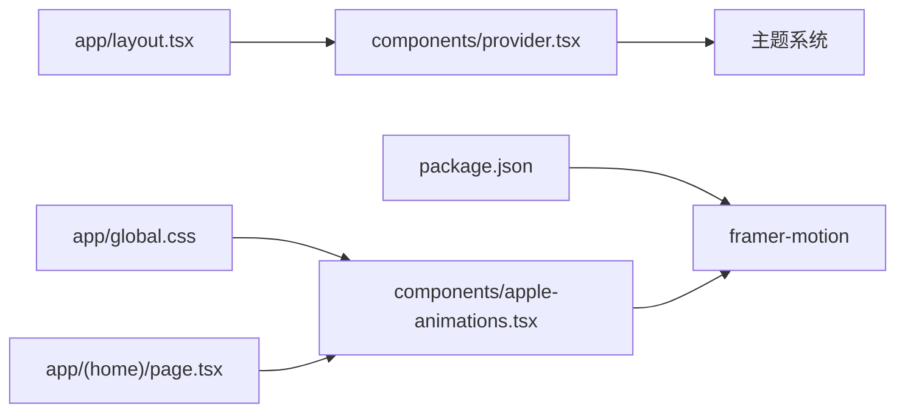

# 动画系统

<cite>
**本文引用的文件**
- [components/apple-animations.tsx](file://components/apple-animations.tsx)
- [components/provider.tsx](file://components/provider.tsx)
- [app/layout.tsx](file://app/layout.tsx)
- [app/global.css](file://app/global.css)
- [app/(home)/page.tsx](file://app/(home)/page.tsx)
- [package.json](file://package.json)
- [next.config.mjs](file://next.config.mjs)
</cite>

## 目录
1. [简介](#简介)
2. [项目结构](#项目结构)
3. [核心组件](#核心组件)
4. [架构总览](#架构总览)
5. [详细组件分析](#详细组件分析)
6. [依赖关系分析](#依赖关系分析)
7. [性能考量](#性能考量)
8. [故障排查指南](#故障排查指南)
9. [结论](#结论)
10. [附录](#附录)

## 简介
本文件系统性梳理并说明本仓库中基于 Framer Motion 的动画集成与配置，重点包括：
- Apple 风格动画的实现原理与视觉效果
- 动画组件的使用方法与参数配置
- 动画性能优化策略与最佳实践
- 动画与主题系统的协调机制
- 具体的动画示例与使用场景
- 动画状态管理与过渡效果的实现
- 动画调试与测试的方法
- 响应式动画与设备适配的处理方式
- 面向开发者的完整动画系统集成指南

## 项目结构
本项目的动画系统主要由以下部分构成：
- 动画组件：位于 components/apple-animations.tsx，封装了滚动触发、悬停抬起、视差滚动、交错淡入等 Apple 风格动画能力
- 主题与提供者：位于 components/provider.tsx 与 app/layout.tsx，负责主题切换与全局样式注入
- 全局样式：位于 app/global.css，定义 Apple 配色变量、基础排版与过渡动画
- 页面使用：位于 app/(home)/page.tsx，演示如何在页面中使用滚动淡入组件
- 依赖声明：位于 package.json，声明 framer-motion 等依赖
- 构建配置：位于 next.config.mjs，启用 MDX 扩展

图表来源
- [app/layout.tsx:19-27](file://app/layout.tsx#L19-L27)
- [components/provider.tsx:19-35](file://components/provider.tsx#L19-L35)
- [app/(home)/page.tsx:33-249](file://app/(home)/page.tsx#L33-L249)
- [components/apple-animations.tsx:1-151](file://components/apple-animations.tsx#L1-L151)
- [app/global.css:1-286](file://app/global.css#L1-L286)
- [package.json:12-32](file://package.json#L12-L32)
- [next.config.mjs:1-15](file://next.config.mjs#L1-L15)

章节来源
- [app/layout.tsx:19-27](file://app/layout.tsx#L19-L27)
- [components/provider.tsx:19-35](file://components/provider.tsx#L19-L35)
- [app/(home)/page.tsx:33-249](file://app/(home)/page.tsx#L33-L249)
- [components/apple-animations.tsx:1-151](file://components/apple-animations.tsx#L1-L151)
- [app/global.css:1-286](file://app/global.css#L1-L286)
- [package.json:12-32](file://package.json#L12-L32)
- [next.config.mjs:1-15](file://next.config.mjs#L1-L15)

## 核心组件
本项目的核心动画组件均来自 components/apple-animations.tsx，包含以下能力：
- 滚动触发淡入（ScrollReveal）
- Apple 风格卡片（AppleCard），支持悬停抬起与滚动淡入
- 视差滚动区域（ParallaxSection）
- 子元素交错淡入（FadeInStagger + FadeInStaggerItem）

这些组件统一采用 Apple 标准缓动曲线，确保动画节奏与 Apple 设计语言一致；同时通过 viewport 触发、useScroll/useTransform 等机制实现流畅的滚动与交互体验。

章节来源
- [components/apple-animations.tsx:13-44](file://components/apple-animations.tsx#L13-L44)
- [components/apple-animations.tsx:49-72](file://components/apple-animations.tsx#L49-L72)
- [components/apple-animations.tsx:77-99](file://components/apple-animations.tsx#L77-L99)
- [components/apple-animations.tsx:104-127](file://components/apple-animations.tsx#L104-L127)
- [components/apple-animations.tsx:132-150](file://components/apple-animations.tsx#L132-L150)

## 架构总览
动画系统在应用中的整体流程如下：
- 应用启动时，根布局注入 Provider，开启主题系统与国际化配置
- 页面渲染时，通过 ScrollReveal 等组件在滚动进入视口时触发动画
- AppleCard 在用户悬停时产生抬起效果，增强交互反馈
- ParallaxSection 利用滚动进度驱动视差位移
- FadeInStagger/FadeInStaggerItem 实现列表或段落的交错入场

图表来源
- [app/layout.tsx:19-27](file://app/layout.tsx#L19-L27)
- [components/provider.tsx:19-35](file://components/provider.tsx#L19-L35)
- [app/(home)/page.tsx:33-249](file://app/(home)/page.tsx#L33-L249)
- [components/apple-animations.tsx:13-44](file://components/apple-animations.tsx#L13-L44)
- [components/apple-animations.tsx:49-72](file://components/apple-animations.tsx#L49-L72)
- [components/apple-animations.tsx:77-99](file://components/apple-animations.tsx#L77-L99)
- [components/apple-animations.tsx:104-127](file://components/apple-animations.tsx#L104-L127)

## 详细组件分析

### ScrollReveal（滚动淡入）
- 功能：当元素进入视口时，从指定方向淡入
- 关键点：
  - 使用 viewport 触发，once 保证只触发一次
  - 支持方向参数（up/down/left/right），对应不同的初始偏移
  - 使用 Apple 缓动曲线，时长与延迟可配置
- 参数：
  - children：子节点
  - className：附加样式类名
  - delay：延迟时间
  - direction：进入方向
- 使用场景：首页 Hero 区块、分节标题、图标与文案组合等

图表来源
- [components/apple-animations.tsx:13-44](file://components/apple-animations.tsx#L13-L44)

章节来源
- [components/apple-animations.tsx:13-44](file://components/apple-animations.tsx#L13-L44)
- [app/(home)/page.tsx:40-63](file://app/(home)/page.tsx#L40-L63)

### AppleCard（Apple 风格卡片）
- 功能：卡片滚动淡入 + 悬停抬起
- 关键点：
  - whileInView 控制滚动淡入
  - whileHover 控制悬停抬起高度
  - 使用 Apple 缓动曲线与统一时长
- 参数：
  - children：卡片内容
  - className：附加样式类名
  - delay：延迟时间
  - hoverLift：悬停抬起像素值
- 使用场景：功能入口卡片、特性展示卡片等

图表来源
- [components/apple-animations.tsx:49-72](file://components/apple-animations.tsx#L49-L72)

章节来源
- [components/apple-animations.tsx:49-72](file://components/apple-animations.tsx#L49-L72)
- [app/global.css:152-163](file://app/global.css#L152-L163)

### ParallaxSection（视差滚动）
- 功能：根据滚动进度驱动容器位移，营造视差效果
- 关键点：
  - useScroll 监听目标元素滚动进度
  - useTransform 将进度映射到位移
  - speed 控制视差强度
- 参数：
  - children：子节点
  - className：附加样式类名
  - speed：视差速度（0~1）
- 使用场景：横幅背景、分节标题背景等

图表来源
- [components/apple-animations.tsx:77-99](file://components/apple-animations.tsx#L77-L99)

章节来源
- [components/apple-animations.tsx:77-99](file://components/apple-animations.tsx#L77-L99)

### FadeInStagger 与 FadeInStaggerItem（交错淡入）
- 功能：容器内子元素按顺序淡入，形成“瀑布”式入场
- 关键点：
  - 容器使用 variants 定义“隐藏/可见”状态，并设置 staggerChildren
  - 子项使用 variants 定义“隐藏/可见”的过渡
  - 使用 Apple 缓动曲线与时长
- 参数：
  - FadeInStagger：children、className、staggerDelay
  - FadeInStaggerItem：children、className
- 使用场景：列表项、段落文本、图标网格等

图表来源
- [components/apple-animations.tsx:104-127](file://components/apple-animations.tsx#L104-L127)
- [components/apple-animations.tsx:132-150](file://components/apple-animations.tsx#L132-L150)

章节来源
- [components/apple-animations.tsx:104-127](file://components/apple-animations.tsx#L104-L127)
- [components/apple-animations.tsx:132-150](file://components/apple-animations.tsx#L132-L150)

### Apple 标准缓动曲线
- 本项目统一使用 Apple 标准缓动曲线，确保动画节奏与 Apple 设计语言一致
- 在多个组件中复用该曲线，保证视觉与交互的一致性

章节来源
- [components/apple-animations.tsx:6-7](file://components/apple-animations.tsx#L6-L7)

## 依赖关系分析
- 动画组件依赖 Framer Motion 的 motion、useScroll、useTransform 等 API
- 主题系统由 Provider 提供，支持系统主题、默认主题与属性控制
- 全局样式定义 Apple 配色变量与过渡动画，为组件提供一致的视觉基础
- 页面通过导入动画组件并在需要的位置进行包裹，实现滚动触发与交互反馈

图表来源
- [package.json:12-32](file://package.json#L12-L32)
- [components/apple-animations.tsx:3](file://components/apple-animations.tsx#L3)
- [components/provider.tsx:26-30](file://components/provider.tsx#L26-L30)
- [app/layout.tsx:19-27](file://app/layout.tsx#L19-L27)
- [app/global.css:18-37](file://app/global.css#L18-L37)
- [app/(home)/page.tsx:33-249](file://app/(home)/page.tsx#L33-L249)

章节来源
- [package.json:12-32](file://package.json#L12-L32)
- [components/apple-animations.tsx:3](file://components/apple-animations.tsx#L3)
- [components/provider.tsx:26-30](file://components/provider.tsx#L26-L30)
- [app/layout.tsx:19-27](file://app/layout.tsx#L19-L27)
- [app/global.css:18-37](file://app/global.css#L18-L37)
- [app/(home)/page.tsx:33-249](file://app/(home)/page.tsx#L33-L249)

## 性能考量
- 视口触发与一次性执行
  - 多个组件使用 viewport 触发且 once 为 true，避免重复计算与重绘
- 滚动监听与视差
  - 使用 useScroll/useTransform 将滚动进度映射为位移，减少 DOM 操作
- 缓动曲线与时长
  - 统一使用 Apple 缓动曲线与时长，降低视觉跳变与过度动画带来的性能负担
- 样式过渡
  - 全局样式中定义的过渡动画（如按钮、卡片）使用简洁的过渡函数，避免复杂贝塞尔曲线导致的 GPU 压力
- 构建与导出
  - next.config.mjs 启用 MDX 并输出静态站点，有助于减少运行时开销

章节来源
- [components/apple-animations.tsx:37-38](file://components/apple-animations.tsx#L37-L38)
- [components/apple-animations.tsx:64-66](file://components/apple-animations.tsx#L64-L66)
- [components/apple-animations.tsx:87-92](file://components/apple-animations.tsx#L87-L92)
- [app/global.css:112-150](file://app/global.css#L112-L150)
- [next.config.mjs:7](file://next.config.mjs#L7)

## 故障排查指南
- 动画不触发
  - 检查 viewport 配置是否正确，margin 与 once 设置是否符合预期
  - 确认元素是否在视口范围内，或适当调整 margin
- 悬停效果异常
  - 确认 whileHover 的值与父容器层级关系，避免被遮挡或冲突
- 视差滚动不生效
  - 检查 useScroll 的 target 与 offset 是否正确，确保 ref 正确传递
- 主题切换后样式不一致
  - 确认 Provider 的 theme 配置与全局 CSS 中的变量是否匹配
- 构建后动画缺失
  - 确认已安装并引入 framer-motion，检查 next.config.mjs 的配置

章节来源
- [components/apple-animations.tsx:37-38](file://components/apple-animations.tsx#L37-L38)
- [components/apple-animations.tsx:64-66](file://components/apple-animations.tsx#L64-L66)
- [components/apple-animations.tsx:87-92](file://components/apple-animations.tsx#L87-L92)
- [components/provider.tsx:26-30](file://components/provider.tsx#L26-L30)
- [next.config.mjs:1-15](file://next.config.mjs#L1-L15)

## 结论
本项目通过 Framer Motion 与自定义动画组件，实现了 Apple 风格的滚动触发、悬停反馈、视差滚动与交错入场等动画效果。配合全局样式与主题系统，形成了统一的视觉与交互体验。在性能方面，通过视口触发、一次性执行与统一缓动曲线等策略，兼顾了流畅性与效率。开发者可直接复用现有组件并按需扩展，快速构建高质量的动画交互。

## 附录

### Apple 风格动画参数速查
- ScrollReveal
  - 参数：children、className、delay、direction
  - 适用：标题、图标与文案组合、Hero 区块
- AppleCard
  - 参数：children、className、delay、hoverLift
  - 适用：功能入口卡片、特性展示卡片
- ParallaxSection
  - 参数：children、className、speed
  - 适用：横幅背景、分节标题背景
- FadeInStagger / FadeInStaggerItem
  - 参数：children、className、staggerDelay
  - 适用：列表项、段落文本、图标网格

章节来源
- [components/apple-animations.tsx:13-44](file://components/apple-animations.tsx#L13-L44)
- [components/apple-animations.tsx:49-72](file://components/apple-animations.tsx#L49-L72)
- [components/apple-animations.tsx:77-99](file://components/apple-animations.tsx#L77-L99)
- [components/apple-animations.tsx:104-127](file://components/apple-animations.tsx#L104-L127)
- [components/apple-animations.tsx:132-150](file://components/apple-animations.tsx#L132-L150)

### 动画与主题系统的协调
- 主题系统由 Provider 提供，支持系统主题与默认主题
- 全局样式定义 Apple 配色变量，确保动画颜色与主题一致
- 卡片悬停与按钮过渡等样式也遵循主题变量，保持整体一致性

章节来源
- [components/provider.tsx:26-30](file://components/provider.tsx#L26-L30)
- [app/global.css:18-37](file://app/global.css#L18-L37)
- [app/global.css:152-163](file://app/global.css#L152-L163)

### 使用示例与场景
- 在首页中使用 ScrollReveal 对 Hero 文案与按钮进行滚动淡入
- 使用 AppleCard 展示功能入口，提供悬停反馈
- 使用 ParallaxSection 为分节标题添加视差背景
- 使用 FadeInStagger/FadeInStaggerItem 实现列表或段落的交错入场

章节来源
- [app/(home)/page.tsx:40-63](file://app/(home)/page.tsx#L40-L63)
- [app/(home)/page.tsx:67-196](file://app/(home)/page.tsx#L67-L196)