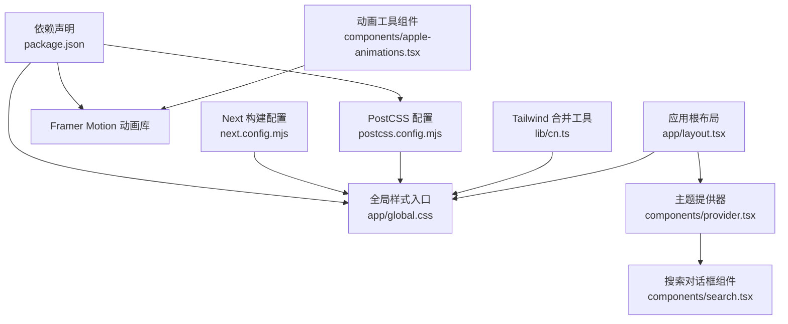
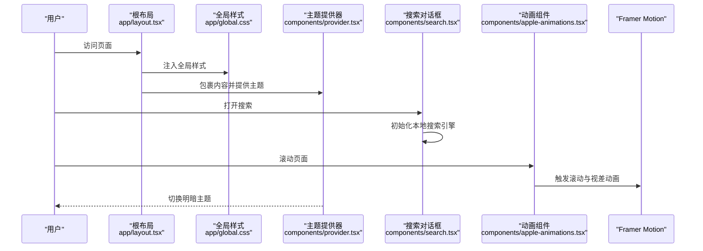
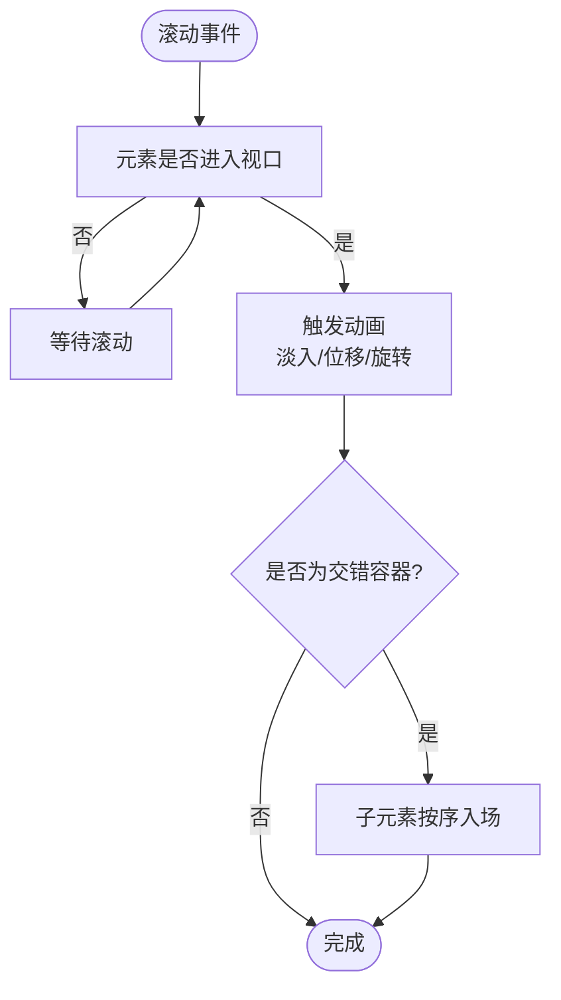
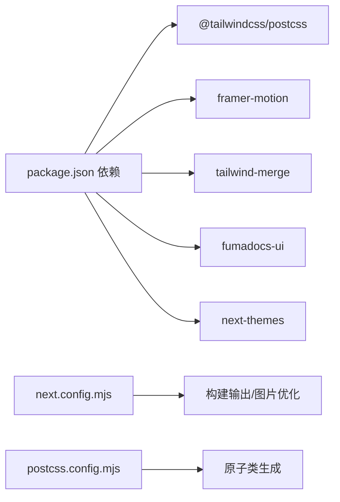

# 样式架构

<cite>
**本文引用的文件**
- [app/global.css](file://app/global.css)
- [app/layout.tsx](file://app/layout.tsx)
- [components/provider.tsx](file://components/provider.tsx)
- [components/apple-animations.tsx](file://components/apple-animations.tsx)
- [components/footer.tsx](file://components/footer.tsx)
- [components/search.tsx](file://components/search.tsx)
- [lib/cn.ts](file://lib/cn.ts)
- [next.config.mjs](file://next.config.mjs)
- [postcss.config.mjs](file://postcss.config.mjs)
- [package.json](file://package.json)
</cite>

## 目录
1. [引言](#引言)
2. [项目结构](#项目结构)
3. [核心组件](#核心组件)
4. [架构总览](#架构总览)
5. [详细组件分析](#详细组件分析)
6. [依赖关系分析](#依赖关系分析)
7. [性能考量](#性能考量)
8. [故障排查指南](#故障排查指南)
9. [结论](#结论)
10. [附录](#附录)

## 引言
本文件系统性梳理本项目的样式架构，涵盖全局样式组织、Apple 风格主题变量与工具类、CSS-in-JS（Framer Motion）与传统 CSS 的协同策略、响应式断点与布局体系、样式模块化与组件隔离、动画系统协同机制、以及在不同环境下的编译与优化策略。目标是为开发者提供一套可落地的样式设计与维护指南。

## 项目结构
项目采用“全局 CSS + 组件级动画 + 主题提供器”的混合样式策略：
- 全局样式通过 Next App Router 的根布局注入，集中管理基础排版、主题变量与通用工具类。
- 组件层通过 Framer Motion 提供的 CSS-in-JS 能力实现滚动触发与视差等交互动画。
- 主题切换由第三方 Provider 管理，支持系统主题与明暗模式联动。
- PostCSS 与 Tailwind v4 插件负责原子化类名生成与构建期优化。

图表来源
- [app/layout.tsx:1-28](file://app/layout.tsx#L1-L28)
- [app/global.css:1-286](file://app/global.css#L1-L286)
- [components/provider.tsx:1-36](file://components/provider.tsx#L1-L36)
- [components/search.tsx:1-47](file://components/search.tsx#L1-L47)
- [components/apple-animations.tsx:1-151](file://components/apple-animations.tsx#L1-L151)
- [lib/cn.ts:1-2](file://lib/cn.ts#L1-L2)
- [postcss.config.mjs:1-8](file://postcss.config.mjs#L1-L8)
- [next.config.mjs:1-15](file://next.config.mjs#L1-L15)
- [package.json:1-45](file://package.json#L1-L45)

章节来源
- [app/layout.tsx:1-28](file://app/layout.tsx#L1-L28)
- [app/global.css:1-286](file://app/global.css#L1-L286)
- [components/provider.tsx:1-36](file://components/provider.tsx#L1-L36)
- [postcss.config.mjs:1-8](file://postcss.config.mjs#L1-L8)
- [next.config.mjs:1-15](file://next.config.mjs#L1-L15)
- [package.json:1-45](file://package.json#L1-L45)

## 核心组件
- 全局样式与主题变量：集中于全局 CSS，定义 Apple 风格与站点通用主题变量，并通过明暗模式伪类切换。
- 主题提供器：封装第三方 UI 主题能力，统一管理主题属性与默认值。
- 动画组件：基于 Framer Motion 的滚动触发动画、视差区域与子元素交错入场。
- Tailwind 合并工具：通过 twMerge 合并冲突的原子类，避免重复与覆盖问题。
- 搜索对话框：集成 UI 组件库与本地搜索引擎，提供站内检索体验。

章节来源
- [app/global.css:1-286](file://app/global.css#L1-L286)
- [components/provider.tsx:19-36](file://components/provider.tsx#L19-L36)
- [components/apple-animations.tsx:13-150](file://components/apple-animations.tsx#L13-L150)
- [lib/cn.ts:1-2](file://lib/cn.ts#L1-L2)
- [components/search.tsx:25-46](file://components/search.tsx#L25-L46)

## 架构总览
整体样式架构以“全局 CSS + 组件动画 + 主题提供器”为核心，配合构建工具链完成样式生成与优化。下图展示关键交互流程：

图表来源
- [app/layout.tsx:19-27](file://app/layout.tsx#L19-L27)
- [app/global.css:1-286](file://app/global.css#L1-L286)
- [components/provider.tsx:19-36](file://components/provider.tsx#L19-L36)
- [components/search.tsx:25-46](file://components/search.tsx#L25-L46)
- [components/apple-animations.tsx:13-150](file://components/apple-animations.tsx#L13-L150)

## 详细组件分析

### 全局样式与主题变量
- Apple 风格变量：定义品牌主色、背景、文本、边框等变量，并在明暗模式下分别赋值。
- 站点通用变量：定义强调色、前景、中性、边框与表面层级变量，用于组件与 MDX 内容。
- 基础排版与工具类：提供 display/headline/body/caption 等语义化排版类，配合 clamp 实现流式字体大小。
- 导航栏、按钮、卡片、链接等通用组件样式，统一 Apple 风格交互与过渡。
- 动画与节区：内置若干关键帧与节区交替背景，适配移动端与桌面端断点。

章节来源
- [app/global.css:8-37](file://app/global.css#L8-L37)
- [app/global.css:269-285](file://app/global.css#L269-L285)
- [app/global.css:50-179](file://app/global.css#L50-L179)
- [app/global.css:180-222](file://app/global.css#L180-L222)

### 主题提供器与明暗模式
- 使用第三方 UI 提供的主题能力，启用系统主题检测，默认跟随系统。
- 通过 attribute: 'class' 将主题状态写入根节点 class，确保全局 CSS 能正确读取明暗变量。
- 国际化文案映射，便于多语言场景下的搜索与导航文案本地化。

章节来源
- [components/provider.tsx:19-36](file://components/provider.tsx#L19-L36)

### CSS-in-JS 与传统 CSS 的协同
- 传统 CSS：全局样式与组件样式通过原子类与变量驱动，保证一致的视觉与交互。
- CSS-in-JS：动画组件通过 Framer Motion 的 motion.div 在运行时注入样式，实现滚动触发动画、视差与交错入场。
- 协同策略：全局 CSS 负责静态样式与主题变量，组件动画负责动态交互；两者通过 DOM 层面共存，互不干扰。

章节来源
- [components/apple-animations.tsx:13-150](file://components/apple-animations.tsx#L13-L150)
- [app/global.css:180-222](file://app/global.css#L180-L222)

### 响应式设计与断点
- 流式排版：使用 clamp 与相对单位实现跨设备的自然缩放。
- 媒体查询：针对节区容器在中等及以上屏幕尺寸调整内边距，确保内容密度与可读性。
- 组件断点：部分组件使用 Tailwind 断点类控制显示/隐藏与布局网格，如移动端时间轴与桌面端时间轴。

章节来源
- [app/global.css:50-93](file://app/global.css#L50-L93)
- [app/global.css:214-218](file://app/global.css#L214-L218)

### 样式模块化与组件隔离
- 全局样式集中管理，组件样式通过原子类与变量引用，避免样式泄漏。
- 动画组件通过 className 与运行时样式组合，保持组件边界清晰。
- 使用 Tailwind 合并工具合并冲突类名，减少重复与覆盖风险。

章节来源
- [lib/cn.ts:1-2](file://lib/cn.ts#L1-L2)
- [components/footer.tsx:49-104](file://components/footer.tsx#L49-L104)

### 动画系统协同机制
- 缓动曲线：统一使用 Apple 标准缓动曲线，保证动效一致性。
- 滚动触发动画：元素进入视口时触发动画，支持方向与延迟参数。
- 视差滚动：根据滚动进度计算位移，营造层次感。
- 交错入场：父容器统一触发，子元素按序渐进出现，增强节奏感。

图表来源
- [components/apple-animations.tsx:13-150](file://components/apple-animations.tsx#L13-L150)

章节来源
- [components/apple-animations.tsx:13-150](file://components/apple-animations.tsx#L13-L150)

### 搜索与样式集成
- 搜索对话框组件直接复用 UI 库提供的样式结构，内部通过本地搜索引擎初始化与查询状态管理，保证交互流畅。
- 与全局样式协同：对话框容器与列表项继承站点排版与主题变量，保持一致的视觉风格。

章节来源
- [components/search.tsx:25-46](file://components/search.tsx#L25-L46)

## 依赖关系分析
- 构建工具链：PostCSS 集成 Tailwind v4 插件，负责生成原子类与基础样式。
- 运行时依赖：Framer Motion 提供 CSS-in-JS 动画能力；twMerge 用于类名合并；UI 组件库提供主题与对话框组件。
- Next 配置：输出模式与图片优化策略影响最终打包体积与加载性能。

图表来源
- [package.json:12-31](file://package.json#L12-L31)
- [next.config.mjs:6-12](file://next.config.mjs#L6-L12)
- [postcss.config.mjs:1-8](file://postcss.config.mjs#L1-L8)

章节来源
- [package.json:12-31](file://package.json#L12-L31)
- [next.config.mjs:6-12](file://next.config.mjs#L6-L12)
- [postcss.config.mjs:1-8](file://postcss.config.mjs#L1-L8)

## 性能考量
- 原子类合并：使用 twMerge 合并冲突类，减少无效样式与重绘。
- 构建输出：Next 输出为静态导出，结合图片未优化配置，适合静态托管；如需进一步优化可考虑 CDN 与懒加载策略。
- 动画性能：优先使用 transform/opacity 等 GPU 加速属性；控制动画数量与频率，避免过度重排。
- 样式体积：按需引入第三方样式（如 KaTeX、Mermaid），并在不需要时移除或按需加载。
- 主题切换：通过 class 属性切换主题，避免频繁重算样式树。

章节来源
- [lib/cn.ts:1-2](file://lib/cn.ts#L1-L2)
- [next.config.mjs:7-11](file://next.config.mjs#L7-L11)
- [components/apple-animations.tsx:34-43](file://components/apple-animations.tsx#L34-L43)

## 故障排查指南
- 明暗主题不生效：检查根节点 class 是否正确写入，确认主题提供器的 attribute 设置与全局 CSS 的 :root/.dark 选择器匹配。
- 动画不触发：确认元素已进入视口且 viewport 参数合理；检查 whileInView 与 viewport 的 once 与 margin 配置。
- 类名冲突：使用 twMerge 合并类名，避免重复设置同一属性导致的覆盖。
- 搜索无结果：确认本地搜索引擎初始化成功，schema 与语言配置正确；检查查询状态与数据源。
- 构建体积异常：核对输出模式与图片优化配置；按需移除未使用的第三方样式与动画。

章节来源
- [components/provider.tsx:26-30](file://components/provider.tsx#L26-L30)
- [components/apple-animations.tsx:37-38](file://components/apple-animations.tsx#L37-L38)
- [lib/cn.ts:1-2](file://lib/cn.ts#L1-L2)
- [components/search.tsx:17-23](file://components/search.tsx#L17-L23)
- [next.config.mjs:7-11](file://next.config.mjs#L7-L11)

## 结论
本项目的样式架构以全局 CSS 为基础，结合 Apple 风格主题变量与工具类，辅以 Framer Motion 的 CSS-in-JS 动画能力，形成“静态样式 + 动态交互”的统一方案。通过主题提供器与构建工具链的协同，实现了跨设备的一致体验与良好的可维护性。建议在后续迭代中持续关注动画性能、样式体积与主题一致性，确保在不同环境下稳定交付高质量的视觉与交互体验。

## 附录
- Apple 风格变量与站点通用变量清单：参见全局 CSS 中的变量定义段落。
- 响应式断点参考：移动端与桌面端的媒体查询与排版断点。
- 动画组件 API：滚动触发动画、视差区域、交错入场等组件的参数与行为。

章节来源
- [app/global.css:8-37](file://app/global.css#L8-L37)
- [app/global.css:269-285](file://app/global.css#L269-L285)
- [app/global.css:214-218](file://app/global.css#L214-L218)
- [components/apple-animations.tsx:13-150](file://components/apple-animations.tsx#L13-L150)