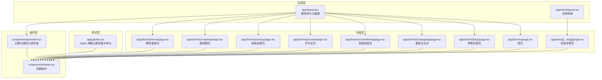
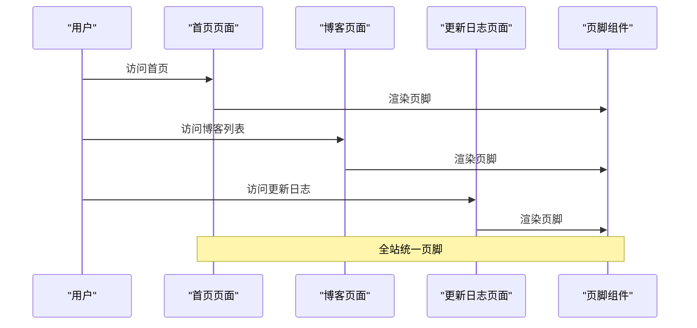
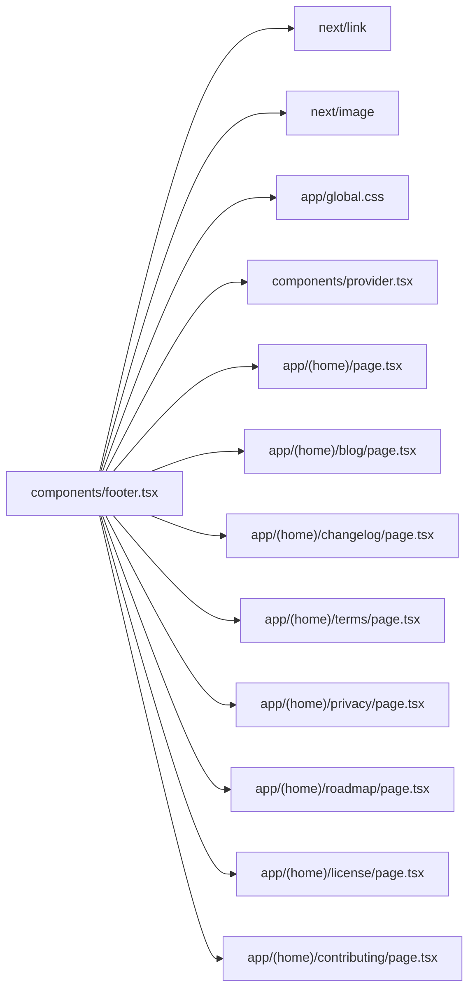

# 页脚组件

<cite>
**本文引用的文件**
- [components/footer.tsx](file://components/footer.tsx)
- [app/layout.tsx](file://app/layout.tsx)
- [app/global.css](file://app/global.css)
- [lib/layout.shared.tsx](file://lib/layout.shared.tsx)
- [lib/shared.ts](file://lib/shared.ts)
- [components/provider.tsx](file://components/provider.tsx)
- [app/(home)/page.tsx](file://app/(home)/page.tsx)
- [app/(home)/blog/page.tsx](file://app/(home)/blog/page.tsx)
- [app/(home)/changelog/page.tsx](file://app/(home)/changelog/page.tsx)
- [app/(home)/contributing/page.tsx](file://app/(home)/contributing/page.tsx)
- [app/(home)/license/page.tsx](file://app/(home)/license/page.tsx)
- [app/(home)/privacy/page.tsx](file://app/(home)/privacy/page.tsx)
- [app/(home)/roadmap/page.tsx](file://app/(home)/roadmap/page.tsx)
- [app/(home)/terms/page.tsx](file://app/(home)/terms/page.tsx)
- [app/docs/[[...slug]]/page.tsx](file://app/docs/[[...slug]]/page.tsx)
- [app/docs/layout.tsx](file://app/docs/layout.tsx)
</cite>

## 目录
1. [简介](#简介)
2. [项目结构](#项目结构)
3. [核心组件](#核心组件)
4. [架构总览](#架构总览)
5. [详细组件分析](#详细组件分析)
6. [依赖分析](#依赖分析)
7. [性能考虑](#性能考虑)
8. [故障排查指南](#故障排查指南)
9. [结论](#结论)
10. [附录](#附录)

## 简介
本文件为页脚组件的完整技术文档，围绕 Footer 组件的结构设计、功能实现、布局策略、链接配置、样式设计与响应式适配、动态更新机制、定制扩展方法、与整体布局的协调关系、SEO 与无障碍支持、以及在不同页面中的差异化显示策略进行系统化说明。文档同时提供面向开发者的使用指南与最佳实践。

## 项目结构
该站点采用 Next.js 应用程序路由结构，页脚组件位于 components 目录中，并在多个页面中被引入使用。全局样式通过 app/global.css 定义 Apple 风格的主题变量与通用样式；应用布局由 app/layout.tsx 提供基础 HTML 结构与元数据；文档子路由通过 app/docs/layout.tsx 使用 fumadocs-ui 的 DocsLayout 包裹内容。

图表来源
- [app/layout.tsx:19-27](file://app/layout.tsx#L19-L27)
- [app/docs/layout.tsx:5-13](file://app/docs/layout.tsx#L5-L13)
- [components/footer.tsx:4-106](file://components/footer.tsx#L4-L106)
- [components/provider.tsx:19-35](file://components/provider.tsx#L19-L35)
- [app/global.css:18-37](file://app/global.css#L18-L37)
- [app/(home)/page.tsx:245-246](file://app/(home)/page.tsx#L245-L246)
- [app/(home)/blog/page.tsx:88-88](file://app/(home)/blog/page.tsx#L88-L88)
- [app/(home)/changelog/page.tsx:269-269](file://app/(home)/changelog/page.tsx#L269-L269)
- [app/(home)/contributing/page.tsx:120-120](file://app/(home)/contributing/page.tsx#L120-L120)
- [app/(home)/license/page.tsx:104-104](file://app/(home)/license/page.tsx#L104-L104)
- [app/(home)/privacy/page.tsx:83-83](file://app/(home)/privacy/page.tsx#L83-L83)
- [app/(home)/roadmap/page.tsx:342-342](file://app/(home)/roadmap/page.tsx#L342-L342)
- [app/(home)/terms/page.tsx:83-83](file://app/(home)/terms/page.tsx#L83-L83)
- [app/docs/[[...slug]]/page.tsx:16-49](file://app/docs/[[...slug]]/page.tsx#L16-L49)

章节来源
- [app/layout.tsx:1-28](file://app/layout.tsx#L1-L28)
- [app/global.css:1-286](file://app/global.css#L1-L286)
- [components/footer.tsx:1-107](file://components/footer.tsx#L1-L107)
- [app/docs/layout.tsx:1-14](file://app/docs/layout.tsx#L1-L14)
- [app/(home)/page.tsx:240-250](file://app/(home)/page.tsx#L240-L250)

## 核心组件
- 组件名称：Footer
- 所属模块：components/footer.tsx
- 组件职责：渲染统一的站点页脚，包含多列导航链接组、法律与版权信息、以及外部链接处理。
- 关键特性：
  - 多列栅格布局，支持响应式断点切换。
  - 支持内部链接与外部链接区分，自动设置 target 与 rel 属性。
  - 使用 Apple 风格主题变量，深浅色模式自适应。
  - 法律链接与版权信息分段展示，包含中国境内网站合规标识。

章节来源
- [components/footer.tsx:4-106](file://components/footer.tsx#L4-L106)

## 架构总览
页脚组件在多个页面中被统一引入，确保全站一致的导航与版权信息呈现。应用根布局负责全局样式与主题提供，文档子路由通过 DocsLayout 包裹内容，页脚始终位于页面底部，形成稳定的视觉与交互基线。

图表来源
- [app/(home)/page.tsx:245-246](file://app/(home)/page.tsx#L245-L246)
- [app/(home)/blog/page.tsx:88-88](file://app/(home)/blog/page.tsx#L88-L88)
- [app/(home)/changelog/page.tsx:269-269](file://app/(home)/changelog/page.tsx#L269-L269)
- [components/footer.tsx:4-106](file://components/footer.tsx#L4-L106)

## 详细组件分析

### 结构设计与布局策略
- 外层容器：使用最大宽度约束与水平内边距，垂直方向提供足够的留白，营造舒适的阅读体验。
- 标题区网格：采用响应式网格布局，按断点从 2 列到 5 列变化，保证在小屏设备上的可读性与大屏设备的空间利用。
- 标题与链接：每个链接组包含一个标题与若干链接项，标题使用小号字重与大写转换，增强层级感。
- 法律与版权区：法律链接采用行内分隔符连接，版权信息包含年份、备案号与公安标识，满足中国大陆网站合规要求。

章节来源
- [components/footer.tsx:48-104](file://components/footer.tsx#L48-L104)

### 链接配置与导航结构
- 链接分组：通过数组结构定义多个链接组，每组包含标题与链接数组。
- 内部与外部链接：通过 external 字段区分外部链接，自动添加目标窗口与安全属性，避免安全风险。
- 法律链接：独立维护法律相关链接集合，便于统一管理与复用。
- 示例路径：
  - 产品：文档、组件、主题、CLI 工具
  - 资源：博客、更新日志、路线图
  - 社区：GitHub、Discord、X/Twitter、贡献指南
  - 法律：隐私政策、服务条款、开源协议

章节来源
- [components/footer.tsx:5-46](file://components/footer.tsx#L5-L46)

### 样式设计原则与响应式适配
- 主题变量：使用 Apple 风格的 CSS 变量，深浅色模式下自动切换背景、文本与边框颜色。
- 字体与间距：标题使用小号字体与大写转换，链接采用次级文本色，悬停时过渡到主文本色，提升可读性与交互反馈。
- 响应式断点：在小屏设备上减少列数，大屏设备上增加列数，确保在不同屏幕尺寸下的良好布局。
- 合规标识：版权区包含中国境内网站所需的备案号与公安标识，使用图片与文字结合的方式呈现。

章节来源
- [app/global.css:18-37](file://app/global.css#L18-L37)
- [components/footer.tsx:48-104](file://components/footer.tsx#L48-L104)

### 动态更新机制
- 年份动态：版权信息中的年份通过运行时获取当前年份，无需手动更新。
- 外链安全：外部链接自动设置目标窗口与安全属性，提升安全性。
- 主题联动：页脚颜色与主题提供者保持一致，深浅色模式自动切换。

章节来源
- [components/footer.tsx:92-101](file://components/footer.tsx#L92-L101)
- [components/provider.tsx:26-30](file://components/provider.tsx#L26-L30)

### 定制与扩展方法
- 修改链接组：在组件内部调整链接数组即可快速增删改导航项。
- 新增链接组：向链接数组添加新的对象，包含标题与链接数组。
- 法律链接维护：修改法律链接数组以同步更新底部法律区域。
- 样式扩展：通过全局 CSS 变量或组件内类名扩展样式，保持与 Apple 风格一致。
- 页面差异化：可在特定页面隐藏或替换页脚，但需确保合规信息不缺失。

章节来源
- [components/footer.tsx:5-46](file://components/footer.tsx#L5-L46)
- [app/global.css:18-37](file://app/global.css#L18-L37)

### 与整体布局的协调关系
- 根布局：提供全局样式与主题提供者，页脚继承主题变量与样式。
- 文档布局：文档子路由通过 DocsLayout 包裹内容，页脚位于文档内容之外，确保文档页脚一致性。
- 页面引入：各页面在渲染树末尾引入页脚，保证其始终处于页面底部。

章节来源
- [app/layout.tsx:19-27](file://app/layout.tsx#L19-L27)
- [app/docs/layout.tsx:5-13](file://app/docs/layout.tsx#L5-L13)
- [app/(home)/page.tsx:245-246](file://app/(home)/page.tsx#L245-L246)

### SEO 优化与无障碍支持
- SEO 优化：页脚不包含关键内容，主要提供导航与法律信息，有助于搜索引擎理解站点结构。建议在页面中通过结构化数据与语义化标签进一步优化。
- 无障碍支持：页脚使用标准语义化元素与链接，具备基本的可访问性。建议为重要链接添加 aria-label 或 title 属性，提升屏幕阅读器体验。

章节来源
- [components/footer.tsx:48-104](file://components/footer.tsx#L48-L104)

### 在不同页面中的差异化显示策略
- 默认显示：所有页面均默认显示页脚，确保一致的品牌与导航体验。
- 特殊页面：如登录、注册等页面可选择隐藏页脚，但需确保法律与版权信息在其他位置可见。
- 文档页面：文档详情页通过 DocsLayout 包裹，页脚仍位于页面底部，保持全局一致性。

章节来源
- [app/docs/[[...slug]]/page.tsx:16-49](file://app/docs/[[...slug]]/page.tsx#L16-L49)
- [app/docs/layout.tsx:5-13](file://app/docs/layout.tsx#L5-L13)

## 依赖分析
- 组件依赖：页脚组件依赖 Next.js 的 Link 与 Image 组件，用于内部导航与图标展示。
- 样式依赖：页脚组件依赖全局 CSS 中定义的 Apple 风格主题变量，确保深浅色模式下的视觉一致性。
- 布局依赖：页脚组件在多个页面中被引入，依赖应用根布局提供的主题提供者与全局样式。

图表来源
- [components/footer.tsx:1-2](file://components/footer.tsx#L1-L2)
- [app/global.css:18-37](file://app/global.css#L18-L37)
- [components/provider.tsx:19-35](file://components/provider.tsx#L19-L35)
- [app/(home)/page.tsx:245-246](file://app/(home)/page.tsx#L245-L246)
- [app/(home)/blog/page.tsx:88-88](file://app/(home)/blog/page.tsx#L88-L88)
- [app/(home)/changelog/page.tsx:269-269](file://app/(home)/changelog/page.tsx#L269-L269)
- [app/(home)/terms/page.tsx:83-83](file://app/(home)/terms/page.tsx#L83-L83)
- [app/(home)/privacy/page.tsx:83-83](file://app/(home)/privacy/page.tsx#L83-L83)
- [app/(home)/roadmap/page.tsx:342-342](file://app/(home)/roadmap/page.tsx#L342-L342)
- [app/(home)/license/page.tsx:104-104](file://app/(home)/license/page.tsx#L104-L104)
- [app/(home)/contributing/page.tsx:120-120](file://app/(home)/contributing/page.tsx#L120-L120)

章节来源
- [components/footer.tsx:1-2](file://components/footer.tsx#L1-L2)
- [app/global.css:18-37](file://app/global.css#L18-L37)
- [components/provider.tsx:19-35](file://components/provider.tsx#L19-L35)

## 性能考虑
- 渲染开销：页脚组件结构简单，渲染成本低，适合在多个页面重复使用。
- 图片加载：页脚中的备案图标为静态资源，建议预加载或懒加载策略以优化首屏性能。
- 主题切换：深浅色模式切换通过 CSS 变量实现，性能开销极低。
- 链接外跳：外部链接自动设置安全属性，避免不必要的 JavaScript 开销。

## 故障排查指南
- 链接无法打开：检查 external 字段是否正确设置，确认外部链接的 target 与 rel 属性已生效。
- 样式异常：确认全局 CSS 中 Apple 风格主题变量已正确加载，深浅色模式切换正常。
- 版权信息不更新：确认年份计算逻辑正确，确保运行时获取的是当前年份。
- 文档页面页脚错位：检查 DocsLayout 是否正确包裹内容，确保页脚位于页面底部。

章节来源
- [components/footer.tsx:58-68](file://components/footer.tsx#L58-L68)
- [app/global.css:18-37](file://app/global.css#L18-L37)
- [app/docs/layout.tsx:5-13](file://app/docs/layout.tsx#L5-L13)

## 结论
页脚组件通过简洁的结构与 Apple 风格的主题变量，实现了跨页面的一致性与良好的可访问性。其响应式布局与动态年份更新提升了用户体验，配合全局样式与主题提供者，确保在深浅色模式下均具有优秀的视觉表现。开发者可通过简单的数组配置即可完成页脚内容的定制与扩展，满足不同页面的差异化需求。

## 附录
- 使用示例：在任意页面末尾引入页脚组件，即可实现全站统一页脚。
- 扩展建议：根据业务需要新增链接组或法律链接，保持与现有样式风格一致。
- 合规提示：确保法律链接与版权信息符合当地法规要求，必要时在特殊页面补充替代展示。