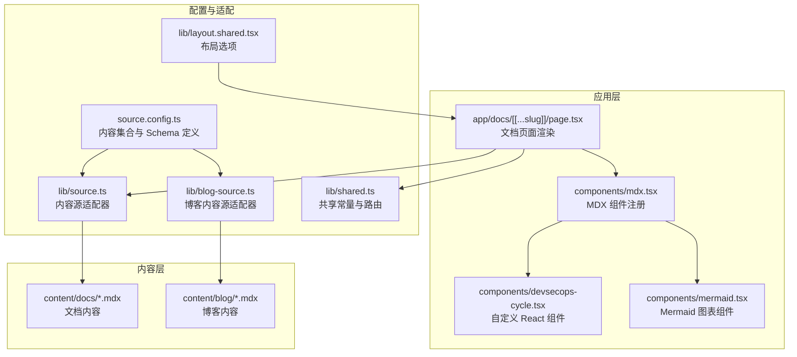
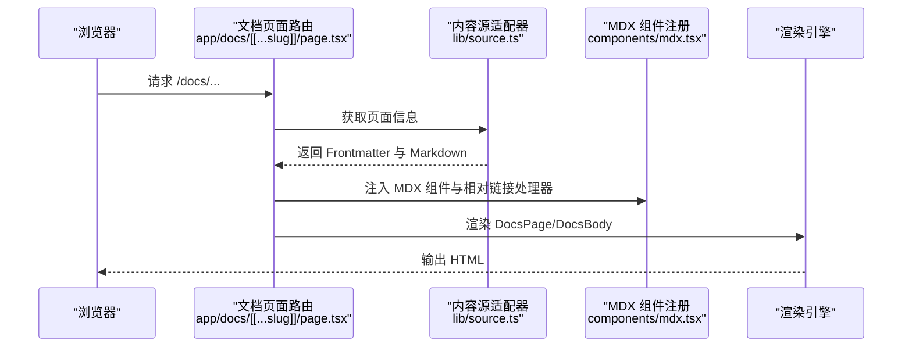
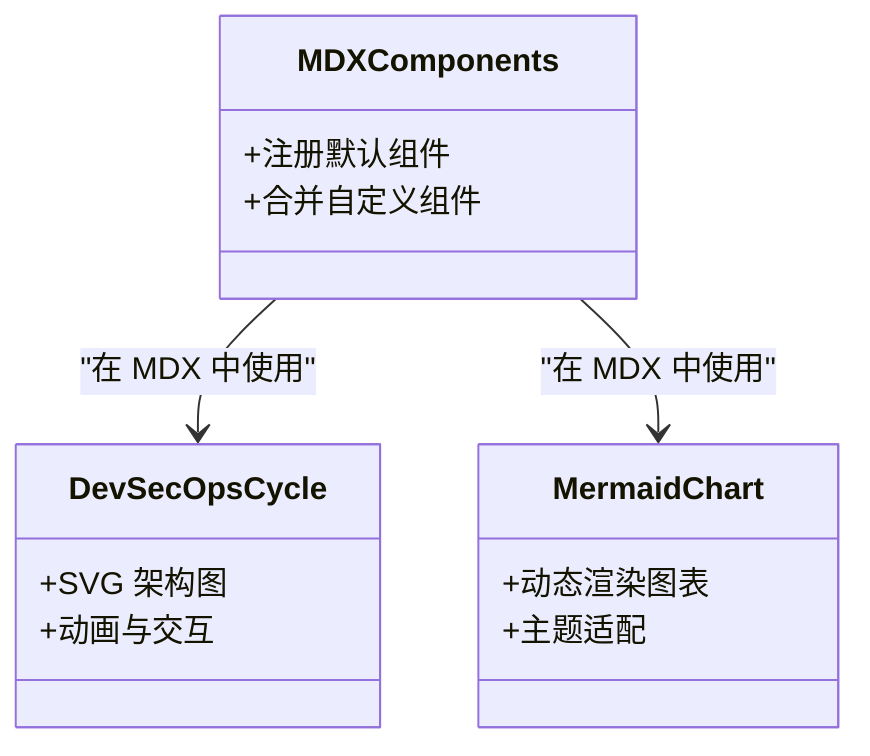
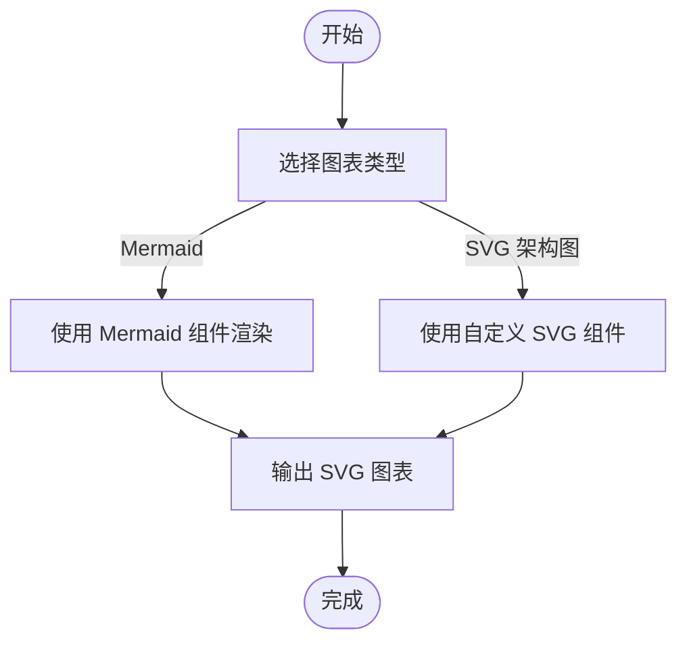
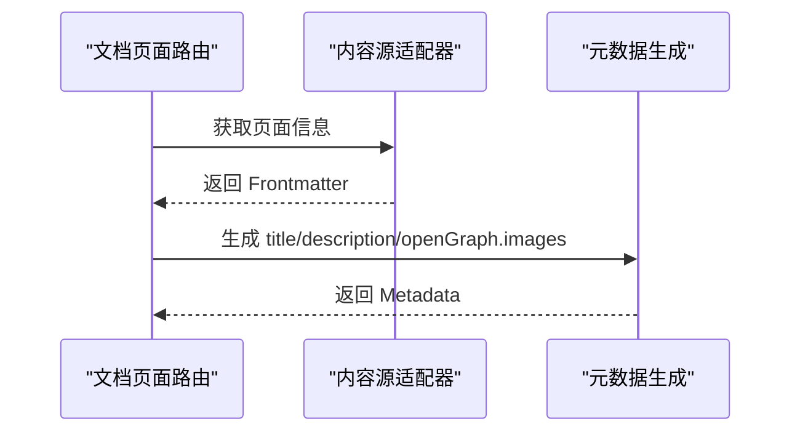
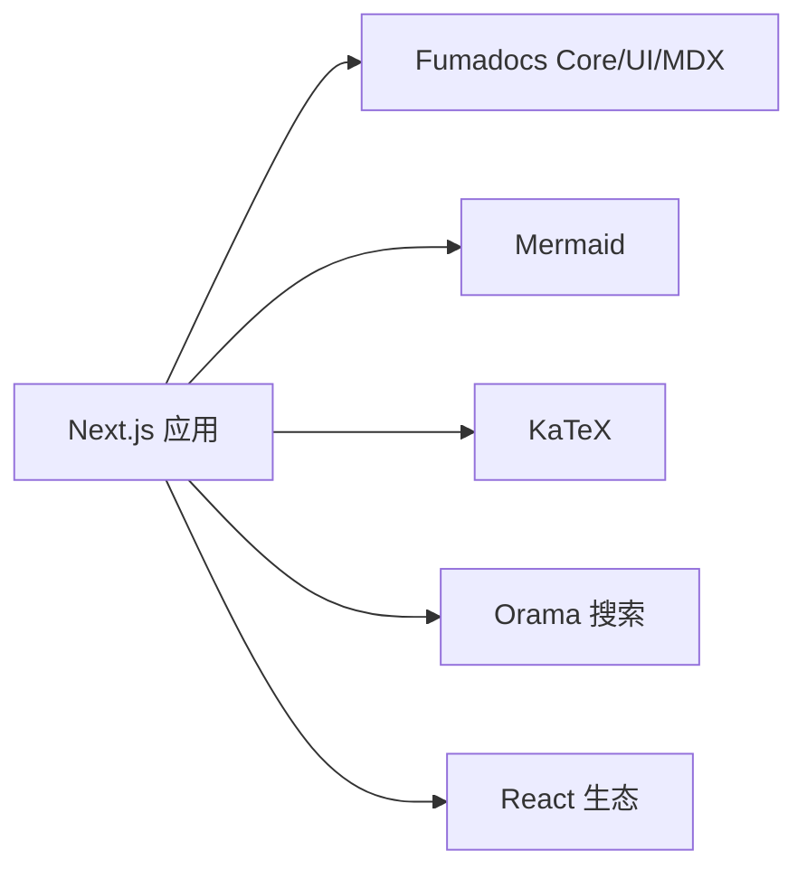

# MDX 内容编写

<cite>
**本文引用的文件**
- [README.md](file://README.md)
- [package.json](file://package.json)
- [source.config.ts](file://source.config.ts)
- [lib/source.ts](file://lib/source.ts)
- [lib/blog-source.ts](file://lib/blog-source.ts)
- [lib/layout.shared.tsx](file://lib/layout.shared.tsx)
- [lib/shared.ts](file://lib/shared.ts)
- [components/mdx.tsx](file://components/mdx.tsx)
- [components/devsecops-cycle.tsx](file://components/devsecops-cycle.tsx)
- [components/mermaid.tsx](file://components/mermaid.tsx)
- [app/docs/[[...slug]]/page.tsx](file://app/docs/[[...slug]]/page.tsx)
- [content/docs/index.mdx](file://content/docs/index.mdx)
- [content/docs/test.mdx](file://content/docs/test.mdx)
- [content/blog/202501150930-welcome-to-docme.mdx](file://content/blog/202501150930-welcome-to-docme.mdx)
- [content/blog/202503101400-full-text-search-orama.mdx](file://content/blog/202503101400-full-text-search-orama.mdx)
</cite>

## 目录
1. [简介](#简介)
2. [项目结构](#项目结构)
3. [核心组件](#核心组件)
4. [架构总览](#架构总览)
5. [详细组件分析](#详细组件分析)
6. [依赖分析](#依赖分析)
7. [性能考虑](#性能考虑)
8. [故障排查指南](#故障排查指南)
9. [结论](#结论)
10. [附录](#附录)

## 简介
本指南面向内容作者，系统讲解如何在本项目中编写高质量的 MDX 文档。内容涵盖：
- MDX 与 Markdown 的结合使用
- Frontmatter 字段定义与最佳实践
- MDX 组件与自定义组件的使用与开发
- 复杂内容（代码块、图表、表格等）的编写方法
- 内容组织与文件命名规范
- SEO 优化与元数据设置
- 内容模板与示例路径
- MDX 组件与 React 组件的集成方式

## 项目结构
本项目基于 Next.js 与 Fumadocs 构建，采用“内容即数据”的架构。核心目录与职责如下：
- app/docs：文档页面渲染入口，负责加载内容、生成元数据与渲染 MDX
- content/docs 与 content/blog：存放 MDX 内容与 Frontmatter
- components：MDX 组件与自定义 React 组件（如流程图、架构图）
- lib：内容源适配器、共享配置与布局选项
- source.config.ts：定义内容集合、Frontmatter Schema 与 MDX 选项

**图表来源**
- [app/docs/[[...slug]]/page.tsx](file://app/docs/[[...slug]]/page.tsx#L16-L63)
- [components/mdx.tsx:1-15](file://components/mdx.tsx#L1-L15)
- [components/devsecops-cycle.tsx:168-377](file://components/devsecops-cycle.tsx#L168-L377)
- [components/mermaid.tsx:15-52](file://components/mermaid.tsx#L15-L52)
- [source.config.ts:1-46](file://source.config.ts#L1-L46)
- [lib/source.ts:1-37](file://lib/source.ts#L1-L37)
- [lib/blog-source.ts:1-10](file://lib/blog-source.ts#L1-L10)
- [lib/layout.shared.tsx:1-36](file://lib/layout.shared.tsx#L1-L36)
- [lib/shared.ts:1-12](file://lib/shared.ts#L1-L12)

**章节来源**
- [README.md:20-37](file://README.md#L20-L37)
- [source.config.ts:16-40](file://source.config.ts#L16-L40)
- [lib/source.ts:6-10](file://lib/source.ts#L6-L10)
- [lib/blog-source.ts:5-9](file://lib/blog-source.ts#L5-L9)

## 核心组件
- MDX 组件注册：通过统一函数合并默认组件与自定义组件，便于全局复用与扩展。
- 自定义 React 组件：如 SVG 架构图、Mermaid 图表等，以 React 组件形式在 MDX 中直接使用。
- 内容源适配器：基于 Fumadocs loader 将内容目录转换为可查询的数据源，支持文档与博客两类集合。

**章节来源**
- [components/mdx.tsx:4-9](file://components/mdx.tsx#L4-L9)
- [components/devsecops-cycle.tsx:168-377](file://components/devsecops-cycle.tsx#L168-L377)
- [components/mermaid.tsx:15-52](file://components/mermaid.tsx#L15-L52)
- [lib/source.ts:6-10](file://lib/source.ts#L6-L10)
- [lib/blog-source.ts:5-9](file://lib/blog-source.ts#L5-L9)

## 架构总览
文档渲染流程概览：
- 页面参数解析后，通过内容源适配器定位具体页面
- 读取 Frontmatter 与处理后的 Markdown
- 渲染 MDX 内容，注入 MDX 组件与相对链接处理器
- 生成页面元数据（标题、描述、OG 图片）

**图表来源**
- [app/docs/[[...slug]]/page.tsx:16-L63](file://app/docs/[[...slug]]/page.tsx#L16-L63)
- [lib/source.ts:6-10](file://lib/source.ts#L6-L10)
- [components/mdx.tsx:4-9](file://components/mdx.tsx#L4-L9)

## 详细组件分析

### Frontmatter 字段与 Schema
- 文档集合（docs）：使用基础页面 Schema，支持标题、描述、目录、全文等字段。
- 博客集合（blog）：在基础 Schema 上扩展 id、author、date、tags、cover 等字段。
- 元数据（meta）：使用统一 Schema，支持更广泛的元信息。

建议字段与用途：
- 标题（title）：页面主标题，用于 SEO 与页面标题
- 描述（description）：页面摘要，用于 Open Graph 与搜索摘要
- 标识（id）：博客唯一标识，用于生成稳定链接
- 作者（author）、日期（date）、标签（tags）、封面（cover）：博客专用
- 目录（toc）、全文（full）：控制文档目录与页面布局

**章节来源**
- [source.config.ts:6-12](file://source.config.ts#L6-L12)
- [source.config.ts:18-22](file://source.config.ts#L18-L22)
- [source.config.ts:32-35](file://source.config.ts#L32-L35)
- [app/docs/[[...slug]]/page.tsx:56-L62](file://app/docs/[[...slug]]/page.tsx#L56-L62)

### MDX 组件与自定义组件
- 默认组件：由 Fumadocs UI 提供，覆盖标题、段落、列表、代码块等常见元素。
- 自定义组件：通过 React 组件在 MDX 中直接使用，如架构图、Mermaid 图表等。
- 组件注册：统一在组件层进行合并与导出，确保页面渲染一致性。

**图表来源**
- [components/mdx.tsx:4-9](file://components/mdx.tsx#L4-L9)
- [components/devsecops-cycle.tsx:168-377](file://components/devsecops-cycle.tsx#L168-L377)
- [components/mermaid.tsx:15-52](file://components/mermaid.tsx#L15-L52)

**章节来源**
- [components/mdx.tsx:1-15](file://components/mdx.tsx#L1-L15)
- [components/devsecops-cycle.tsx:168-377](file://components/devsecops-cycle.tsx#L168-L377)
- [components/mermaid.tsx:15-52](file://components/mermaid.tsx#L15-L52)

### 复杂内容编写方法
- 代码块：支持语言高亮，建议明确指定语言以便正确渲染。
- 表格：标准 Markdown 表格即可；若需复杂样式，可在 MDX 中嵌入自定义组件或使用表格组件。
- 图表：
  - Mermaid：通过 Mermaid 组件传入图表定义字符串，自动渲染 SVG。
  - SVG 架构图：使用自定义组件，适合展示系统架构、流程等。

**图表来源**
- [components/mermaid.tsx:15-52](file://components/mermaid.tsx#L15-L52)
- [components/devsecops-cycle.tsx:168-377](file://components/devsecops-cycle.tsx#L168-L377)

**章节来源**
- [content/docs/test.mdx:8-10](file://content/docs/test.mdx#L8-L10)
- [content/docs/test.mdx:14-17](file://content/docs/test.mdx#L14-L17)
- [components/mermaid.tsx:15-52](file://components/mermaid.tsx#L15-L52)
- [components/devsecops-cycle.tsx:168-377](file://components/devsecops-cycle.tsx#L168-L377)

### 内容组织与文件命名规范
- 文档内容：放置于 content/docs，Frontmatter 使用基础 Schema 字段。
- 博客内容：放置于 content/blog，Frontmatter 使用扩展 Schema 字段。
- 文件命名：建议使用日期+简短标题的形式（如 202501150930-welcome-to-docme.mdx），便于排序与识别。
- 目录结构：按主题分目录组织，配合自动生成的侧边栏导航。

**章节来源**
- [source.config.ts:16-27](file://source.config.ts#L16-L27)
- [source.config.ts:29-40](file://source.config.ts#L29-L40)
- [content/blog/202501150930-welcome-to-docme.mdx:1-9](file://content/blog/202501150930-welcome-to-docme.mdx#L1-L9)

### SEO 优化与元数据设置
- 页面标题与描述：来自 Frontmatter 的 title 与 description，用于页面标题与 Open Graph 描述。
- OG 图片：根据页面 slug 生成固定路径的图片资源，提升分享体验。
- 动态元数据：在页面层生成 Metadata，确保每个页面的 SEO 信息准确。

**图表来源**
- [app/docs/[[...slug]]/page.tsx:51-L63](file://app/docs/[[...slug]]/page.tsx#L51-L63)
- [lib/source.ts:12-28](file://lib/source.ts#L12-L28)

**章节来源**
- [app/docs/[[...slug]]/page.tsx:56-L62](file://app/docs/[[...slug]]/page.tsx#L56-L62)
- [lib/source.ts:12-19](file://lib/source.ts#L12-L19)

### 内容模板与示例
- 文档首页模板：包含 Frontmatter、标题、段落与卡片组件示例。
- 博客文章模板：包含标题、描述、作者、日期、标签、封面等字段，以及代码块与列表示例。
- 测试页模板：展示代码块与卡片组件的组合使用。

**章节来源**
- [content/docs/index.mdx:1-19](file://content/docs/index.mdx#L1-L19)
- [content/docs/test.mdx:1-18](file://content/docs/test.mdx#L1-L18)
- [content/blog/202501150930-welcome-to-docme.mdx:1-42](file://content/blog/202501150930-welcome-to-docme.mdx#L1-L42)
- [content/blog/202503101400-full-text-search-orama.mdx:1-60](file://content/blog/202503101400-full-text-search-orama.mdx#L1-L60)

### MDX 组件与 React 组件的集成
- 在 MDX 中直接使用自定义 React 组件，如 <DevSecOpsCycle>、<Mermaid> 等。
- 通过 getMDXComponents 注册组件，确保页面渲染时可用。
- 可以在组件中使用状态、主题、动画等 React 能力，增强交互性。

**章节来源**
- [components/mdx.tsx:4-9](file://components/mdx.tsx#L4-L9)
- [components/devsecops-cycle.tsx:168-377](file://components/devsecops-cycle.tsx#L168-L377)
- [components/mermaid.tsx:15-52](file://components/mermaid.tsx#L15-L52)

## 依赖分析
- 核心依赖：Next.js、Fumadocs（core/ui/mdx）、Mermaid、KaTeX、Orama 等。
- 类型与工具：TypeScript、TailwindCSS、MDX 类型声明等。
- 构建与脚本：开发、构建、类型检查与 MDX 类型生成。

**图表来源**
- [package.json:12-31](file://package.json#L12-L31)

**章节来源**
- [package.json:12-31](file://package.json#L12-L31)
- [package.json:5-11](file://package.json#L5-L11)

## 性能考虑
- 静态生成：文档页面采用静态生成，提升首屏性能与 SEO。
- 代码高亮：使用内置高亮方案，避免额外运行时开销。
- 图表渲染：Mermaid 采用懒加载与缓存策略，减少重复渲染成本。
- 资源路径：OG 图片与 Markdown 原始内容路径统一管理，便于缓存与 CDN 加速。

## 故障排查指南
- 页面未找到：当内容源无法解析 slug 时返回 404，检查文件是否存在与命名是否规范。
- Frontmatter 校验失败：确认字段类型与 Schema 是否一致，必要时调整 source.config.ts 中的 Schema。
- MDX 组件未生效：检查组件是否在 getMDXComponents 中注册，或是否在页面渲染时传入。
- OG 图片不显示：确认共享路由配置与图片路径生成逻辑是否正确。

**章节来源**
- [app/docs/[[...slug]]/page.tsx:18-L19](file://app/docs/[[...slug]]/page.tsx#L18-L19)
- [lib/shared.ts:2-4](file://lib/shared.ts#L2-L4)
- [lib/source.ts:12-19](file://lib/source.ts#L12-L19)

## 结论
本指南提供了在本项目中编写 MDX 内容的完整方法论：从 Frontmatter 字段定义、MDX 组件与自定义组件的使用，到复杂内容的编写、SEO 优化与性能考量。遵循本文档的规范与示例，内容作者可以高效产出高质量、可维护且具备良好用户体验的文档与博客内容。

## 附录
- 开发与构建：使用提供的脚本进行开发、构建与类型检查。
- 资源与生态：充分利用 Fumadocs 生态与 Next.js 能力，持续扩展内容能力。

**章节来源**
- [README.md:8-16](file://README.md#L8-L16)
- [package.json:5-11](file://package.json#L5-L11)