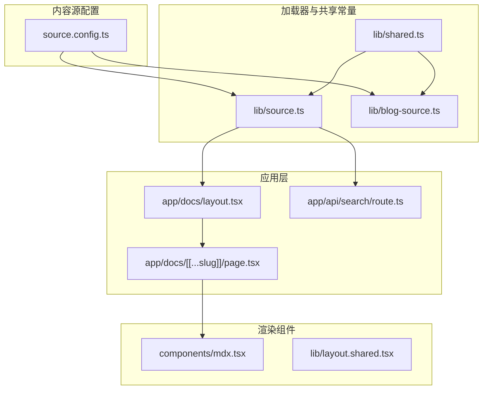
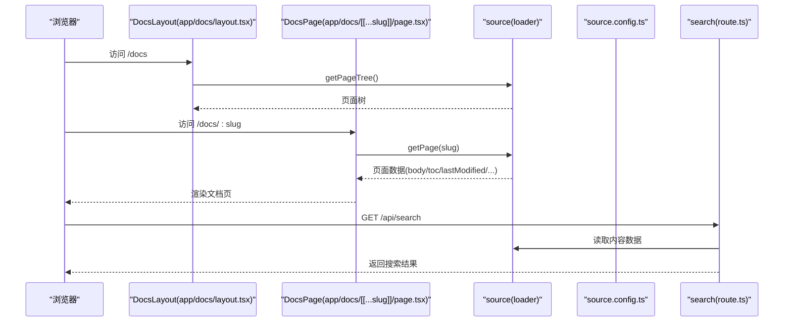
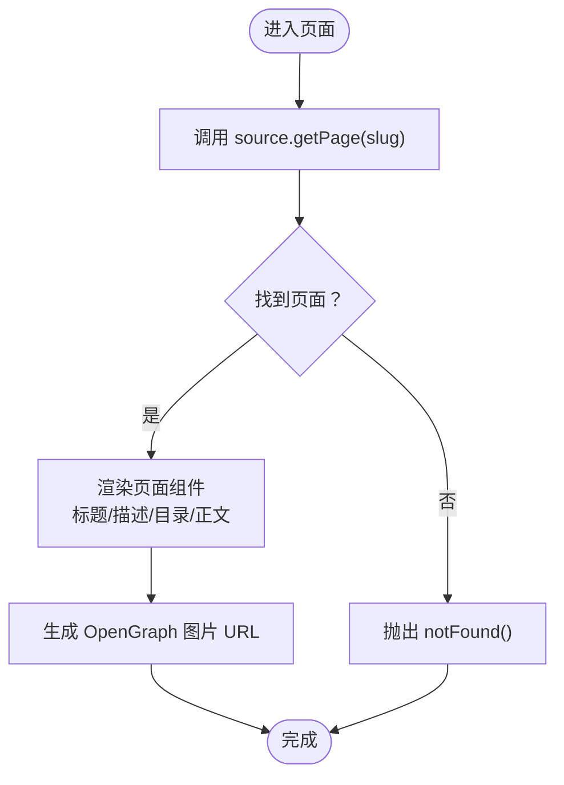
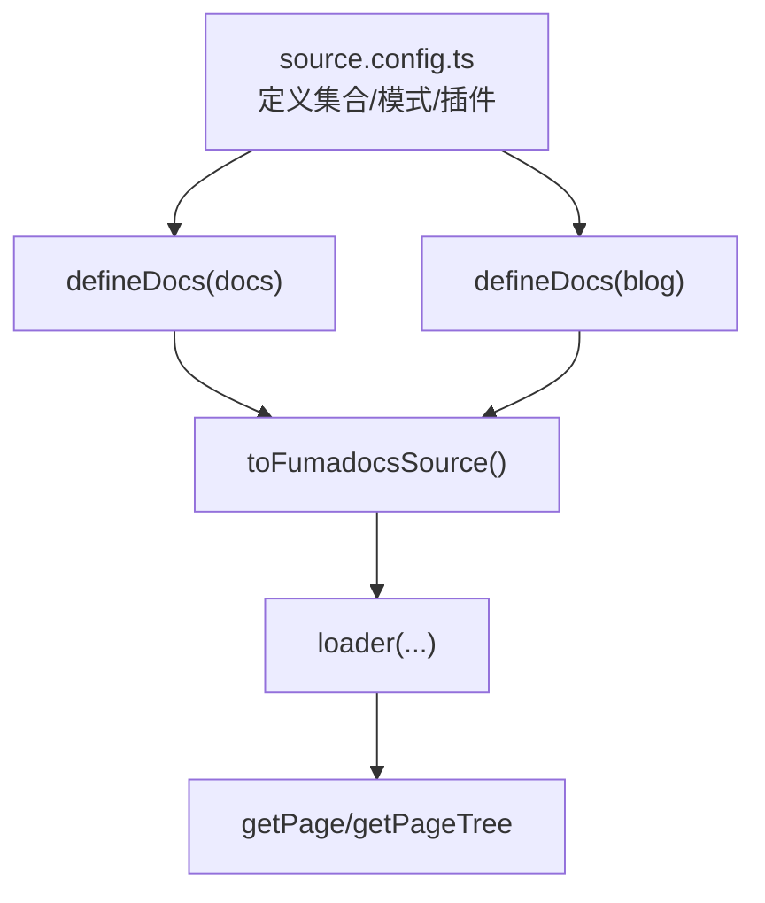
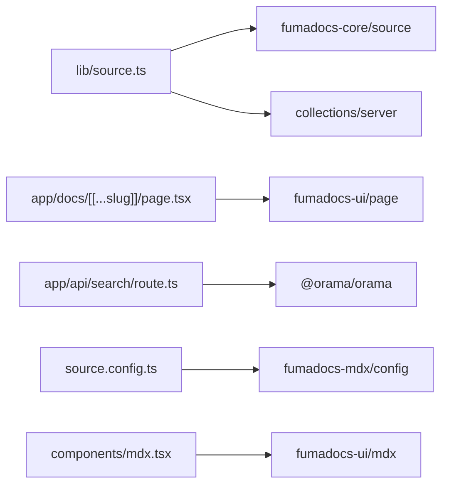

# 内容加载机制

<cite>
**本文引用的文件**
- [README.md](file://README.md)
- [source.config.ts](file://source.config.ts)
- [lib/source.ts](file://lib/source.ts)
- [lib/blog-source.ts](file://lib/blog-source.ts)
- [lib/shared.ts](file://lib/shared.ts)
- [lib/layout.shared.tsx](file://lib/layout.shared.tsx)
- [components/mdx.tsx](file://components/mdx.tsx)
- [app/docs/layout.tsx](file://app/docs/layout.tsx)
- [app/docs/[[...slug]]/page.tsx](file://app/docs/[[...slug]]/page.tsx)
- [app/api/search/route.ts](file://app/api/search/route.ts)
- [package.json](file://package.json)
</cite>

## 目录
1. [简介](#简介)
2. [项目结构](#项目结构)
3. [核心组件](#核心组件)
4. [架构总览](#架构总览)
5. [详细组件分析](#详细组件分析)
6. [依赖分析](#依赖分析)
7. [性能考虑](#性能考虑)
8. [故障排查指南](#故障排查指南)
9. [结论](#结论)
10. [附录](#附录)

## 简介
本技术文档围绕内容加载机制展开，系统性阐述内容加载器的实现原理、数据流与缓存策略，解析内容预处理与转换流程，说明内容索引的生成与维护，给出调试与监控方法，并讨论增量更新与热重载支持、安全与权限控制、错误处理与恢复机制，以及性能基准测试与优化建议。文档面向开发者，既提供高层概览也给出底层实现细节与扩展指南。

## 项目结构
该项目基于 Next.js App Router，采用静态导出配置，内容由 Fumadocs 提供的 MDX 收集与加载能力驱动。核心内容目录为 content/docs 与 content/blog，通过 source.config.ts 定义内容集合与 MDX 转换插件；lib/source.ts 暴露统一的内容加载器，app/docs 下的页面与布局负责消费该加载器提供的页面树与页面数据。

图表来源
- [source.config.ts:1-56](file://source.config.ts#L1-L56)
- [lib/source.ts:1-37](file://lib/source.ts#L1-L37)
- [lib/blog-source.ts:1-10](file://lib/blog-source.ts#L1-L10)
- [lib/shared.ts:1-12](file://lib/shared.ts#L1-L12)
- [app/docs/layout.tsx:1-14](file://app/docs/layout.tsx#L1-L14)
- [app/docs/[[...slug]]/page.tsx:1-69](file://app/docs/[[...slug]]/page.tsx#L1-L69)
- [app/api/search/route.ts:1-11](file://app/api/search/route.ts#L1-L11)
- [components/mdx.tsx:1-18](file://components/mdx.tsx#L1-L18)
- [lib/layout.shared.tsx:1-36](file://lib/layout.shared.tsx#L1-L36)

章节来源
- [README.md:1-48](file://README.md#L1-L48)
- [source.config.ts:1-56](file://source.config.ts#L1-L56)
- [lib/source.ts:1-37](file://lib/source.ts#L1-L37)
- [lib/blog-source.ts:1-10](file://lib/blog-source.ts#L1-L10)
- [lib/shared.ts:1-12](file://lib/shared.ts#L1-L12)
- [app/docs/layout.tsx:1-14](file://app/docs/layout.tsx#L1-L14)
- [app/docs/[[...slug]]/page.tsx:1-69](file://app/docs/[[...slug]]/page.tsx#L1-L69)
- [app/api/search/route.ts:1-11](file://app/api/search/route.ts#L1-L11)
- [components/mdx.tsx:1-18](file://components/mdx.tsx#L1-L18)
- [lib/layout.shared.tsx:1-36](file://lib/layout.shared.tsx#L1-L36)

## 核心组件
- 内容配置与模式定义：在 source.config.ts 中定义 docs 与 blog 两个内容集合，分别指向 content/docs 与 content/blog，设置 frontmatter 校验模式与后处理选项（如包含已处理的 Markdown 文本），并配置 MDX 插件链（数学公式等）。
- 加载器封装：lib/source.ts 使用 loader 构造文档内容加载器，指定 baseUrl 与数据源，并提供工具函数用于生成页面图片与 Markdown 下载地址，以及提取 LLM 可用文本。
- 博客加载器：lib/blog-source.ts 同样使用 loader，但为博客内容附加了基于数据字段的 slug 插件，确保 URL 与内容 ID 对齐。
- 页面与布局：app/docs/layout.tsx 使用 source.getPageTree 渲染文档布局；app/docs/[[...slug]]/page.tsx 通过 source.getPage 获取当前页面，渲染标题、描述、目录、正文与元信息。
- 搜索接口：app/api/search/route.ts 基于 source 创建搜索索引服务，支持静态 GET 请求与可选的分词器配置。
- 共享常量：lib/shared.ts 定义文档路由前缀、图片路由前缀与 Markdown 内容路由前缀，便于统一生成资源 URL。

章节来源
- [source.config.ts:17-56](file://source.config.ts#L17-L56)
- [lib/source.ts:6-37](file://lib/source.ts#L6-L37)
- [lib/blog-source.ts:5-10](file://lib/blog-source.ts#L5-L10)
- [app/docs/layout.tsx:5-13](file://app/docs/layout.tsx#L5-L13)
- [app/docs/[[...slug]]/page.tsx:16-69](file://app/docs/[[...slug]]/page.tsx#L16-L69)
- [app/api/search/route.ts:7-11](file://app/api/search/route.ts#L7-L11)
- [lib/shared.ts:2-5](file://lib/shared.ts#L2-L5)

## 架构总览
内容加载机制以“配置 → 加载器 → 页面消费 → 搜索索引”的路径贯穿应用。配置层定义内容目录、模式与转换；加载器层提供统一的数据访问接口；页面层消费数据并渲染；搜索层基于加载器数据构建可检索索引。

图表来源
- [app/docs/layout.tsx:5-13](file://app/docs/layout.tsx#L5-L13)
- [app/docs/[[...slug]]/page.tsx:16-69](file://app/docs/[[...slug]]/page.tsx#L16-L69)
- [lib/source.ts:6-10](file://lib/source.ts#L6-L10)
- [source.config.ts:23-47](file://source.config.ts#L23-L47)
- [app/api/search/route.ts:7-11](file://app/api/search/route.ts#L7-L11)

## 详细组件分析

### 内容加载器与数据流
- 加载器构造：lib/source.ts 的 loader 接收 baseUrl 与数据源，返回可查询的 source 实例；getPageTree 用于生成页面树，getPage 用于按 slug 获取具体页面。
- 数据消费：app/docs/[[...slug]]/page.tsx 在服务端调用 source.getPage 获取页面数据，渲染标题、描述、目录、正文与元信息；generateStaticParams 通过 source.generateParams 生成静态参数，配合静态导出。
- 资源 URL 生成：lib/source.ts 提供工具函数生成页面图片与 Markdown 内容的下载 URL，便于分享与复制。

图表来源
- [app/docs/[[...slug]]/page.tsx:16-69](file://app/docs/[[...slug]]/page.tsx#L16-L69)
- [lib/source.ts:12-28](file://lib/source.ts#L12-L28)

章节来源
- [lib/source.ts:6-37](file://lib/source.ts#L6-L37)
- [app/docs/[[...slug]]/page.tsx:16-69](file://app/docs/[[...slug]]/page.tsx#L16-L69)

### 内容缓存策略与性能优化
- 静态导出与预渲染：README 指明项目采用静态导出配置，结合 generateStaticParams 与静态页面生成，减少运行时 IO 与计算开销。
- 搜索索引缓存：app/api/search/route.ts 使用 createFromSource 构建搜索索引，revalidate 设置为 false 表示禁用自动重建，适合静态内容场景；可在 CI 中预构建索引并随产物发布。
- 资源路由前缀：lib/shared.ts 定义文档、图片与 Markdown 内容的路由前缀，有助于 CDN 缓存与边缘加速。
- MDX 组件复用：components/mdx.tsx 统一注入默认组件与自定义组件，避免重复声明带来的构建成本。

章节来源
- [README.md:6](file://README.md#L6)
- [app/docs/[[...slug]]/page.tsx:52-54](file://app/docs/[[...slug]]/page.tsx#L52-L54)
- [app/api/search/route.ts:5-11](file://app/api/search/route.ts#L5-L11)
- [lib/shared.ts:2-5](file://lib/shared.ts#L2-L5)
- [components/mdx.tsx:5-11](file://components/mdx.tsx#L5-L11)

### 内容预处理与转换流程
- 配置层：source.config.ts 定义 docs 与 blog 的集合，设置 frontmatter 模式与后处理选项（如 includeProcessedMarkdown），并配置 remark/rehype 插件链（数学公式、KaTeX 等）。
- 集合层：通过 defineDocs 指定目录与模式，结合插件实现内容的预处理与转换。
- 加载器层：lib/source.ts 将集合转换为 Fumadocs 数据源并交由 loader 处理，形成统一的页面数据结构。

图表来源
- [source.config.ts:23-56](file://source.config.ts#L23-L56)
- [lib/source.ts:1-10](file://lib/source.ts#L1-L10)

章节来源
- [source.config.ts:17-56](file://source.config.ts#L17-L56)
- [lib/source.ts:1-10](file://lib/source.ts#L1-L10)

### 内容索引的生成与维护
- 搜索服务：app/api/search/route.ts 基于 source 创建搜索服务，支持静态 GET 请求；tokenizer 可选配置中文分词器。
- 索引构建：建议在 CI 中调用 createFromSource 构建索引并缓存，部署时随产物一起发布，避免线上首次请求的冷启动延迟。
- 版本与增量：若内容频繁变更，可在 CI 中检测变更并增量重建索引，或在构建阶段触发重建。

章节来源
- [app/api/search/route.ts:7-11](file://app/api/search/route.ts#L7-L11)
- [package.json:12-32](file://package.json#L12-L32)

### 调试与监控方法
- 日志与错误：在页面中捕获 notFound 场景并进行日志记录；在搜索接口中捕获异常并返回标准错误响应。
- 性能观测：利用 Next.js Profiling 工具与浏览器性能面板观察页面渲染与 MDX 渲染耗时；对大型文档进行拆分与懒加载。
- 指标采集：在生产环境收集页面加载时间、搜索响应时间与缓存命中率，结合 CDN 日志分析边缘命中情况。

章节来源
- [app/docs/[[...slug]]/page.tsx:18-20](file://app/docs/[[...slug]]/page.tsx#L18-L20)
- [app/api/search/route.ts:7-11](file://app/api/search/route.ts#L7-L11)

### 增量更新与热重载支持
- 静态导出：由于采用静态导出，开发时的热重载主要体现在本地开发服务器；生产部署需重新构建与发布。
- 内容变更：新增/修改 content/docs 或 content/blog 文件后，需重新执行构建流程以更新页面与索引。
- 搜索索引：在 CI 中监听内容变更并重建索引，确保线上搜索结果及时更新。

章节来源
- [README.md:6](file://README.md#L6)
- [app/docs/[[...slug]]/page.tsx:52-54](file://app/docs/[[...slug]]/page.tsx#L52-L54)

### 内容安全与权限控制
- 访问控制：当前未见显式的鉴权逻辑；如需限制访问，可在路由层添加中间件或在 API 层增加鉴权校验。
- 资源暴露：确保只暴露必要的内容路由（如 /docs、/og/docs、/llms.mdx/docs），避免泄露源文件。
- 输入验证：frontmatter 模式已在 source.config.ts 中定义，确保内容输入符合预期格式，降低渲染风险。

章节来源
- [source.config.ts:17-21](file://source.config.ts#L17-L21)
- [lib/shared.ts:2-5](file://lib/shared.ts#L2-L5)

### 错误处理与恢复机制
- 页面不存在：当 source.getPage 返回空时，页面抛出 notFound，避免错误渲染。
- 构建期错误：在 CI 中对类型检查与 MDX 转换进行严格校验，失败时中断构建并输出错误日志。
- 运行时降级：在搜索服务不可用时，提供降级提示或静态占位，保证用户体验。

章节来源
- [app/docs/[[...slug]]/page.tsx:18-20](file://app/docs/[[...slug]]/page.tsx#L18-L20)
- [package.json:9](file://package.json#L9)

## 依赖分析
- 核心依赖：fumadocs-core、fumadocs-mdx、fumadocs-ui、@orama/orama 与 @orama/tokenizers 等，分别负责内容加载、MDX 转换、UI 组件与搜索索引。
- 构建与类型：next、typescript、tailwindcss 与相关工具链支撑开发与构建流程。

图表来源
- [lib/source.ts:1-10](file://lib/source.ts#L1-L10)
- [app/docs/[[...slug]]/page.tsx:1-14](file://app/docs/[[...slug]]/page.tsx#L1-L14)
- [app/api/search/route.ts:1-11](file://app/api/search/route.ts#L1-L11)
- [source.config.ts:1-7](file://source.config.ts#L1-L7)
- [components/mdx.tsx:1-11](file://components/mdx.tsx#L1-L11)

章节来源
- [package.json:12-32](file://package.json#L12-L32)

## 性能考虑
- 构建阶段优化：启用静态导出与预渲染，减少运行时 IO；在 CI 中并行化构建与索引生成。
- 运行时优化：使用 CDN 缓存静态资源与搜索索引；对大型文档进行分段与懒加载；合理拆分 MDX 组件以提升渲染性能。
- 搜索性能：选择合适的分词器与索引策略；在高频查询场景下考虑本地缓存与预热。

## 故障排查指南
- 页面 404：确认 slug 是否存在于内容集合中；检查 generateStaticParams 生成的参数是否完整。
- MDX 渲染异常：检查 frontmatter 模式与内容格式；查看 MDX 组件注册是否正确。
- 搜索无结果：确认搜索服务已正确初始化；检查索引是否在构建阶段生成并随产物发布。
- 构建失败：运行类型检查脚本；修复 MDX 语法与引用问题。

章节来源
- [app/docs/[[...slug]]/page.tsx:18-20](file://app/docs/[[...slug]]/page.tsx#L18-L20)
- [app/api/search/route.ts:7-11](file://app/api/search/route.ts#L7-L11)
- [package.json:9](file://package.json#L9)

## 结论
本项目通过 Fumadocs 的内容配置与加载器，实现了清晰的内容数据流与可扩展的渲染体系。结合静态导出与搜索索引，能够在保证性能的同时提供良好的开发体验。建议在 CI 中完善构建与索引流程，在生产环境中引入监控与缓存策略，持续优化内容加载与渲染性能。

## 附录
- 扩展指南：新增内容集合时，参照 source.config.ts 的 defineDocs 与 schema 定义；新增页面组件时，遵循 components/mdx.tsx 的组件注册模式；新增搜索功能时，参考 app/api/search/route.ts 的实现方式。
- 配置项参考：baseUrl、schema、postprocess、plugins 等在 source.config.ts 中集中管理，便于统一维护。