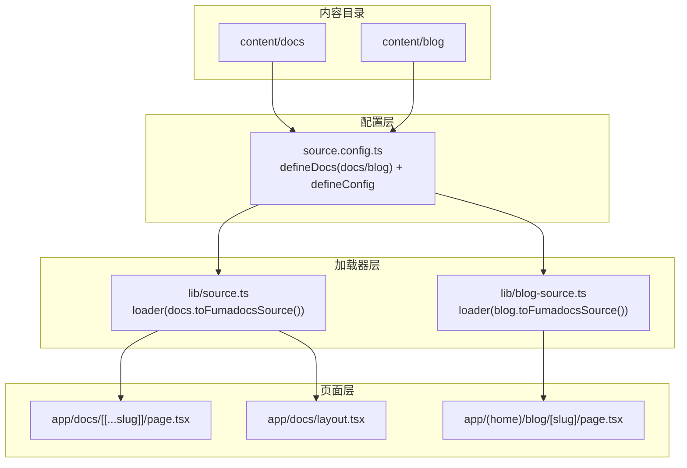
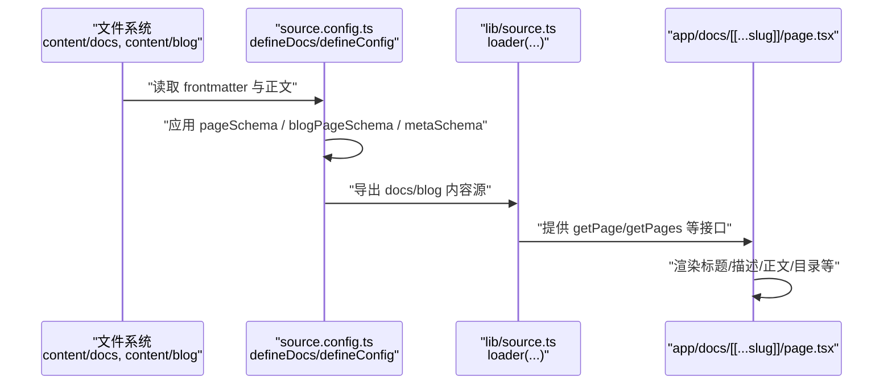
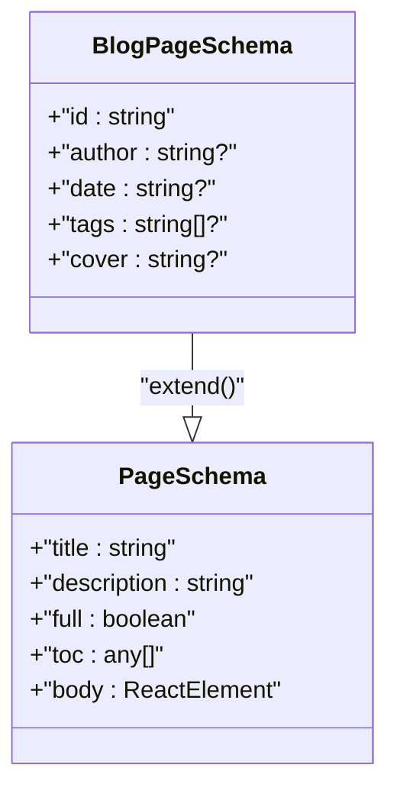
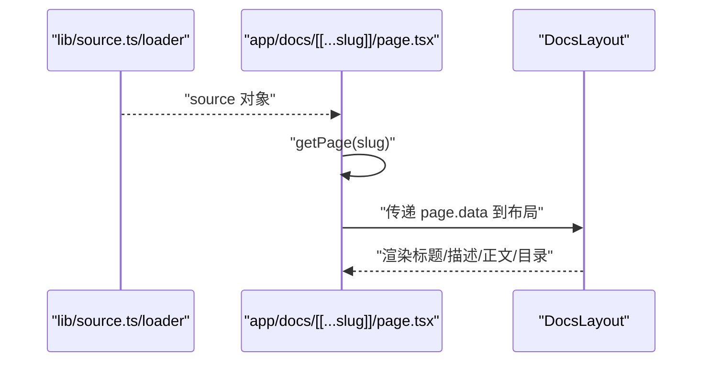
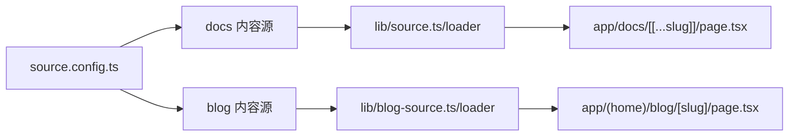

# 内容源配置

<cite>
**本文引用的文件**
- [source.config.ts](file://source.config.ts)
- [lib/source.ts](file://lib/source.ts)
- [lib/blog-source.ts](file://lib/blog-source.ts)
- [lib/shared.ts](file://lib/shared.ts)
- [lib/layout.shared.tsx](file://lib/layout.shared.tsx)
- [app/docs/[[...slug]]/page.tsx](file://app/docs/[[...slug]]/page.tsx)
- [app/docs/layout.tsx](file://app/docs/layout.tsx)
- [app/(home)/blog/[slug]/page.tsx](file://app/(home)/blog/[slug]/page.tsx)
- [content/docs/index.mdx](file://content/docs/index.mdx)
- [content/blog/202501150930-welcome-to-docme.mdx](file://content/blog/202501150930-welcome-to-docme.mdx)
- [package.json](file://package.json)
- [README.md](file://README.md)
</cite>

## 目录
1. [简介](#简介)
2. [项目结构](#项目结构)
3. [核心组件](#核心组件)
4. [架构总览](#架构总览)
5. [详细组件分析](#详细组件分析)
6. [依赖关系分析](#依赖关系分析)
7. [性能考量](#性能考量)
8. [故障排查指南](#故障排查指南)
9. [结论](#结论)
10. [附录](#附录)

## 简介
本文件面向内容管理员与开发者，系统性解析内容源配置，重点围绕以下主题：
- source.config.ts 中 defineDocs 与 defineConfig 的配置项与作用域
- 文档目录设置、schema 定义与后处理配置
- pageSchema 与 blogPageSchema 的字段定义与验证规则
- docs 与 blog 两个内容源的区别与用途
- meta.json 的作用与配置方法
- 自定义 schema 的扩展指南与最佳实践
- 完整配置示例与常见配置错误的解决方案

## 项目结构
该仓库采用 Next.js App Router 结构，内容源通过 fumadocs-mdx 与 fumadocs-core 集成，形成“内容 → 配置 → 加载器 → 页面”的清晰链路。

图表来源
- [source.config.ts:16-40](file://source.config.ts#L16-L40)
- [lib/source.ts:6-10](file://lib/source.ts#L6-L10)
- [lib/blog-source.ts:5-9](file://lib/blog-source.ts#L5-L9)
- [app/docs/[[...slug]]/page.tsx:16-19](file://app/docs/[[...slug]]/page.tsx#L16-L19)
- [app/docs/layout.tsx:5-13](file://app/docs/layout.tsx#L5-L13)
- [app/(home)/blog/[slug]/page.tsx:9-13](file://app/(home)/blog/[slug]/page.tsx#L9-L13)

章节来源
- [source.config.ts:16-40](file://source.config.ts#L16-L40)
- [lib/source.ts:6-10](file://lib/source.ts#L6-L10)
- [lib/blog-source.ts:5-9](file://lib/blog-source.ts#L5-L9)
- [app/docs/[[...slug]]/page.tsx:16-19](file://app/docs/[[...slug]]/page.tsx#L16-L19)
- [app/docs/layout.tsx:5-13](file://app/docs/layout.tsx#L5-L13)
- [app/(home)/blog/[slug]/page.tsx:9-13](file://app/(home)/blog/[slug]/page.tsx#L9-L13)

## 核心组件
- defineDocs：为不同内容源（如 docs、blog）声明目录、文档 schema、元数据 schema 与后处理策略
- defineConfig：全局 MDX 选项等配置入口
- loader：将内容源转换为可被页面消费的数据源对象
- pageSchema / blogPageSchema：Zod schema，约束 frontmatter 字段类型与可选性
- metaSchema：约束 meta.json 的字段结构

章节来源
- [source.config.ts:16-40](file://source.config.ts#L16-L40)
- [lib/source.ts:6-10](file://lib/source.ts#L6-L10)
- [lib/blog-source.ts:5-9](file://lib/blog-source.ts#L5-L9)

## 架构总览
下图展示从内容文件到页面渲染的关键流程：内容文件经由 source.config.ts 声明的 schema 与目录映射，再由 loader 转换为页面可用的数据结构，最终在页面组件中渲染。

图表来源
- [source.config.ts:16-40](file://source.config.ts#L16-L40)
- [lib/source.ts:6-10](file://lib/source.ts#L6-L10)
- [app/docs/[[...slug]]/page.tsx:16-19](file://app/docs/[[...slug]]/page.tsx#L16-L19)

## 详细组件分析

### defineDocs 与 defineConfig 配置详解
- docs 内容源
  - 目录：content/docs
  - 文档 schema：pageSchema
  - 后处理：includeProcessedMarkdown=true，确保生成可检索的已处理 Markdown
  - 元数据 schema：metaSchema
- blog 内容源
  - 目录：content/blog
  - 文档 schema：blogPageSchema（在 pageSchema 基础上扩展 id、author、date、tags、cover）
  - 后处理：includeProcessedMarkdown=true
  - 元数据 schema：metaSchema
- defineConfig
  - 当前用于承载 mdxOptions（预留扩展点）

章节来源
- [source.config.ts:16-40](file://source.config.ts#L16-L40)

### pageSchema 与 blogPageSchema 字段定义与验证规则
- pageSchema（来自 fumadocs-core/source/schema）
  - 用于 docs 内容源的通用文档字段（如 title、description 等），具体字段以实际 schema 为准
- blogPageSchema（扩展自 pageSchema）
  - id：字符串，作为博客文章唯一标识符
  - author：字符串（可选）
  - date：字符串（可选）
  - tags：字符串数组（可选）
  - cover：字符串（可选）

图表来源
- [source.config.ts:6-12](file://source.config.ts#L6-L12)

章节来源
- [source.config.ts:6-12](file://source.config.ts#L6-L12)

### docs 与 blog 内容源的区别与用途
- docs
  - 用途：常规文档内容，如用户手册、指南、API 文档等
  - 特点：使用 pageSchema；通过 loader 导出为 docs 源；页面路径为 /docs/...
- blog
  - 用途：博客文章，强调作者、时间、标签、封面等属性
  - 特点：使用 blogPageSchema；通过 loader 导出为 blog 源；页面路径为 /blog/...

章节来源
- [source.config.ts:16-40](file://source.config.ts#L16-L40)
- [lib/blog-source.ts:5-9](file://lib/blog-source.ts#L5-L9)

### meta.json 的作用与配置方法
- 作用：为内容页提供额外的元数据（如 SEO、社交分享、导航信息等），其结构由 metaSchema 约束
- 配置方法：在 defineDocs 的 meta 字段中指定 schema 即可启用
- 使用场景：当需要为某类内容页注入统一的元数据时，可在对应内容目录下提供 meta.json，并遵循 metaSchema

章节来源
- [source.config.ts:24-26](file://source.config.ts#L24-L26)
- [source.config.ts:37-39](file://source.config.ts#L37-L39)

### 加载器与页面集成
- docs 加载器
  - 将 docs 内容源转换为 loader 对象，baseUrl 为 /docs
  - 提供 getPage、generateParams 等能力，页面通过 source.getPage(slug) 获取当前页数据
- blog 加载器
  - 将 blog 内容源转换为 loader 对象，baseUrl 为 /blog
  - 使用插件根据 id 字段生成 slug，确保文章可通过 id 访问

图表来源
- [lib/source.ts:6-10](file://lib/source.ts#L6-L10)
- [app/docs/[[...slug]]/page.tsx:16-19](file://app/docs/[[...slug]]/page.tsx#L16-L19)
- [app/docs/layout.tsx:5-13](file://app/docs/layout.tsx#L5-L13)

章节来源
- [lib/source.ts:6-10](file://lib/source.ts#L6-L10)
- [app/docs/[[...slug]]/page.tsx:16-19](file://app/docs/[[...slug]]/page.tsx#L16-L19)
- [app/docs/layout.tsx:5-13](file://app/docs/layout.tsx#L5-L13)
- [lib/blog-source.ts:5-9](file://lib/blog-source.ts#L5-L9)
- [app/(home)/blog/[slug]/page.tsx:9-13](file://app/(home)/blog/[slug]/page.tsx#L9-L13)

### 自定义 schema 扩展指南与最佳实践
- 扩展原则
  - 在现有 schema 上使用 extend 进行增量扩展，避免完全重写
  - 保持字段命名一致性，便于页面消费与类型推断
- 最佳实践
  - 明确区分 docs 与 blog 的字段差异，避免混用
  - 对可选字段使用 .optional()，提升容错性
  - 使用 includeProcessedMarkdown，确保全文检索与 LLM 处理可用
  - 为 meta.json 提供统一的 metaSchema，减少重复配置
- 参考实现
  - docs 使用 pageSchema，blog 使用 blogPageSchema 扩展
  - 两者均开启 includeProcessedMarkdown

章节来源
- [source.config.ts:6-12](file://source.config.ts#L6-L12)
- [source.config.ts:16-40](file://source.config.ts#L16-L40)

### 配置示例与常见问题
- 配置示例
  - docs 目录：content/docs
  - blog 目录：content/blog
  - docs 使用 pageSchema，blog 使用 blogPageSchema
  - 两者均启用 includeProcessedMarkdown
- 常见错误与解决
  - frontmatter 字段类型不匹配：检查 schema 定义，确保类型一致
  - 目录路径错误：确认 defineDocs.dir 与实际目录一致
  - 未启用 includeProcessedMarkdown：导致搜索或 LLM 文本不可用
  - 未正确导出加载器：确保 loader(...) 返回的对象被页面使用

章节来源
- [source.config.ts:16-40](file://source.config.ts#L16-L40)
- [lib/source.ts:6-10](file://lib/source.ts#L6-L10)
- [lib/blog-source.ts:5-9](file://lib/blog-source.ts#L5-L9)

## 依赖关系分析
- 依赖链
  - source.config.ts 定义 docs/blog 内容源与 schema
  - lib/source.ts 与 lib/blog-source.ts 通过 loader 将内容源暴露给页面
  - 页面组件通过 source.getPage(...) 获取数据并渲染
- 外部依赖
  - fumadocs-core/source 与 fumadocs-mdx 提供 schema 与构建能力
  - zod 用于 schema 定义与校验

图表来源
- [source.config.ts:16-40](file://source.config.ts#L16-L40)
- [lib/source.ts:6-10](file://lib/source.ts#L6-L10)
- [lib/blog-source.ts:5-9](file://lib/blog-source.ts#L5-L9)
- [app/docs/[[...slug]]/page.tsx:16-19](file://app/docs/[[...slug]]/page.tsx#L16-L19)
- [app/(home)/blog/[slug]/page.tsx:9-13](file://app/(home)/blog/[slug]/page.tsx#L9-L13)

章节来源
- [source.config.ts:16-40](file://source.config.ts#L16-L40)
- [lib/source.ts:6-10](file://lib/source.ts#L6-L10)
- [lib/blog-source.ts:5-9](file://lib/blog-source.ts#L5-L9)
- [app/docs/[[...slug]]/page.tsx:16-19](file://app/docs/[[...slug]]/page.tsx#L16-L19)
- [app/(home)/blog/[slug]/page.tsx:9-13](file://app/(home)/blog/[slug]/page.tsx#L9-L13)

## 性能考量
- includeProcessedMarkdown 开启后会预处理 Markdown，有利于全文检索与 LLM 文本生成，但可能增加构建时间
- 合理拆分 docs 与 blog 目录，避免单个源过大
- 使用 loader 的缓存与懒加载策略，减少页面渲染压力

## 故障排查指南
- 页面 404 或找不到内容
  - 检查 slug 生成是否正确（blog 使用 id 生成 slug）
  - 确认 generateStaticParams 是否返回正确的参数
- frontmatter 校验失败
  - 检查 schema 字段类型与值是否符合要求
  - 确保 docs 与 blog 使用对应的 schema
- 搜索或 LLM 文本为空
  - 确认 includeProcessedMarkdown 已启用
  - 检查 getLLMText 等函数是否正确读取已处理文本

章节来源
- [lib/blog-source.ts:86-91](file://lib/blog-source.ts#L86-L91)
- [app/(home)/blog/[slug]/page.tsx:86-91](file://app/(home)/blog/[slug]/page.tsx#L86-L91)
- [source.config.ts:20-22](file://source.config.ts#L20-L22)
- [source.config.ts:33-35](file://source.config.ts#L33-L35)

## 结论
通过 source.config.ts 的 defineDocs 与 defineConfig，结合 loader 的内容加载机制，项目实现了清晰的内容源分层与强类型的 schema 校验。docs 与 blog 的差异化配置满足了不同类型内容的管理需求，配合 includeProcessedMarkdown 与 metaSchema，进一步提升了可发现性与可维护性。建议在扩展 schema 时遵循“增量扩展、类型一致、明确用途”的原则，并在 CI 中加入类型检查与构建校验，确保配置变更不会破坏内容渲染。

## 附录
- 关键文件与职责
  - source.config.ts：定义 docs/blog 内容源、schema 与后处理
  - lib/source.ts：docs 加载器，提供页面访问接口
  - lib/blog-source.ts：blog 加载器，基于 id 生成 slug
  - app/docs/[[...slug]]/page.tsx：docs 页面渲染
  - app/(home)/blog/[slug]/page.tsx：blog 文章渲染
  - content/docs/index.mdx：docs 示例
  - content/blog/202501150930-welcome-to-docme.mdx：blog 示例
- 依赖与版本
  - fumadocs-core、fumadocs-mdx、zod 等

章节来源
- [README.md:24-37](file://README.md#L24-L37)
- [package.json:12-32](file://package.json#L12-L32)
- [content/docs/index.mdx:1-19](file://content/docs/index.mdx#L1-L19)
- [content/blog/202501150930-welcome-to-docme.mdx:1-42](file://content/blog/202501150930-welcome-to-docme.mdx#L1-L42)