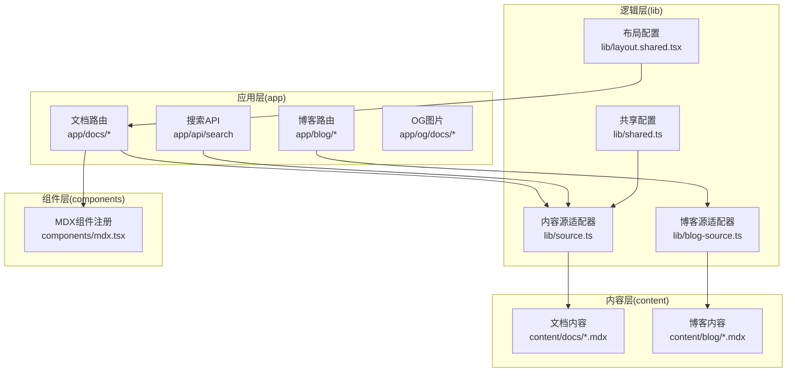
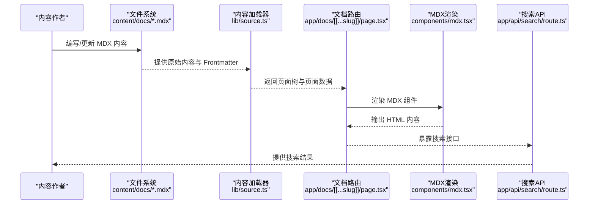
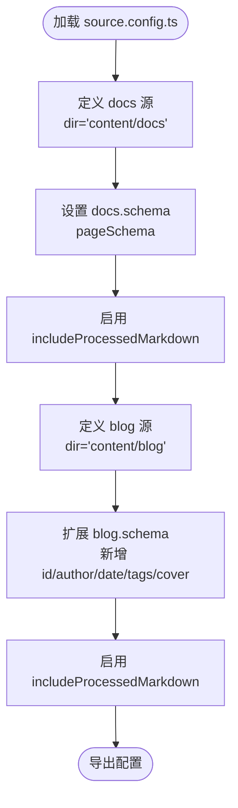
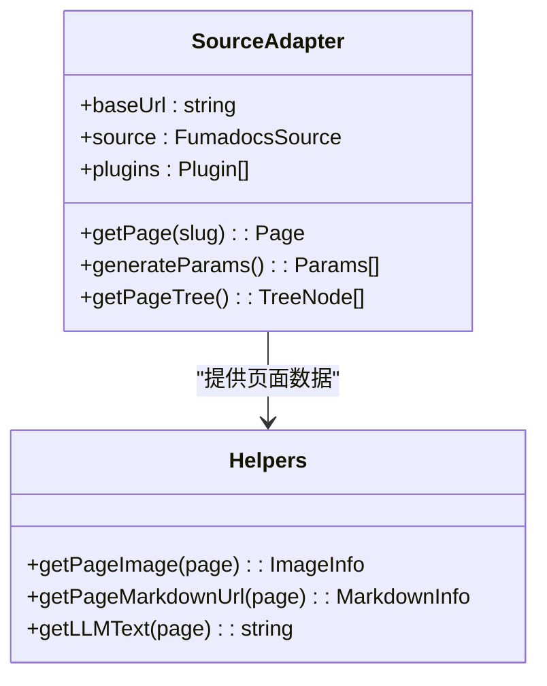
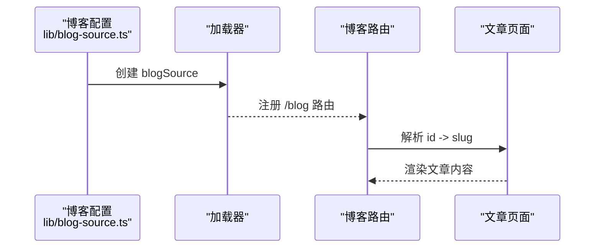
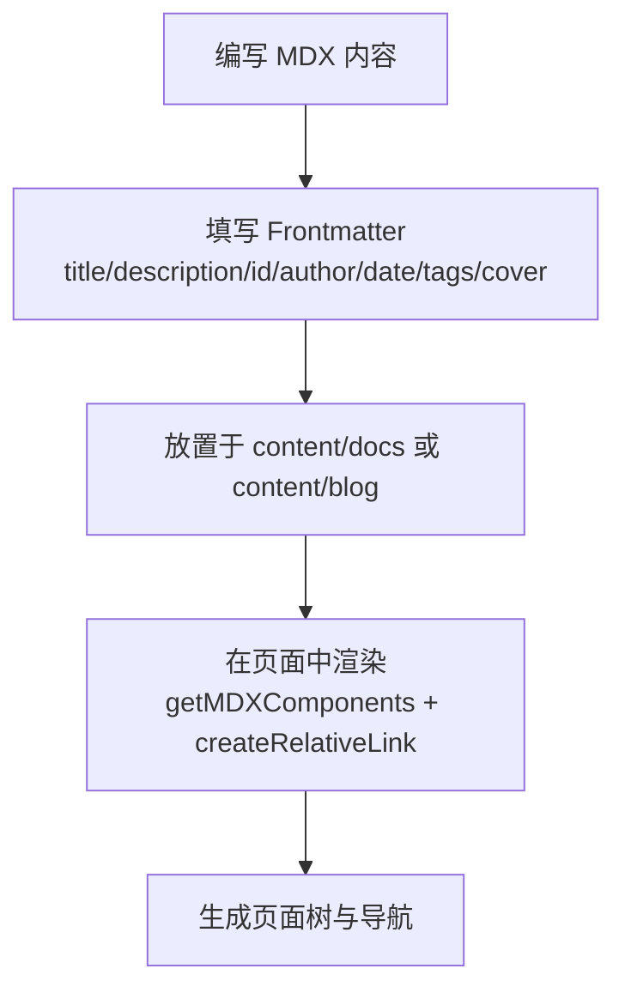
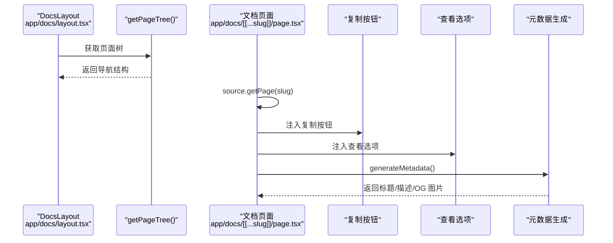
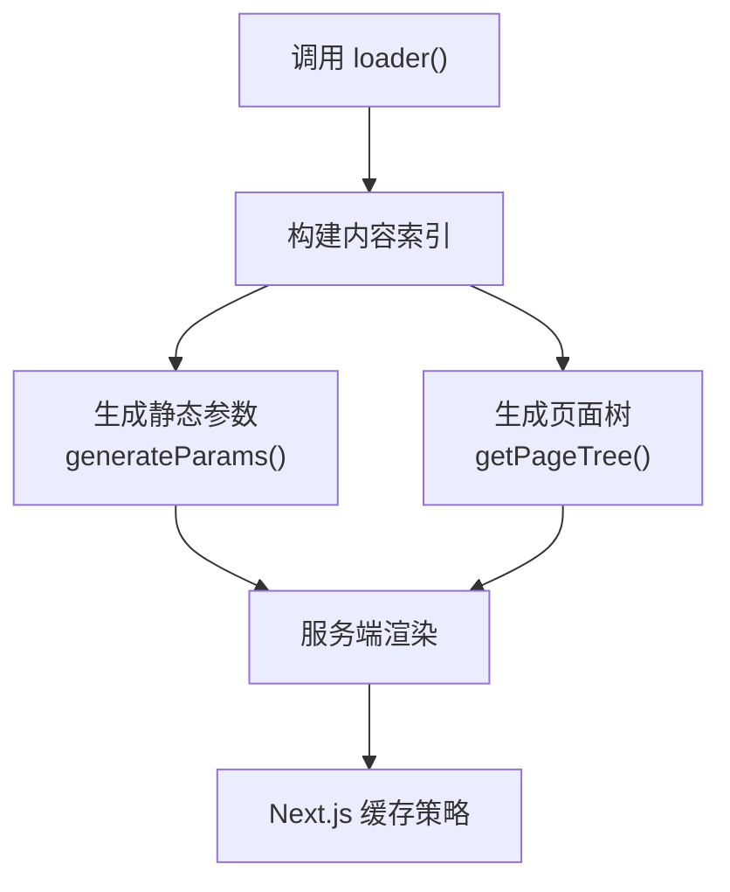
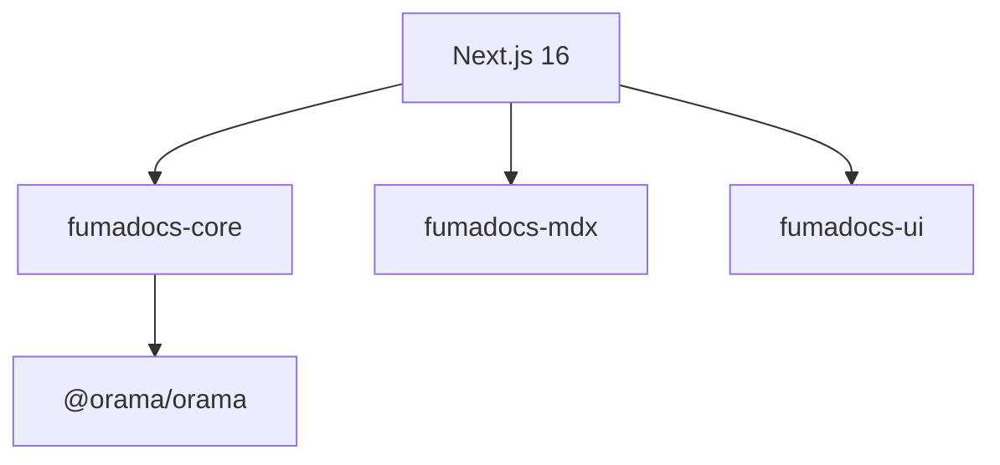

# 内容管理系统

<cite>
**本文档引用的文件**
- [source.config.ts](file://source.config.ts)
- [lib/source.ts](file://lib/source.ts)
- [lib/blog-source.ts](file://lib/blog-source.ts)
- [lib/shared.ts](file://lib/shared.ts)
- [lib/layout.shared.tsx](file://lib/layout.shared.tsx)
- [components/mdx.tsx](file://components/mdx.tsx)
- [app/docs/layout.tsx](file://app/docs/layout.tsx)
- [app/docs/[[...slug]]/page.tsx](file://app/docs/[[...slug]]/page.tsx)
- [app/api/search/route.ts](file://app/api/search/route.ts)
- [content/docs/index.mdx](file://content/docs/index.mdx)
- [content/blog/202501150930-welcome-to-docme.mdx](file://content/blog/202501150930-welcome-to-docme.mdx)
- [package.json](file://package.json)
- [README.md](file://README.md)
</cite>

## 目录
1. [简介](#简介)
2. [项目结构](#项目结构)
3. [核心组件](#核心组件)
4. [架构总览](#架构总览)
5. [详细组件分析](#详细组件分析)
6. [依赖关系分析](#依赖关系分析)
7. [性能考虑](#性能考虑)
8. [故障排除指南](#故障排除指南)
9. [结论](#结论)
10. [附录](#附录)

## 简介
本内容管理系统基于 Next.js 16 与 Fumadocs 构建，提供文档与博客一体化的内容管理能力。系统通过 source.config.ts 定义内容源配置，使用 MDX 编写富文本内容，结合自动导航生成与全文搜索实现高效的内容消费体验。本文档面向内容作者与管理员，提供从配置到部署的全流程操作指南。

## 项目结构
项目采用按功能分层的目录组织方式：
- app：Next.js 路由层，包含文档、博客、API 等页面
- content：内容存储层，分为 docs 与 blog 两大类
- lib：核心逻辑封装，包括内容源适配器、共享配置等
- components：可复用组件，如 MDX 组件注册
- 根目录：构建配置、依赖声明与说明文档

**图表来源**
- [app/docs/layout.tsx:1-14](file://app/docs/layout.tsx#L1-L14)
- [lib/source.ts:1-37](file://lib/source.ts#L1-L37)
- [lib/blog-source.ts:1-10](file://lib/blog-source.ts#L1-L10)
- [lib/shared.ts:1-12](file://lib/shared.ts#L1-L12)

**章节来源**
- [README.md:20-32](file://README.md#L20-L32)

## 核心组件
- 内容源配置：通过 source.config.ts 定义文档与博客的内容源，包括目录位置、Frontmatter Schema 与后处理选项。
- 内容加载器：lib/source.ts 中的 loader 将内容源转换为可查询的数据结构，提供页面树、图片与 Markdown 下载地址等辅助方法。
- 博客源适配器：lib/blog-source.ts 针对博客内容进行特殊处理，如基于 id 的 slug 插件。
- MDX 组件注册：components/mdx.tsx 提供默认组件与扩展能力，确保文档中可使用统一的 UI 组件。
- 布局与导航：lib/layout.shared.tsx 提供全局导航链接与 GitHub 集成；app/docs/layout.tsx 使用 getPageTree 自动生成侧边栏导航。

**章节来源**
- [source.config.ts:1-47](file://source.config.ts#L1-L47)
- [lib/source.ts:1-37](file://lib/source.ts#L1-L37)
- [lib/blog-source.ts:1-10](file://lib/blog-source.ts#L1-L10)
- [components/mdx.tsx:1-16](file://components/mdx.tsx#L1-L16)
- [lib/layout.shared.tsx:1-36](file://lib/layout.shared.tsx#L1-L36)
- [app/docs/layout.tsx:1-14](file://app/docs/layout.tsx#L1-L14)

## 架构总览
系统采用“内容即数据”的架构，通过 loader 将本地 MDX 文件转换为可查询的页面对象，再由路由层渲染。搜索服务基于 Orama，通过 createFromSource 从内容源生成索引。

**图表来源**
- [lib/source.ts:6-10](file://lib/source.ts#L6-L10)
- [app/docs/[[...slug]]/page.tsx](file://app/docs/[[...slug]]/page.tsx#L16-L45)
- [components/mdx.tsx:4-9](file://components/mdx.tsx#L4-L9)
- [app/api/search/route.ts:6-9](file://app/api/search/route.ts#L6-L9)

## 详细组件分析

### 内容源配置（source.config.ts）
- 文档源（docs）：指向 content/docs 目录，使用通用 pageSchema 校验 Frontmatter，启用 includeProcessedMarkdown 后处理以生成可搜索的纯文本。
- 博客源（blog）：指向 content/blog 目录，扩展 pageSchema 包含 id、author、date、tags、cover 字段，同样启用 includeProcessedMarkdown。
- 默认配置：保留 mdxOptions 空置，便于后续扩展。

**图表来源**
- [source.config.ts:16-46](file://source.config.ts#L16-L46)

**章节来源**
- [source.config.ts:1-47](file://source.config.ts#L1-L47)

### 内容加载器与缓存策略（lib/source.ts）
- 加载器：通过 loader 将 docs 源转换为可查询的对象，baseUrl 指向 /docs，plugins 为空。
- 页面辅助函数：
  - getPageImage：根据页面 slugs 生成图片路径，URL 基于 docsImageRoute。
  - getPageMarkdownUrl：生成 Markdown 原文下载地址，URL 基于 docsContentRoute。
  - getLLMText：提取已处理的 Markdown 文本，拼接标题与 URL，便于 LLM 使用。
- 缓存策略：Next.js 的静态生成与增量静态再生（ISR）机制配合，具体缓存行为取决于构建与部署配置。

**图表来源**
- [lib/source.ts:6-10](file://lib/source.ts#L6-L10)
- [lib/source.ts:12-36](file://lib/source.ts#L12-L36)

**章节来源**
- [lib/source.ts:1-37](file://lib/source.ts#L1-L37)

### 博客系统与文档系统集成（lib/blog-source.ts）
- 博客源适配器：基于 blog 源，设置 baseUrl 为 /blog，并使用 slugsPlugin 与 slugsFromData('id') 将 id 作为 slug 来源，确保稳定的永久链接。
- 集成点：与文档系统共享相同的底层加载器机制，但路由与 URL 结构分离。

**图表来源**
- [lib/blog-source.ts:5-9](file://lib/blog-source.ts#L5-L9)

**章节来源**
- [lib/blog-source.ts:1-10](file://lib/blog-source.ts#L1-L10)

### MDX 内容编写规范与最佳实践
- Frontmatter 结构：
  - 文档：title、description 等通用字段，遵循 pageSchema。
  - 博客：在通用字段基础上增加 id、author、date、tags、cover。
- 内容组织：
  - 使用层级目录组织文档，根目录可放置 index.mdx 作为入口。
  - 博客文章建议以时间戳+标题的形式命名，便于排序与 SEO。
- MDX 组件：
  - 通过 getMDXComponents 注册默认组件，可在文档中直接使用 React 组件。
  - 使用 createRelativeLink 实现站内相对链接的正确解析。

**图表来源**
- [content/docs/index.mdx:1-19](file://content/docs/index.mdx#L1-L19)
- [content/blog/202501150930-welcome-to-docme.mdx:1-42](file://content/blog/202501150930-welcome-to-docme.mdx#L1-L42)
- [components/mdx.tsx:4-9](file://components/mdx.tsx#L4-L9)

**章节来源**
- [content/docs/index.mdx:1-19](file://content/docs/index.mdx#L1-L19)
- [content/blog/202501150930-welcome-to-docme.mdx:1-42](file://content/blog/202501150930-welcome-to-docme.mdx#L1-L42)
- [components/mdx.tsx:1-16](file://components/mdx.tsx#L1-L16)

### 自动导航生成与页面渲染（app/docs/layout.tsx 与 app/docs/[[...slug]]/page.tsx）
- 自动导航：DocsLayout 接收 source.getPageTree() 生成侧边栏导航，无需手动维护菜单。
- 页面渲染：page.tsx 获取当前页面，注入 MarkdownCopyButton 与 ViewOptionsPopover，支持复制 Markdown 与跳转到 GitHub 源码。
- 元数据：generateMetadata 动态生成 Open Graph 图片与描述，提升分享体验。

**图表来源**
- [app/docs/layout.tsx:5-12](file://app/docs/layout.tsx#L5-L12)
- [app/docs/[[...slug]]/page.tsx](file://app/docs/[[...slug]]/page.tsx#L16-L45)
- [app/docs/[[...slug]]/page.tsx](file://app/docs/[[...slug]]/page.tsx#L51-L63)

**章节来源**
- [app/docs/layout.tsx:1-14](file://app/docs/layout.tsx#L1-L14)
- [app/docs/[[...slug]]/page.tsx](file://app/docs/[[...slug]]/page.tsx#L1-L64)

### 内容加载器实现机制与缓存策略
- 实现机制：loader 将内容源转换为统一的页面对象，支持生成参数、页面树与页面数据查询。
- 缓存策略：Next.js 静态生成与增量静态再生（ISR）机制配合，具体缓存行为取决于构建与部署配置。搜索 API 设置 revalidate=false，确保搜索结果实时性。

**图表来源**
- [lib/source.ts:6-10](file://lib/source.ts#L6-L10)
- [app/docs/[[...slug]]/page.tsx](file://app/docs/[[...slug]]/page.tsx#L47-L49)
- [app/api/search/route.ts:4-4](file://app/api/search/route.ts#L4-L4)

**章节来源**
- [lib/source.ts:1-37](file://lib/source.ts#L1-L37)
- [app/api/search/route.ts:1-10](file://app/api/search/route.ts#L1-L10)

### 内容更新与版本管理指导
- 更新流程：修改 content/docs 或 content/blog 下的 MDX 文件，触发重新构建；静态参数通过 generateParams() 生成。
- 版本管理：推荐使用 Git 进行版本控制，GitHub 集成在布局配置中提供链接；通过分支管理不同版本内容。

**章节来源**
- [lib/layout.shared.tsx:22-24](file://lib/layout.shared.tsx#L22-L24)
- [app/docs/[[...slug]]/page.tsx](file://app/docs/[[...slug]]/page.tsx#L30-L34)

### 内容模板与示例代码
- 文档模板：参考 content/docs/index.mdx，包含基本 Frontmatter 与示例内容。
- 博客模板：参考 content/blog/202501150930-welcome-to-docme.mdx，展示扩展的 Frontmatter 字段与示例内容。
- MDX 组件：通过 getMDXComponents 注册默认组件，支持在文档中使用统一的 UI 组件。

**章节来源**
- [content/docs/index.mdx:1-19](file://content/docs/index.mdx#L1-L19)
- [content/blog/202501150930-welcome-to-docme.mdx:1-42](file://content/blog/202501150930-welcome-to-docme.mdx#L1-L42)
- [components/mdx.tsx:4-9](file://components/mdx.tsx#L4-L9)

### 博客系统与文档系统的集成方式
- 共享基础：两者均使用 loader 作为内容加载器，保持一致的数据结构。
- 路由分离：文档路由位于 /docs，博客路由位于 /blog，通过不同的 baseUrl 区分。
- 导航集成：布局配置中同时提供“文档”和“博客”导航链接，实现统一入口。

**章节来源**
- [lib/blog-source.ts:5-9](file://lib/blog-source.ts#L5-L9)
- [lib/layout.shared.tsx:10-23](file://lib/layout.shared.tsx#L10-L23)

### 内容 SEO 优化最佳实践
- 元数据：通过 generateMetadata 动态生成标题、描述与 Open Graph 图片，提升社交分享效果。
- 链接：使用 createRelativeLink 保证站内链接的正确解析，避免 404。
- 内容结构：合理使用标题层级与目录，增强可读性与搜索引擎友好度。

**章节来源**
- [app/docs/[[...slug]]/page.tsx](file://app/docs/[[...slug]]/page.tsx#L51-L63)
- [components/mdx.tsx:4-9](file://components/mdx.tsx#L4-L9)

### 内容迁移与备份建议
- 迁移：将旧内容复制到 content/docs 或 content/blog 对应目录，调整 Frontmatter 字段以匹配 schema。
- 备份：定期备份 content 目录与数据库（如使用 Orama），确保内容安全。

**章节来源**
- [source.config.ts:6-12](file://source.config.ts#L6-L12)
- [source.config.ts:29-40](file://source.config.ts#L29-L40)

## 依赖关系分析
系统依赖 Next.js 16 与 Fumadocs 生态，核心依赖包括 fumadocs-core、fumadocs-mdx、fumadocs-ui 以及 Orama 搜索引擎。

**图表来源**
- [package.json:12-26](file://package.json#L12-L26)

**章节来源**
- [package.json:1-39](file://package.json#L1-L39)

## 性能考虑
- 静态生成：利用 Next.js 的静态生成能力，减少运行时开销。
- 搜索性能：Orama 作为内存型搜索引擎，适合中小型站点；对于大型站点可考虑持久化或云端搜索服务。
- 缓存策略：结合 ISR 与浏览器缓存，平衡内容新鲜度与性能。

## 故障排除指南
- 页面未找到：检查 source.getPage(slug) 是否返回页面对象，确认 slug 与文件名是否匹配。
- 导航不显示：确认 getPageTree() 是否正确生成，检查目录层级与文件命名。
- 搜索无结果：确认 createFromSource 已正确绑定 source，检查 language 配置与 revalidate 设置。
- MDX 组件异常：检查 getMDXComponents 是否正确合并默认组件，确保自定义组件类型兼容。

**章节来源**
- [app/docs/[[...slug]]/page.tsx](file://app/docs/[[...slug]]/page.tsx#L18-L19)
- [app/api/search/route.ts:6-9](file://app/api/search/route.ts#L6-L9)

## 结论
本内容管理系统通过清晰的分层架构与标准化的配置，实现了文档与博客的一体化管理。借助 Fumadocs 的生态能力，系统具备良好的可扩展性与可维护性。内容作者可通过简单的 Frontmatter 与 MDX 规范快速产出高质量内容，管理员则可基于现有组件与配置进行定制与优化。

## 附录
- 开发与构建：参考 README 中的开发脚本与依赖安装说明。
- 路由映射：文档路由 /docs、博客路由 /blog、搜索 API /api/search。

**章节来源**
- [README.md:8-16](file://README.md#L8-L16)
- [README.md:27-31](file://README.md#L27-L31)