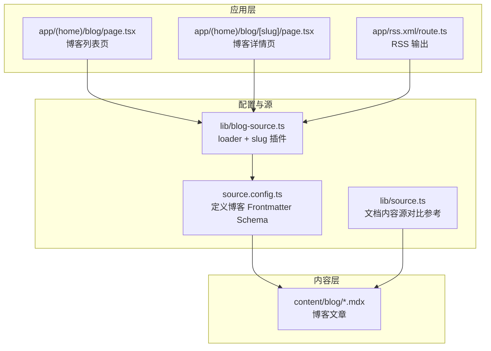
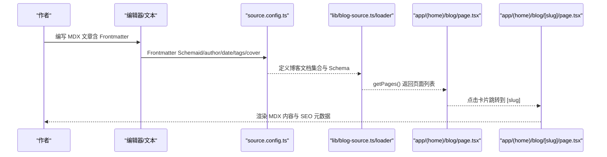
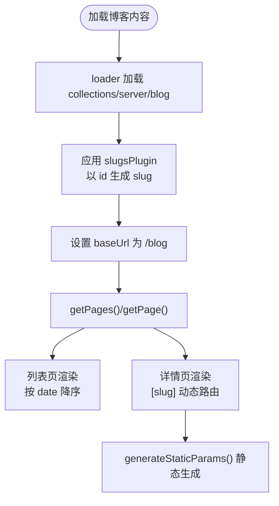
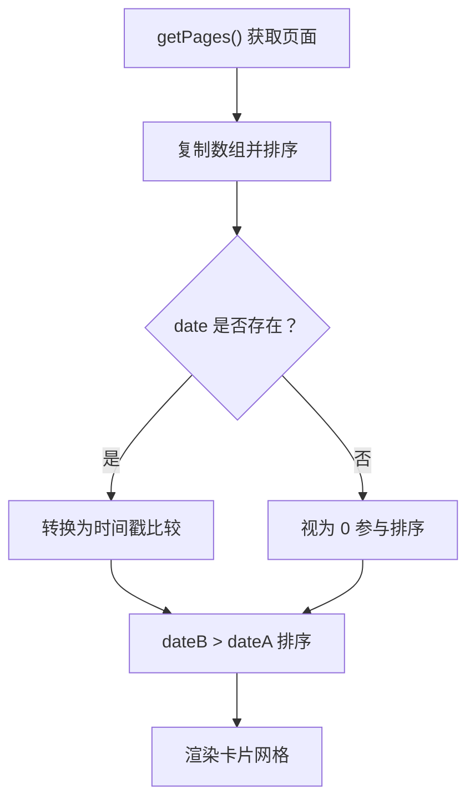
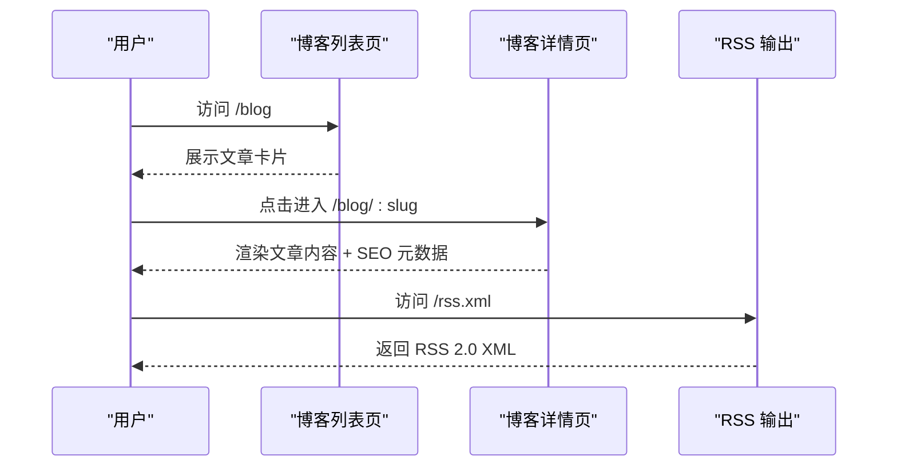
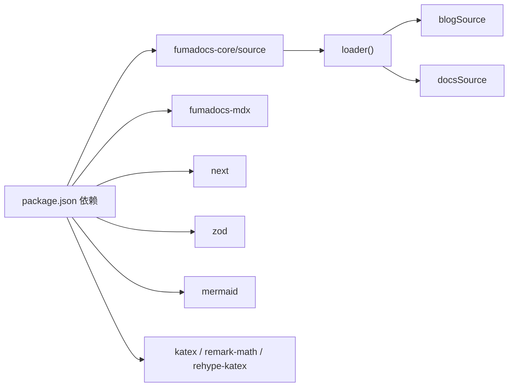

# 博客系统

<cite>
**本文引用的文件**
- [README.md](file://README.md)
- [source.config.ts](file://source.config.ts)
- [lib/blog-source.ts](file://lib/blog-source.ts)
- [app/(home)/blog/page.tsx](file://app/(home)/blog/page.tsx)
- [app/(home)/blog/[slug]/page.tsx](file://app/(home)/blog/[slug]/page.tsx)
- [content/blog/202501150930-welcome-to-docme.mdx](file://content/blog/202501150930-welcome-to-docme.mdx)
- [content/blog/202503101400-full-text-search-orama.mdx](file://content/blog/202503101400-full-text-search-orama.mdx)
- [components/mdx.tsx](file://components/mdx.tsx)
- [next.config.mjs](file://next.config.mjs)
- [lib/source.ts](file://lib/source.ts)
- [lib/shared.ts](file://lib/shared.ts)
- [package.json](file://package.json)
- [app/rss.xml/route.ts](file://app/rss.xml/route.ts)
</cite>

## 目录
1. [简介](#简介)
2. [项目结构](#项目结构)
3. [核心组件](#核心组件)
4. [架构总览](#架构总览)
5. [详细组件分析](#详细组件分析)
6. [依赖关系分析](#依赖关系分析)
7. [性能考量](#性能考量)
8. [故障排查指南](#故障排查指南)
9. [结论](#结论)
10. [附录](#附录)

## 简介
本文件为 DocME 博客系统的综合文档，围绕博客内容源配置、Frontmatter 字段定义、路由与 slug 生成、博客列表与分页、编写规范、与文档系统的集成差异、SEO 优化、迁移与备份、评论与互动扩展等方面进行系统化说明。目标读者为博客作者与管理员，帮助其高效地创作、发布与维护博客内容。

## 项目结构
- 应用采用 Next.js App Router 结构，博客页面位于 app/(home)/blog 路由组下，静态导出模式（output: export）。
- 内容源通过 Fumadocs 的 collections/server 与 loader 配置，分别对接 content/docs 与 content/blog。
- 博客内容以 MDX 文件形式存放于 content/blog，Frontmatter 使用 Zod Schema 校验。
- 博客路由通过插件将数据中的 id 字段映射为 slug，实现稳定的 URL 结构。

图表来源
- [app/(home)/blog/page.tsx](file://app/(home)/blog/page.tsx#L1-L92)
- [app/(home)/blog/[slug]/page.tsx](file://app/(home)/blog/[slug]/page.tsx#L1-L105)
- [app/rss.xml/route.ts:1-49](file://app/rss.xml/route.ts#L1-L49)
- [source.config.ts:1-56](file://source.config.ts#L1-L56)
- [lib/blog-source.ts:1-10](file://lib/blog-source.ts#L1-L10)
- [lib/source.ts:1-37](file://lib/source.ts#L1-L37)

章节来源
- [README.md:1-48](file://README.md#L1-L48)
- [next.config.mjs:1-15](file://next.config.mjs#L1-L15)

## 核心组件
- 博客内容源与路由
  - 通过 loader 将 collections/server 的 blog 数据源包装为可查询的页面集合，并设置 baseUrl 为 /blog。
  - 使用 slugsPlugin 与 slugsFromData('id') 将页面的 id 字段作为 slug 来源，确保 URL 稳定且可预测。
- 博客列表页
  - 从 blogSource.getPages() 获取所有页面，按 date 字段降序排序后渲染卡片网格。
  - 展示标题、摘要、标签、作者与日期等信息。
- 博客详情页
  - 通过 [slug] 参数定位页面，不存在则返回 404。
  - 渲染 MDX 内容，计算阅读时长，展示标签、标题、元信息与返回列表的链接。
  - 自动生成静态参数 generateStaticParams 与 SEO 元数据 generateMetadata。
- RSS 输出
  - 对博客页面按日期倒序生成 RSS 2.0，包含标题、链接、描述与发布日期等字段。

章节来源
- [lib/blog-source.ts:1-10](file://lib/blog-source.ts#L1-L10)
- [app/(home)/blog/page.tsx:11-92](file://app/(home)/blog/page.tsx#L11-L92)
- [app/(home)/blog/[slug]/page.tsx:9-105](file://app/(home)/blog/[slug]/page.tsx#L9-L105)
- [app/rss.xml/route.ts:1-49](file://app/rss.xml/route.ts#L1-L49)

## 架构总览
博客系统基于 Fumadocs 的内容源抽象与 Next.js 的静态生成能力，形成“配置驱动 + 内容即代码”的架构。Frontmatter Schema 在构建期校验，页面在构建期或运行期生成，最终输出静态 HTML。

图表来源
- [source.config.ts:36-47](file://source.config.ts#L36-L47)
- [lib/blog-source.ts:5-9](file://lib/blog-source.ts#L5-L9)
- [app/(home)/blog/page.tsx:11-19](file://app/(home)/blog/page.tsx#L11-L19)
- [app/(home)/blog/[slug]/page.tsx:9-16](file://app/(home)/blog/[slug]/page.tsx#L9-L16)

## 详细组件分析

### 博客内容源与 Frontmatter Schema
- 博客集合定义
  - 在 source.config.ts 中通过 defineDocs 定义博客目录 content/blog，并为其指定 docs.schema 为扩展后的 blogPageSchema。
- 扩展的 Frontmatter 字段
  - id: 字符串，作为 slug 的稳定来源。
  - author: 可选字符串，作者名。
  - date: 可选字符串，ISO 日期格式。
  - tags: 可选字符串数组，用于分类与筛选。
  - cover: 可选字符串，封面图路径。
- 文档集合对比
  - 文档集合 docs 使用 docsPageSchema，包含 lastModified 等字段；博客集合 blog 使用 blogPageSchema，强调内容属性而非文档元信息。

章节来源
- [source.config.ts:8-15](file://source.config.ts#L8-L15)
- [source.config.ts:19-21](file://source.config.ts#L19-L21)
- [source.config.ts:36-47](file://source.config.ts#L36-L47)

### 路由生成与 slug 处理
- 基础路径与插件
  - blogSource.baseUrl 设为 /blog，确保生成的页面 URL 以 /blog 开头。
  - 使用 slugsPlugin 与 slugsFromData('id') 将页面的 id 字段作为 slug，避免因文件名变化导致的 URL 不一致。
- 动态路由与静态生成
  - 博客详情页使用 [slug] 动态路由，generateStaticParams 基于 blogSource.generateParams('slug') 生成静态参数，提升 SEO 与首屏性能。

图表来源
- [lib/blog-source.ts:5-9](file://lib/blog-source.ts#L5-L9)
- [app/(home)/blog/[slug]/page.tsx:86-91](file://app/(home)/blog/[slug]/page.tsx#L86-L91)

章节来源
- [lib/blog-source.ts:1-10](file://lib/blog-source.ts#L1-L10)
- [app/(home)/blog/[slug]/page.tsx:86-104](file://app/(home)/blog/[slug]/page.tsx#L86-L104)

### 博客列表页面与分页
- 列表实现
  - 从 blogSource.getPages() 获取页面集合，按 date 字段降序排序，渲染为卡片网格。
  - 卡片内展示 tags、title、description、author 与 date 等信息。
- 分页策略
  - 当前实现未引入分页逻辑，建议在页面数量增长后，结合 getPages() 的分页参数或服务端渲染（SSR）实现分页。

图表来源
- [app/(home)/blog/page.tsx:11-19](file://app/(home)/blog/page.tsx#L11-L19)

章节来源
- [app/(home)/blog/page.tsx:11-92](file://app/(home)/blog/page.tsx#L11-L92)

### 博客详情页面与 SEO
- 页面渲染
  - 通过 blogSource.getPage([slug]) 获取页面，不存在则 404。
  - 渲染 MDX 内容，计算阅读时长，展示标签、标题、作者、日期与返回列表的链接。
- SEO 元数据
  - generateMetadata 返回 title 与 description，便于搜索引擎抓取与社交分享预览。
- RSS 输出
  - app/rss.xml/route.ts 对博客页面按日期倒序生成 RSS 2.0，包含标题、链接、描述与发布日期。

图表来源
- [app/(home)/blog/[slug]/page.tsx:9-104](file://app/(home)/blog/[slug]/page.tsx#L9-L104)
- [app/rss.xml/route.ts:1-49](file://app/rss.xml/route.ts#L1-L49)

章节来源
- [app/(home)/blog/[slug]/page.tsx:9-105](file://app/(home)/blog/[slug]/page.tsx#L9-L105)
- [app/rss.xml/route.ts:1-49](file://app/rss.xml/route.ts#L1-L49)

### 博客与文档系统的集成与差异
- 集成方式
  - 文档系统同样基于 Fumadocs 的 loader 与 collections/server，但文档集合 docs 使用 docsPageSchema，包含 lastModified 等文档元信息。
- 差异点
  - 博客集合 blog 使用 blogPageSchema，强调内容属性（id、author、date、tags、cover），适合内容型站点。
  - 文档集合 docs 更关注文档生命周期与版本信息，二者共享底层内容源抽象，但 Schema 与用途不同。

章节来源
- [lib/source.ts:1-37](file://lib/source.ts#L1-L37)
- [source.config.ts:19-21](file://source.config.ts#L19-L21)
- [source.config.ts:36-47](file://source.config.ts#L36-L47)

### 编写规范与格式要求
- Frontmatter 字段
  - 必填：title、description
  - 建议：id（唯一标识，用于 slug）、date（ISO 日期）、author、tags（数组）、cover（图片路径）
- 文件命名与结构
  - 建议采用时间戳+短标题的命名方式，便于排序与识别。
  - MDX 内容支持 React 组件与数学公式等富文本能力。
- MDX 组件
  - 通过 getMDXComponents 注入默认组件与自定义组件（如 Mermaid），满足图表与交互需求。

章节来源
- [source.config.ts:8-15](file://source.config.ts#L8-L15)
- [content/blog/202501150930-welcome-to-docme.mdx:1-42](file://content/blog/202501150930-welcome-to-docme.mdx#L1-L42)
- [content/blog/202503101400-full-text-search-orama.mdx:1-60](file://content/blog/202503101400-full-text-search-orama.mdx#L1-L60)
- [components/mdx.tsx:1-18](file://components/mdx.tsx#L1-L18)

### SEO 优化配置与最佳实践
- 元数据
  - 使用 generateMetadata 返回 title 与 description，提升搜索可见性。
- RSS 订阅
  - 提供 /rss.xml 输出，便于订阅与传播。
- 静态导出与性能
  - next.config.mjs 启用静态导出（output: export），减少运行时开销，利于 CDN 分发与首屏性能。

章节来源
- [app/(home)/blog/[slug]/page.tsx:93-104](file://app/(home)/blog/[slug]/page.tsx#L93-L104)
- [app/rss.xml/route.ts:1-49](file://app/rss.xml/route.ts#L1-L49)
- [next.config.mjs:1-15](file://next.config.mjs#L1-L15)

### 内容迁移与备份指导
- 迁移步骤
  - 备份 content/blog 目录与 source.config.ts。
  - 确认新环境的 Frontmatter 字段与 Schema 一致（id、author、date、tags、cover）。
  - 在新环境中重新构建，验证 /blog 列表与详情页渲染。
- 备份建议
  - 使用 Git 或云存储定期备份 content 与配置文件。
  - 导出 RSS 作为离线备份与订阅记录。

章节来源
- [source.config.ts:36-47](file://source.config.ts#L36-L47)
- [app/rss.xml/route.ts:1-49](file://app/rss.xml/route.ts#L1-L49)

### 评论与互动功能扩展方案
- 评论系统
  - 可在博客详情页引入第三方评论组件（如 utterances、giscus、Remark42 等），在 MDX 内容下方挂载。
- 互动指标
  - 可在详情页增加点赞、收藏、分享按钮，结合本地存储或后端服务统计。
- 社交媒体
  - 在 generateMetadata 中补充 og:image 与 twitter:card 等元数据，提升社交分享质量。

章节来源
- [app/(home)/blog/[slug]/page.tsx:9-105](file://app/(home)/blog/[slug]/page.tsx#L9-L105)

## 依赖关系分析
- 核心依赖
  - fumadocs-core/source：内容源加载与页面查询。
  - fumadocs-mdx：MDX 编译与插件生态。
  - next：App Router、静态生成与 SSR。
- 博客相关依赖
  - zod：Frontmatter Schema 校验。
  - mermaid、katex、remark-math/rehype-katex：图表与数学公式渲染。
- 文档系统对比
  - 文档集合使用 docsPageSchema，博客集合使用 blogPageSchema，二者共享底层 loader 抽象。

图表来源
- [package.json:12-31](file://package.json#L12-L31)
- [lib/blog-source.ts:1-3](file://lib/blog-source.ts#L1-L3)
- [lib/source.ts:1-10](file://lib/source.ts#L1-L10)

章节来源
- [package.json:1-45](file://package.json#L1-L45)
- [lib/shared.ts:1-12](file://lib/shared.ts#L1-L12)

## 性能考量
- 静态导出
  - output: export 减少运行时成本，适合博客类内容更新频率较低的场景。
- 预渲染与缓存
  - generateStaticParams 生成静态参数，降低运行时查询成本。
- 图片与资源
  - 未启用图像优化（images.unoptimized: true），建议在生产环境配置合适的图片处理与缓存策略。

章节来源
- [next.config.mjs:6-12](file://next.config.mjs#L6-L12)

## 故障排查指南
- 页面 404
  - 检查 [slug] 是否与页面 id 匹配，确认 slugsPlugin 已正确将 id 映射为 slug。
- Frontmatter 校验失败
  - 确认字段类型与可选性符合 blogPageSchema，尤其是 id、date、tags、cover。
- 列表排序异常
  - 确保 date 字段为有效 ISO 字符串，否则排序逻辑会将其视为 0。
- RSS 内容缺失
  - 检查 RSS 路由是否正确读取页面的 title、description、date 与 slugs。

章节来源
- [app/(home)/blog/[slug]/page.tsx:13](file://app/(home)/blog/[slug]/page.tsx#L13)
- [source.config.ts:8-15](file://source.config.ts#L8-L15)
- [app/(home)/blog/page.tsx:15-18](file://app/(home)/blog/page.tsx#L15-L18)
- [app/rss.xml/route.ts:5-10](file://app/rss.xml/route.ts#L5-L10)

## 结论
本博客系统以 Fumadocs 为核心，结合 Next.js 的静态生成能力，实现了稳定、可扩展的内容管理与发布流程。通过明确的 Frontmatter Schema、稳定的 slug 生成与完善的 SEO 元数据，博客作者可以专注于内容创作；管理员则可通过配置与脚本实现迁移、备份与扩展。建议在内容规模扩大后引入分页与评论系统，并持续优化图片与缓存策略以提升性能与用户体验。

## 附录
- 示例文章
  - [content/blog/202501150930-welcome-to-docme.mdx:1-42](file://content/blog/202501150930-welcome-to-docme.mdx#L1-L42)
  - [content/blog/202503101400-full-text-search-orama.mdx:1-60](file://content/blog/202503101400-full-text-search-orama.mdx#L1-L60)
- MDX 组件
  - [components/mdx.tsx:1-18](file://components/mdx.tsx#L1-L18)
- 文档系统参考
  - [lib/source.ts:1-37](file://lib/source.ts#L1-L37)
  - [lib/shared.ts:1-12](file://lib/shared.ts#L1-L12)