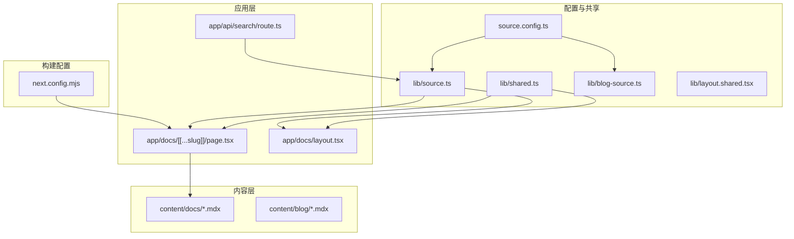
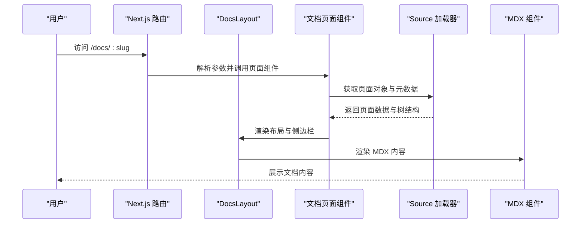
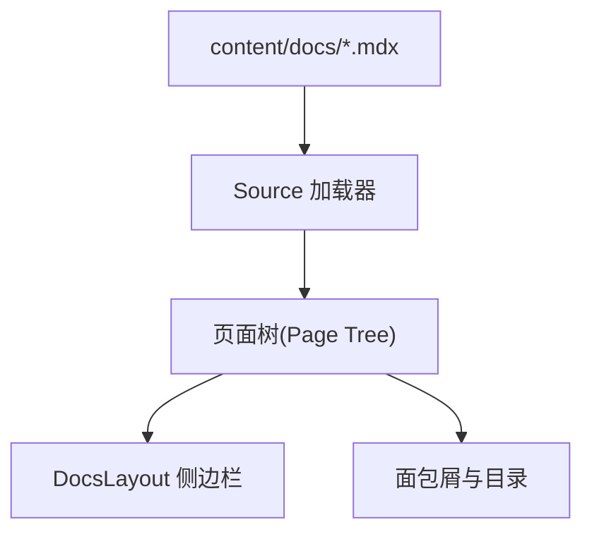
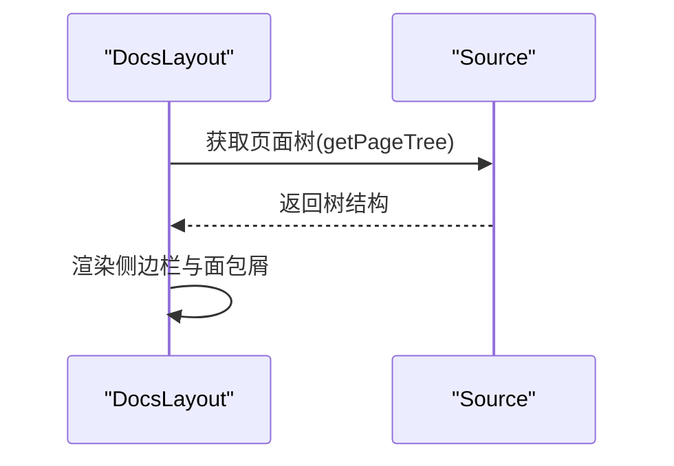
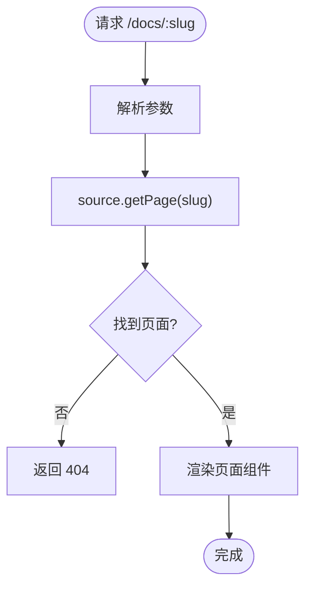
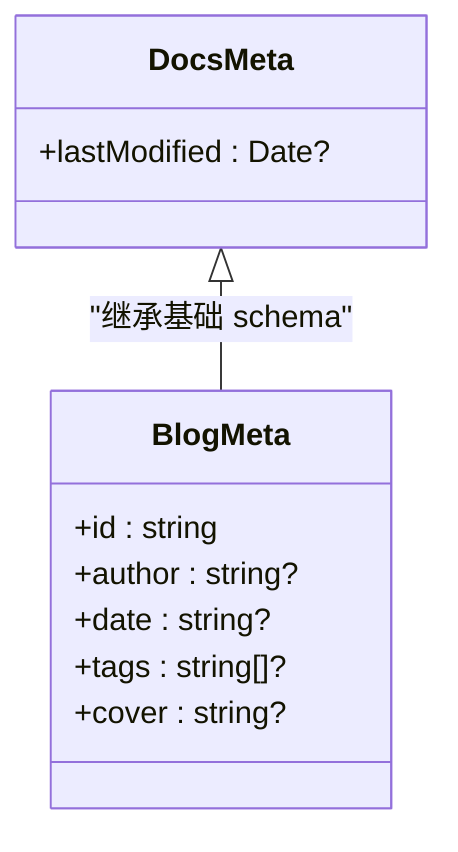
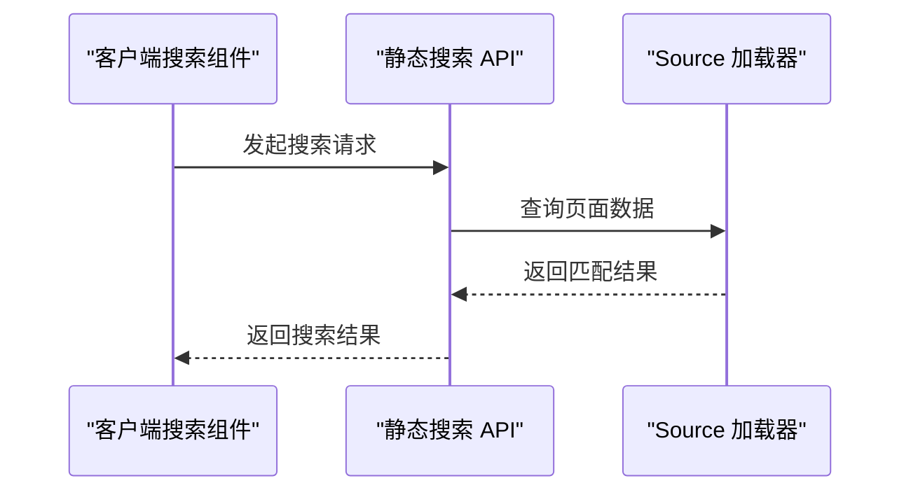
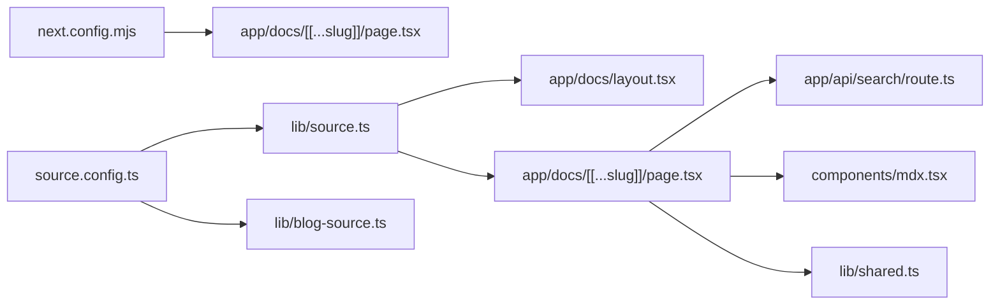

# 文档结构管理

<cite>
**本文引用的文件**
- [README.md](file://README.md)
- [source.config.ts](file://source.config.ts)
- [next.config.mjs](file://next.config.mjs)
- [lib/source.ts](file://lib/source.ts)
- [lib/blog-source.ts](file://lib/blog-source.ts)
- [lib/shared.ts](file://lib/shared.ts)
- [lib/layout.shared.tsx](file://lib/layout.shared.tsx)
- [app/docs/layout.tsx](file://app/docs/layout.tsx)
- [app/docs/[[...slug]]/page.tsx](file://app/docs/[[...slug]]/page.tsx)
- [app/api/search/route.ts](file://app/api/search/route.ts)
- [content/docs/index.mdx](file://content/docs/index.mdx)
- [content/docs/test.mdx](file://content/docs/test.mdx)
- [content/blog/202501150930-welcome-to-docme.mdx](file://content/blog/202501150930-welcome-to-docme.mdx)
- [components/mdx.tsx](file://components/mdx.tsx)
- [components/search.tsx](file://components/search.tsx)
</cite>

## 目录
1. [简介](#简介)
2. [项目结构](#项目结构)
3. [核心组件](#核心组件)
4. [架构总览](#架构总览)
5. [详细组件分析](#详细组件分析)
6. [依赖关系分析](#依赖关系分析)
7. [性能考量](#性能考量)
8. [故障排查指南](#故障排查指南)
9. [结论](#结论)
10. [附录](#附录)

## 简介
本文件面向文档管理员与开发者，系统化阐述该文档管理系统的结构设计与实现要点，包括：
- 文档树的组织方式与层级结构
- 自动导航生成机制与配置项
- 文档页面路由规则与 slug 生成逻辑
- 文档元数据的管理与排序规则
- 文档分类与标签系统设计
- 结构优化最佳实践
- 版本控制与多语言支持配置思路
- 文档迁移与重构指导
- 搜索索引生成与维护策略

## 项目结构
该项目采用 Next.js App Router 路由模型，结合 Fumadocs 生态，将“文档”和“博客”两类内容通过统一的源适配器进行加载与渲染，并提供静态导出能力。

图表来源
- [app/docs/[[...slug]]/page.tsx:1-69](file://app/docs/[[...slug]]/page.tsx#L1-L69)
- [app/docs/layout.tsx:1-14](file://app/docs/layout.tsx#L1-L14)
- [app/api/search/route.ts:1-12](file://app/api/search/route.ts#L1-L12)
- [lib/source.ts:1-37](file://lib/source.ts#L1-L37)
- [lib/blog-source.ts:1-10](file://lib/blog-source.ts#L1-L10)
- [lib/shared.ts:1-12](file://lib/shared.ts#L1-L12)
- [lib/layout.shared.tsx:1-36](file://lib/layout.shared.tsx#L1-L36)
- [source.config.ts:1-56](file://source.config.ts#L1-L56)
- [next.config.mjs:1-15](file://next.config.mjs#L1-L15)

章节来源
- [README.md:20-37](file://README.md#L20-L37)
- [next.config.mjs:1-15](file://next.config.mjs#L1-L15)
- [source.config.ts:1-56](file://source.config.ts#L1-L56)

## 核心组件
- 内容源适配器与加载器：通过统一的 loader 将 docs 与 blog 两类内容映射为可查询的页面树，支持元数据 schema 定义与后处理（如包含已处理的 Markdown 文本）。
- 文档布局与页面：文档页通过 DocsLayout 渲染侧边栏与目录；页面组件负责渲染 MDX 内容、面包屑、标题与描述等。
- 搜索服务：基于 Orama 的静态搜索接口，支持中文分词器。
- 共享配置：文档路由前缀、图片与内容访问路径、GitHub 仓库信息等。

章节来源
- [lib/source.ts:1-37](file://lib/source.ts#L1-L37)
- [lib/blog-source.ts:1-10](file://lib/blog-source.ts#L1-L10)
- [lib/shared.ts:1-12](file://lib/shared.ts#L1-L12)
- [lib/layout.shared.tsx:1-36](file://lib/layout.shared.tsx#L1-L36)
- [app/docs/layout.tsx:1-14](file://app/docs/layout.tsx#L1-L14)
- [app/docs/[[...slug]]/page.tsx:1-69](file://app/docs/[[...slug]]/page.tsx#L1-L69)
- [app/api/search/route.ts:1-12](file://app/api/search/route.ts#L1-L12)

## 架构总览
系统以“内容源适配器”为核心，将物理文件映射为页面树，再由 Next.js 路由与 Fumadocs 布局组件完成渲染。搜索服务独立于页面渲染，通过静态 API 提供检索能力。

图表来源
- [app/docs/[[...slug]]/page.tsx:16-50](file://app/docs/[[...slug]]/page.tsx#L16-L50)
- [app/docs/layout.tsx:5-12](file://app/docs/layout.tsx#L5-L12)
- [lib/source.ts:6-10](file://lib/source.ts#L6-L10)

## 详细组件分析

### 文档树组织与层级结构
- 文档树来源于内容目录的文件结构。docs 与 blog 分别对应不同的内容集合，各自定义了 frontmatter schema 与后处理选项。
- docs 集合默认启用“包含已处理的 Markdown 文本”，便于后续 LLM 或搜索使用。
- 页面树由 Source 加载器根据物理路径与 frontmatter 生成，支持自动生成侧边栏与面包屑。

图表来源
- [source.config.ts:23-34](file://source.config.ts#L23-L34)
- [lib/source.ts:6-10](file://lib/source.ts#L6-L10)
- [app/docs/layout.tsx:8](file://app/docs/layout.tsx#L8)

章节来源
- [source.config.ts:19-34](file://source.config.ts#L19-L34)
- [content/docs/index.mdx:1-19](file://content/docs/index.mdx#L1-L19)
- [content/docs/test.mdx:1-18](file://content/docs/test.mdx#L1-L18)

### 自动导航生成机制与配置
- 导航树由 DocsLayout 接收的 tree 参数提供，tree 来源于 source.getPageTree()。
- 侧边栏与面包屑的展示可通过布局选项与页面 props 控制，例如 includeRoot 与 includePage。
- 博客侧边栏通过自定义 slug 插件，使用 frontmatter 中的 id 字段作为 slug，确保稳定且可预测的 URL。

图表来源
- [app/docs/layout.tsx:8](file://app/docs/layout.tsx#L8)
- [lib/source.ts:6-10](file://lib/source.ts#L6-L10)
- [lib/blog-source.ts:8](file://lib/blog-source.ts#L8)

章节来源
- [lib/layout.shared.tsx:6-24](file://lib/layout.shared.tsx#L6-L24)
- [app/docs/layout.tsx:5-12](file://app/docs/layout.tsx#L5-L12)
- [lib/blog-source.ts:5-9](file://lib/blog-source.ts#L5-L9)

### 文档页面路由规则与 slug 生成逻辑
- 文档路由采用 App Router 的 catch-all 路径 [[...slug]]，支持任意层级的 slug。
- 页面通过 source.getPage(slug) 获取页面对象，不存在时返回 404。
- 生成静态参数 generateStaticParams 使用 source.generateParams()，确保预渲染覆盖所有页面。
- 博客使用自定义插件，将 frontmatter 的 id 作为 slug，保证 URL 的稳定性与可读性。

图表来源
- [app/docs/[[...slug]]/page.tsx:16-20](file://app/docs/[[...slug]]/page.tsx#L16-L20)
- [app/docs/[[...slug]]/page.tsx:52-54](file://app/docs/[[...slug]]/page.tsx#L52-L54)

章节来源
- [app/docs/[[...slug]]/page.tsx:16-69](file://app/docs/[[...slug]]/page.tsx#L16-L69)
- [lib/blog-source.ts:5-9](file://lib/blog-source.ts#L5-L9)

### 文档元数据管理与排序规则
- docs 与 blog 均使用统一的 meta schema，支持扩展字段（如 lastModified、id、author、date、tags、cover 等）。
- docs 集合对 lastModified 进行可选日期处理，便于显示“最后更新时间”。
- 排序规则未在配置中显式声明，默认遵循文件系统顺序或由加载器内部策略决定；如需自定义排序，可在后处理阶段或自定义插件中实现。
- 页面元信息用于 Open Graph 图像与标题/描述生成，提升分享体验。

图表来源
- [source.config.ts:19-21](file://source.config.ts#L19-L21)
- [source.config.ts:9-15](file://source.config.ts#L9-L15)
- [app/docs/[[...slug]]/page.tsx:56-68](file://app/docs/[[...slug]]/page.tsx#L56-L68)

章节来源
- [source.config.ts:19-21](file://source.config.ts#L19-L21)
- [source.config.ts:9-15](file://source.config.ts#L9-L15)
- [content/blog/202501150930-welcome-to-docme.mdx:1-9](file://content/blog/202501150930-welcome-to-docme.mdx#L1-L9)

### 文档分类与标签系统设计
- 博客内容通过 frontmatter 的 tags 数组实现标签分类，可用于筛选与聚合展示。
- 文档内容当前未见显式的分类字段定义，若需引入分类，可在 docsPageSchema 中扩展相应字段并在布局中提供筛选 UI。
- 建议：为文档引入 category 字段，并在侧边栏或顶部导航中提供分类入口，提升检索效率。

章节来源
- [source.config.ts:9-15](file://source.config.ts#L9-L15)
- [content/blog/202501150930-welcome-to-docme.mdx:7](file://content/blog/202501150930-welcome-to-docme.mdx#L7)

### 文档结构优化最佳实践
- 文件命名：建议采用语义化命名（如 YYYYMMDD_title.mdx），便于排序与检索。
- 目录层级：保持扁平到三层以内，避免过深的嵌套导致导航复杂。
- frontmatter 规范：统一字段名称与类型，确保元数据一致性。
- 内容复用：通过 MDX 组件抽象公共 UI（如 Cards、Mermaid），减少重复。
- 预渲染：利用 generateStaticParams 与静态导出，提升首屏性能与 SEO 友好度。

章节来源
- [components/mdx.tsx:1-18](file://components/mdx.tsx#L1-L18)
- [next.config.mjs:7](file://next.config.mjs#L7)

### 版本控制与多语言支持配置
- 版本控制：建议在内容目录下按版本划分子目录（如 content/docs/v1、content/docs/v2），并通过构建脚本或环境变量切换当前版本。
- 多语言支持：可在 source.config.ts 中为不同语言创建独立的 defineDocs 实例，分别指向 content/docs/{lang} 目录，并在路由前缀上区分（如 /zh/docs、/en/docs）。客户端通过 i18n 上下文切换语言，搜索端可配置对应语言的分词器。

章节来源
- [source.config.ts:23-47](file://source.config.ts#L23-L47)
- [components/search.tsx:25-31](file://components/search.tsx#L25-L31)

### 文档迁移与重构指导
- 迁移步骤：
  1) 在 source.config.ts 中新增目标集合（如 defineDocs），设置 dir 指向新目录。
  2) 更新 lib/source.ts 与 lib/blog-source.ts，将新集合纳入 loader。
  3) 如需自定义 slug，参考 blog 的 slugsPlugin 方案。
  4) 更新 app/docs/[[...slug]]/page.tsx 的 baseUrl 与路由前缀。
  5) 重新生成静态参数并验证页面树。
- 重构建议：
  - 将重复的 frontmatter 字段抽取为共享 schema。
  - 引入后处理插件统一格式化（如标题大小写、摘要截取）。
  - 对长文档拆分章节，降低单页渲染压力。

章节来源
- [lib/source.ts:6-10](file://lib/source.ts#L6-L10)
- [lib/blog-source.ts:5-9](file://lib/blog-source.ts#L5-L9)
- [app/docs/[[...slug]]/page.tsx:52-54](file://app/docs/[[...slug]]/page.tsx#L52-L54)

### 文档搜索索引生成与维护
- 服务端：app/api/search/route.ts 使用 createFromSource(source) 创建静态搜索索引，语言设为中文，使用中文分词器。
- 客户端：components/search.tsx 使用 useDocsSearch 初始化本地 Orama 实例，类型为 static，从服务端静态接口获取结果。
- 维护策略：
  - 在 CI 中预构建搜索索引，确保每次内容变更后索引同步。
  - 对长文档内容进行摘要提取，提升检索相关性。
  - 根据业务需要调整语言与分词器，支持中英混合场景。

图表来源
- [app/api/search/route.ts:7-11](file://app/api/search/route.ts#L7-L11)
- [components/search.tsx:27-31](file://components/search.tsx#L27-L31)

章节来源
- [app/api/search/route.ts:1-12](file://app/api/search/route.ts#L1-L12)
- [components/search.tsx:1-47](file://components/search.tsx#L1-L47)

## 依赖关系分析
- 构建期：next.config.mjs 通过 createMDX 包装 Next 配置，启用 MDX 支持与静态导出。
- 运行期：lib/source.ts 与 lib/blog-source.ts 作为内容源适配器，向页面与布局组件提供统一的数据接口。
- 路由期：app/docs/[[...slug]]/page.tsx 负责解析 slug、生成静态参数与页面元信息。
- 搜索期：app/api/search/route.ts 与 components/search.tsx 分别承担服务端索引与客户端检索。

图表来源
- [next.config.mjs:1-15](file://next.config.mjs#L1-L15)
- [source.config.ts:1-56](file://source.config.ts#L1-L56)
- [lib/source.ts:1-37](file://lib/source.ts#L1-L37)
- [lib/blog-source.ts:1-10](file://lib/blog-source.ts#L1-L10)
- [app/docs/layout.tsx:1-14](file://app/docs/layout.tsx#L1-L14)
- [app/docs/[[...slug]]/page.tsx:1-69](file://app/docs/[[...slug]]/page.tsx#L1-L69)
- [app/api/search/route.ts:1-12](file://app/api/search/route.ts#L1-L12)
- [components/mdx.tsx:1-18](file://components/mdx.tsx#L1-L18)
- [lib/shared.ts:1-12](file://lib/shared.ts#L1-L12)

章节来源
- [next.config.mjs:1-15](file://next.config.mjs#L1-L15)
- [source.config.ts:1-56](file://source.config.ts#L1-L56)

## 性能考量
- 静态导出：next.config.mjs 设置 output 为 export，有利于 CDN 分发与离线部署。
- 预渲染：generateStaticParams 自动生成所有页面参数，减少运行时计算。
- 搜索性能：静态搜索接口避免运行时重建索引，客户端使用本地 Orama 实例提升交互速度。
- 内容体积：对大文档进行分段与摘要，减少单页渲染负担。

章节来源
- [next.config.mjs:7](file://next.config.mjs#L7)
- [app/docs/[[...slug]]/page.tsx:52-54](file://app/docs/[[...slug]]/page.tsx#L52-L54)
- [components/search.tsx:27-31](file://components/search.tsx#L27-L31)

## 故障排查指南
- 页面 404：确认 slug 是否存在于页面树中，检查 source.getPage(slug) 返回值。
- 导航不显示：检查 DocsLayout 的 tree 是否来自 source.getPageTree()，确认 baseUrl 与路由前缀一致。
- 搜索无结果：确认 app/api/search/route.ts 的 language 与 tokenizer 配置是否正确，以及静态索引是否已生成。
- MDX 组件缺失：确认 components/mdx.tsx 中已注册所需组件，并在页面中传入 getMDXComponents 返回的组件集。

章节来源
- [app/docs/[[...slug]]/page.tsx:16-20](file://app/docs/[[...slug]]/page.tsx#L16-L20)
- [app/docs/layout.tsx:8](file://app/docs/layout.tsx#L8)
- [app/api/search/route.ts:7-11](file://app/api/search/route.ts#L7-L11)
- [components/mdx.tsx:5-11](file://components/mdx.tsx#L5-L11)

## 结论
本系统通过 Fumadocs 与 Next.js 的组合，实现了内容驱动的文档树管理、自动导航生成、灵活的路由与 slug 策略、可扩展的元数据与分类体系，以及高效的静态搜索。建议在实际运营中持续完善元数据规范、优化内容结构与索引策略，并按需扩展多语言与版本化能力，以满足不断增长的文档规模与用户体验需求。

## 附录
- 开发与运行：参考根目录 README 的开发服务器启动方式与项目概览。
- 资源链接：Next.js 文档、Fumadocs 文档与学习资源参见 README。

章节来源
- [README.md:8-16](file://README.md#L8-L16)
- [README.md:39-48](file://README.md#L39-L48)