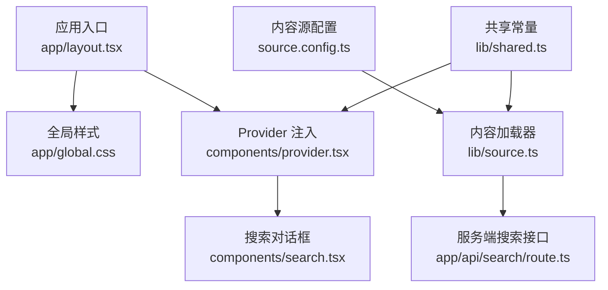
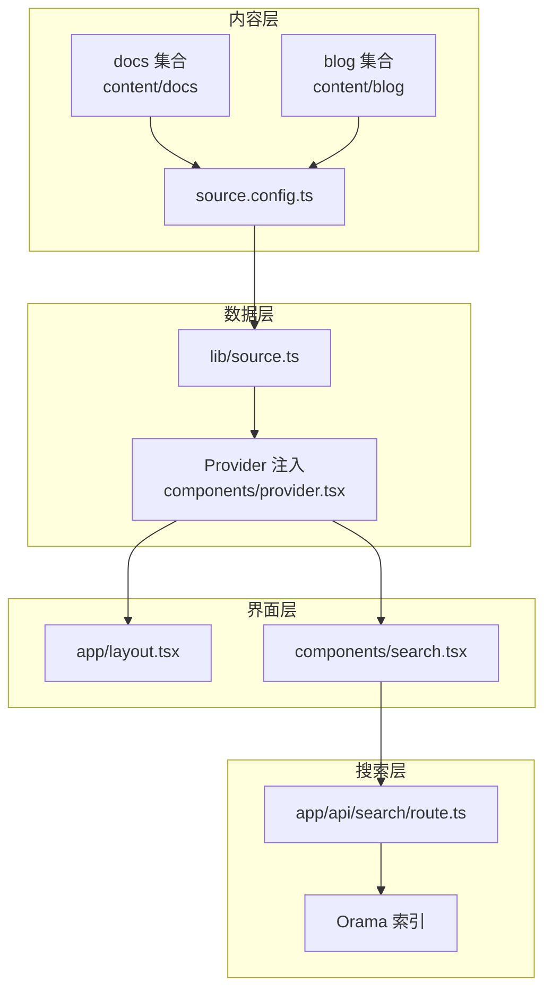
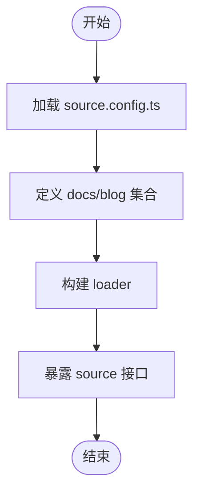
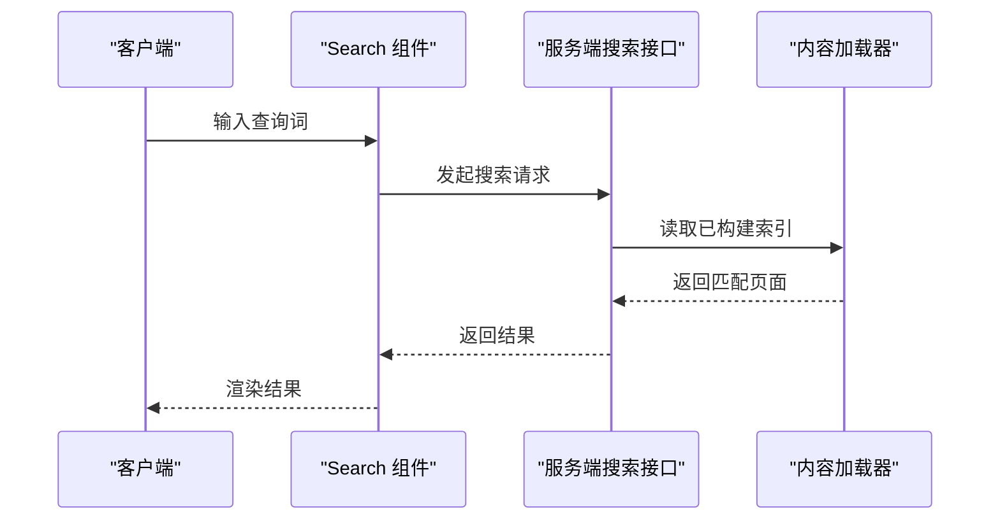
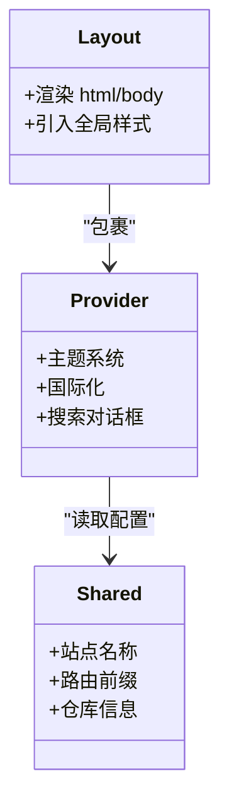
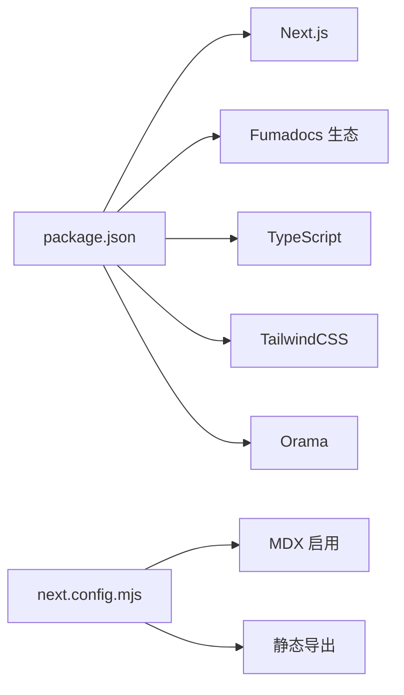

# 开发指南

<cite>
**本文引用的文件**
- [README.md](file://README.md)
- [package.json](file://package.json)
- [next.config.mjs](file://next.config.mjs)
- [tsconfig.json](file://tsconfig.json)
- [source.config.ts](file://source.config.ts)
- [lib/source.ts](file://lib/source.ts)
- [lib/shared.ts](file://lib/shared.ts)
- [lib/layout.shared.tsx](file://lib/layout.shared.tsx)
- [components/provider.tsx](file://components/provider.tsx)
- [components/search.tsx](file://components/search.tsx)
- [app/layout.tsx](file://app/layout.tsx)
- [app/global.css](file://app/global.css)
- [app/api/search/route.ts](file://app/api/search/route.ts)
- [content/docs/index.mdx](file://content/docs/index.mdx)
- [content/blog/202501150930-welcome-to-docme.mdx](file://content/blog/202501150930-welcome-to-docme.mdx)
</cite>

## 目录
1. [简介](#简介)
2. [项目结构](#项目结构)
3. [核心组件](#核心组件)
4. [架构总览](#架构总览)
5. [详细组件分析](#详细组件分析)
6. [依赖分析](#依赖分析)
7. [性能考虑](#性能考虑)
8. [故障排查指南](#故障排查指南)
9. [结论](#结论)
10. [附录](#附录)

## 简介
本指南面向新加入的开发者，提供从环境搭建到日常开发、测试与发布的完整路径。DocME 是一个基于 Next.js 与 Fumadocs 的静态导出文档站点，采用 MDX 内容源与 Orama 全文搜索引擎，支持多语言与主题切换。本文档将帮助你快速上手并高效协作。

## 项目结构
- 应用入口与布局
  - 应用根布局与全局样式位于 app/layout.tsx 与 app/global.css
  - 根 Provider 负责主题、国际化与搜索对话框注入
- 内容与源配置
  - source.config.ts 定义文档与博客集合的目录、Schema 与后处理选项
  - lib/source.ts 使用 Fumadocs loader 将内容源暴露为可查询的数据源
  - lib/shared.ts 提供共享的路由前缀与仓库信息
- 搜索与 API
  - app/api/search/route.ts 提供服务端搜索接口
  - components/search.tsx 基于 Orama 初始化客户端搜索
- 示例内容
  - content/docs/index.mdx 与 content/blog/... 包含示例文档与博客条目

图表来源
- [app/layout.tsx:1-13](file://app/layout.tsx#L1-L13)
- [app/global.css:1-285](file://app/global.css#L1-L285)
- [components/provider.tsx:1-36](file://components/provider.tsx#L1-L36)
- [components/search.tsx:1-47](file://components/search.tsx#L1-L47)
- [source.config.ts:1-47](file://source.config.ts#L1-L47)
- [lib/source.ts:1-37](file://lib/source.ts#L1-L37)
- [app/api/search/route.ts:1-10](file://app/api/search/route.ts#L1-L10)
- [lib/shared.ts:1-12](file://lib/shared.ts#L1-L12)

章节来源
- [README.md:1-48](file://README.md#L1-L48)
- [package.json:1-39](file://package.json#L1-L39)
- [next.config.mjs:1-15](file://next.config.mjs#L1-L15)
- [tsconfig.json:1-36](file://tsconfig.json#L1-L36)
- [source.config.ts:1-47](file://source.config.ts#L1-L47)
- [lib/source.ts:1-37](file://lib/source.ts#L1-L37)
- [lib/shared.ts:1-12](file://lib/shared.ts#L1-L12)
- [lib/layout.shared.tsx:1-36](file://lib/layout.shared.tsx#L1-L36)
- [components/provider.tsx:1-36](file://components/provider.tsx#L1-L36)
- [components/search.tsx:1-47](file://components/search.tsx#L1-L47)
- [app/layout.tsx:1-13](file://app/layout.tsx#L1-L13)
- [app/global.css:1-285](file://app/global.css#L1-L285)
- [app/api/search/route.ts:1-10](file://app/api/search/route.ts#L1-L10)
- [content/docs/index.mdx:1-19](file://content/docs/index.mdx#L1-L19)
- [content/blog/202501150930-welcome-to-docme.mdx:1-42](file://content/blog/202501150930-welcome-to-docme.mdx#L1-L42)

## 核心组件
- 内容源与加载器
  - source.config.ts 定义 docs 与 blog 两套集合，分别映射 content/docs 与 content/blog，使用 Zod Schema 校验 frontmatter，并开启 processed markdown 输出
  - lib/source.ts 通过 loader 将内容源转换为可查询的 source，并提供图片与 Markdown 下载辅助函数
- 布局与导航
  - lib/layout.shared.tsx 提供基础与文档专用的布局选项，包含站点标题、导航链接与 GitHub 仓库地址
  - app/layout.tsx 注入 Provider 并设置全局样式与语言属性
- 搜索与主题
  - components/search.tsx 基于 Orama 初始化客户端索引，配合服务端接口实现静态搜索
  - components/provider.tsx 配置主题系统与中文翻译，启用系统主题与默认系统主题
- 构建与导出
  - next.config.mjs 启用 MDX 并配置静态导出，禁用图片优化以适配静态部署
  - package.json 定义开发、类型检查与构建脚本

章节来源
- [source.config.ts:1-47](file://source.config.ts#L1-L47)
- [lib/source.ts:1-37](file://lib/source.ts#L1-L37)
- [lib/layout.shared.tsx:1-36](file://lib/layout.shared.tsx#L1-L36)
- [app/layout.tsx:1-13](file://app/layout.tsx#L1-L13)
- [components/search.tsx:1-47](file://components/search.tsx#L1-L47)
- [components/provider.tsx:1-36](file://components/provider.tsx#L1-L36)
- [next.config.mjs:1-15](file://next.config.mjs#L1-L15)
- [package.json:1-39](file://package.json#L1-L39)

## 架构总览
DocME 采用“内容即数据”的架构：source.config.ts 定义内容集合与 Schema；lib/source.ts 将内容转为统一数据源；UI 层通过 Fumadocs 提供的组件与 Provider 进行渲染与交互；搜索由服务端接口与客户端 Orama 共同完成。

图表来源
- [source.config.ts:1-47](file://source.config.ts#L1-L47)
- [lib/source.ts:1-37](file://lib/source.ts#L1-L37)
- [components/provider.tsx:1-36](file://components/provider.tsx#L1-L36)
- [app/layout.tsx:1-13](file://app/layout.tsx#L1-L13)
- [components/search.tsx:1-47](file://components/search.tsx#L1-L47)
- [app/api/search/route.ts:1-10](file://app/api/search/route.ts#L1-L10)

## 详细组件分析

### 组件 A：内容源与加载器
- 设计要点
  - 通过 defineDocs 与 Zod Schema 明确内容结构，确保类型安全与一致性
  - loader 将内容源抽象为统一接口，便于 UI 与搜索模块复用
- 数据流
  - 读取 content/docs 与 content/blog → 解析 frontmatter 与 markdown → 生成可查询页面列表
- 复杂度与性能
  - 加载复杂度与文档数量线性相关；建议分组与懒加载策略减少首屏压力
- 错误处理
  - Schema 校验失败时应抛出明确错误，便于定位内容问题

图表来源
- [source.config.ts:1-47](file://source.config.ts#L1-L47)
- [lib/source.ts:1-37](file://lib/source.ts#L1-L37)

章节来源
- [source.config.ts:1-47](file://source.config.ts#L1-L47)
- [lib/source.ts:1-37](file://lib/source.ts#L1-L37)

### 组件 B：搜索与 API
- 设计要点
  - 服务端接口负责构建与缓存索引；客户端通过 Orama 初始化本地索引，提升交互体验
- 数据流
  - 客户端发起搜索请求 → 服务端根据 source 生成索引 → 返回匹配结果
- 性能与优化
  - 服务端禁用自动 revalidate，避免频繁重建索引；客户端按需初始化 Orama
- 错误处理
  - 查询异常时返回空结果或错误提示，保持 UI 稳定

图表来源
- [components/search.tsx:1-47](file://components/search.tsx#L1-L47)
- [app/api/search/route.ts:1-10](file://app/api/search/route.ts#L1-L10)
- [lib/source.ts:1-37](file://lib/source.ts#L1-L37)

章节来源
- [components/search.tsx:1-47](file://components/search.tsx#L1-L47)
- [app/api/search/route.ts:1-10](file://app/api/search/route.ts#L1-L10)
- [lib/source.ts:1-37](file://lib/source.ts#L1-L37)

### 组件 C：布局与主题
- 设计要点
  - Provider 统一注入主题、国际化与搜索对话框；布局选项来自 shared 配置
- 数据流
  - app/layout.tsx 渲染 HTML 结构与全局样式；Provider 包裹子树
- 性能与优化
  - 主题切换与国际化状态集中管理，避免重复渲染
- 错误处理
  - 国际化缺失键值回退至默认文案，确保可用性

图表来源
- [app/layout.tsx:1-13](file://app/layout.tsx#L1-L13)
- [components/provider.tsx:1-36](file://components/provider.tsx#L1-L36)
- [lib/shared.ts:1-12](file://lib/shared.ts#L1-L12)

章节来源
- [app/layout.tsx:1-13](file://app/layout.tsx#L1-L13)
- [components/provider.tsx:1-36](file://components/provider.tsx#L1-L36)
- [lib/shared.ts:1-12](file://lib/shared.ts#L1-L12)

## 依赖分析
- 运行时依赖
  - Next.js、React、Fumadocs 生态（core/ui/mdx）、Tailwind、Zod、Orama、HeroUI、Lucide 等
- 开发依赖
  - TypeScript、TailwindCSS、PostCSS、serve 等
- 构建与导出
  - next.config.mjs 启用 MDX 与静态导出，关闭图片优化以适配静态托管

图表来源
- [package.json:1-39](file://package.json#L1-L39)
- [next.config.mjs:1-15](file://next.config.mjs#L1-L15)

章节来源
- [package.json:1-39](file://package.json#L1-L39)
- [next.config.mjs:1-15](file://next.config.mjs#L1-L15)
- [tsconfig.json:1-36](file://tsconfig.json#L1-L36)

## 性能考虑
- 构建与导出
  - 静态导出减少运行时开销，适合文档站点；注意资源体积与加载时间
- 搜索性能
  - 服务端构建索引，客户端按需初始化；避免在首屏进行重型计算
- 样式与主题
  - 全局样式集中管理，主题切换使用 CSS 变量，降低重排成本
- 类型与校验
  - 使用 Zod Schema 与 TypeScript 在编译期捕获错误，减少运行时异常

## 故障排查指南
- 开发服务器无法启动
  - 检查 Node 版本与包管理器一致性；确认端口占用情况
- 文档不显示或路由异常
  - 确认 content/docs 与 content/blog 目录存在且命名规范正确
- 搜索无结果
  - 检查服务端接口是否正常返回；确认客户端 Orama 初始化参数与语言设置一致
- 样式异常
  - 确认 Tailwind 引入顺序与 CSS 变量覆盖是否生效

章节来源
- [README.md:1-48](file://README.md#L1-L48)
- [app/api/search/route.ts:1-10](file://app/api/search/route.ts#L1-L10)
- [components/search.tsx:1-47](file://components/search.tsx#L1-L47)
- [app/global.css:1-285](file://app/global.css#L1-L285)

## 结论
本指南提供了 DocME 项目的开发环境、架构与组件的系统性说明。遵循本文档的流程与最佳实践，你可以高效地新增内容、扩展功能并保障质量与性能。

## 附录

### 开发环境设置与配置
- 环境要求
  - Node.js 与包管理器（推荐 pnpm）
  - 文本编辑器（建议 VS Code 并安装相关扩展）
- 安装与启动
  - 安装依赖后运行开发服务器，访问本地端口查看效果
- 关键配置
  - next.config.mjs：启用 MDX 与静态导出
  - tsconfig.json：严格类型检查与路径别名
  - source.config.ts：内容集合与 Schema 定义

章节来源
- [README.md:1-48](file://README.md#L1-L48)
- [package.json:1-39](file://package.json#L1-L39)
- [next.config.mjs:1-15](file://next.config.mjs#L1-L15)
- [tsconfig.json:1-36](file://tsconfig.json#L1-L36)
- [source.config.ts:1-47](file://source.config.ts#L1-L47)

### 贡献指南与工作流
- 代码规范
  - 使用 TypeScript 严格模式；遵循现有命名与目录组织
  - 组件与样式分离，优先使用 Fumadocs UI 组件
- 提交规范
  - 提交信息清晰描述变更目的与范围
- Pull Request 流程
  - 新分支开发 → 本地类型检查与格式化 → 提交 PR → 代码审查 → 合并

章节来源
- [package.json:1-39](file://package.json#L1-L39)
- [tsconfig.json:1-36](file://tsconfig.json#L1-L36)

### 调试技巧与开发工具
- 类型检查
  - 使用类型检查脚本在合并前验证类型安全
- 构建与预览
  - 本地构建后使用静态服务器预览产物
- 搜索调试
  - 检查服务端接口返回与客户端初始化日志

章节来源
- [package.json:1-39](file://package.json#L1-L39)
- [app/api/search/route.ts:1-10](file://app/api/search/route.ts#L1-L10)
- [components/search.tsx:1-47](file://components/search.tsx#L1-L47)

### 新功能开发指导与模板
- 新增文档页面
  - 在 content/docs 或 content/blog 下新增 MDX 文件，按需填写 frontmatter
- 新增集合或路由
  - 在 source.config.ts 中定义新集合；在 lib/shared.ts 中补充路由前缀
- 搜索扩展
  - 如需多语言支持，在服务端与客户端均配置对应语言

章节来源
- [content/docs/index.mdx:1-19](file://content/docs/index.mdx#L1-L19)
- [content/blog/202501150930-welcome-to-docme.mdx:1-42](file://content/blog/202501150930-welcome-to-docme.mdx#L1-L42)
- [source.config.ts:1-47](file://source.config.ts#L1-L47)
- [lib/shared.ts:1-12](file://lib/shared.ts#L1-L12)
- [app/api/search/route.ts:1-10](file://app/api/search/route.ts#L1-L10)
- [components/search.tsx:1-47](file://components/search.tsx#L1-L47)

### 代码审查标准与流程
- 审查重点
  - 类型安全、内容 Schema 合规、搜索索引构建、样式与主题一致性
- 流程
  - 提交 PR → 自动化检查通过 → 至少一名维护者审查 → 合并

章节来源
- [tsconfig.json:1-36](file://tsconfig.json#L1-L36)
- [source.config.ts:1-47](file://source.config.ts#L1-L47)
- [app/api/search/route.ts:1-10](file://app/api/search/route.ts#L1-L10)

### 测试策略与质量保证
- 类型检查
  - 在 CI 中执行类型检查，确保无类型错误
- 内容校验
  - 对 frontmatter 进行 Schema 校验，避免无效字段导致渲染异常
- 端到端验证
  - 本地构建后人工验收关键页面与交互

章节来源
- [package.json:1-39](file://package.json#L1-L39)
- [source.config.ts:1-47](file://source.config.ts#L1-L47)

### 团队协作与沟通
- 分支策略
  - 主分支保护，功能开发在特性分支进行
- 沟通渠道
  - 使用 Issue 记录需求与缺陷，PR 讨论技术方案
- 文档同步
  - 新功能同步更新 README 与贡献指南

章节来源
- [README.md:1-48](file://README.md#L1-L48)