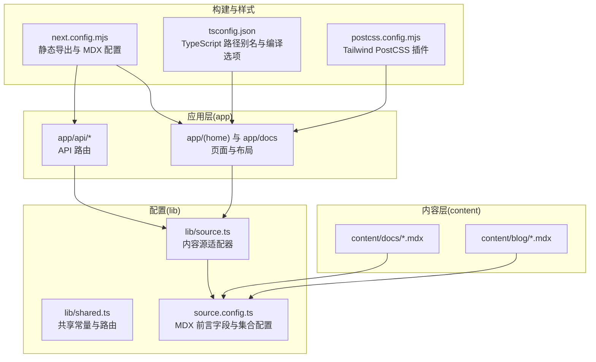
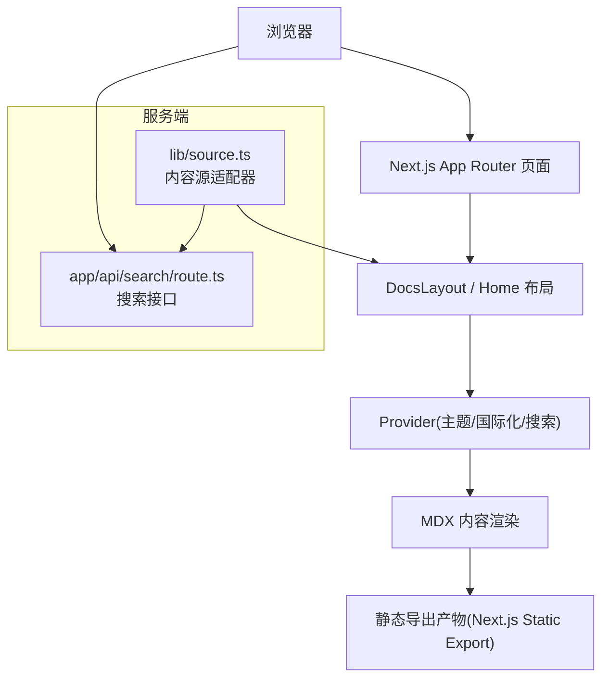
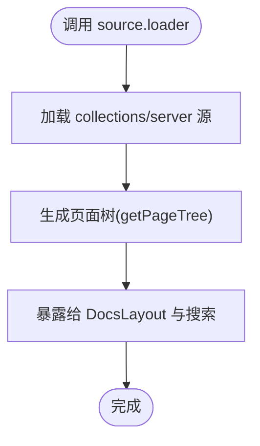
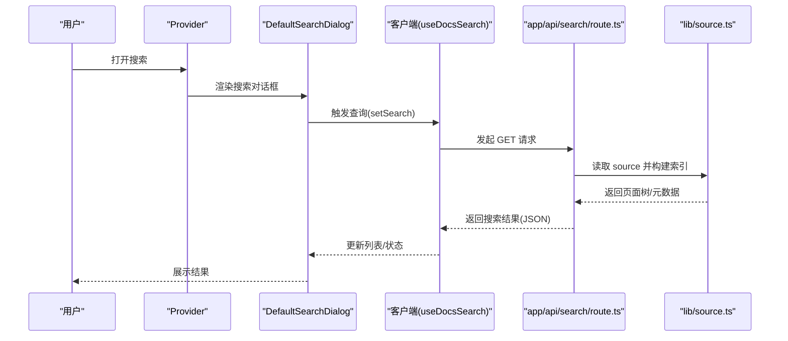
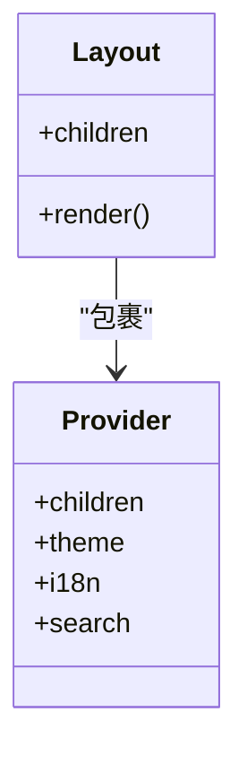
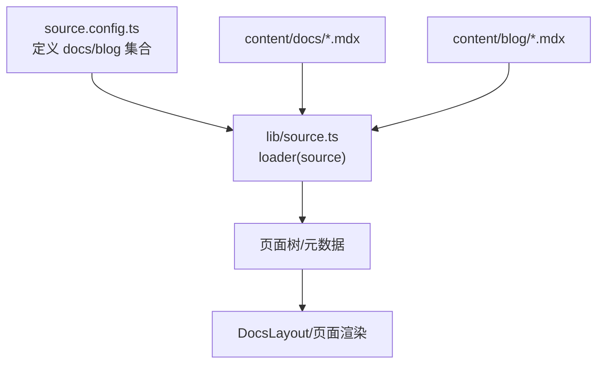
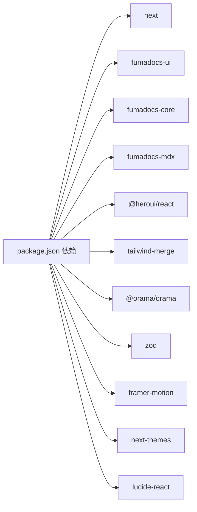

# 快速开始

<cite>
**本文引用的文件**
- [package.json](file://package.json)
- [README.md](file://README.md)
- [next.config.mjs](file://next.config.mjs)
- [tsconfig.json](file://tsconfig.json)
- [source.config.ts](file://source.config.ts)
- [postcss.config.mjs](file://postcss.config.mjs)
- [app/layout.tsx](file://app/layout.tsx)
- [components/provider.tsx](file://components/provider.tsx)
- [components/search.tsx](file://components/search.tsx)
- [lib/shared.ts](file://lib/shared.ts)
- [lib/source.ts](file://lib/source.ts)
- [app/api/search/route.ts](file://app/api/search/route.ts)
- [content/docs/index.mdx](file://content/docs/index.mdx)
- [content/blog/202501150930-welcome-to-docme.mdx](file://content/blog/202501150930-welcome-to-docme.mdx)
</cite>

## 目录
1. [简介](#简介)
2. [项目结构](#项目结构)
3. [核心组件](#核心组件)
4. [架构总览](#架构总览)
5. [详细组件分析](#详细组件分析)
6. [依赖分析](#依赖分析)
7. [性能考虑](#性能考虑)
8. [故障排除指南](#故障排除指南)
9. [结论](#结论)
10. [附录](#附录)

## 简介
本指南面向初学者与进阶开发者，帮助你在最短时间内完成 DocMe 项目的环境准备、安装与本地运行，并理解关键目录与文件的作用。DocMe 基于 Next.js App Router 与 Fumadocs 构建，采用静态导出（Static Export）以实现快速部署；同时集成了 Orama 全文搜索引擎与 MDX 内容系统，便于编写高质量文档与博客。

## 项目结构
DocMe 采用“按功能分层 + 路由组”的组织方式，核心目录与职责如下：
- app：Next.js App Router 页面与路由处理，包含首页、文档区、API 路由等
- components：可复用 UI 组件与全局 Provider
- content：MDX 文档与博客内容
- lib：内容源适配器、共享常量与布局配置
- 配置文件：next.config.mjs、tsconfig.json、postcss.config.mjs、source.config.ts 等

图表来源
- [next.config.mjs:1-15](file://next.config.mjs#L1-L15)
- [tsconfig.json:17-25](file://tsconfig.json#L17-L25)
- [source.config.ts:16-46](file://source.config.ts#L16-L46)
- [lib/source.ts:1-10](file://lib/source.ts#L1-L10)
- [lib/shared.ts:1-12](file://lib/shared.ts#L1-L12)

章节来源
- [README.md:20-37](file://README.md#L20-L37)
- [next.config.mjs:1-15](file://next.config.mjs#L1-L15)
- [tsconfig.json:17-25](file://tsconfig.json#L17-L25)
- [source.config.ts:16-46](file://source.config.ts#L16-L46)

## 核心组件
- 内容源适配器：通过 Fumadocs loader 将 content/docs 与 content/blog 的 MDX 内容转换为可查询的页面树与元数据，供文档布局与搜索使用
- Provider：封装主题、国际化与搜索对话框，统一注入到根布局
- 搜索组件：基于 Orama 的静态搜索，结合 Fumadocs UI 对话框组件
- API 路由：提供静态搜索接口，配合前端客户端查询

章节来源
- [lib/source.ts:1-37](file://lib/source.ts#L1-L37)
- [components/provider.tsx:19-35](file://components/provider.tsx#L19-L35)
- [components/search.tsx:25-46](file://components/search.tsx#L25-L46)
- [app/api/search/route.ts:1-10](file://app/api/search/route.ts#L1-L10)

## 架构总览
DocMe 的运行时架构围绕“内容 → 适配器 → 布局/搜索 → 前端渲染”展开。静态导出模式下，构建产物可在任意静态托管服务上部署。

图表来源
- [app/docs/layout.tsx:5-13](file://app/docs/layout.tsx#L5-L13)
- [components/provider.tsx:19-35](file://components/provider.tsx#L19-L35)
- [lib/source.ts:1-10](file://lib/source.ts#L1-L10)
- [app/api/search/route.ts:1-10](file://app/api/search/route.ts#L1-L10)

## 详细组件分析

### 内容源适配器（lib/source.ts）
- 作用：将 collections/server 暴露的内容源包装为 Fumadocs 可消费的 source，提供页面树、图片与 Markdown 访问能力
- 关键点：baseUrl 使用共享常量 docsRoute；提供 getPageImage/getPageMarkdownUrl/getLLMText 等辅助函数

图表来源
- [lib/source.ts:6-10](file://lib/source.ts#L6-L10)
- [lib/shared.ts:2-4](file://lib/shared.ts#L2-L4)

章节来源
- [lib/source.ts:1-37](file://lib/source.ts#L1-L37)
- [lib/shared.ts:1-12](file://lib/shared.ts#L1-L12)

### 搜索组件与 API（components/search.tsx 与 app/api/search/route.ts）
- 前端：DefaultSearchDialog 使用 useDocsSearch 与 Orama 初始化，提供输入、列表与加载状态
- 后端：静态搜索接口基于 createFromSource(source, { language })，返回 JSON 结果

图表来源
- [components/search.tsx:25-46](file://components/search.tsx#L25-L46)
- [app/api/search/route.ts:1-10](file://app/api/search/route.ts#L1-L10)
- [lib/source.ts:1-10](file://lib/source.ts#L1-L10)

章节来源
- [components/search.tsx:1-47](file://components/search.tsx#L1-L47)
- [app/api/search/route.ts:1-10](file://app/api/search/route.ts#L1-L10)

### 根布局与 Provider（app/layout.tsx 与 components/provider.tsx）
- 根布局设置 HTML 语言、字体与全局样式，并包裹 Provider
- Provider 注入搜索对话框、主题与国际化翻译，统一行为

图表来源
- [app/layout.tsx:4-12](file://app/layout.tsx#L4-L12)
- [components/provider.tsx:19-35](file://components/provider.tsx#L19-L35)

章节来源
- [app/layout.tsx:1-13](file://app/layout.tsx#L1-L13)
- [components/provider.tsx:1-36](file://components/provider.tsx#L1-L36)

### MDX 内容与配置（source.config.ts 与 content/docs/index.mdx）
- source.config.ts 定义 docs 与 blog 两个集合，分别指向 content/docs 与 content/blog，提供前言字段 schema 与后处理选项
- content/docs/index.mdx 展示了基础 MDX 语法与卡片组件用法

图表来源
- [source.config.ts:16-46](file://source.config.ts#L16-L46)
- [lib/source.ts:6-10](file://lib/source.ts#L6-L10)
- [content/docs/index.mdx:1-19](file://content/docs/index.mdx#L1-L19)

章节来源
- [source.config.ts:1-47](file://source.config.ts#L1-L47)
- [content/docs/index.mdx:1-19](file://content/docs/index.mdx#L1-L19)

## 依赖分析
- 运行时依赖：Next.js、Fumadocs 生态（core/ui/mdx）、Heroui、Tailwind Merge、Zod、Framer Motion、Orama、Lucide React、Next-Themes
- 开发依赖：PostCSS、TailwindCSS v4、TypeScript、serve、@types/* 等

图表来源
- [package.json:12-26](file://package.json#L12-L26)
- [package.json:27-37](file://package.json#L27-L37)

章节来源
- [package.json:1-39](file://package.json#L1-L39)

## 性能考虑
- 静态导出：next.config.mjs 中启用 output: 'export'，适合静态托管，减少运行时开销
- 图片优化：images.unoptimized: true，避免动态图像处理
- MDX 与类型生成：postinstall 自动执行 fumadocs-mdx，提升 DX 并保证类型安全
- 搜索性能：静态搜索接口与 Orama 初始化在客户端进行，减少服务端压力

章节来源
- [next.config.mjs:7-12](file://next.config.mjs#L7-L12)
- [package.json:10](file://package.json#L10)

## 故障排除指南
- 安装失败或依赖冲突
  - 确认使用 pnpm 作为包管理器（推荐），并确保网络稳定
  - 若出现 TypeScript 或 MDX 类型错误，执行类型检查脚本以触发类型生成
- 开发服务器无法启动
  - 确保 Node.js 版本满足 Next.js 16 要求（建议使用 LTS 版本）
  - 检查端口 3000 是否被占用
- 搜索无结果
  - 确认 app/api/search/route.ts 已正确导入 lib/source.ts
  - 检查 source.config.ts 中 docs/blog 集合路径是否与 content 目录一致
- 国际化与主题异常
  - 检查 components/provider.tsx 中 i18n 与 theme 配置
- 静态导出后页面空白
  - 确认 next.config.mjs 的 output: 'export' 未被覆盖
  - 检查路径别名与静态资源访问

章节来源
- [README.md:8-18](file://README.md#L8-L18)
- [components/provider.tsx:19-35](file://components/provider.tsx#L19-L35)
- [app/api/search/route.ts:1-10](file://app/api/search/route.ts#L1-L10)
- [source.config.ts:16-46](file://source.config.ts#L16-L46)
- [next.config.mjs:7-12](file://next.config.mjs#L7-L12)

## 结论
通过本指南，你可以快速完成 DocMe 的环境准备、安装与本地运行。项目采用静态导出与 MDX 内容体系，结合 Fumadocs 生态与 Orama 搜索，既适合入门学习也便于扩展生产使用。建议在本地验证成功后再进行静态导出与部署。

## 附录

### 环境要求
- Node.js：建议使用 LTS 版本（与 Next.js 16 兼容）
- 包管理器：推荐 pnpm（与 lock 文件一致）
- 其他：Git（用于版本控制）

章节来源
- [package.json:10](file://package.json#L10)
- [README.md:8-18](file://README.md#L8-L18)

### 安装步骤
- 克隆仓库后，在项目根目录执行安装命令（推荐 pnpm）
- 安装完成后，执行类型检查脚本以生成类型声明
- 如需预览静态导出效果，可使用 serve 启动输出目录

章节来源
- [package.json:5-10](file://package.json#L5-L10)
- [README.md:8-18](file://README.md#L8-L18)

### 开发服务器与常用命令
- 启动开发服务器：npm run dev 或 pnpm dev 或 yarn dev
- 构建项目：npm run build 或 pnpm build
- 类型检查：npm run types:check 或 pnpm types:check
- 预览静态导出：npm start 或 pnpm start

章节来源
- [package.json:5-10](file://package.json#L5-L10)
- [README.md:8-18](file://README.md#L8-L18)

### 验证安装成功
- 在浏览器打开 http://localhost:3000，应看到首页内容
- 导航至 /docs，应显示文档页面树
- 打开搜索框，输入关键词，应返回相关结果
- 查看 content/blog 下的示例文章，确认渲染正常

章节来源
- [README.md:18](file://README.md#L18)
- [content/blog/202501150930-welcome-to-docme.mdx:1-42](file://content/blog/202501150930-welcome-to-docme.mdx#L1-L42)
- [content/docs/index.mdx:1-19](file://content/docs/index.mdx#L1-L19)