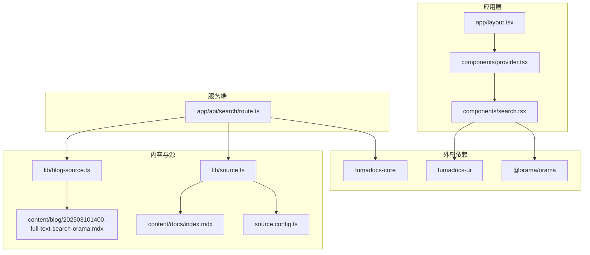
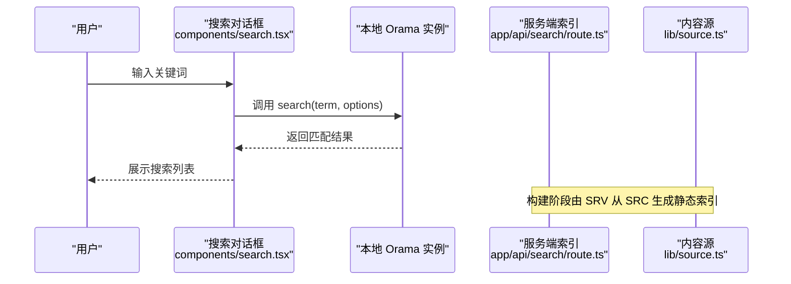
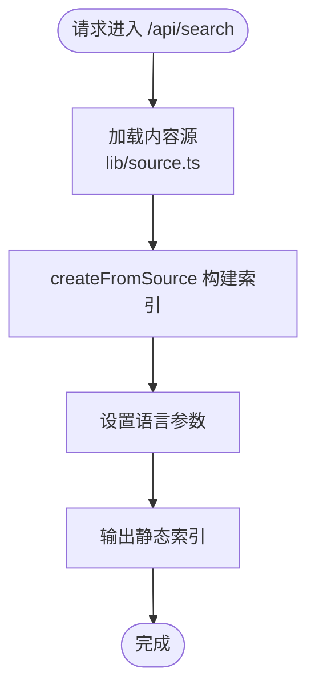
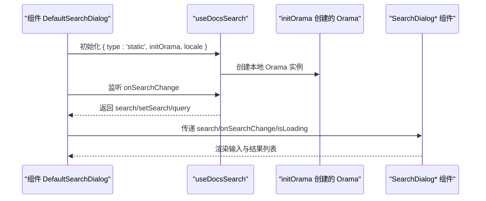
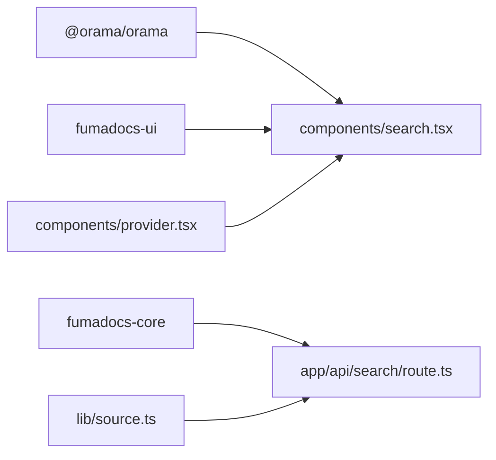
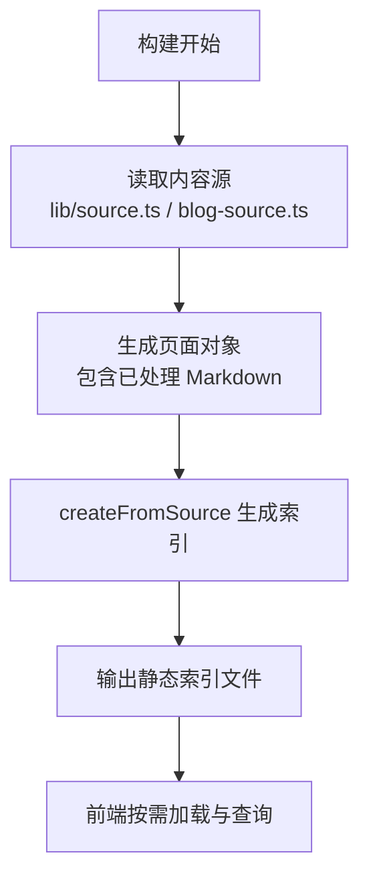

# 搜索功能

<cite>
**本文引用的文件**
- [app/api/search/route.ts](file://app/api/search/route.ts)
- [components/search.tsx](file://components/search.tsx)
- [components/provider.tsx](file://components/provider.tsx)
- [lib/source.ts](file://lib/source.ts)
- [lib/shared.ts](file://lib/shared.ts)
- [lib/blog-source.ts](file://lib/blog-source.ts)
- [source.config.ts](file://source.config.ts)
- [content/blog/202503101400-full-text-search-orama.mdx](file://content/blog/202503101400-full-text-search-orama.mdx)
- [content/docs/index.mdx](file://content/docs/index.mdx)
- [app/layout.tsx](file://app/layout.tsx)
- [package.json](file://package.json)
- [README.md](file://README.md)
</cite>

## 目录
1. [简介](#简介)
2. [项目结构](#项目结构)
3. [核心组件](#核心组件)
4. [架构总览](#架构总览)
5. [组件详解](#组件详解)
6. [依赖关系分析](#依赖关系分析)
7. [性能与优化](#性能与优化)
8. [搜索 API 使用指南](#搜索-api-使用指南)
9. [结果展示与用户体验](#结果展示与用户体验)
10. [配置与自定义](#配置与自定义)
11. [索引生成与更新机制](#索引生成与更新机制)
12. [调试与故障排除](#调试与故障排除)
13. [结论](#结论)

## 简介
本项目采用基于 Orama 的全文搜索方案，结合 fumadocs-core 提供的服务端索引生成与客户端搜索组件，实现文档站点的毫秒级搜索体验。服务端通过静态 Route Handler 预生成搜索索引，前端通过本地 Orama 实例进行即时查询，整体架构清晰、可扩展性强。

## 项目结构
围绕搜索功能的关键文件组织如下：
- 服务端索引生成：app/api/search/route.ts
- 前端搜索对话框与初始化：components/search.tsx
- 应用根提供者与搜索入口注册：components/provider.tsx
- 内容源适配器与页面元数据：lib/source.ts、lib/blog-source.ts、source.config.ts
- 共享路由与常量：lib/shared.ts
- 示例文档与博客文章：content/docs/index.mdx、content/blog/202503101400-full-text-search-orama.mdx
- 应用布局与依赖声明：app/layout.tsx、package.json、README.md

图表来源
- [app/layout.tsx:1-13](file://app/layout.tsx#L1-L13)
- [components/provider.tsx:1-35](file://components/provider.tsx#L1-L35)
- [components/search.tsx:1-47](file://components/search.tsx#L1-L47)
- [app/api/search/route.ts:1-10](file://app/api/search/route.ts#L1-L10)
- [lib/source.ts:1-37](file://lib/source.ts#L1-L37)
- [lib/blog-source.ts:1-10](file://lib/blog-source.ts#L1-L10)
- [source.config.ts:1-47](file://source.config.ts#L1-L47)
- [content/docs/index.mdx:1-19](file://content/docs/index.mdx#L1-L19)
- [content/blog/202503101400-full-text-search-orama.mdx:1-60](file://content/blog/202503101400-full-text-search-orama.mdx#L1-L60)

章节来源
- [README.md:27-31](file://README.md#L27-L31)
- [package.json:12-26](file://package.json#L12-L26)

## 核心组件
- 服务端 Route Handler：负责从内容源生成静态搜索索引，设置语言等参数，关闭 revalidation 以确保索引稳定。
- 前端搜索对话框：封装搜索 UI 组件，使用 useDocsSearch 初始化本地 Orama 实例，支持国际化与加载状态。
- 内容源适配器：通过 loader 将 docs 与 blog 文档转换为统一的数据源，供服务端索引与前端查询使用。
- 应用提供者：注册搜索对话框组件，注入翻译与主题配置，确保搜索 UI 在全局可用。

章节来源
- [app/api/search/route.ts:1-10](file://app/api/search/route.ts#L1-L10)
- [components/search.tsx:1-47](file://components/search.tsx#L1-L47)
- [lib/source.ts:1-37](file://lib/source.ts#L1-L37)
- [lib/blog-source.ts:1-10](file://lib/blog-source.ts#L1-L10)
- [components/provider.tsx:19-35](file://components/provider.tsx#L19-L35)

## 架构总览
整体架构分为三部分：
- 内容采集与适配：source.config.ts 定义文档集合与模式；lib/source.ts 与 lib/blog-source.ts 将内容转换为可搜索的页面对象。
- 服务端索引生成：app/api/search/route.ts 使用 createFromSource 从内容源构建静态索引，指定语言等参数。
- 前端查询与展示：components/search.tsx 使用 useDocsSearch 与 @orama/orama 在浏览器侧执行查询，并通过 fumadocs-ui 组件渲染结果。

图表来源
- [components/search.tsx:25-46](file://components/search.tsx#L25-L46)
- [app/api/search/route.ts:6-9](file://app/api/search/route.ts#L6-L9)
- [lib/source.ts:6-10](file://lib/source.ts#L6-L10)

## 组件详解

### 服务端索引生成（app/api/search/route.ts）
- 功能：基于内容源生成静态搜索索引，禁用 revalidation 保证索引稳定。
- 关键点：
  - 引入 source 并调用 createFromSource(source, { language })。
  - 语言参数影响分词与索引构建策略。
- 可扩展性：可通过传入更多配置项（如分词器、权重等）进一步优化。

图表来源
- [app/api/search/route.ts:1-10](file://app/api/search/route.ts#L1-L10)
- [lib/source.ts:1-10](file://lib/source.ts#L1-L10)

章节来源
- [app/api/search/route.ts:1-10](file://app/api/search/route.ts#L1-L10)

### 前端搜索对话框（components/search.tsx）
- 功能：提供搜索输入、加载状态与结果列表展示。
- 关键点：
  - 使用 useDocsSearch(type='static', initOrama, locale) 初始化搜索。
  - initOrama 返回一个 schema 为 { _: 'string' } 的 Orama 实例，语言参数与服务端一致。
  - 通过 fumadocs-ui 的 SearchDialog 系列组件组合 UI。
- 交互逻辑：onSearchChange 更新查询状态，isLoading 控制加载指示，items 渲染结果。

图表来源
- [components/search.tsx:17-31](file://components/search.tsx#L17-L31)
- [components/search.tsx:33-46](file://components/search.tsx#L33-L46)

章节来源
- [components/search.tsx:1-47](file://components/search.tsx#L1-L47)

### 应用提供者与搜索注册（components/provider.tsx）
- 功能：在应用根部注册搜索对话框组件，注入翻译与主题配置。
- 关键点：search 字段绑定 DefaultSearchDialog，使全局可触发搜索。

章节来源
- [components/provider.tsx:19-31](file://components/provider.tsx#L19-L31)

### 内容源适配器（lib/source.ts、lib/blog-source.ts、source.config.ts）
- 功能：将 docs 与 blog 文档转换为统一内容源，支持处理已处理的 Markdown 文本。
- 关键点：
  - loader(baseUrl, source, plugins) 定义基础路由与插件。
  - includeProcessedMarkdown 启用后，页面数据包含已处理的 Markdown 文本，提升搜索准确性。
  - blogSource 通过插件为博客文章生成稳定 slug。

章节来源
- [lib/source.ts:6-10](file://lib/source.ts#L6-L10)
- [lib/blog-source.ts:5-9](file://lib/blog-source.ts#L5-L9)
- [source.config.ts:16-27](file://source.config.ts#L16-L27)
- [source.config.ts:29-40](file://source.config.ts#L29-L40)

## 依赖关系分析
- 外部依赖：
  - @orama/orama：本地搜索核心库。
  - fumadocs-core：服务端索引生成与客户端搜索钩子。
  - fumadocs-ui：搜索对话框 UI 组件。
- 内部依赖：
  - app/api/search/route.ts 依赖 lib/source.ts。
  - components/search.tsx 依赖 fumadocs-core 与 @orama/orama。
  - components/provider.tsx 注册搜索对话框到应用提供者。

图表来源
- [package.json:14-18](file://package.json#L14-L18)
- [components/search.tsx:14-15](file://components/search.tsx#L14-L15)
- [app/api/search/route.ts:1-2](file://app/api/search/route.ts#L1-L2)
- [components/provider.tsx:21-22](file://components/provider.tsx#L21-L22)

章节来源
- [package.json:12-26](file://package.json#L12-L26)

## 性能与优化
- 索引预生成：服务端在构建时生成静态索引，避免运行时计算开销。
- 语言与分词：通过 language 参数选择合适的分词策略，中文可考虑集成更精细的分词器以提升召回质量。
- 增量更新：支持对新增内容进行增量更新，无需重建全量索引。
- 客户端缓存：前端可缓存常用查询结果，减少重复请求与渲染成本。
- 查询限制：合理设置 limit 与过滤条件，控制返回结果规模，提升响应速度。

章节来源
- [content/blog/202503101400-full-text-search-orama.mdx:51-55](file://content/blog/202503101400-full-text-search-orama.mdx#L51-L55)
- [app/api/search/route.ts:8](file://app/api/search/route.ts#L8)

## 搜索 API 使用指南
- 服务端接口
  - 路径：/api/search
  - 方法：GET（staticGET）
  - 行为：根据内容源生成静态索引，语言参数通过配置项传入。
- 前端查询
  - 组件：DefaultSearchDialog
  - 初始化：useDocsSearch(type='static', initOrama, locale)
  - 查询调用：search(db, { term, limit, ... })
  - 结果渲染：SearchDialogList(items)

参数说明（基于实现与文档）
- term：查询关键词
- limit：最大返回条数
- locale：国际化语言标识（可选）

章节来源
- [app/api/search/route.ts:4-9](file://app/api/search/route.ts#L4-L9)
- [components/search.tsx:27-31](file://components/search.tsx#L27-L31)
- [content/blog/202503101400-full-text-search-orama.mdx:38-45](file://content/blog/202503101400-full-text-search-orama.mdx#L38-L45)

## 结果展示与用户体验
- 搜索对话框：包含输入、图标、关闭按钮与结果列表。
- 加载状态：通过 isLoading 控制加载指示，避免空 UI。
- 国际化：通过 useI18n 获取 locale，配合 Provider 注入的翻译文本。
- 列表渲染：当 query.data 不为空时渲染结果，否则显示空状态。

章节来源
- [components/search.tsx:33-46](file://components/search.tsx#L33-L46)
- [components/provider.tsx:23-25](file://components/provider.tsx#L23-L25)

## 配置与自定义
- 语言设置
  - 服务端：language 通过 createFromSource 的配置传入。
  - 客户端：initOrama 中 language 与服务端保持一致。
- 内容源扩展
  - 通过 source.config.ts 自定义 docs 与 blog 的 schema 与后处理选项。
  - includeProcessedMarkdown 可提升搜索准确性。
- 路由与资源
  - docsRoute、docsImageRoute、docsContentRoute 等常量集中管理，便于维护。
- 博客源
  - blogSource 使用插件为博客文章生成稳定 slug，便于链接与索引。

章节来源
- [app/api/search/route.ts:7-8](file://app/api/search/route.ts#L7-L8)
- [components/search.tsx:21](file://components/search.tsx#L21)
- [source.config.ts:16-27](file://source.config.ts#L16-L27)
- [source.config.ts:29-40](file://source.config.ts#L29-L40)
- [lib/shared.ts:2-4](file://lib/shared.ts#L2-L4)
- [lib/blog-source.ts:5-9](file://lib/blog-source.ts#L5-L9)

## 索引生成与更新机制
- 生成时机：构建阶段由服务端 Route Handler 从内容源生成静态索引。
- 数据来源：lib/source.ts 与 lib/blog-source.ts 提供统一页面对象，包含标题、URL、已处理 Markdown 等字段。
- 更新策略：支持增量更新，新增内容无需重建全量索引，降低维护成本。
- 输出形态：静态索引文件，前端直接消费，减少网络与解析开销。

图表来源
- [lib/source.ts:6-10](file://lib/source.ts#L6-L10)
- [lib/blog-source.ts:5-9](file://lib/blog-source.ts#L5-L9)
- [app/api/search/route.ts:6-9](file://app/api/search/route.ts#L6-L9)

章节来源
- [content/blog/202503101400-full-text-search-orama.mdx:24-34](file://content/blog/202503101400-full-text-search-orama.mdx#L24-L34)
- [content/blog/202503101400-full-text-search-orama.mdx:53-55](file://content/blog/202503101400-full-text-search-orama.mdx#L53-L55)

## 调试与故障排除
- 确认服务端索引是否生成
  - 访问 /api/search，检查返回内容是否为有效索引。
  - 若无索引或报错，检查内容源配置与权限。
- 前端查询异常
  - 确认 initOrama 的 language 与服务端一致。
  - 检查 useDocsSearch 的 type 是否为 'static'。
- 结果为空
  - 检查 includeProcessedMarkdown 是否启用，确保页面包含已处理 Markdown。
  - 调整 term 或 limit，确认关键词与内容匹配度。
- 国际化问题
  - 确认 Provider 中 i18n 配置与 locale 一致。
- 性能问题
  - 合理设置 limit，避免一次性返回过多结果。
  - 考虑启用增量更新，减少索引重建频率。

章节来源
- [components/search.tsx:27-31](file://components/search.tsx#L27-L31)
- [app/api/search/route.ts:7-8](file://app/api/search/route.ts#L7-L8)
- [source.config.ts:20-22](file://source.config.ts#L20-L22)

## 结论
本项目通过 fumadocs-core 与 @orama/orama 的组合，实现了高性能、可扩展的全文搜索系统。服务端静态索引与前端本地查询的分离设计，既保证了查询速度，又降低了运行时复杂度。通过合理的配置与优化策略，可在不同语言与内容规模下获得稳定的搜索体验。建议在生产环境中结合增量更新与缓存策略，持续优化搜索质量与性能。