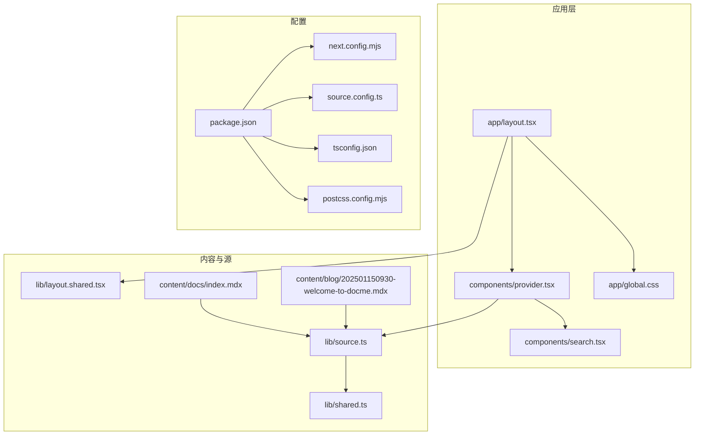
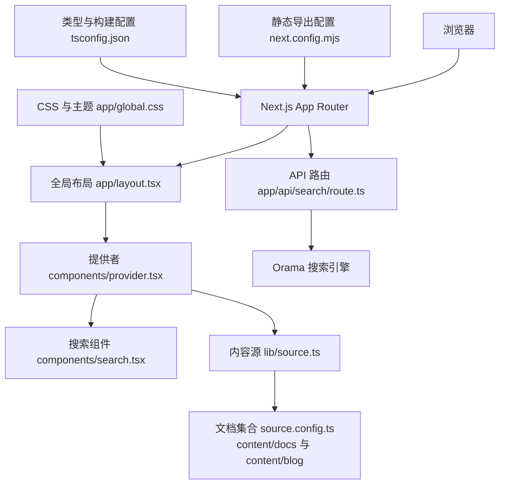
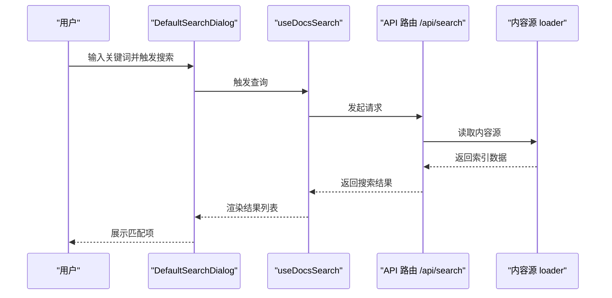
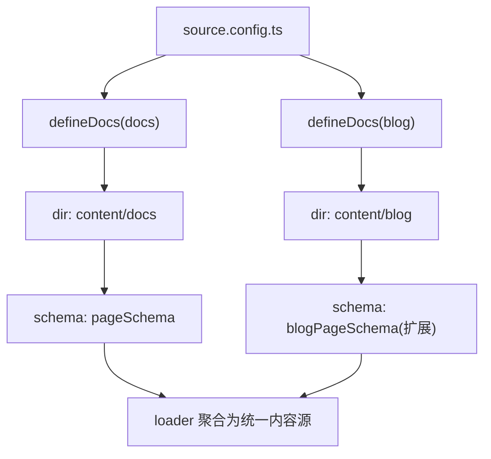
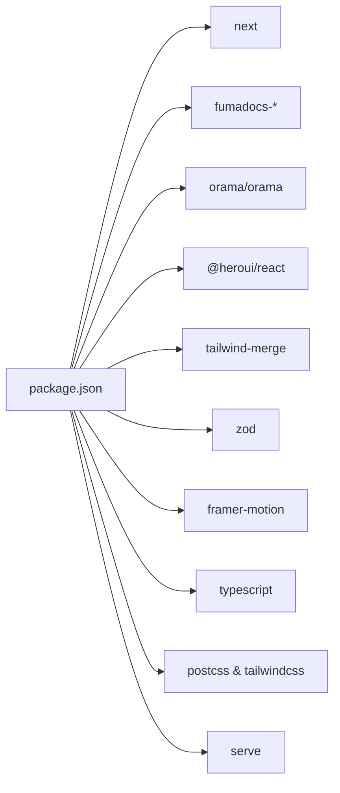

# 故障排除

<cite>
**本文引用的文件**
- [README.md](file://README.md)
- [package.json](file://package.json)
- [next.config.mjs](file://next.config.mjs)
- [source.config.ts](file://source.config.ts)
- [tsconfig.json](file://tsconfig.json)
- [postcss.config.mjs](file://postcss.config.mjs)
- [app/layout.tsx](file://app/layout.tsx)
- [components/provider.tsx](file://components/provider.tsx)
- [lib/layout.shared.tsx](file://lib/layout.shared.tsx)
- [app/api/search/route.ts](file://app/api/search/route.ts)
- [lib/source.ts](file://lib/source.ts)
- [lib/shared.ts](file://lib/shared.ts)
- [components/search.tsx](file://components/search.tsx)
- [app/global.css](file://app/global.css)
- [content/docs/index.mdx](file://content/docs/index.mdx)
- [content/blog/202501150930-welcome-to-docme.mdx](file://content/blog/202501150930-welcome-to-docme.mdx)
</cite>

## 目录
1. [简介](#简介)
2. [项目结构](#项目结构)
3. [核心组件](#核心组件)
4. [架构总览](#架构总览)
5. [详细组件分析](#详细组件分析)
6. [依赖分析](#依赖分析)
7. [性能考虑](#性能考虑)
8. [故障排除指南](#故障排除指南)
9. [结论](#结论)
10. [附录](#附录)

## 简介
本指南面向用户与开发者，提供针对该 Next.js 应用在安装、运行、构建、部署与日常维护过程中常见问题的系统化排查与修复建议。内容涵盖：
- 安装与运行问题
- 构建与导出错误
- 搜索与内容加载异常
- 浏览器兼容性与样式问题
- 网络与 CDN 相关问题
- 配置错误诊断与修正
- 日志与错误追踪方法
- 性能瓶颈与内存泄漏识别
- 社区支持与问题反馈渠道

## 项目结构
该项目采用 Next.js App Router 结构，并通过 Fumadocs 进行文档与 MDX 内容管理，同时使用静态导出（Static Export）以适配多端部署场景。关键目录与职责概览如下：
- app：页面与 API 路由、全局布局与样式
- components：UI 组件与提供者（Provider）
- lib：内容源适配、共享配置与布局选项
- content：MDX 文档与博客内容
- 配置文件：next.config.mjs、source.config.ts、tsconfig.json、postcss.config.mjs、package.json

图表来源
- [app/layout.tsx:1-13](file://app/layout.tsx#L1-L13)
- [components/provider.tsx:1-36](file://components/provider.tsx#L1-L36)
- [components/search.tsx:1-47](file://components/search.tsx#L1-L47)
- [app/global.css:1-285](file://app/global.css#L1-L285)
- [lib/source.ts:1-37](file://lib/source.ts#L1-L37)
- [lib/shared.ts:1-12](file://lib/shared.ts#L1-L12)
- [lib/layout.shared.tsx:1-36](file://lib/layout.shared.tsx#L1-L36)
- [content/docs/index.mdx:1-19](file://content/docs/index.mdx#L1-L19)
- [content/blog/202501150930-welcome-to-docme.mdx:1-42](file://content/blog/202501150930-welcome-to-docme.mdx#L1-L42)
- [package.json:1-39](file://package.json#L1-L39)
- [next.config.mjs:1-15](file://next.config.mjs#L1-L15)
- [source.config.ts:1-47](file://source.config.ts#L1-L47)
- [tsconfig.json:1-36](file://tsconfig.json#L1-L36)
- [postcss.config.mjs:1-8](file://postcss.config.mjs#L1-L8)

章节来源
- [README.md:1-48](file://README.md#L1-L48)
- [package.json:1-39](file://package.json#L1-L39)
- [next.config.mjs:1-15](file://next.config.mjs#L1-L15)
- [source.config.ts:1-47](file://source.config.ts#L1-L47)
- [tsconfig.json:1-36](file://tsconfig.json#L1-L36)
- [postcss.config.mjs:1-8](file://postcss.config.mjs#L1-L8)

## 核心组件
- 全局布局与主题提供者：负责根节点 HTML 属性、国际化、主题系统与搜索对话框注册。
- 搜索组件：本地静态搜索（Orama）与服务端搜索接口配合，实现快速检索。
- 内容源适配：基于 Fumadocs 的 loader 将 content/docs 与 content/blog 聚合为统一数据源。
- 静态导出配置：禁用图片优化、启用严格模式与静态导出，便于部署到静态托管平台。

章节来源
- [app/layout.tsx:1-13](file://app/layout.tsx#L1-L13)
- [components/provider.tsx:1-36](file://components/provider.tsx#L1-L36)
- [components/search.tsx:1-47](file://components/search.tsx#L1-L47)
- [app/api/search/route.ts:1-10](file://app/api/search/route.ts#L1-L10)
- [lib/source.ts:1-37](file://lib/source.ts#L1-L37)
- [next.config.mjs:1-15](file://next.config.mjs#L1-L15)

## 架构总览
应用采用“内容即数据”的架构：content/docs 与 content/blog 通过 source.config.ts 定义的文档集合，经由 lib/source.ts 的 loader 聚合为统一内容源；UI 层通过 provider 注入主题、国际化与搜索能力；App Router 负责页面渲染与 API 路由处理；静态导出配置确保可部署至任意静态托管。

图表来源
- [app/layout.tsx:1-13](file://app/layout.tsx#L1-L13)
- [components/provider.tsx:1-36](file://components/provider.tsx#L1-L36)
- [components/search.tsx:1-47](file://components/search.tsx#L1-L47)
- [lib/source.ts:1-37](file://lib/source.ts#L1-L37)
- [source.config.ts:1-47](file://source.config.ts#L1-L47)
- [app/api/search/route.ts:1-10](file://app/api/search/route.ts#L1-L10)
- [next.config.mjs:1-15](file://next.config.mjs#L1-L15)
- [tsconfig.json:1-36](file://tsconfig.json#L1-L36)
- [app/global.css:1-285](file://app/global.css#L1-L285)

## 详细组件分析

### 搜索与内容加载流程
- 客户端：DefaultSearchDialog 使用 useDocsSearch 初始化 Orama 并执行查询，列表展示搜索结果。
- 服务端：API 路由通过 createFromSource 从统一内容源生成静态搜索索引，禁用 revalidation 以保证一致性。
- 内容源：loader 将 docs 与 blog 集合转换为 Fumadocs 数据源，支持页面元信息与 Markdown 获取。

图表来源
- [components/search.tsx:1-47](file://components/search.tsx#L1-L47)
- [app/api/search/route.ts:1-10](file://app/api/search/route.ts#L1-L10)
- [lib/source.ts:1-37](file://lib/source.ts#L1-L37)

章节来源
- [components/search.tsx:1-47](file://components/search.tsx#L1-L47)
- [app/api/search/route.ts:1-10](file://app/api/search/route.ts#L1-L10)
- [lib/source.ts:1-37](file://lib/source.ts#L1-L37)

### 内容集合与 Schema 定义
- docs 与 blog 集合分别定义在 source.config.ts 中，支持自定义 frontmatter schema（如博客扩展字段）。
- includeProcessedMarkdown 开启后，可在客户端或服务端访问已处理的 Markdown 内容，便于 LLM 或渲染使用。

图表来源
- [source.config.ts:1-47](file://source.config.ts#L1-L47)
- [lib/source.ts:1-37](file://lib/source.ts#L1-L37)

章节来源
- [source.config.ts:1-47](file://source.config.ts#L1-L47)
- [lib/source.ts:1-37](file://lib/source.ts#L1-L37)

### 静态导出与图片优化
- output: 'export' 启用静态导出，适合部署到 Vercel、Netlify、GitHub Pages 等静态托管。
- images.unoptimized: true 禁用 next/image 优化，避免在静态导出时出现图片路径或构建问题。

章节来源
- [next.config.mjs:1-15](file://next.config.mjs#L1-L15)

## 依赖分析
- 运行时依赖：Next.js、Fumadocs 生态（core/ui/mdx）、Heroui、Tailwind Merge、Zod、Framer Motion、Orama。
- 开发依赖：PostCSS、TailwindCSS v4、TypeScript、serve（静态服务器）等。
- 关键脚本：dev/build/start/types:check/postinstall，分别用于开发、构建、启动静态服务与类型检查。

图表来源
- [package.json:1-39](file://package.json#L1-L39)

章节来源
- [package.json:1-39](file://package.json#L1-L39)

## 性能考虑
- 静态导出与严格模式：减少运行时开销，提升首屏性能。
- 图片优化关闭：避免在静态导出场景下的额外处理成本。
- 搜索策略：客户端静态搜索与服务端索引结合，降低请求延迟。
- CSS 与主题：通过 CSS 变量与 Tailwind 工具类减少运行时样式计算。

章节来源
- [next.config.mjs:1-15](file://next.config.mjs#L1-L15)
- [app/global.css:1-285](file://app/global.css#L1-L285)

## 故障排除指南

### 一、安装与运行问题
- 症状：安装依赖失败或 Node 版本不兼容
  - 排查要点：确认 Node.js 版本满足 Next.js 16 要求；优先使用 pnpm/yarn/npm 之一，避免混合安装导致锁文件冲突。
  - 处理建议：清理缓存与 node_modules 后重装；若使用 pnpm，确保版本较新。
- 症状：开发服务器无法启动或端口占用
  - 排查要点：检查端口是否被占用；确认环境变量与代理设置。
  - 处理建议：更换端口或释放占用进程；使用官方脚本启动 dev。
- 症状：热更新无效或页面不刷新
  - 排查要点：检查 TypeScript 类型检查是否阻塞；确认 tsconfig 与 bundler 分辨策略。
  - 处理建议：先执行类型检查修复后再重启开发服务器。

章节来源
- [README.md:8-18](file://README.md#L8-L18)
- [package.json:5-11](file://package.json#L5-L11)
- [tsconfig.json:1-36](file://tsconfig.json#L1-L36)

### 二、构建与部署问题
- 症状：构建失败或导出产物缺失
  - 排查要点：确认 output: 'export' 已启用；检查 next.config.mjs 是否正确包裹 withMDX。
  - 处理建议：重新执行构建脚本；确保所有页面与 API 路由可静态化。
- 症状：静态托管平台 404 或资源路径错误
  - 排查要点：检查静态资源路径与基础路径；确认 CDN 或子路径部署配置。
  - 处理建议：在静态托管平台设置正确的基础路径；核对 public 与静态资源映射。

章节来源
- [next.config.mjs:1-15](file://next.config.mjs#L1-L15)
- [package.json:6-8](file://package.json#L6-L8)

### 三、搜索与内容加载异常
- 症状：搜索无结果或报错
  - 排查要点：确认 API 路由 /api/search 正常返回；检查 Orama 初始化参数与语言设置。
  - 处理建议：验证 source 配置与内容集合；确保 includeProcessedMarkdown 已开启以便检索。
- 症状：页面空白或 hydration 异常
  - 排查要点：检查 Provider 包裹与国际化配置；确认 SSR/Hydration 与客户端组件边界。
  - 处理建议：移除不必要的服务端逻辑；确保 use client 正确标注客户端组件。

章节来源
- [app/api/search/route.ts:1-10](file://app/api/search/route.ts#L1-L10)
- [components/search.tsx:1-47](file://components/search.tsx#L1-L47)
- [components/provider.tsx:1-36](file://components/provider.tsx#L1-L36)
- [lib/source.ts:1-37](file://lib/source.ts#L1-L37)

### 四、浏览器兼容性问题
- 症状：样式错乱或主题不生效
  - 排查要点：检查 CSS 变量与 Tailwind v4 的兼容性；确认浏览器对 CSS 自定义属性与 backdrop-filter 的支持。
  - 处理建议：降级或补充 polyfill；在全局样式中增加必要回退。
- 症状：动画卡顿或闪烁
  - 排查要点：检查 Framer Motion 与 CSS 动画的硬件加速；确认主线程阻塞。
  - 处理建议：减少复杂动画；拆分大组件；使用 requestAnimationFrame 优化。

章节来源
- [app/global.css:1-285](file://app/global.css#L1-L285)
- [components/apple-animations.tsx:1-200](file://components/apple-animations.tsx#L1-L200)

### 五、网络与 CDN 相关问题
- 症状：CDN 加载失败或资源跨域
  - 排查要点：检查 CDN 域名与 CORS 设置；确认静态导出路径与 CDN 映射一致。
  - 处理建议：使用相对路径或绝对路径；在托管平台配置正确的缓存与安全头。
- 症状：HTTPS 与混合内容警告
  - 排查要点：确认所有静态资源使用 HTTPS；避免内联 HTTP 资源。
  - 处理建议：统一使用 HTTPS；在构建前替换资源链接。

章节来源
- [next.config.mjs:9-11](file://next.config.mjs#L9-L11)
- [lib/shared.ts:1-12](file://lib/shared.ts#L1-L12)

### 六、配置错误诊断与修正
- 症状：类型检查失败或编译错误
  - 排查要点：检查 tsconfig 的 moduleResolution、bundler 与 jsx 设置；确认路径别名与插件。
  - 处理建议：按需调整 compilerOptions；确保 include/exclude 覆盖到目标文件。
- 症状：PostCSS/Tailwind 未生效
  - 排查要点：确认 postcss.config.mjs 引入 tailwind 插件；检查 Tailwind v4 兼容性。
  - 处理建议：升级到推荐版本；确保 Tailwind 指令与导入顺序正确。

章节来源
- [tsconfig.json:1-36](file://tsconfig.json#L1-L36)
- [postcss.config.mjs:1-8](file://postcss.config.mjs#L1-L8)

### 七、日志分析与错误追踪
- 开发期：利用 Next.js DevTools 与浏览器控制台定位组件渲染与状态变化；关注 hydration 与 SSR 相关警告。
- 构建期：查看构建日志中的模块解析、类型生成与静态导出阶段输出；关注 Orama 索引生成与内容聚合阶段。
- 运行期：在生产环境开启轻量级日志记录（如关键事件埋点），避免泄露敏感信息；使用浏览器性能面板分析长任务与内存峰值。

章节来源
- [package.json:9-10](file://package.json#L9-L10)

### 八、性能瓶颈与内存泄漏识别
- 症状：页面卡顿或内存持续增长
  - 排查要点：使用浏览器性能面板与内存快照；检查大型组件重渲染、未释放的订阅与定时器。
  - 处理建议：拆分组件、使用 memo 与 lazy；及时清理副作用；避免在渲染期间进行昂贵计算。
- 症状：搜索响应慢
  - 排查要点：检查 Orama 索引大小与语言设置；确认查询复杂度与结果集上限。
  - 处理建议：预分词与降噪；限制返回条数；在服务端预生成索引。

章节来源
- [components/search.tsx:17-23](file://components/search.tsx#L17-L23)
- [app/api/search/route.ts:6-9](file://app/api/search/route.ts#L6-L9)

### 九、社区支持与问题报告
- 官方资源：Next.js 文档、Fumadocs 文档与社区讨论区。
- 问题报告：在相关仓库提交 Issue，附带最小可复现示例、环境信息与日志片段。
- 建议模板：问题简述、复现步骤、期望行为、实际行为、环境信息（Node/OS/Browser）、相关配置片段路径。

章节来源
- [README.md:41-48](file://README.md#L41-L48)

## 结论
本指南围绕安装、运行、构建、搜索、样式、网络与配置等维度提供了系统化的排查思路与修复建议。建议在开发与发布流程中遵循“先类型检查、再构建导出、后部署验证”的原则，并结合浏览器与构建日志进行快速定位。对于性能问题，应从资源体积、渲染开销与搜索策略三方面入手优化。

## 附录

### 常见问题速查表
- 安装失败：检查 Node 版本与包管理器；清理缓存后重试。
- 开发服务器异常：更换端口或释放占用；确认代理与环境变量。
- 构建失败：确认静态导出配置与 API 路由可静态化。
- 搜索无结果：检查 API 路由与 Orama 初始化；确保内容已聚合。
- 样式异常：检查 CSS 变量与浏览器兼容性；补充回退方案。
- CDN 404：核对路径与映射；统一使用 HTTPS。
- 类型错误：调整 tsconfig；确保 include/exclude 覆盖目标文件。
- 性能问题：拆分组件、减少重渲染、优化搜索与资源体积。

### 关键文件定位参考
- 开发与构建脚本：[package.json:5-11](file://package.json#L5-L11)
- 静态导出与图片优化：[next.config.mjs:6-11](file://next.config.mjs#L6-L11)
- 内容集合与 Schema：[source.config.ts:16-40](file://source.config.ts#L16-L40)
- 内容源适配：[lib/source.ts:6-10](file://lib/source.ts#L6-L10)
- 搜索 API 与客户端：[app/api/search/route.ts:1-10](file://app/api/search/route.ts#L1-L10)、[components/search.tsx:1-47](file://components/search.tsx#L1-L47)
- 全局样式与主题：[app/global.css:1-285](file://app/global.css#L1-L285)
- 布局与提供者：[app/layout.tsx:1-13](file://app/layout.tsx#L1-L13)、[components/provider.tsx:1-36](file://components/provider.tsx#L1-L36)
- 类型与构建配置：[tsconfig.json:1-36](file://tsconfig.json#L1-L36)
- PostCSS 配置：[postcss.config.mjs:1-8](file://postcss.config.mjs#L1-L8)