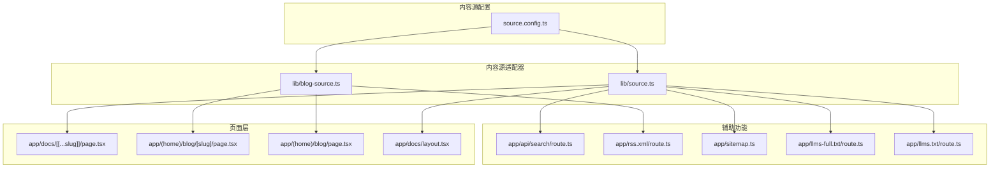
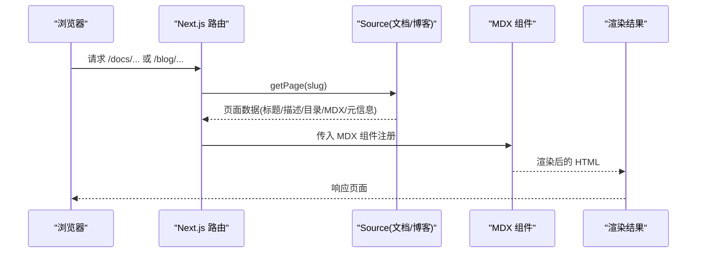
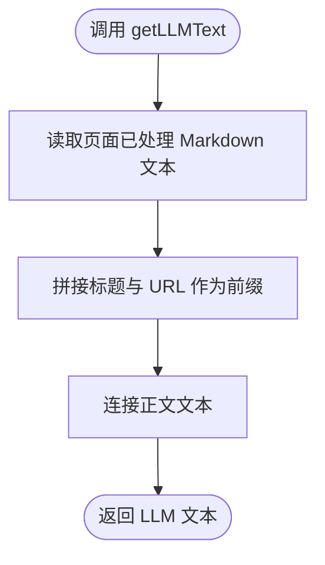
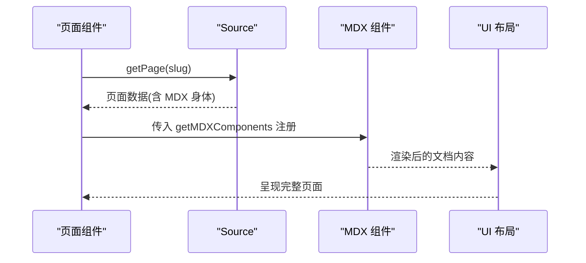
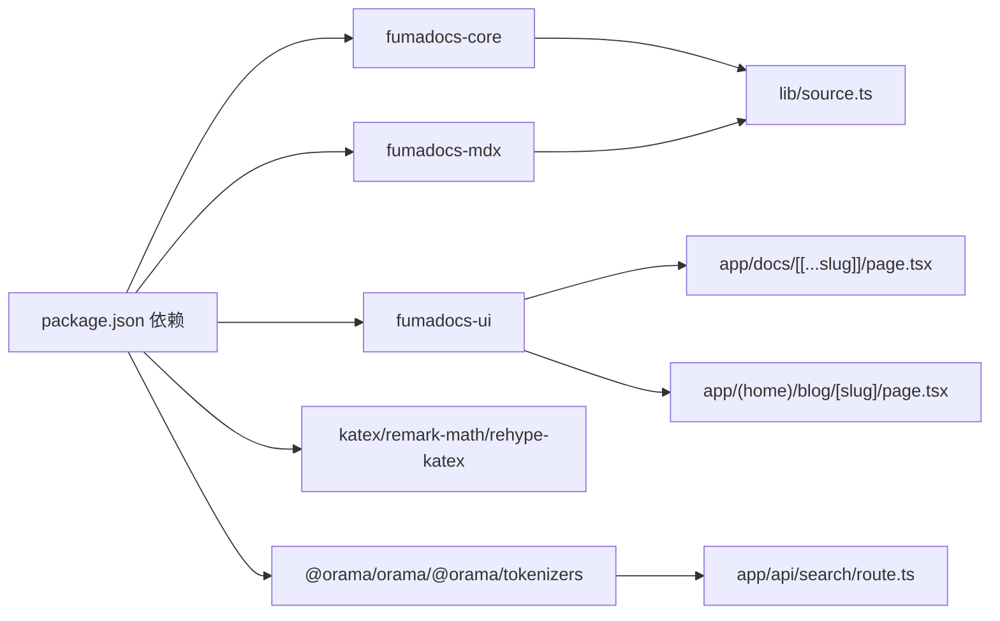

# 内容源适配器

<cite>
**本文引用的文件**
- [source.config.ts](file://source.config.ts)
- [lib/source.ts](file://lib/source.ts)
- [lib/blog-source.ts](file://lib/blog-source.ts)
- [lib/shared.ts](file://lib/shared.ts)
- [components/mdx.tsx](file://components/mdx.tsx)
- [app/docs/layout.tsx](file://app/docs/layout.tsx)
- [app/docs/[[...slug]]/page.tsx](file://app/docs/[[...slug]]/page.tsx)
- [app/(home)/blog/[slug]/page.tsx](file://app/(home)/blog/[slug]/page.tsx)
- [app/(home)/blog/page.tsx](file://app/(home)/blog/page.tsx)
- [app/api/search/route.ts](file://app/api/search/route.ts)
- [app/llms-full.txt/route.ts](file://app/llms-full.txt/route.ts)
- [app/llms.txt/route.ts](file://app/llms.txt/route.ts)
- [app/rss.xml/route.ts](file://app/rss.xml/route.ts)
- [app/sitemap.ts](file://app/sitemap.ts)
- [package.json](file://package.json)
</cite>

## 目录
1. [引言](#引言)
2. [项目结构](#项目结构)
3. [核心组件](#核心组件)
4. [架构总览](#架构总览)
5. [详细组件分析](#详细组件分析)
6. [依赖分析](#依赖分析)
7. [性能考虑](#性能考虑)
8. [故障排查指南](#故障排查指南)
9. [结论](#结论)
10. [附录](#附录)

## 引言
本文件系统化阐述 DocMe 的“内容源适配器”模式，围绕统一内容访问接口、MDX 加载/解析/渲染流程、内容源配置的灵活性与扩展性、文档与博客两类内容的适配器差异、缓存与性能优化、版本管理与增量更新方案、以及与 Fumadocs 生态的集成方式进行深入说明，并提供自定义内容源适配器的开发指南与最佳实践。

## 项目结构
DocMe 基于 Next.js 与 Fumadocs 生态，采用“内容源适配器 + 页面层渲染”的分层设计：
- 内容源配置：通过 source.config.ts 定义文档与博客两类内容集合及其校验 Schema、MDX 插件等。
- 内容源适配器：lib/source.ts 与 lib/blog-source.ts 将内容集合封装为可被 UI 层使用的统一 Source 接口。
- 页面层：app/docs/[[...slug]]/page.tsx 与 app/(home)/blog/[slug]/page.tsx 使用统一的 Source API 渲染 MDX。
- 辅助路由：搜索索引生成、RSS、站点地图、LLM 文本导出等均基于同一 Source 接口实现。

图表来源
- [source.config.ts:1-56](file://source.config.ts#L1-L56)
- [lib/source.ts:1-37](file://lib/source.ts#L1-L37)
- [lib/blog-source.ts:1-10](file://lib/blog-source.ts#L1-L10)
- [app/docs/[[...slug]]/page.tsx:1-69](file://app/docs/[[...slug]]/page.tsx#L1-L69)
- [app/(home)/blog/[slug]/page.tsx:1-105](file://app/(home)/blog/[slug]/page.tsx#L1-L105)
- [app/api/search/route.ts:1-11](file://app/api/search/route.ts#L1-L11)
- [app/rss.xml/route.ts:1-48](file://app/rss.xml/route.ts#L1-L48)
- [app/sitemap.ts:1-25](file://app/sitemap.ts#L1-L25)
- [app/llms-full.txt/route.ts:1-10](file://app/llms-full.txt/route.ts#L1-L10)
- [app/llms.txt/route.ts:1-8](file://app/llms.txt/route.ts#L1-L8)

章节来源
- [source.config.ts:1-56](file://source.config.ts#L1-L56)
- [lib/source.ts:1-37](file://lib/source.ts#L1-L37)
- [lib/blog-source.ts:1-10](file://lib/blog-source.ts#L1-L10)
- [app/docs/[[...slug]]/page.tsx:1-69](file://app/docs/[[...slug]]/page.tsx#L1-L69)
- [app/(home)/blog/[slug]/page.tsx:1-105](file://app/(home)/blog/[slug]/page.tsx#L1-L105)

## 核心组件
- 内容源配置（source.config.ts）
  - 定义文档与博客两类内容集合，分别指定目录、Schema 校验与后处理选项（如是否包含已处理的 Markdown 文本）。
  - 配置全局 MDX 插件（如数学公式渲染），并通过 defineConfig 汇总。
- 文档内容源适配器（lib/source.ts）
  - 将 docs 集合转换为 Fumadocs Source，设置 baseUrl、图片与 Markdown 下载路径常量，提供页面元数据与 LLM 文本拼装能力。
- 博客内容源适配器（lib/blog-source.ts）
  - 将 blog 集合转换为 Fumadocs Source，并通过 slug 插件将页面 URL 由数据字段驱动，便于稳定链接。
- MDX 组件注册（components/mdx.tsx）
  - 注册默认 MDX 组件与自定义组件（如 Mermaid），供页面层按需注入。
- 页面层（app/docs/[[...slug]]/page.tsx 与 app/(home)/blog/[slug]/page.tsx）
  - 通过 source.getPage 获取页面，读取标题、描述、目录、最后更新时间、MDX 身体内容等，渲染为最终页面。
- 辅助功能路由
  - 搜索索引生成、RSS 输出、站点地图生成、LLM 文本导出等均基于统一 Source 接口实现。

章节来源
- [source.config.ts:19-47](file://source.config.ts#L19-L47)
- [lib/source.ts:6-10](file://lib/source.ts#L6-L10)
- [lib/blog-source.ts:5-9](file://lib/blog-source.ts#L5-L9)
- [components/mdx.tsx:5-11](file://components/mdx.tsx#L5-L11)
- [app/docs/[[...slug]]/page.tsx:16-49](file://app/docs/[[...slug]]/page.tsx#L16-L49)
- [app/(home)/blog/[slug]/page.tsx:9-68](file://app/(home)/blog/[slug]/page.tsx#L9-L68)

## 架构总览
内容从“配置 → 适配器 → 页面层 → 渲染”的单向数据流，确保不同内容类型（文档、博客）共享统一的 Source API，降低耦合并提升可维护性。

图表来源
- [lib/source.ts:6-10](file://lib/source.ts#L6-L10)
- [lib/blog-source.ts:5-9](file://lib/blog-source.ts#L5-L9)
- [app/docs/[[...slug]]/page.tsx:16-49](file://app/docs/[[...slug]]/page.tsx#L16-L49)
- [app/(home)/blog/[slug]/page.tsx:9-68](file://app/(home)/blog/[slug]/page.tsx#L9-L68)

## 详细组件分析

### 内容源配置与 Schema 设计
- 文档集合（docs）
  - 目录：content/docs
  - Schema：在通用 Schema 基础上扩展 lastModified 字段，支持最后修改时间。
  - 后处理：includeProcessedMarkdown=true，便于后续 LLM 文本拼装。
- 博客集合（blog）
  - 目录：content/blog
  - Schema：扩展 id、author、date、tags、cover 等字段，满足博客文章元信息需求。
- 全局配置
  - 插件：启用 last-modified 插件；MDX 插件：启用数学公式与 KaTeX 渲染。

章节来源
- [source.config.ts:23-47](file://source.config.ts#L23-L47)
- [source.config.ts:50-55](file://source.config.ts#L50-L55)

### 文档内容源适配器（Docs Source）
- 统一入口
  - 通过 loader 创建 source，baseUrl 指向 /docs，内部使用 docs.toFumadocsSource()。
- 资源路径工具
  - getPageImage：根据页面 slugs 生成 OGP 图片下载路径。
  - getPageMarkdownUrl：根据页面 slugs 生成 Markdown 下载路径。
- LLM 文本拼装
  - getLLMText：读取已处理 Markdown 文本，拼接标题与 URL，形成 LLM 输入文本。

图表来源
- [lib/source.ts:30-36](file://lib/source.ts#L30-L36)

章节来源
- [lib/source.ts:6-28](file://lib/source.ts#L6-L28)
- [lib/source.ts:30-36](file://lib/source.ts#L30-L36)

### 博客内容源适配器（Blog Source）
- 统一入口
  - 通过 loader 创建 blogSource，baseUrl 指向 /blog。
- Slug 插件
  - 使用 slugsPlugin 与 slugsFromData('id')，将页面 URL 由数据中的 id 字段决定，保证链接稳定性与可预测性。
- 页面渲染
  - 支持标签、作者、日期、阅读时长等元信息展示；提供列表页与详情页。

章节来源
- [lib/blog-source.ts:5-9](file://lib/blog-source.ts#L5-L9)
- [app/(home)/blog/[slug]/page.tsx:9-68](file://app/(home)/blog/[slug]/page.tsx#L9-L68)
- [app/(home)/blog/page.tsx:11-92](file://app/(home)/blog/page.tsx#L11-L92)

### MDX 加载、解析与渲染流程
- 组件注册
  - getMDXComponents 合并默认组件与自定义组件（如 Mermaid），并允许注入相对链接处理器。
- 页面渲染
  - 文档页：从 source.getPage 获取页面，读取 toc、full、lastModified、title、description 等，渲染 DocsPage 与 DocsBody。
  - 博客页：从 blogSource.getPage 获取页面，渲染文章头部、标签、元信息与正文。
- 相对链接
  - 文档页通过 createRelativeLink(source, page) 注入 a 标签的链接处理器，确保站内跳转正确。

图表来源
- [app/docs/[[...slug]]/page.tsx:16-49](file://app/docs/[[...slug]]/page.tsx#L16-L49)
- [app/(home)/blog/[slug]/page.tsx:9-68](file://app/(home)/blog/[slug]/page.tsx#L9-L68)
- [components/mdx.tsx:5-11](file://components/mdx.tsx#L5-L11)

章节来源
- [components/mdx.tsx:5-11](file://components/mdx.tsx#L5-L11)
- [app/docs/[[...slug]]/page.tsx:16-49](file://app/docs/[[...slug]]/page.tsx#L16-L49)
- [app/(home)/blog/[slug]/page.tsx:9-68](file://app/(home)/blog/[slug]/page.tsx#L9-L68)

### 内容源配置的灵活性与扩展性
- 多集合并行
  - docs 与 blog 各自独立配置，互不干扰，便于扩展更多内容类型（如教程、FAQ）。
- Schema 可定制
  - 通过 extend 基于通用 Schema 扩展字段，满足不同内容类型的元信息需求。
- 插件可插拔
  - MDX 插件集中配置，新增插件只需在 defineConfig 中维护，不影响各适配器。
- 路径与资源
  - 通过 shared 常量集中管理 baseUrl、图片与 Markdown 下载路径，便于统一调整。

章节来源
- [source.config.ts:8-21](file://source.config.ts#L8-L21)
- [source.config.ts:36-47](file://source.config.ts#L36-L47)
- [lib/shared.ts:2-4](file://lib/shared.ts#L2-L4)
- [lib/source.ts:12-28](file://lib/source.ts#L12-L28)

### 不同类型内容（文档、博客）的适配器差异
- 文档
  - 使用 docs.toFumadocsSource()，提供 lastModified、toc、full 等文档专用元信息。
  - 提供 Markdown 下载与 LLM 文本导出能力。
- 博客
  - 使用 blog.toFumadocsSource()，并启用基于 id 的 slug 插件，保证 URL 稳定。
  - 支持 tags、author、date 等博客元信息，列表页按日期排序展示。

章节来源
- [lib/source.ts:6-10](file://lib/source.ts#L6-L10)
- [lib/blog-source.ts:5-9](file://lib/blog-source.ts#L5-L9)
- [app/(home)/blog/page.tsx:14-19](file://app/(home)/blog/page.tsx#L14-L19)

### 内容缓存机制与性能优化策略
- 搜索索引
  - 使用 createFromSource(source, { language: 'mandarin', tokenizer: createTokenizer() }) 生成中文分词的静态搜索索引，revalidate=false，避免重复计算。
- LLM 文本导出
  - app/llms-full.txt/route.ts 并发拉取所有页面的 LLM 文本，Promise.all 并行处理，减少总耗时。
- 站点地图与 RSS
  - sitemap.ts 与 rss.xml/route.ts 均基于 Source.getPages() 一次性生成，避免重复扫描。
- MDX 组件复用
  - getMDXComponents 在组件层统一注册，减少重复配置开销。

章节来源
- [app/api/search/route.ts:7-11](file://app/api/search/route.ts#L7-L11)
- [app/llms-full.txt/route.ts:5-10](file://app/llms-full.txt/route.ts#L5-L10)
- [app/sitemap.ts:5-25](file://app/sitemap.ts#L5-L25)
- [app/rss.xml/route.ts:5-39](file://app/rss.xml/route.ts#L5-L39)
- [components/mdx.tsx:5-11](file://components/mdx.tsx#L5-L11)

### 内容版本管理与增量更新方案
- 版本管理
  - 通过 Git 仓库管理 content/docs 与 content/blog，结合 GitHub 链接在页面中直接指向具体文件与分支。
- 增量更新
  - 利用 lastModified 字段与 last-modified 插件，配合页面层的 lastUpdate 展示，实现“最后更新时间”的增量感知。
  - 对于搜索索引与 LLM 文本导出，当前实现为全量生成；若需要增量，可在路由层引入基于时间戳或文件变更的 revalidation 策略。

章节来源
- [source.config.ts:50-55](file://source.config.ts#L50-L55)
- [app/docs/[[...slug]]/page.tsx:28](file://app/docs/[[...slug]]/page.tsx#L28)
- [lib/shared.ts:7-11](file://lib/shared.ts#L7-L11)

### 自定义内容源适配器开发指南与最佳实践
- 步骤
  - 在 source.config.ts 中定义新集合（dir、schema、postprocess），必要时扩展 Schema。
  - 在 lib/ 下新增适配器文件，使用 loader 创建 source，设置 baseUrl 与 plugins。
  - 在页面层导入适配器并调用 getPage/getPages，按需渲染。
  - 如需特殊资源路径，参考 shared 常量集中管理。
- 最佳实践
  - 保持 baseUrl 与目录结构一致，避免深层嵌套导致路径复杂。
  - 使用统一的 MDX 组件注册，确保跨页面一致性。
  - 对大体量内容采用并发处理（如 Promise.all）与静态参数生成（generateStaticParams）以提升性能。
  - 对搜索与导出类路由设置合理的 revalidate 策略，平衡新鲜度与性能。

章节来源
- [source.config.ts:23-47](file://source.config.ts#L23-L47)
- [lib/source.ts:6-10](file://lib/source.ts#L6-L10)
- [app/docs/[[...slug]]/page.tsx:52-54](file://app/docs/[[...slug]]/page.tsx#L52-L54)

### 与 Fumadocs 生态系统的集成
- 配置与集合
  - 使用 fumadocs-mdx/config 的 defineDocs 与 defineConfig，结合 fumadocs-core/source/loader 实现内容源适配。
- UI 布局
  - 文档布局使用 fumadocs-ui/layouts/docs，博客与首页使用自定义布局组件。
- MDX 渲染
  - 通过 fumadocs-ui/mdx 提供默认组件，结合自定义组件（Mermaid）增强渲染能力。
- 搜索与索引
  - 使用 fumadocs-core/search/server 的 createFromSource 生成搜索索引，支持中文分词。
- RSS 与站点地图
  - 基于 Source.getPages() 生成标准格式输出，便于 SEO 与订阅。

章节来源
- [package.json:18-21](file://package.json#L18-L21)
- [app/docs/layout.tsx:1-14](file://app/docs/layout.tsx#L1-L14)
- [components/mdx.tsx:1](file://components/mdx.tsx#L1)
- [app/api/search/route.ts:2](file://app/api/search/route.ts#L2)

## 依赖分析
- 运行时依赖
  - fumadocs-core、fumadocs-mdx、fumadocs-ui：内容源、MDX 处理与 UI 布局。
  - katex、remark-math、rehype-katex：数学公式渲染。
  - @orama/orama、@orama/tokenizers：全文搜索与中文分词。
- 构建与脚本
  - next、fumadocs-mdx：Next.js 与 MDX 类型生成。
- 项目内依赖
  - lib/source.ts 与 lib/blog-source.ts 依赖 collections/server 生成的 docs/blog 集合。
  - 页面层依赖 lib/source 与 lib/blog-source 提供的统一 Source API。

图表来源
- [package.json:12-31](file://package.json#L12-L31)
- [lib/source.ts:1](file://lib/source.ts#L1)
- [app/docs/[[...slug]]/page.tsx:1](file://app/docs/[[...slug]]/page.tsx#L1)
- [app/(home)/blog/[slug]/page.tsx:1](file://app/(home)/blog/[slug]/page.tsx#L1)
- [app/api/search/route.ts:1](file://app/api/search/route.ts#L1)

章节来源
- [package.json:12-31](file://package.json#L12-L31)

## 性能考虑
- 并发拉取
  - LLM 文本导出使用 Promise.all 并行处理页面，显著缩短响应时间。
- 静态参数生成
  - 文档页通过 generateStaticParams 预渲染静态路由，减少运行时计算。
- 搜索索引
  - 使用中文分词器与静态索引生成，避免每次请求都进行昂贵的分词与索引构建。
- 资源路径
  - 图片与 Markdown 下载路径集中管理，减少路径拼接错误与重复逻辑。

章节来源
- [app/llms-full.txt/route.ts:5-10](file://app/llms-full.txt/route.ts#L5-L10)
- [app/docs/[[...slug]]/page.tsx:52-54](file://app/docs/[[...slug]]/page.tsx#L52-L54)
- [app/api/search/route.ts:7-11](file://app/api/search/route.ts#L7-L11)
- [lib/shared.ts:2-4](file://lib/shared.ts#L2-L4)

## 故障排查指南
- 页面未找到
  - 当 source.getPage(slug) 返回空时，页面会触发 notFound()。检查 slug 是否正确、内容文件是否存在、baseUrl 与路径是否匹配。
- MDX 组件缺失
  - 若自定义组件未生效，确认 getMDXComponents 是否正确合并默认组件与自定义组件，并在页面渲染时传入。
- 搜索索引为空
  - 确认 createFromSource 的 source 参数正确、语言与分词器配置无误，且路由返回的是静态索引。
- RSS 内容异常
  - 检查 blogSource.getPages() 排序逻辑与日期字段，确保日期字符串可被正确解析。
- LLM 文本导出不完整
  - 确认 docs 的 postprocess.includeProcessedMarkdown 已启用，且页面存在已处理 Markdown 文本。

章节来源
- [app/docs/[[...slug]]/page.tsx:18-19](file://app/docs/[[...slug]]/page.tsx#L18-L19)
- [components/mdx.tsx:5-11](file://components/mdx.tsx#L5-L11)
- [app/api/search/route.ts:7-11](file://app/api/search/route.ts#L7-L11)
- [app/rss.xml/route.ts:6-10](file://app/rss.xml/route.ts#L6-L10)
- [lib/source.ts:28-36](file://lib/source.ts#L28-L36)

## 结论
DocMe 的内容源适配器模式通过统一的 Source API 将文档与博客两类内容整合到一致的访问与渲染流程中，借助 Fumadocs 生态实现了强大的 MDX 渲染、搜索、RSS、站点地图与 LLM 导出能力。该模式具备良好的扩展性与可维护性，适合进一步拓展更多内容类型与功能模块。

## 附录
- 关键实现路径
  - 内容源配置：[source.config.ts:1-56](file://source.config.ts#L1-L56)
  - 文档适配器：[lib/source.ts:1-37](file://lib/source.ts#L1-L37)
  - 博客适配器：[lib/blog-source.ts:1-10](file://lib/blog-source.ts#L1-L10)
  - 文档页面：[app/docs/[[...slug]]/page.tsx:1-69](file://app/docs/[[...slug]]/page.tsx#L1-L69)
  - 博客页面：[app/(home)/blog/[slug]/page.tsx:1-105](file://app/(home)/blog/[slug]/page.tsx#L1-L105)
  - 搜索索引：[app/api/search/route.ts:1-11](file://app/api/search/route.ts#L1-L11)
  - LLM 导出：[app/llms-full.txt/route.ts:1-10](file://app/llms-full.txt/route.ts#L1-L10)、[app/llms.txt/route.ts:1-8](file://app/llms.txt/route.ts#L1-L8)
  - RSS：[app/rss.xml/route.ts:1-48](file://app/rss.xml/route.ts#L1-L48)
  - 站点地图：[app/sitemap.ts:1-25](file://app/sitemap.ts#L1-L25)