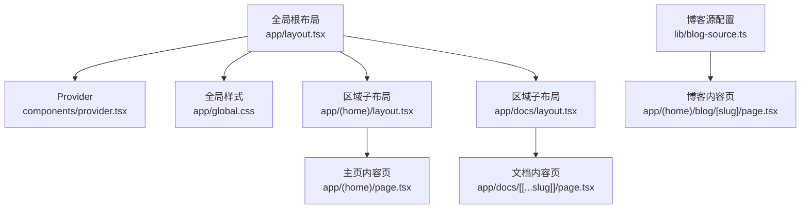
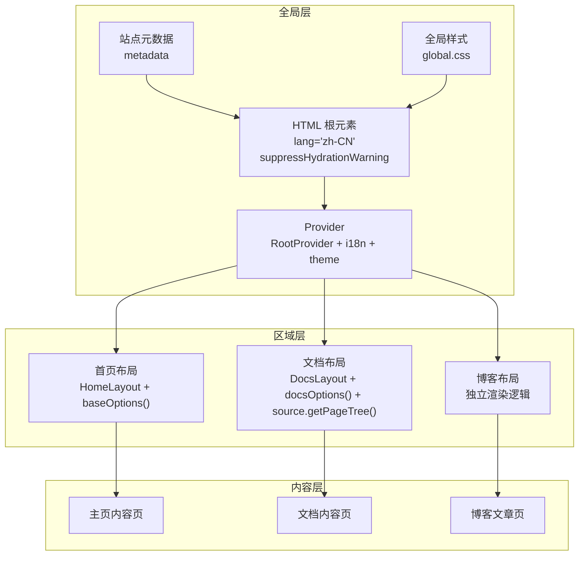
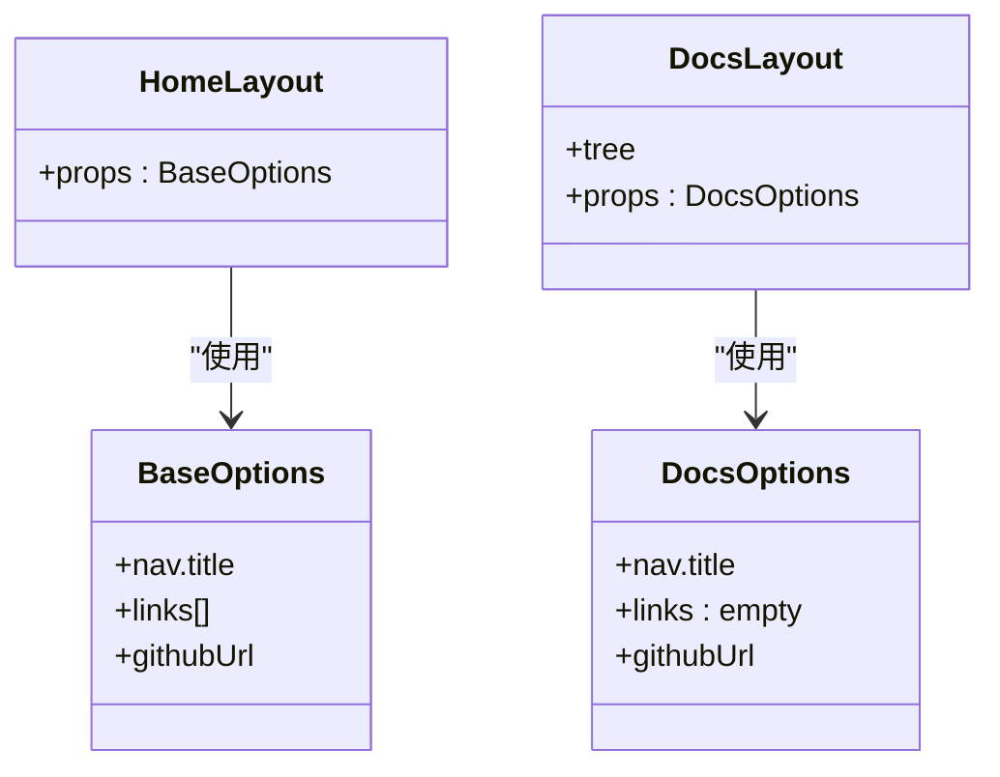
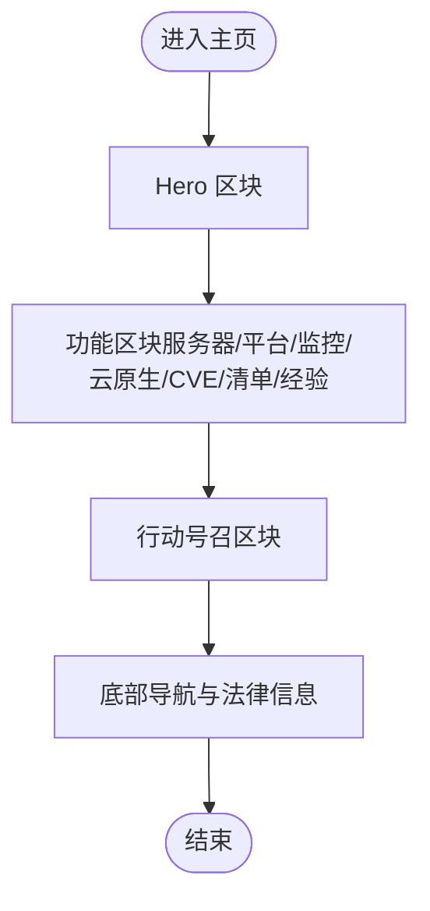
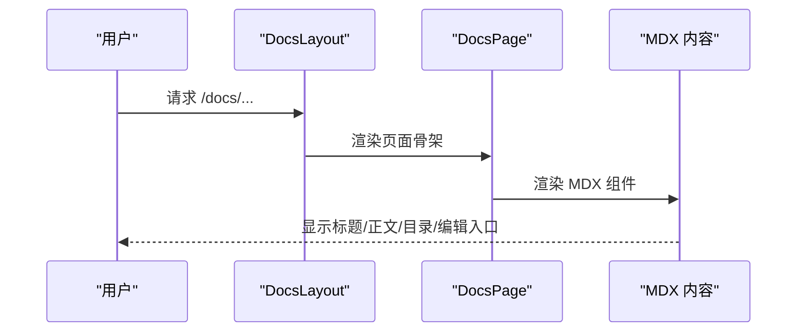
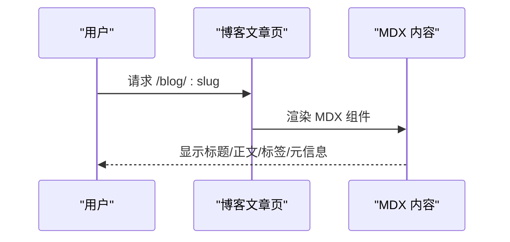
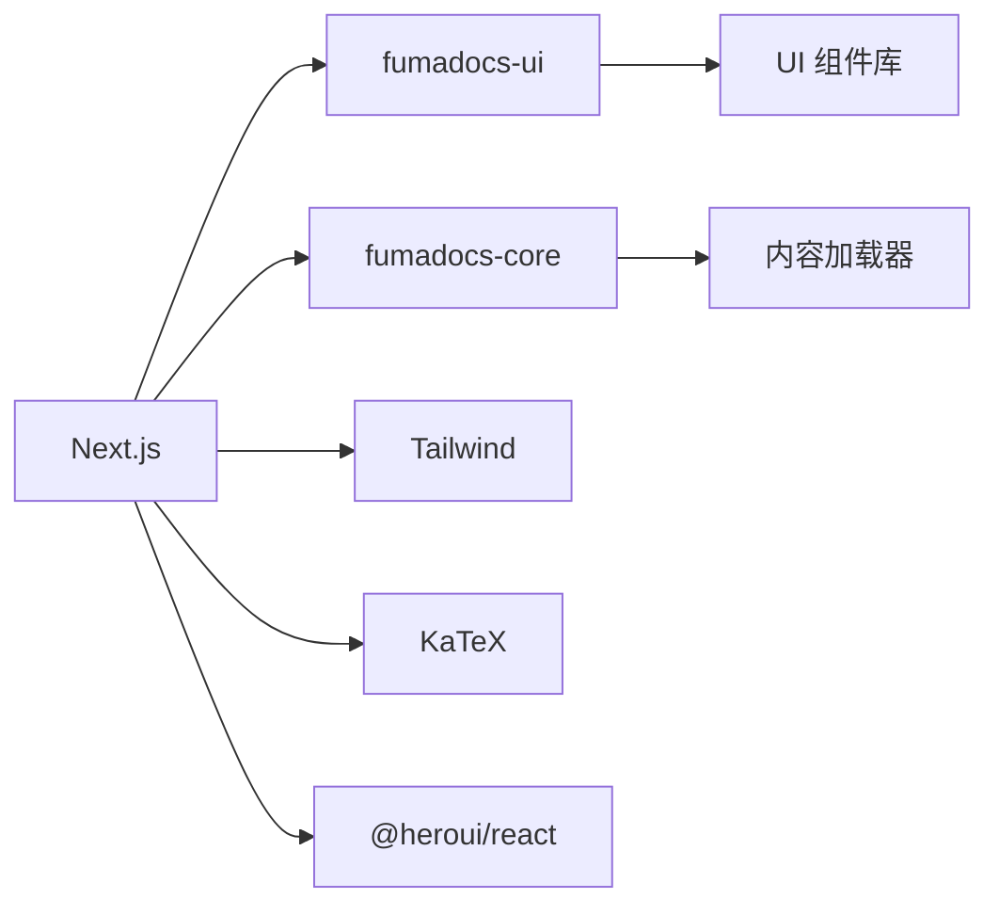

# 布局系统

<cite>
**本文引用的文件**
- [app/layout.tsx](file://app/layout.tsx)
- [app/(home)/layout.tsx](file://app/(home)/layout.tsx)
- [app/docs/layout.tsx](file://app/docs/layout.tsx)
- [lib/layout.shared.tsx](file://lib/layout.shared.tsx)
- [lib/shared.ts](file://lib/shared.ts)
- [components/provider.tsx](file://components/provider.tsx)
- [app/global.css](file://app/global.css)
- [app/(home)/page.tsx](file://app/(home)/page.tsx)
- [app/docs/[[...slug]]/page.tsx](file://app/docs/[[...slug]]/page.tsx)
- [components/footer.tsx](file://components/footer.tsx)
- [app/(home)/blog/[slug]/page.tsx](file://app/(home)/blog/[slug]/page.tsx)
- [lib/blog-source.ts](file://lib/blog-source.ts)
- [next.config.mjs](file://next.config.mjs)
- [package.json](file://package.json)
</cite>

## 目录
1. [引言](#引言)
2. [项目结构](#项目结构)
3. [核心组件](#核心组件)
4. [架构总览](#架构总览)
5. [详细组件分析](#详细组件分析)
6. [依赖分析](#依赖分析)
7. [性能考虑](#性能考虑)
8. [故障排除指南](#故障排除指南)
9. [结论](#结论)
10. [附录](#附录)

## 引言
本文件系统性梳理 DocMe 的布局体系，重点覆盖以下方面：
- 全局布局与页面特定布局的分离与协作
- HTML 根元素配置与国际化支持
- 文档页、博客页与主页的差异化布局策略
- 响应式布局与移动端适配
- 布局组件的组合模式与继承关系
- 性能优化与渲染策略
- 自定义布局开发与样式定制
- 布局系统与主题系统的协同机制

## 项目结构
DocMe 的布局由“全局根布局”和“区域子布局”共同构成：全局布局负责站点级元数据、HTML 根元素与主题/国际化 Provider；区域子布局（如首页、文档、博客）基于 fumadocs-ui 提供的布局组件进行二次封装，形成统一而可扩展的页面骨架。

图表来源
- [app/layout.tsx:1-28](file://app/layout.tsx#L1-L28)
- [components/provider.tsx:1-36](file://components/provider.tsx#L1-L36)
- [app/global.css:1-286](file://app/global.css#L1-L286)
- [app/(home)/layout.tsx:1-8](file://app/(home)/layout.tsx#L1-L8)
- [app/docs/layout.tsx:1-14](file://app/docs/layout.tsx#L1-L14)
- [app/(home)/page.tsx:1-250](file://app/(home)/page.tsx#L1-L250)
- [app/docs/[[...slug]]/page.tsx:1-69](file://app/docs/[[...slug]]/page.tsx#L1-L69)
- [lib/blog-source.ts:1-10](file://lib/blog-source.ts#L1-L10)
- [app/(home)/blog/[slug]/page.tsx:1-105](file://app/(home)/blog/[slug]/page.tsx#L1-L105)

章节来源
- [app/layout.tsx:1-28](file://app/layout.tsx#L1-L28)
- [app/global.css:1-286](file://app/global.css#L1-L286)
- [app/(home)/layout.tsx:1-8](file://app/(home)/layout.tsx#L1-L8)
- [app/docs/layout.tsx:1-14](file://app/docs/layout.tsx#L1-L14)
- [components/provider.tsx:1-36](file://components/provider.tsx#L1-L36)

## 核心组件
- 全局根布局：定义站点元数据、HTML 根元素语言与防水合警告、全局样式引入，并包裹 Provider。
- Provider：集中注入搜索对话框、国际化词条、主题控制等 UI 服务。
- 区域布局：
  - 首页布局：基于 fumadocs-ui 的 HomeLayout，复用共享布局选项。
  - 文档布局：基于 fumadocs-ui 的 DocsLayout，结合内容树与共享选项。
- 共享布局选项：提供导航标题、主导航链接、GitHub 地址等基础配置，支持文档页与通用页的差异化。
- 全局样式：引入 Tailwind、HeroUI、fumadocs-ui 预设与 KaTeX，并定义 Apple 风格的主题变量与工具类。
- 内容页：
  - 主页：采用分段区块与滚动动画组件，强调视觉层次与交互体验。
  - 文档页：通过 fumadocs-ui 的 DocsPage/DocsBody 渲染 MDX 内容，支持面包屑、侧边目录、编辑入口等。
  - 博客页：渲染单篇博文，支持标签、作者、日期、阅读时长与返回列表。

章节来源
- [app/layout.tsx:1-28](file://app/layout.tsx#L1-L28)
- [components/provider.tsx:1-36](file://components/provider.tsx#L1-L36)
- [app/(home)/layout.tsx:1-8](file://app/(home)/layout.tsx#L1-L8)
- [app/docs/layout.tsx:1-14](file://app/docs/layout.tsx#L1-L14)
- [lib/layout.shared.tsx:1-36](file://lib/layout.shared.tsx#L1-L36)
- [app/global.css:1-286](file://app/global.css#L1-L286)
- [app/(home)/page.tsx:1-250](file://app/(home)/page.tsx#L1-L250)
- [app/docs/[[...slug]]/page.tsx:1-69](file://app/docs/[[...slug]]/page.tsx#L1-L69)
- [app/(home)/blog/[slug]/page.tsx:1-105](file://app/(home)/blog/[slug]/page.tsx#L1-L105)

## 架构总览
DocMe 的布局体系遵循“全局根布局 + 区域子布局”的分层设计。全局根布局负责站点级上下文（元数据、HTML 根元素、Provider），区域子布局负责页面级骨架（导航、侧边栏、内容区）。共享布局选项在多个区域间复用，确保一致的品牌与导航体验。

图表来源
- [app/layout.tsx:1-28](file://app/layout.tsx#L1-L28)
- [components/provider.tsx:1-36](file://components/provider.tsx#L1-L36)
- [app/global.css:1-286](file://app/global.css#L1-L286)
- [app/(home)/layout.tsx:1-8](file://app/(home)/layout.tsx#L1-L8)
- [app/docs/layout.tsx:1-14](file://app/docs/layout.tsx#L1-L14)
- [lib/layout.shared.tsx:1-36](file://lib/layout.shared.tsx#L1-L36)
- [app/docs/[[...slug]]/page.tsx:1-69](file://app/docs/[[...slug]]/page.tsx#L1-L69)
- [app/(home)/blog/[slug]/page.tsx:1-105](file://app/(home)/blog/[slug]/page.tsx#L1-L105)

## 详细组件分析

### 全局根布局与 HTML 根元素
- 站点元数据：定义默认标题模板、描述、Open Graph 信息与 RSS 类型的替代链接。
- HTML 根元素：设置语言为简体中文，启用防水合警告以避免 SSR/CSR 差异导致的闪烁。
- 全局样式：引入 Tailwind、HeroUI、fumadocs-ui 预设与 KaTeX，并定义 Apple 风格的主题变量与排版工具类。

章节来源
- [app/layout.tsx:1-28](file://app/layout.tsx#L1-L28)
- [app/global.css:1-286](file://app/global.css#L1-L286)

### Provider 与国际化支持
- 国际化词条：提供中文搜索、目录、编辑、主题切换等词条映射。
- 主题控制：启用系统主题检测，默认使用系统主题，通过 class 属性切换明暗。
- 搜索集成：注入自定义搜索对话框组件。

章节来源
- [components/provider.tsx:1-36](file://components/provider.tsx#L1-L36)

### 共享布局选项与继承关系
- 基础选项：包含应用名称、主导航链接（文档、博客）、GitHub 地址等。
- 文档专用选项：移除主导航链接，仅保留应用标题与 GitHub 地址。
- 继承关系：首页布局继承基础选项，文档布局继承文档专用选项，保证一致性的同时满足页面差异化需求。

图表来源
- [lib/layout.shared.tsx:1-36](file://lib/layout.shared.tsx#L1-L36)
- [app/(home)/layout.tsx:1-8](file://app/(home)/layout.tsx#L1-L8)
- [app/docs/layout.tsx:1-14](file://app/docs/layout.tsx#L1-L14)

章节来源
- [lib/layout.shared.tsx:1-36](file://lib/layout.shared.tsx#L1-L36)
- [app/(home)/layout.tsx:1-8](file://app/(home)/layout.tsx#L1-L8)
- [app/docs/layout.tsx:1-14](file://app/docs/layout.tsx#L1-L14)

### 主页布局策略
- 骨架：采用分段区块（hero、server prep、platform、monitoring、cloud native、CVE、checklists、experience、cta）组织内容。
- 视觉：使用 Apple 风格排版工具类与卡片、按钮、链接等组件类名，强调层级与对比。
- 交互：结合滚动动画组件实现入场动效，提升用户体验。
- 底部：统一 Footer 组件，提供多列导航与法律信息。

图表来源
- [app/(home)/page.tsx:1-250](file://app/(home)/page.tsx#L1-L250)
- [components/footer.tsx:1-107](file://components/footer.tsx#L1-L107)

章节来源
- [app/(home)/page.tsx:1-250](file://app/(home)/page.tsx#L1-L250)
- [components/footer.tsx:1-107](file://components/footer.tsx#L1-L107)

### 文档页面布局策略
- 骨架：使用 DocsLayout 包裹内容，左侧显示文档树，右侧为主内容区。
- 内容：通过 DocsPage/DocsBody 渲染 MDX，支持标题、描述、目录、编辑入口、相对链接等。
- 数据：基于 source.getPageTree 生成页面树，通过 source.getPage 获取当前页面数据。

图表来源
- [app/docs/layout.tsx:1-14](file://app/docs/layout.tsx#L1-L14)
- [app/docs/[[...slug]]/page.tsx:1-69](file://app/docs/[[...slug]]/page.tsx#L1-L69)

章节来源
- [app/docs/layout.tsx:1-14](file://app/docs/layout.tsx#L1-L14)
- [app/docs/[[...slug]]/page.tsx:1-69](file://app/docs/[[...slug]]/page.tsx#L1-L69)

### 博客页面布局策略
- 骨架：独立页面渲染，不依赖 DocsLayout，但复用 DocsBody 以保持内容一致性。
- 元数据：动态生成标题与描述，支持 Open Graph 图片（通过博客源配置）。
- 导航：提供返回博客列表的链接与标签展示。

图表来源
- [app/(home)/blog/[slug]/page.tsx:1-105](file://app/(home)/blog/[slug]/page.tsx#L1-L105)
- [lib/blog-source.ts:1-10](file://lib/blog-source.ts#L1-L10)

章节来源
- [app/(home)/blog/[slug]/page.tsx:1-105](file://app/(home)/blog/[slug]/page.tsx#L1-L105)
- [lib/blog-source.ts:1-10](file://lib/blog-source.ts#L1-L10)

### 响应式布局与移动端适配
- 响应式断点：全局样式中使用媒体查询对段落间距等进行适配。
- 移动端时间轴：在路线图页面中提供移动端时间轴组件，通过条件渲染在小屏设备上切换展示方式。
- 字体与排版：使用 clamp 实现流式字体大小，配合 Apple 风格排版工具类保证在不同设备上的可读性。

章节来源
- [app/global.css:214-222](file://app/global.css#L214-L222)
- [app/(home)/page.tsx:259-287](file://app/(home)/page.tsx#L259-L287)

### 布局组件的组合模式与继承关系
- 组合模式：Provider 将搜索、国际化、主题等能力组合注入到根布局之下，各区域布局再在其上叠加页面骨架。
- 继承关系：首页与文档布局分别继承不同的共享选项，形成“通用选项 + 页面特有选项”的继承链。

章节来源
- [components/provider.tsx:1-36](file://components/provider.tsx#L1-L36)
- [lib/layout.shared.tsx:1-36](file://lib/layout.shared.tsx#L1-L36)

### 布局系统与主题系统的协作机制
- 主题控制：Provider 中启用系统主题检测与默认系统主题，通过 class 属性切换明暗模式。
- 样式覆盖：全局 CSS 定义明/暗两套主题变量，配合 fumadocs-ui 预设实现一致的视觉风格。
- 无障碍与性能：通过防水合警告减少首屏闪烁，配合 Tailwind 工具类实现高效样式编写。

章节来源
- [components/provider.tsx:26-30](file://components/provider.tsx#L26-L30)
- [app/global.css:7-37](file://app/global.css#L7-L37)
- [app/layout.tsx:21](file://app/layout.tsx#L21)

## 依赖分析
- Next.js：作为前端框架，负责路由、SSR、静态导出与 MDX 处理。
- fumadocs-ui：提供布局组件（HomeLayout、DocsLayout）、页面组件（DocsPage、DocsBody）与 UI Provider。
- fumadocs-core：提供内容加载器与插件（如博客源的 slug 插件）。
- Tailwind/HeroUI/KaTeX：提供基础样式与数学公式渲染支持。

图表来源
- [package.json:12-32](file://package.json#L12-L32)
- [next.config.mjs:1-15](file://next.config.mjs#L1-L15)

章节来源
- [package.json:12-32](file://package.json#L12-L32)
- [next.config.mjs:1-15](file://next.config.mjs#L1-L15)

## 性能考虑
- 静态导出：Next 配置为静态导出，有利于 CDN 分发与首屏性能。
- MDX 处理：通过 fumadocs-mdx 进行预处理，减少运行时开销。
- 样式组织：集中引入全局样式，避免重复加载；使用工具类减少额外 CSS。
- 防水合：在根布局启用防水合警告，降低首屏闪烁与重排风险。
- 内容树：文档布局使用预生成的内容树，避免运行时构建成本。

章节来源
- [next.config.mjs:7](file://next.config.mjs#L7)
- [next.config.mjs:3](file://next.config.mjs#L3)
- [app/layout.tsx:21](file://app/layout.tsx#L21)
- [app/docs/layout.tsx:7](file://app/docs/layout.tsx#L7)

## 故障排除指南
- 国际化词条缺失：若界面出现英文占位符，检查 Provider 中的 i18n 词条是否完整。
- 主题切换异常：确认 Provider 的 theme 配置与 class 切换属性是否正确设置。
- 文档目录不显示：检查 DocsLayout 是否传入正确的 source.getPageTree() 与页面数据。
- 博客文章 404：确认博客源配置与 slug 插件是否正确，以及 generateStaticParams 是否返回有效参数。
- 首屏闪烁：确认 HTML 根元素是否设置防水合警告，且 Provider 是否包裹在根布局之下。

章节来源
- [components/provider.tsx:23-30](file://components/provider.tsx#L23-L30)
- [app/docs/layout.tsx:8](file://app/docs/layout.tsx#L8)
- [lib/blog-source.ts:5-9](file://lib/blog-source.ts#L5-L9)
- [app/layout.tsx:21](file://app/layout.tsx#L21)

## 结论
DocMe 的布局系统通过“全局根布局 + 区域子布局”的分层设计，结合共享布局选项与 Provider 的能力注入，实现了统一品牌、灵活扩展与良好性能的平衡。文档页、博客页与主页在保持一致性的前提下，针对各自场景进行了差异化布局，辅以响应式与移动端适配，确保跨设备的一致体验。

## 附录
- 自定义布局开发指南
  - 在对应区域目录新增 layout.tsx，导入 fumadocs-ui 对应布局组件与共享选项。
  - 使用 Provider 注入搜索、国际化与主题能力，确保全局一致性。
  - 通过 source.getPageTree 或自定义内容源生成页面树，传递给 DocsLayout。
- 样式定制方法
  - 在全局 CSS 中扩展 Apple 风格变量与工具类，保持明/暗两套主题。
  - 使用 Tailwind 工具类快速实现布局与交互效果，避免重复定义样式。
  - 对响应式断点进行细化，确保在不同屏幕尺寸下的可读性与可用性。