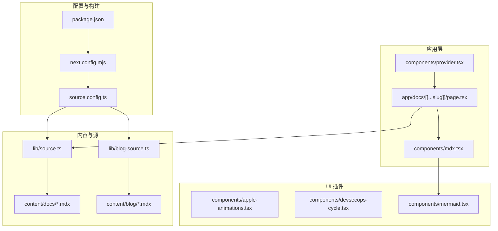
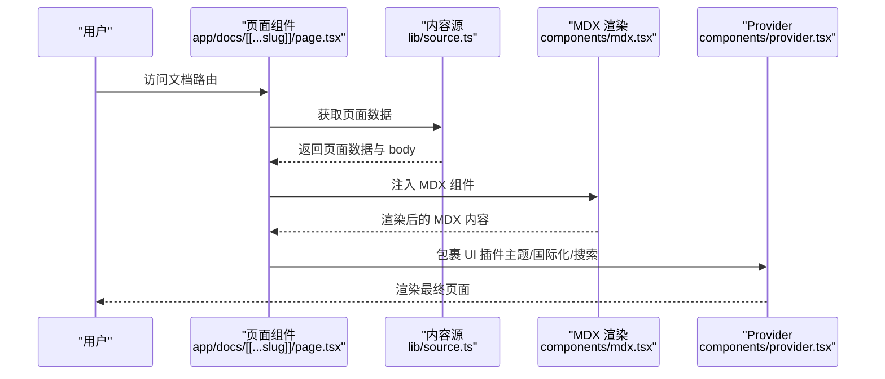
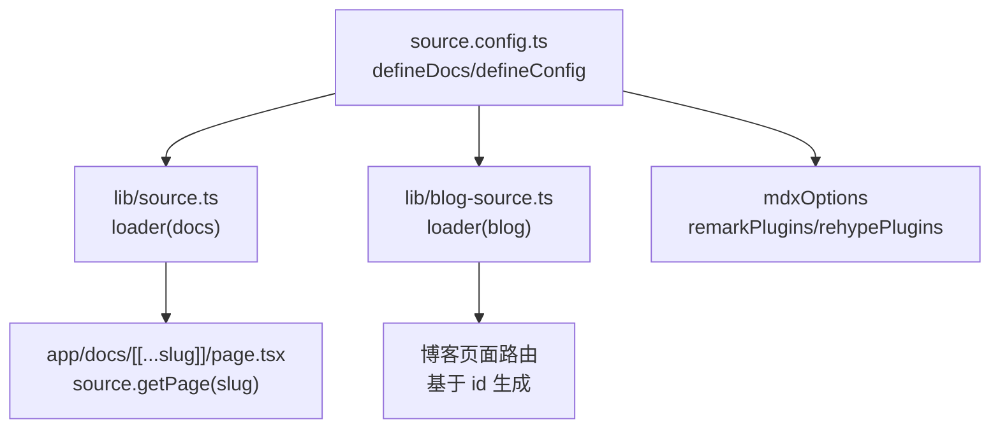
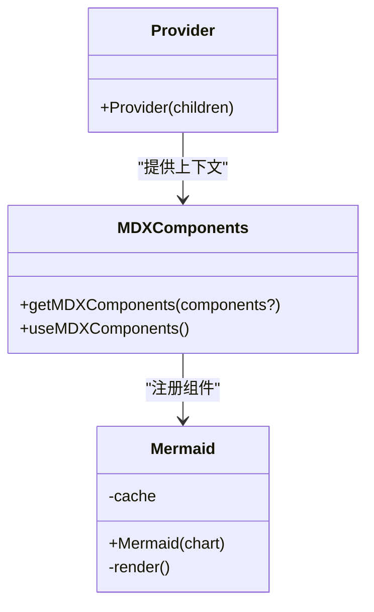
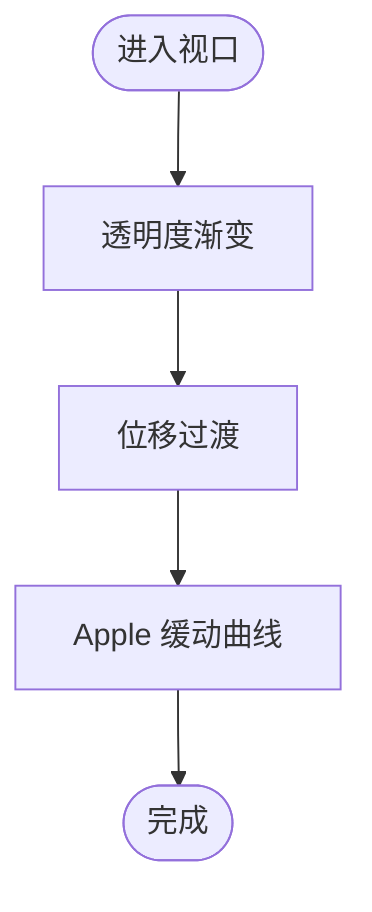
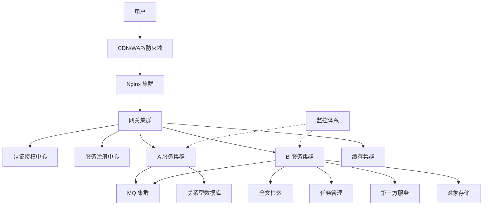
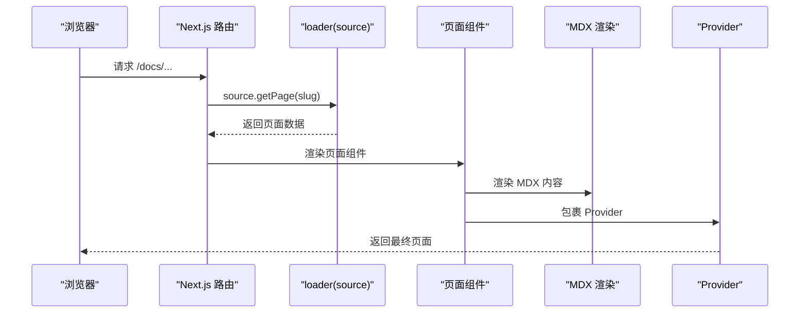
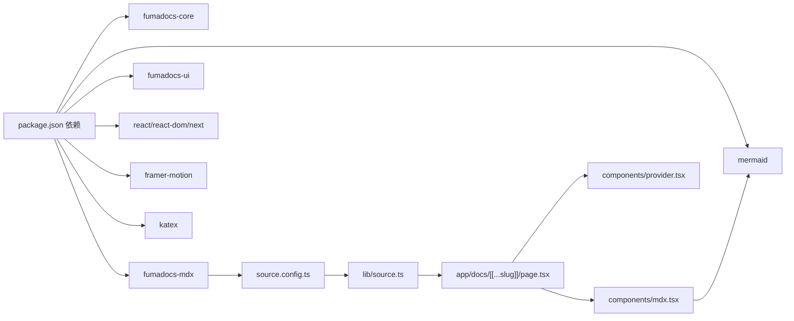

# 插件架构

<cite>
**本文引用的文件**
- [README.md](file://README.md)
- [package.json](file://package.json)
- [next.config.mjs](file://next.config.mjs)
- [source.config.ts](file://source.config.ts)
- [lib/source.ts](file://lib/source.ts)
- [lib/blog-source.ts](file://lib/blog-source.ts)
- [lib/layout.shared.tsx](file://lib/layout.shared.tsx)
- [lib/shared.ts](file://lib/shared.ts)
- [components/apple-animations.tsx](file://components/apple-animations.tsx)
- [components/devsecops-cycle.tsx](file://components/devsecops-cycle.tsx)
- [components/mdx.tsx](file://components/mdx.tsx)
- [components/provider.tsx](file://components/provider.tsx)
- [components/mermaid.tsx](file://components/mermaid.tsx)
- [app/docs/[[...slug]]/page.tsx](file://app/docs/[[...slug]]/page.tsx)
- [content/docs/index.mdx](file://content/docs/index.mdx)
- [content/blog/202501150930-welcome-to-docme.mdx](file://content/blog/202501150930-welcome-to-docme.mdx)
</cite>

## 目录
1. [引言](#引言)
2. [项目结构](#项目结构)
3. [核心组件](#核心组件)
4. [架构总览](#架构总览)
5. [详细组件分析](#详细组件分析)
6. [依赖分析](#依赖分析)
7. [性能考虑](#性能考虑)
8. [故障排查指南](#故障排查指南)
9. [结论](#结论)
10. [附录](#附录)

## 引言
本文件面向 DocMe 的插件架构，系统性阐述其基于 Fumadocs 的插件化设计理念与实现方式，重点覆盖以下方面：
- 插件系统的扩展点与自定义机制
- 内置插件（Apple 动画插件、DevSecOps 循环插件）的功能与配置选项
- 插件与主系统的集成方式与生命周期管理
- 插件开发最佳实践与规范要求
- 插件性能监控与调试方法
- 完整的插件开发示例与模板
- 架构对系统可扩展性的贡献与限制

## 项目结构
DocMe 基于 Next.js 与 Fumadocs 构建，采用“内容即插件”的理念：通过配置文件与内容源适配器加载文档与博客内容，并在渲染层通过 MDX 组件与 UI 插件实现扩展。

图表来源
- [app/docs/[[...slug]]/page.tsx](file://app/docs/[[...slug]]/page.tsx#L1-L22)
- [components/mdx.tsx:1-18](file://components/mdx.tsx#L1-L18)
- [components/provider.tsx:1-36](file://components/provider.tsx#L1-L36)
- [lib/source.ts:1-37](file://lib/source.ts#L1-L37)
- [lib/blog-source.ts:1-10](file://lib/blog-source.ts#L1-L10)
- [source.config.ts:1-56](file://source.config.ts#L1-L56)
- [next.config.mjs:1-14](file://next.config.mjs#L1-L14)
- [package.json:1-45](file://package.json#L1-L45)

章节来源
- [README.md:1-48](file://README.md#L1-L48)
- [package.json:1-45](file://package.json#L1-L45)
- [next.config.mjs:1-14](file://next.config.mjs#L1-L14)
- [source.config.ts:1-56](file://source.config.ts#L1-L56)

## 核心组件
- 内容源适配器与插件
  - 文档源：通过内容目录与 schema 定义，结合 Fumadocs 的 loader 与插件系统，实现文档页面的动态加载与后处理。
  - 博客源：通过 slug 插件扩展 URL 路由策略，实现基于 frontmatter 字段的路由生成。
- MDX 渲染与 UI 插件
  - MDX 组件注册：将默认组件与自定义组件（如 Mermaid）合并，形成统一的 MDX 渲染上下文。
  - Provider：封装主题、国际化与搜索等 UI 插件能力。
- 自定义动画与可视化插件
  - Apple 动画：提供滚动触发、视差、交错淡入等 Apple 风格动画能力。
  - DevSecOps 循环：以 SVG 可视化微服务架构与 DevSecOps 循环流程。
- 构建与运行时配置
  - Next 配置：启用 MDX 支持与静态导出。
  - Fumadocs 配置：定义文档集合、插件与 MDX 插件链。

章节来源
- [lib/source.ts:1-37](file://lib/source.ts#L1-L37)
- [lib/blog-source.ts:1-10](file://lib/blog-source.ts#L1-L10)
- [components/mdx.tsx:1-18](file://components/mdx.tsx#L1-L18)
- [components/provider.tsx:1-36](file://components/provider.tsx#L1-L36)
- [components/apple-animations.tsx:1-151](file://components/apple-animations.tsx#L1-L151)
- [components/devsecops-cycle.tsx:1-378](file://components/devsecops-cycle.tsx#L1-L378)
- [next.config.mjs:1-14](file://next.config.mjs#L1-L14)
- [source.config.ts:1-56](file://source.config.ts#L1-L56)

## 架构总览
DocMe 的插件架构围绕“内容源 → MDX 渲染 → UI 插件 → 可视化/动画插件”的数据流展开。Fumadocs 的 defineDocs/defineConfig 提供内容集合与插件配置入口；Next 的 MDX 扩展负责编译与运行时渲染；React 组件作为 UI 插件承载主题、国际化、搜索等功能；自定义组件作为可视化/动画插件提供增强体验。

图表来源
- [app/docs/[[...slug]]/page.tsx](file://app/docs/[[...slug]]/page.tsx#L1-L22)
- [lib/source.ts:1-37](file://lib/source.ts#L1-L37)
- [components/mdx.tsx:1-18](file://components/mdx.tsx#L1-L18)
- [components/provider.tsx:1-36](file://components/provider.tsx#L1-L36)

## 详细组件分析

### 内容源与插件系统
- 文档源与博客源
  - 文档源：定义 docs 集合，设置目录、schema 与后处理选项，启用 processed markdown 输出，便于 LLM 等场景使用。
  - 博客源：定义 blog 集合，扩展 frontmatter schema 并通过 slug 插件将 id 映射为路由片段。
- 插件配置
  - Fumadocs 插件：通过 defineConfig 注册 lastModified 插件，自动注入最后修改时间。
  - MDX 插件链：通过 remarkMath 与 rehypeKatex 实现数学公式渲染。
- 运行时加载
  - loader 将内容源转换为 Fumadocs 可用格式，支持插件扩展与页面查询。

图表来源
- [source.config.ts:1-56](file://source.config.ts#L1-L56)
- [lib/source.ts:1-37](file://lib/source.ts#L1-L37)
- [lib/blog-source.ts:1-10](file://lib/blog-source.ts#L1-L10)
- [app/docs/[[...slug]]/page.tsx](file://app/docs/[[...slug]]/page.tsx#L1-L22)

章节来源
- [source.config.ts:1-56](file://source.config.ts#L1-L56)
- [lib/source.ts:1-37](file://lib/source.ts#L1-L37)
- [lib/blog-source.ts:1-10](file://lib/blog-source.ts#L1-L10)

### MDX 渲染与 UI 插件
- MDX 组件注册
  - 合并默认组件与自定义组件（如 Mermaid），确保在文档中可直接使用。
- Provider
  - RootProvider 封装搜索对话框、主题切换（明暗/系统）、国际化文案等 UI 插件能力。
- Mermaid 插件
  - 按需异步加载 mermaid，基于主题切换动态渲染，具备缓存与取消渲染的保护逻辑。

图表来源
- [components/mdx.tsx:1-18](file://components/mdx.tsx#L1-L18)
- [components/provider.tsx:1-36](file://components/provider.tsx#L1-L36)
- [components/mermaid.tsx:1-54](file://components/mermaid.tsx#L1-L54)

章节来源
- [components/mdx.tsx:1-18](file://components/mdx.tsx#L1-L18)
- [components/provider.tsx:1-36](file://components/provider.tsx#L1-L36)
- [components/mermaid.tsx:1-54](file://components/mermaid.tsx#L1-L54)

### Apple 动画插件
- 能力概览
  - ScrollReveal：滚动进入视口时从指定方向淡入，支持延迟与 Apple 缓动曲线。
  - AppleCard：悬停抬起效果与滚动淡入，支持延迟与抬升高度。
  - ParallaxSection：视差滚动区域，根据滚动进度变换位移。
  - FadeInStagger/FadeInStaggerItem：子元素依次淡入，支持交错延迟。
- 设计要点
  - 使用 Framer Motion 的 useScroll/useTransform 管理滚动状态。
  - viewport 配置控制首次触发与边界条件，提升性能与体验。
  - Apple 缓动曲线统一视觉节奏，增强品牌一致性。

图表来源
- [components/apple-animations.tsx:1-151](file://components/apple-animations.tsx#L1-L151)

章节来源
- [components/apple-animations.tsx:1-151](file://components/apple-animations.tsx#L1-L151)

### DevSecOps 循环插件
- 能力概览
  - 以 SVG 绘制微服务架构与 DevSecOps 循环，包含用户、CDN、Nginx、Gateway、认证授权、服务注册、服务集群、MQ/ES/任务、第三方服务、缓存、数据库、对象存储与监控体系等区域。
  - 通过路径与箭头标注各组件间的数据流与交互关系，配合动画点模拟流量。
- 设计要点
  - 使用常量定义网格布局与颜色体系，保证一致性与可维护性。
  - 通过 zones 与连接线定义拓扑结构，便于扩展与修改。
  - 在监控区集中展示服务监控、APM 与日志系统。

图表来源
- [components/devsecops-cycle.tsx:1-378](file://components/devsecops-cycle.tsx#L1-L378)

章节来源
- [components/devsecops-cycle.tsx:1-378](file://components/devsecops-cycle.tsx#L1-L378)

### 页面渲染与生命周期
- 生命周期阶段
  - 构建期：Next 通过 createMDX 应用 MDX 编译配置，Fumadocs 配置决定内容集合与插件链。
  - 运行期：页面组件根据路由参数获取页面数据，渲染 MDX 内容并通过 Provider 注入 UI 插件。
- 关键流程
  - 页面请求 → 查询内容源 → 获取页面数据 → 渲染 MDX → Provider 包裹 → 响应客户端。

图表来源
- [app/docs/[[...slug]]/page.tsx](file://app/docs/[[...slug]]/page.tsx#L1-L22)
- [lib/source.ts:1-37](file://lib/source.ts#L1-L37)
- [components/provider.tsx:1-36](file://components/provider.tsx#L1-L36)

章节来源
- [app/docs/[[...slug]]/page.tsx:1-22](file://app/docs/[[...slug]]/page.tsx#L1-L22)
- [lib/source.ts:1-37](file://lib/source.ts#L1-L37)
- [next.config.mjs:1-14](file://next.config.mjs#L1-L14)

## 依赖分析
- 外部依赖
  - Fumadocs 生态：fumadocs-core、fumadocs-mdx、fumadocs-ui 提供内容源、MDX 编译与 UI 插件。
  - React 生态：react、react-dom、next、next-themes、framer-motion、mermaid、katex 等。
- 内部耦合
  - 页面组件依赖内容源与 MDX 组件注册。
  - Provider 依赖 UI 插件与主题系统。
  - 自定义组件（Apple 动画、DevSecOps）独立性强，可按需引入。

图表来源
- [package.json:1-45](file://package.json#L1-L45)
- [source.config.ts:1-56](file://source.config.ts#L1-L56)
- [lib/source.ts:1-37](file://lib/source.ts#L1-L37)
- [app/docs/[[...slug]]/page.tsx](file://app/docs/[[...slug]]/page.tsx#L1-L22)
- [components/mdx.tsx:1-18](file://components/mdx.tsx#L1-L18)
- [components/provider.tsx:1-36](file://components/provider.tsx#L1-L36)

章节来源
- [package.json:1-45](file://package.json#L1-L45)
- [source.config.ts:1-56](file://source.config.ts#L1-L56)

## 性能考虑
- 按需加载与缓存
  - Mermaid 插件使用缓存 Map 避免重复加载与重复渲染。
  - Apple 动画通过 viewport once 与边界配置减少不必要的重绘。
- 渲染优化
  - Framer Motion 的 useTransform 与 useScroll 在滚动场景下保持高性能。
  - DevSecOps 插件为纯 SVG，避免复杂 DOM 结构带来的开销。
- 构建与导出
  - Next 静态导出（export）降低运行时成本，适合文档站点部署。

章节来源
- [components/mermaid.tsx:1-54](file://components/mermaid.tsx#L1-L54)
- [components/apple-animations.tsx:1-151](file://components/apple-animations.tsx#L1-L151)
- [next.config.mjs:1-14](file://next.config.mjs#L1-L14)

## 故障排查指南
- MDX 渲染异常
  - 症状：公式未渲染或报错。
  - 排查：确认 remarkMath 与 rehypeKatex 是否正确注册；检查主题切换是否影响渲染。
  - 参考路径：[components/mdx.tsx:1-18](file://components/mdx.tsx#L1-L18)，[source.config.ts:51-54](file://source.config.ts#L51-L54)
- Mermaid 渲染失败
  - 症状：图表不显示或控制台报错。
  - 排查：确认 mermaid 初始化参数与主题一致；检查缓存与取消标志防止竞态。
  - 参考路径：[components/mermaid.tsx:1-54](file://components/mermaid.tsx#L1-L54)
- 页面未找到
  - 症状：访问文档路由返回 404。
  - 排查：确认 source.getPage 返回值与路由 slug 匹配；检查内容目录与 frontmatter。
  - 参考路径：[app/docs/[[...slug]]/page.tsx](file://app/docs/[[...slug]]/page.tsx#L16-L22)，[lib/source.ts:1-37](file://lib/source.ts#L1-L37)
- 主题/国际化问题
  - 症状：主题切换无效或文案未翻译。
  - 排查：确认 Provider 的 theme 与 i18n 配置；检查 resolvedTheme 与 translations。
  - 参考路径：[components/provider.tsx:1-36](file://components/provider.tsx#L1-L36)

章节来源
- [components/mdx.tsx:1-18](file://components/mdx.tsx#L1-L18)
- [components/mermaid.tsx:1-54](file://components/mermaid.tsx#L1-L54)
- [app/docs/[[...slug]]/page.tsx:16-22](file://app/docs/[[...slug]]/page.tsx#L16-L22)
- [components/provider.tsx:1-36](file://components/provider.tsx#L1-L36)

## 结论
DocMe 的插件架构以 Fumadocs 为核心，通过内容源、MDX 渲染与 UI 插件三层次实现高度可扩展的文档站点。Apple 动画与 DevSecOps 循环两类插件分别强化了交互体验与可视化表达。整体架构在性能、可维护性与扩展性之间取得良好平衡，适合持续演进与团队协作。

## 附录

### 插件开发最佳实践与规范
- 内容源与插件
  - 使用 defineDocs/defineConfig 统一声明内容集合与插件链，确保类型安全与可维护性。
  - 对于博客等需要自定义路由的场景，优先使用 slug 插件映射 frontmatter 字段。
- MDX 组件
  - 通过 getMDXComponents 合并默认组件与自定义组件，避免覆盖全局行为。
  - 对异步组件（如 Mermaid）实现缓存与取消逻辑，防止重复加载与竞态。
- UI 插件
  - Provider 封装主题、国际化与搜索等通用能力，保持页面组件简洁。
  - 严格区分服务端与客户端插件，避免在 SSR 中使用不兼容 API。
- 动画与可视化
  - 使用 viewport once 与边界配置控制触发时机，减少不必要的计算。
  - 采用常量定义布局与配色，便于维护与一致性。

### 插件性能监控与调试方法
- 性能监控
  - 使用浏览器性能面板观察滚动与动画帧率；关注 useTransform 与 useScroll 的调用频率。
  - 对异步组件（Mermaid）记录加载耗时与渲染耗时，必要时增加节流/防抖。
- 调试方法
  - 在组件内添加最小可复现示例，逐步排除外部依赖。
  - 利用控制台输出与断点定位渲染异常；对 Promise 链路添加错误捕获。

### 插件开发示例与模板
- 自定义 MDX 组件模板
  - 步骤：创建组件 → 在 getMDXComponents 中注册 → 在页面中使用。
  - 参考路径：[components/mdx.tsx:1-18](file://components/mdx.tsx#L1-L18)
- Apple 动画组件模板
  - 步骤：封装滚动触发与过渡 → 配置 viewport 与缓动 → 在页面中组合使用。
  - 参考路径：[components/apple-animations.tsx:1-151](file://components/apple-animations.tsx#L1-L151)
- DevSecOps 可视化模板
  - 步骤：定义网格常量与颜色 → 绘制区域与节点 → 添加连接线与标签 → 可选动画点。
  - 参考路径：[components/devsecops-cycle.tsx:1-378](file://components/devsecops-cycle.tsx#L1-L378)
- 内容源与插件模板
  - 步骤：defineDocs 定义集合 → defineConfig 注册插件 → loader 加载 → 页面组件消费。
  - 参考路径：[source.config.ts:1-56](file://source.config.ts#L1-L56)，[lib/source.ts:1-37](file://lib/source.ts#L1-L37)，[lib/blog-source.ts:1-10](file://lib/blog-source.ts#L1-L10)