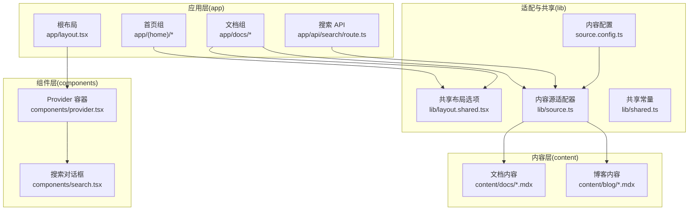
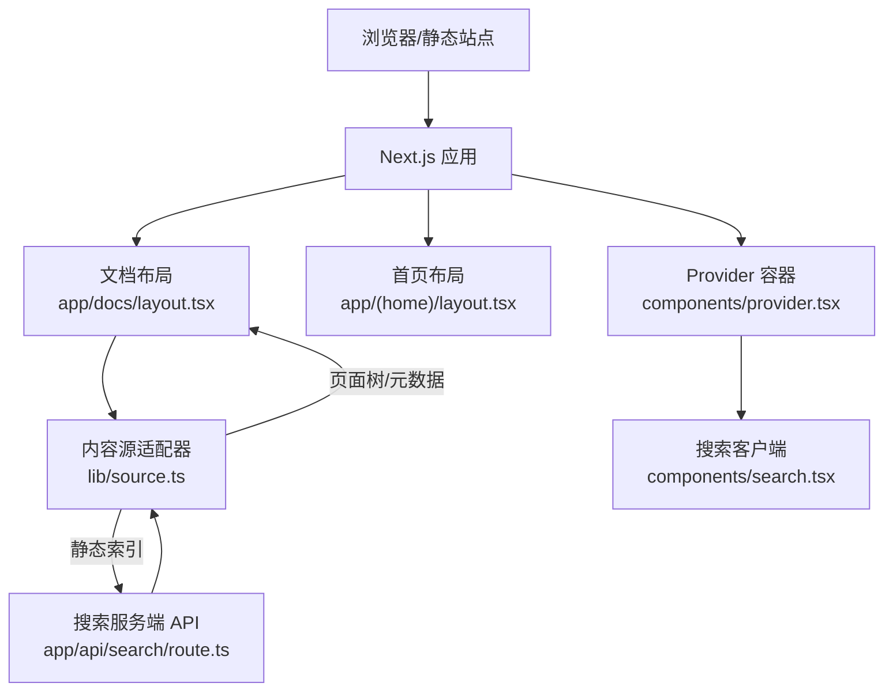
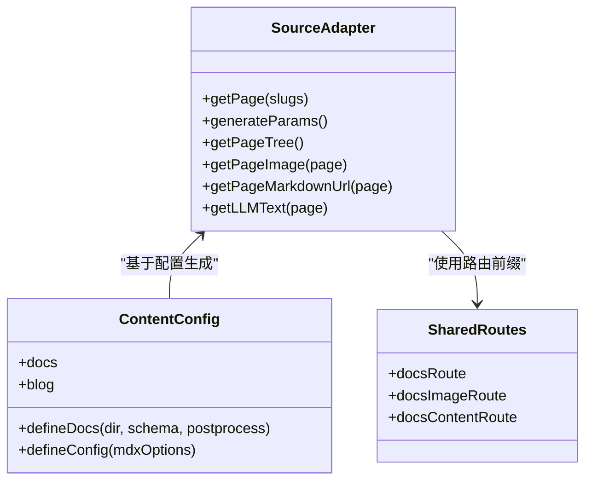
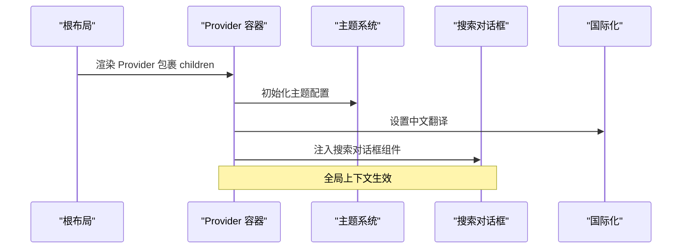
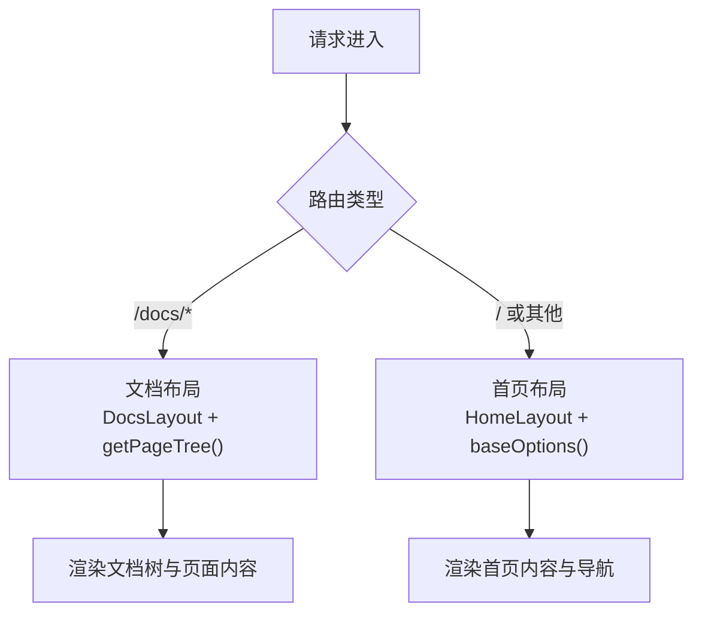
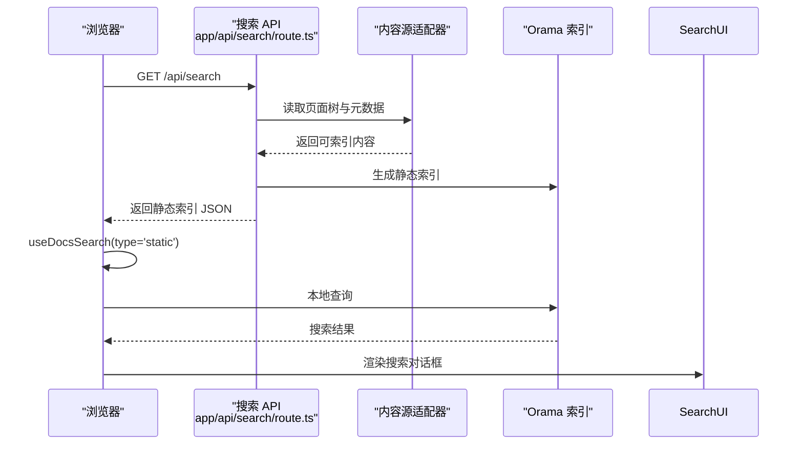
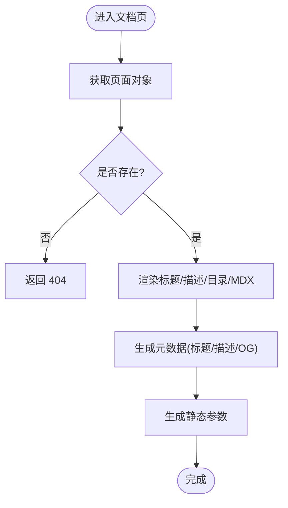
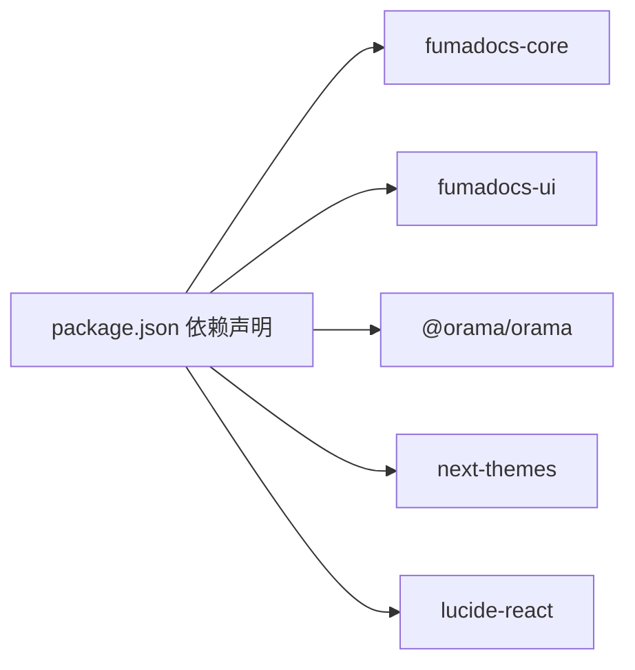
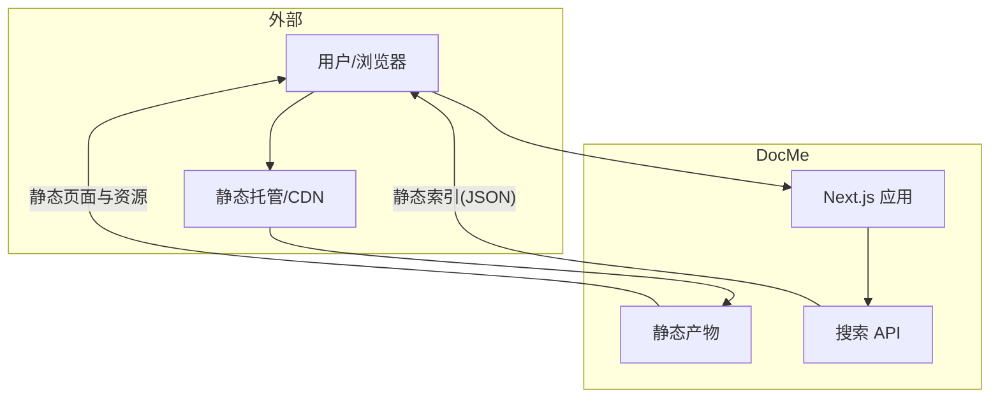

# 核心架构

<cite>
**本文引用的文件**
- [README.md](file://README.md)
- [next.config.mjs](file://next.config.mjs)
- [source.config.ts](file://source.config.ts)
- [package.json](file://package.json)
- [app/layout.tsx](file://app/layout.tsx)
- [components/provider.tsx](file://components/provider.tsx)
- [components/search.tsx](file://components/search.tsx)
- [lib/source.ts](file://lib/source.ts)
- [lib/layout.shared.tsx](file://lib/layout.shared.tsx)
- [lib/shared.ts](file://lib/shared.ts)
- [app/docs/layout.tsx](file://app/docs/layout.tsx)
- [app/docs/[[...slug]]/page.tsx](file://app/docs/[[...slug]]/page.tsx)
- [app/(home)/layout.tsx](file://app/(home)/layout.tsx)
- [app/(home)/page.tsx](file://app/(home)/page.tsx)
- [app/api/search/route.ts](file://app/api/search/route.ts)
</cite>

## 目录
1. [引言](#引言)
2. [项目结构](#项目结构)
3. [核心组件](#核心组件)
4. [架构总览](#架构总览)
5. [详细组件分析](#详细组件分析)
6. [依赖分析](#依赖分析)
7. [性能考量](#性能考量)
8. [故障排除指南](#故障排除指南)
9. [结论](#结论)
10. [附录](#附录)

## 引言
本文件面向 DocMe 的核心架构，系统性阐述其基于 Next.js App Router 的组件化与插件化设计、内容源适配器模式、Provider 主题与搜索能力、布局系统与页面分离、静态导出模式及其性能优势，并给出扩展点与定制建议。目标是帮助读者快速理解系统边界、组件关系与运行机制。

## 项目结构
DocMe 采用 Next.js App Router 的目录式路由组织，结合 Fumadocs 提供的 UI 布局与搜索能力，形成“内容源适配 + 布局渲染 + 搜索服务”的分层架构。关键目录与职责如下：
- app：应用入口与路由组织，包含根布局、文档布局、首页布局、API 路由等
- components：可复用 UI 组件与 Provider 容器
- content：MDX 文档与博客内容
- lib：内容源适配器、共享布局配置与通用常量
- source.config.ts：内容集合与 Front Matter Schema 定义
- next.config.mjs：Next.js 构建配置，启用 MDX 与静态导出

图表来源
- [app/layout.tsx:1-13](file://app/layout.tsx#L1-L13)
- [components/provider.tsx:1-36](file://components/provider.tsx#L1-L36)
- [components/search.tsx:1-47](file://components/search.tsx#L1-L47)
- [lib/source.ts:1-37](file://lib/source.ts#L1-L37)
- [lib/layout.shared.tsx:1-36](file://lib/layout.shared.tsx#L1-L36)
- [lib/shared.ts:1-12](file://lib/shared.ts#L1-L12)
- [source.config.ts:1-47](file://source.config.ts#L1-L47)
- [app/docs/layout.tsx:1-14](file://app/docs/layout.tsx#L1-L14)
- [app/api/search/route.ts:1-10](file://app/api/search/route.ts#L1-L10)

章节来源
- [README.md:27-31](file://README.md#L27-L31)
- [next.config.mjs:1-15](file://next.config.mjs#L1-L15)
- [source.config.ts:1-47](file://source.config.ts#L1-L47)

## 核心组件
- 内容源适配器：封装内容加载、页面树生成、图片与 Markdown 导出路径计算，统一对外接口
- Provider 容器：集中注入主题、国际化、搜索对话框等全局能力
- 搜索组件：基于 Orama 的静态搜索客户端，配合服务端索引生成 API
- 布局共享：提供首页与文档区的共享布局选项，支持导航、链接与 GitHub 仓库信息
- 静态导出：通过 Next.js 配置输出静态产物，便于托管与分发

章节来源
- [lib/source.ts:1-37](file://lib/source.ts#L1-L37)
- [components/provider.tsx:1-36](file://components/provider.tsx#L1-L36)
- [components/search.tsx:1-47](file://components/search.tsx#L1-L47)
- [lib/layout.shared.tsx:1-36](file://lib/layout.shared.tsx#L1-L36)
- [next.config.mjs:1-15](file://next.config.mjs#L1-L15)

## 架构总览
DocMe 的架构围绕“内容源适配器 + 布局渲染 + 搜索服务”展开，采用分层解耦与插件化设计：
- 内容源适配器：以 loader 将内容集合抽象为统一的数据模型，提供页面树、图片与 Markdown 导出路由
- 布局系统：通过共享布局选项与 Fumadocs 布局组件，实现首页与文档区的差异化展示
- 搜索体系：服务端生成静态索引，客户端使用 Orama 进行本地检索，提升性能与离线可用性
- 静态导出：构建产物可独立部署，降低运行时复杂度与成本

图表来源
- [lib/source.ts:1-37](file://lib/source.ts#L1-L37)
- [app/docs/layout.tsx:1-14](file://app/docs/layout.tsx#L1-L14)
- [app/(home)/layout.tsx](file://app/(home)/layout.tsx#L1-L8)
- [components/provider.tsx:1-36](file://components/provider.tsx#L1-L36)
- [components/search.tsx:1-47](file://components/search.tsx#L1-L47)
- [app/api/search/route.ts:1-10](file://app/api/search/route.ts#L1-L10)

## 详细组件分析

### 内容源适配器模式
- 设计要点
  - 使用 loader 抽象内容集合，统一页面树、元数据与资源路由
  - 对外暴露 getPageImage/getPageMarkdownUrl/getLLMText 等工具函数，便于页面与 API 复用
  - 通过 source.config.ts 定义文档与博客集合、Schema 与后处理选项
- 优势
  - 解耦内容存储与渲染逻辑，便于扩展新内容类型或迁移内容格式
  - 统一的页面树与资源路由，简化导航与分享链接生成
  - 支持增量构建与静态导出，利于性能与部署

图表来源
- [lib/source.ts:1-37](file://lib/source.ts#L1-L37)
- [source.config.ts:1-47](file://source.config.ts#L1-L47)
- [lib/shared.ts:1-12](file://lib/shared.ts#L1-L12)

章节来源
- [lib/source.ts:1-37](file://lib/source.ts#L1-L37)
- [source.config.ts:1-47](file://source.config.ts#L1-L47)
- [lib/shared.ts:1-12](file://lib/shared.ts#L1-L12)

### Provider 组件：主题与搜索的集中注入
- 功能
  - 通过 RootProvider 注入主题（系统跟随、默认系统、类名切换）
  - 注入中文翻译与搜索对话框组件
  - 作为全局上下文容器，承载 UI 与交互状态
- 交互流程
  - 根布局引入 Provider，子组件通过上下文访问主题与搜索
  - 搜索对话框基于 useDocsSearch 与 Orama 初始化，支持静态检索

图表来源
- [app/layout.tsx:1-13](file://app/layout.tsx#L1-L13)
- [components/provider.tsx:1-36](file://components/provider.tsx#L1-L36)
- [components/search.tsx:1-47](file://components/search.tsx#L1-L47)

章节来源
- [app/layout.tsx:1-13](file://app/layout.tsx#L1-L13)
- [components/provider.tsx:1-36](file://components/provider.tsx#L1-L36)
- [components/search.tsx:1-47](file://components/search.tsx#L1-L47)

### 布局系统：共享布局选项与页面布局分离
- 共享布局选项
  - baseOptions：首页与多处页面共用的导航标题、链接与 GitHub 仓库链接
  - docsOptions：文档区专用，隐藏链接列表，保留导航与仓库链接
- 页面布局
  - 文档页：DocsLayout + source.getPageTree() + docsOptions
  - 首页：HomeLayout + baseOptions
- 优势
  - 布局与内容解耦，便于维护与扩展
  - 通过共享选项减少重复配置，保持品牌一致性

图表来源
- [app/docs/layout.tsx:1-14](file://app/docs/layout.tsx#L1-L14)
- [app/(home)/layout.tsx](file://app/(home)/layout.tsx#L1-L8)
- [lib/layout.shared.tsx:1-36](file://lib/layout.shared.tsx#L1-L36)
- [lib/source.ts:1-37](file://lib/source.ts#L1-L37)

章节来源
- [app/docs/layout.tsx:1-14](file://app/docs/layout.tsx#L1-L14)
- [app/(home)/layout.tsx](file://app/(home)/layout.tsx#L1-L8)
- [lib/layout.shared.tsx:1-36](file://lib/layout.shared.tsx#L1-L36)

### 搜索系统：静态索引与本地检索
- 服务端
  - 通过 createFromSource(source, { language }) 生成静态搜索索引
  - 关闭 revalidate，确保索引稳定且可缓存
- 客户端
  - 使用 useDocsSearch(type: 'static', initOrama) 初始化 Orama
  - 通过 SearchDialog 组件呈现搜索 UI，支持输入、加载状态与结果列表
- 性能与体验
  - 静态索引避免运行时构建开销，提升首屏与搜索响应速度
  - 本地检索减少网络往返，适合静态部署场景

图表来源
- [app/api/search/route.ts:1-10](file://app/api/search/route.ts#L1-L10)
- [lib/source.ts:1-37](file://lib/source.ts#L1-L37)
- [components/search.tsx:1-47](file://components/search.tsx#L1-L47)

章节来源
- [app/api/search/route.ts:1-10](file://app/api/search/route.ts#L1-L10)
- [components/search.tsx:1-47](file://components/search.tsx#L1-L47)

### 文档页面渲染：MDX 组件与元数据生成
- 页面职责
  - 通过 source.getPage(slug) 获取页面对象，不存在则 notFound
  - 读取页面的标题、描述、目录与 MDX 内容
  - 生成 Open Graph 图像链接与 Markdown 下载链接
  - 使用相对链接处理器，支持 MDX 中的内部跳转
- 生成策略
  - generateStaticParams 基于 source.generateParams() 静态生成所有路由参数
  - generateMetadata 动态生成标题、描述与 OG 图像

图表来源
- [app/docs/[[...slug]]/page.tsx](file://app/docs/[[...slug]]/page.tsx#L1-L64)
- [lib/source.ts:1-37](file://lib/source.ts#L1-L37)
- [lib/shared.ts:1-12](file://lib/shared.ts#L1-L12)

章节来源
- [app/docs/[[...slug]]/page.tsx](file://app/docs/[[...slug]]/page.tsx#L1-L64)
- [lib/source.ts:1-37](file://lib/source.ts#L1-L37)
- [lib/shared.ts:1-12](file://lib/shared.ts#L1-L12)

### 静态导出模式与性能优势
- 配置要点
  - output: 'export' 输出静态站点
  - images.unoptimized: true 适配静态导出的图片策略
  - MDX 通过 fumadocs-mdx 插件集成
- 优势
  - 无需 Node.js 运行时，可部署至任意静态托管
  - 构建期生成页面与索引，减少运行时开销
  - 与服务端搜索 API 协同，兼顾性能与交互体验

章节来源
- [next.config.mjs:1-15](file://next.config.mjs#L1-L15)
- [package.json:1-39](file://package.json#L1-L39)

## 依赖分析
- 外部依赖
  - fumadocs-core/ui：内容源适配、布局、搜索与 UI 组件生态
  - @orama/orama：高性能全文检索引擎
  - next-themes：主题切换与系统主题感知
  - lucide-react：图标库
- 内部耦合
  - Provider 依赖搜索组件与 UI Provider
  - 文档布局依赖内容源适配器与共享布局选项
  - 搜索 API 依赖内容源适配器生成索引
- 可能的循环依赖
  - 当前模块间通过函数与组件注入，未见直接循环导入

图表来源
- [package.json:1-39](file://package.json#L1-L39)

章节来源
- [package.json:1-39](file://package.json#L1-L39)

## 性能考量
- 静态导出与预构建
  - 通过 generateStaticParams 与静态索引，减少运行时计算
- 搜索优化
  - 本地 Orama 检索，避免网络抖动；服务端索引稳定，利于缓存
- 图片与资源
  - 静态导出模式下禁用 Next.js 图片优化，需确保资源路径正确
- 主题与国际化
  - Provider 集中初始化，避免重复上下文创建

## 故障排除指南
- 页面 404
  - 现象：访问不存在的文档路由
  - 排查：确认 source.getPage(slug) 是否存在；检查 generateStaticParams 生成的参数是否完整
- 搜索无结果
  - 现象：搜索框显示空结果或加载状态异常
  - 排查：确认 /api/search 返回的索引有效；检查 useDocsSearch 的 type 与 initOrama 配置；确认语言设置与索引一致
- 布局不一致
  - 现象：文档区与首页导航/链接不一致
  - 排查：确认 DocsLayout 传入的 tree 与 options 来自共享配置；检查 baseOptions/docsOptions 的返回值
- 图片或 OG 图像缺失
  - 现象：Open Graph 图像无法显示
  - 排查：确认 getPageImage 返回的 URL 与 docsImageRoute 一致；检查静态导出后的资源路径

章节来源
- [app/docs/[[...slug]]/page.tsx](file://app/docs/[[...slug]]/page.tsx#L10-L20)
- [app/api/search/route.ts:4-9](file://app/api/search/route.ts#L4-L9)
- [components/search.tsx:25-46](file://components/search.tsx#L25-L46)
- [lib/layout.shared.tsx:4-35](file://lib/layout.shared.tsx#L4-L35)
- [lib/source.ts:12-19](file://lib/source.ts#L12-L19)

## 结论
DocMe 以内容源适配器为核心，结合 Fumadocs 的布局与搜索能力，构建了清晰的分层架构。通过静态导出与本地搜索，系统在易部署、低运行时成本与良好用户体验之间取得平衡。Provider 统一注入主题与搜索，布局共享选项保证一致性。该架构具备良好的扩展性，便于新增内容类型、定制布局与增强搜索策略。

## 附录
- 系统边界图（概念性）

- 架构扩展点与自定义选项
  - 新增内容类型：在 source.config.ts 中定义新的 defineDocs，调整 lib/source.ts 的适配器以兼容新集合
  - 自定义搜索：调整 /api/search/route.ts 的语言与索引策略；或替换客户端初始化逻辑
  - 布局定制：在 lib/layout.shared.tsx 中扩展 baseOptions/docsOptions，或在各路由组布局中按需覆盖
  - 主题与国际化：在 components/provider.tsx 中调整主题属性与翻译映射
  - 静态导出：根据部署需求调整 next.config.mjs 的输出与图片策略