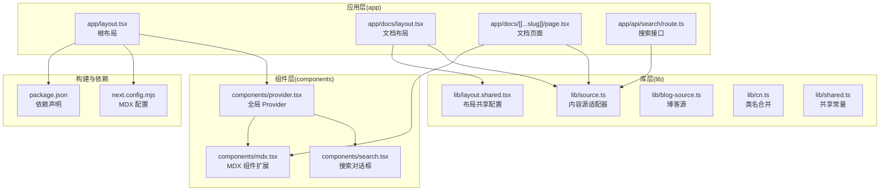
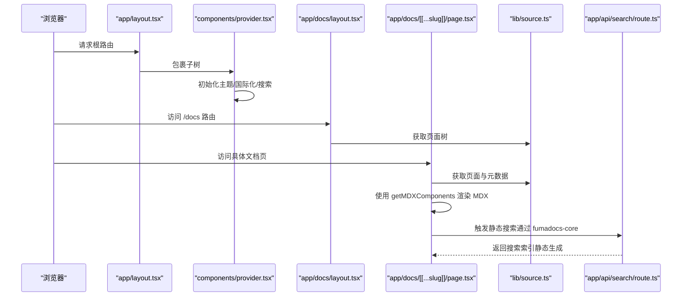
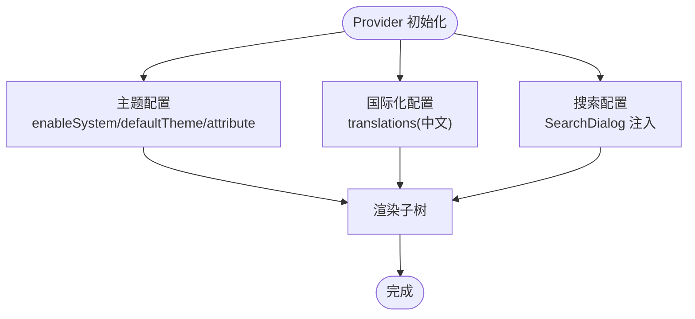
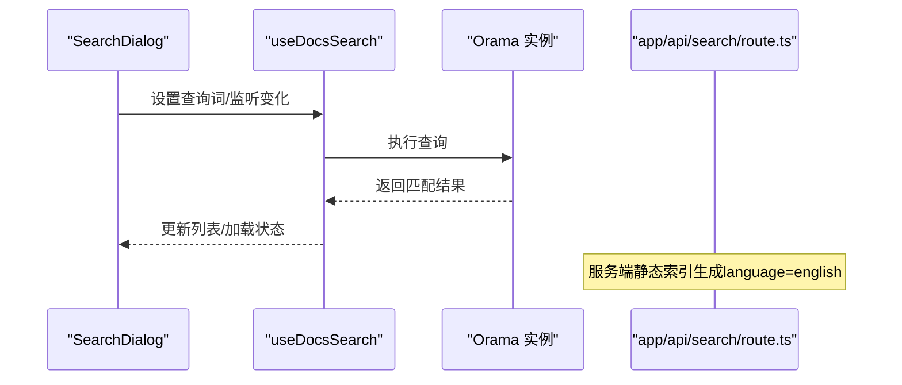
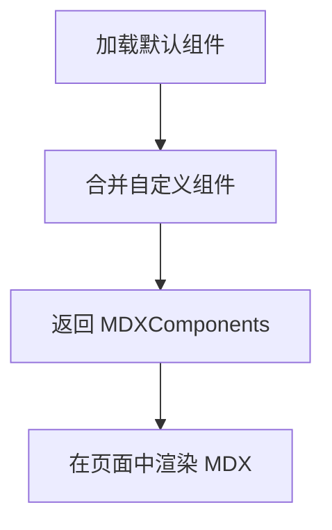
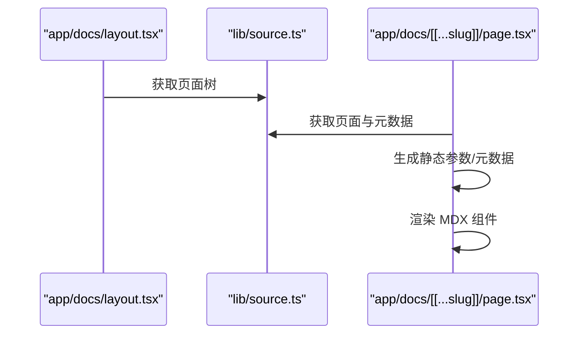
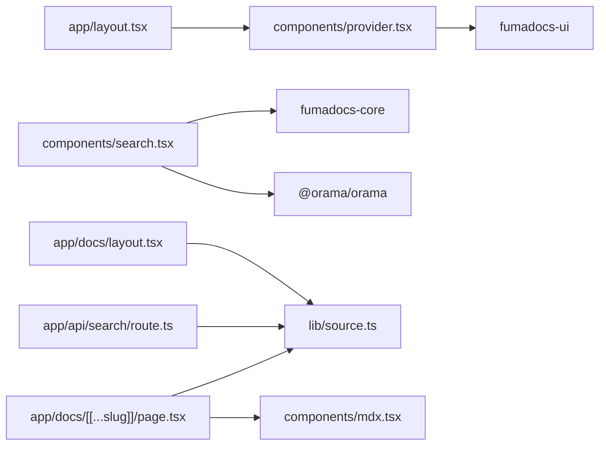

# 组件架构

<cite>
**本文引用的文件**
- [components/provider.tsx](file://components/provider.tsx)
- [components/search.tsx](file://components/search.tsx)
- [components/mdx.tsx](file://components/mdx.tsx)
- [app/layout.tsx](file://app/layout.tsx)
- [app/docs/layout.tsx](file://app/docs/layout.tsx)
- [app/docs/[[...slug]]/page.tsx](file://app/docs/[[...slug]]/page.tsx)
- [app/api/search/route.ts](file://app/api/search/route.ts)
- [lib/source.ts](file://lib/source.ts)
- [lib/layout.shared.tsx](file://lib/layout.shared.tsx)
- [lib/blog-source.ts](file://lib/blog-source.ts)
- [lib/cn.ts](file://lib/cn.ts)
- [lib/shared.ts](file://lib/shared.ts)
- [next.config.mjs](file://next.config.mjs)
- [package.json](file://package.json)
- [README.md](file://README.md)
</cite>

## 目录
1. [引言](#引言)
2. [项目结构](#项目结构)
3. [核心组件](#核心组件)
4. [架构总览](#架构总览)
5. [详细组件分析](#详细组件分析)
6. [依赖分析](#依赖分析)
7. [性能考虑](#性能考虑)
8. [故障排查指南](#故障排查指南)
9. [结论](#结论)
10. [附录](#附录)

## 引言
本文件系统性梳理 DocMe 的组件架构与实现，重点覆盖以下方面：
- 组件化设计模式：可复用组件的设计原则与最佳实践
- Provider 组件：作为全局状态管理的核心，涵盖主题提供者、搜索状态管理与国际化支持
- 搜索组件：基于 Orama 的搜索引擎集成与静态搜索实现
- MDX 组件系统：扩展机制与自定义组件开发方法
- 组件间通信与数据流：从布局到页面再到内容源的数据传递路径
- 生命周期管理、性能优化策略与错误处理机制
- 提供具体代码片段路径与使用场景说明

## 项目结构
DocMe 基于 Next.js App Router 架构，采用“布局 + 页面 + 组件 + 库”的分层组织方式：
- app：应用入口与路由层，负责根布局、文档布局与页面渲染
- components：通用 UI 组件与业务组件（Provider、Search、MDX 扩展）
- lib：内容源适配器、共享配置与工具函数
- public：静态资源（图片等）
- 配置：next.config.mjs、tsconfig.json、source.config.ts 等

图表来源
- [app/layout.tsx:1-13](file://app/layout.tsx#L1-L13)
- [app/docs/layout.tsx:1-14](file://app/docs/layout.tsx#L1-L14)
- [app/docs/[[...slug]]/page.tsx:1-64](file://app/docs/[[...slug]]/page.tsx#L1-L64)
- [app/api/search/route.ts:1-10](file://app/api/search/route.ts#L1-L10)
- [components/provider.tsx:1-36](file://components/provider.tsx#L1-L36)
- [components/search.tsx:1-47](file://components/search.tsx#L1-L47)
- [components/mdx.tsx:1-16](file://components/mdx.tsx#L1-L16)
- [lib/source.ts:1-37](file://lib/source.ts#L1-L37)
- [lib/layout.shared.tsx:1-36](file://lib/layout.shared.tsx#L1-L36)
- [lib/blog-source.ts:1-10](file://lib/blog-source.ts#L1-L10)
- [lib/cn.ts:1-2](file://lib/cn.ts#L1-L2)
- [lib/shared.ts:1-12](file://lib/shared.ts#L1-L12)
- [next.config.mjs:1-15](file://next.config.mjs#L1-L15)
- [package.json:1-45](file://package.json#L1-L45)

章节来源
- [README.md:20-37](file://README.md#L20-L37)
- [next.config.mjs:1-15](file://next.config.mjs#L1-L15)
- [package.json:12-32](file://package.json#L12-L32)

## 核心组件
本节聚焦三个关键组件：Provider、SearchDialog、MDX 组件扩展，并说明它们如何协同工作。

- Provider 组件
  - 作用：作为全局状态容器，注入主题、国际化与搜索对话框
  - 关键点：通过 fumadocs-ui 的 RootProvider 提供统一上下文；内置中文翻译；启用系统主题与默认主题属性
  - 位置：[components/provider.tsx:19-35](file://components/provider.tsx#L19-L35)

- 搜索组件（SearchDialog）
  - 作用：封装搜索对话框 UI 与搜索逻辑，基于 fumadocs-core 的 useDocsSearch 与 Orama 实现静态搜索
  - 关键点：初始化 Orama 实例、设置语言、绑定查询状态、渲染列表项
  - 位置：[components/search.tsx:25-46](file://components/search.tsx#L25-L46)

- MDX 组件扩展
  - 作用：在默认组件基础上合并自定义组件，便于在文档中插入交互或业务组件
  - 关键点：导出 getMDXComponents/useMDXComponents，支持传入额外组件并合并默认组件
  - 位置：[components/mdx.tsx:4-11](file://components/mdx.tsx#L4-L11)

章节来源
- [components/provider.tsx:6-35](file://components/provider.tsx#L6-L35)
- [components/search.tsx:17-31](file://components/search.tsx#L17-L31)
- [components/mdx.tsx:4-11](file://components/mdx.tsx#L4-L11)

## 架构总览
DocMe 的组件架构围绕“布局 -> 组件 -> 内容源”展开，数据流自上而下贯穿根布局、Provider、文档布局与页面，最终由内容源驱动 MDX 渲染与搜索服务。

图表来源
- [app/layout.tsx:4-12](file://app/layout.tsx#L4-L12)
- [components/provider.tsx:19-35](file://components/provider.tsx#L19-L35)
- [app/docs/layout.tsx:5-13](file://app/docs/layout.tsx#L5-L13)
- [app/docs/[[...slug]]/page.tsx:16-44](file://app/docs/[[...slug]]/page.tsx#L16-L44)
- [lib/source.ts:6-10](file://lib/source.ts#L6-L10)
- [app/api/search/route.ts:6-9](file://app/api/search/route.ts#L6-L9)

## 详细组件分析

### Provider 组件：全局状态与上下文
- 设计原则
  - 单一职责：集中管理主题、国际化与搜索对话框
  - 可复用性：通过 RootProvider 将上下文暴露给子树
  - 可扩展性：允许注入自定义组件（如 SearchDialog）
- 国际化与主题
  - 内置中文翻译映射，覆盖搜索、目录、语言切换、主题等关键文案
  - 主题系统启用系统跟随，默认使用系统主题，通过 class 属性切换明暗
- 与布局的关系
  - 根布局包裹 Provider，确保整站生效
- 与搜索的衔接
  - 通过 search 属性注入自定义 SearchDialog，使任意页面均可触发搜索

图表来源
- [components/provider.tsx:19-35](file://components/provider.tsx#L19-L35)

章节来源
- [components/provider.tsx:6-35](file://components/provider.tsx#L6-L35)
- [app/layout.tsx:4-12](file://app/layout.tsx#L4-L12)

### 搜索组件：Orama 集成与静态搜索
- 架构要点
  - 客户端：使用 fumadocs-core 的 useDocsSearch 管理搜索状态，结合自定义 SearchDialog
  - 服务端：通过 createFromSource(source, { language }) 生成静态搜索索引
  - 引擎：Orama 初始化时指定 schema 与语言（英语），用于全文检索
- 数据流
  - 用户输入 -> useDocsSearch(query/setQuery) -> Orama 查询 -> 结果回填 -> 列表渲染
- 语言与本地化
  - 通过 useI18n 获取当前语言，配合服务端语言配置保持一致

图表来源
- [components/search.tsx:25-46](file://components/search.tsx#L25-L46)
- [app/api/search/route.ts:6-9](file://app/api/search/route.ts#L6-L9)

章节来源
- [components/search.tsx:17-31](file://components/search.tsx#L17-L31)
- [components/search.tsx:34-42](file://components/search.tsx#L34-L42)
- [app/api/search/route.ts:6-9](file://app/api/search/route.ts#L6-L9)

### MDX 组件系统：扩展机制与自定义组件
- 默认组件
  - 通过 fumadocs-ui/mdx 导入默认组件集合
- 扩展与合并
  - getMDXComponents 合并默认组件与传入组件，返回可用的 MDXComponents
  - useMDXComponents 为便捷别名，便于在页面中直接使用
- 在页面中的应用
  - 文档页面通过 source.getPage 获取页面数据，再将 MDX 组件传入 MDX 渲染器
  - 支持相对链接转换（createRelativeLink），提升文档内跳转体验

图表来源
- [components/mdx.tsx:4-11](file://components/mdx.tsx#L4-L11)
- [app/docs/[[...slug]]/page.tsx:35-41](file://app/docs/[[...slug]]/page.tsx#L35-L41)

章节来源
- [components/mdx.tsx:1-16](file://components/mdx.tsx#L1-L16)
- [app/docs/[[...slug]]/page.tsx:16-44](file://app/docs/[[...slug]]/page.tsx#L16-L44)

### 布局与内容源：数据流向
- 文档布局
  - DocsLayout 接收 source.getPageTree() 生成的页面树，渲染侧边栏与导航
- 文档页面
  - 通过 source.getPage(slug) 获取页面对象，读取标题、描述、目录、正文等
  - 生成静态参数与元数据，支持 SEO 与 Open Graph
- 内容源适配器
  - loader 将内容源包装为可查询的结构，提供 getPage、getPageTree、generateParams 等能力
  - 提供工具函数：页面图片 URL、Markdown 下载 URL、LLM 文本拼接

图表来源
- [app/docs/layout.tsx:5-13](file://app/docs/layout.tsx#L5-L13)
- [lib/source.ts:6-10](file://lib/source.ts#L6-L10)
- [app/docs/[[...slug]]/page.tsx:16-63](file://app/docs/[[...slug]]/page.tsx#L16-L63)

章节来源
- [app/docs/layout.tsx:1-14](file://app/docs/layout.tsx#L1-L14)
- [app/docs/[[...slug]]/page.tsx:16-64](file://app/docs/[[...slug]]/page.tsx#L16-L64)
- [lib/source.ts:12-37](file://lib/source.ts#L12-L37)

## 依赖分析
- 外部依赖
  - fumadocs-core：内容源适配、搜索客户端/服务端、文档布局
  - fumadocs-ui：Provider、布局、MDX 组件、对话框组件
  - @orama/orama：全文搜索引擎
  - next：App Router、静态导出、类型生成
- 内部耦合
  - Provider 依赖 fumadocs-ui 的 RootProvider 与组件
  - SearchDialog 依赖 fumadocs-core 的 useDocsSearch 与 Orama
  - 文档页面依赖 lib/source.ts 的内容源与 MDX 组件扩展
  - 搜索接口依赖 lib/source.ts 的 source 配置

图表来源
- [components/provider.tsx:19-35](file://components/provider.tsx#L19-L35)
- [components/search.tsx:13-31](file://components/search.tsx#L13-L31)
- [app/docs/[[...slug]]/page.tsx:16-44](file://app/docs/[[...slug]]/page.tsx#L16-L44)
- [app/api/search/route.ts:1-9](file://app/api/search/route.ts#L1-L9)
- [lib/source.ts:1-10](file://lib/source.ts#L1-L10)
- [app/layout.tsx:4-8](file://app/layout.tsx#L4-L8)

章节来源
- [package.json:12-32](file://package.json#L12-L32)
- [next.config.mjs:1-15](file://next.config.mjs#L1-L15)

## 性能考虑
- 静态导出与预渲染
  - next.config.mjs 启用静态导出，减少运行时开销，适合文档站点
- 搜索性能
  - 服务端静态生成搜索索引，客户端按需查询，避免重复构建索引
  - Orama 初始化时指定语言，有助于提升检索效率
- 组件渲染
  - MDX 组件按需渲染，避免不必要的重渲染
  - 类名合并工具（tailwind-merge）减少样式冲突与冗余
- 构建与类型
  - 使用 fumadocs-mdx 的类型生成脚本，保证 MDX 内容与类型安全

章节来源
- [next.config.mjs:6-12](file://next.config.mjs#L6-L12)
- [components/search.tsx:17-23](file://components/search.tsx#L17-L23)
- [lib/cn.ts:1-2](file://lib/cn.ts#L1-L2)
- [package.json:9-10](file://package.json#L9-L10)

## 故障排查指南
- 搜索无结果或异常
  - 检查服务端语言配置是否与 Orama 初始化一致
  - 确认静态索引已生成且未被缓存污染
  - 参考路径：[app/api/search/route.ts:6-9](file://app/api/search/route.ts#L6-L9)、[components/search.tsx:17-23](file://components/search.tsx#L17-L23)
- 国际化文案不显示
  - 确认 Provider 中 translations 是否完整覆盖所需键值
  - 参考路径：[components/provider.tsx:6-17](file://components/provider.tsx#L6-L17)
- 文档页面 404
  - 检查 slug 参数与内容源是否匹配，确认 generateStaticParams 是否正确
  - 参考路径：[app/docs/[[...slug]]/page.tsx:47-49](file://app/docs/[[...slug]]/page.tsx#L47-L49)
- MDX 组件未生效
  - 确认 getMDXComponents 返回的组件已传入 MDX 渲染器
  - 参考路径：[components/mdx.tsx:4-11](file://components/mdx.tsx#L4-L11)、[app/docs/[[...slug]]/page.tsx:35-41](file://app/docs/[[...slug]]/page.tsx#L35-L41)

章节来源
- [app/api/search/route.ts:6-9](file://app/api/search/route.ts#L6-L9)
- [components/search.tsx:17-23](file://components/search.tsx#L17-L23)
- [components/provider.tsx:6-17](file://components/provider.tsx#L6-L17)
- [app/docs/[[...slug]]/page.tsx:47-49](file://app/docs/[[...slug]]/page.tsx#L47-L49)
- [components/mdx.tsx:4-11](file://components/mdx.tsx#L4-L11)

## 结论
DocMe 的组件架构以 Provider 为核心，串联起主题、国际化与搜索三大全局能力；通过 fumadocs-core 与 Orama 实现高性能静态搜索；借助 MDX 组件扩展机制，实现内容与交互的灵活组合。整体设计遵循单一职责与可复用原则，具备良好的可维护性与扩展性。

## 附录
- 使用场景建议
  - 主题与国际化：在 Provider 中统一配置，避免分散设置
  - 搜索：优先使用静态索引，结合语言配置与加载状态优化用户体验
  - MDX：在页面中按需注入自定义组件，保持默认组件的兼容性
- 最佳实践
  - 将共享配置收敛至 lib/shared.ts 与 lib/layout.shared.tsx
  - 使用 cn 工具进行类名合并，减少样式冲突
  - 通过 generateStaticParams 与 generateMetadata 提升 SEO 与首屏性能