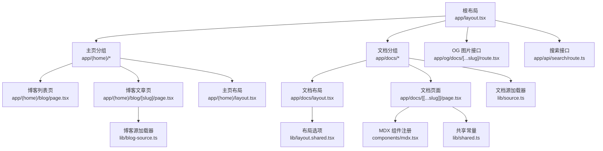
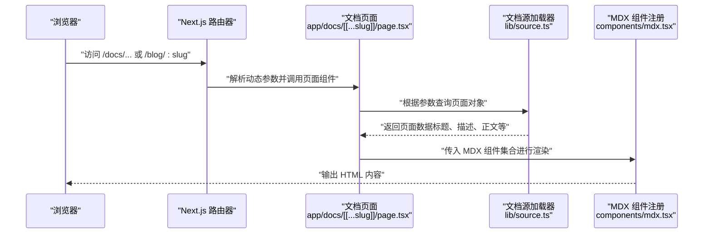
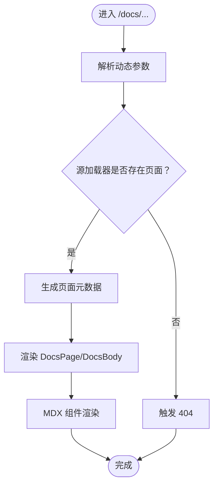
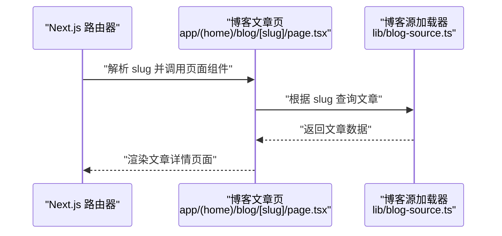
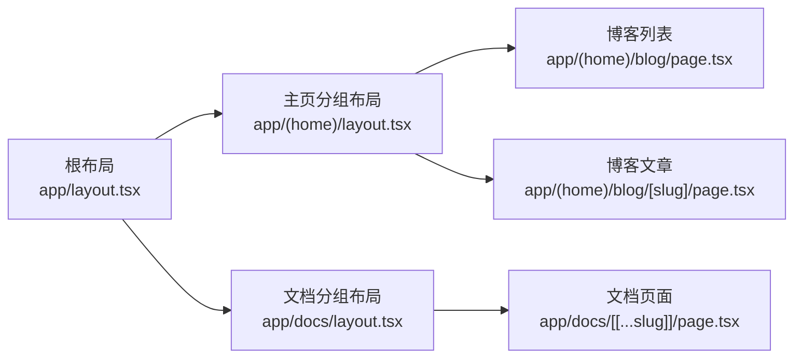
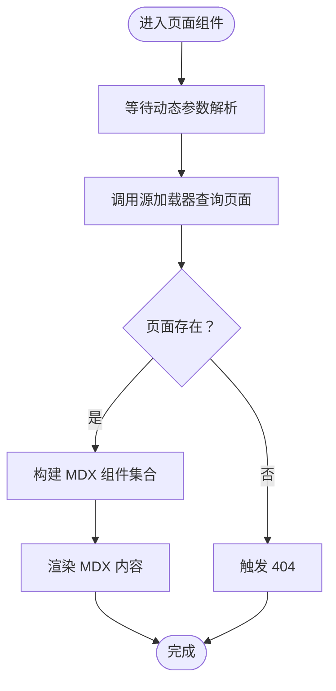
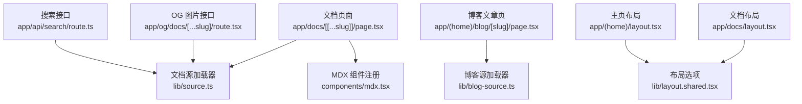

# 路由系统

<cite>
**本文引用的文件**
- [app/layout.tsx](file://app/layout.tsx)
- [app/docs/layout.tsx](file://app/docs/layout.tsx)
- [app/docs/[[...slug]]/page.tsx](file://app/docs/[[...slug]]/page.tsx)
- [app/(home)/layout.tsx](file://app/(home)/layout.tsx)
- [app/(home)/blog/[slug]/page.tsx](file://app/(home)/blog/[slug]/page.tsx)
- [app/(home)/blog/page.tsx](file://app/(home)/blog/page.tsx)
- [app/og/docs/[...slug]/route.tsx](file://app/og/docs/[...slug]/route.tsx)
- [app/api/search/route.ts](file://app/api/search/route.ts)
- [lib/source.ts](file://lib/source.ts)
- [lib/blog-source.ts](file://lib/blog-source.ts)
- [lib/layout.shared.tsx](file://lib/layout.shared.tsx)
- [lib/shared.ts](file://lib/shared.ts)
- [components/mdx.tsx](file://components/mdx.tsx)
- [next.config.mjs](file://next.config.mjs)
</cite>

## 目录
1. [简介](#简介)
2. [项目结构](#项目结构)
3. [核心组件](#核心组件)
4. [架构总览](#架构总览)
5. [详细组件分析](#详细组件分析)
6. [依赖关系分析](#依赖关系分析)
7. [性能考量](#性能考量)
8. [故障排查指南](#故障排查指南)
9. [结论](#结论)
10. [附录](#附录)

## 简介
本文件系统性梳理 DocMe 的路由体系，围绕 Next.js App Router 的组织方式与动态路由实现展开，重点覆盖：
- 文档路由与博客路由的配置与渲染流程
- 动态路由参数解析与页面渲染链路
- 嵌套路由与布局继承机制
- 路由级代码分割与懒加载策略
- 路由守卫、权限控制与 SEO 优化
- 路由与内容管理系统的数据传递机制
- 最佳实践与性能优化建议

## 项目结构
DocMe 的路由采用 Next.js App Router 的文件系统路由约定，结合 fumadocs 提供的文档布局与源加载器，形成“文档”和“博客”两大内容域，并通过共享布局与全局元数据统一风格。

图表来源
- [app/layout.tsx:1-28](file://app/layout.tsx#L1-L28)
- [app/(home)/layout.tsx:1-8](file://app/(home)/layout.tsx#L1-L8)
- [app/docs/layout.tsx:1-14](file://app/docs/layout.tsx#L1-L14)
- [app/docs/[[...slug]]/page.tsx:1-64](file://app/docs/[[...slug]]/page.tsx#L1-L64)
- [app/(home)/blog/[slug]/page.tsx:1-105](file://app/(home)/blog/[slug]/page.tsx#L1-L105)
- [app/(home)/blog/page.tsx:1-92](file://app/(home)/blog/page.tsx#L1-L92)
- [app/og/docs/[...slug]/route.tsx:1-29](file://app/og/docs/[...slug]/route.tsx#L1-L29)
- [app/api/search/route.ts:1-10](file://app/api/search/route.ts#L1-L10)
- [lib/source.ts:1-37](file://lib/source.ts#L1-L37)
- [lib/blog-source.ts:1-10](file://lib/blog-source.ts#L1-L10)
- [lib/layout.shared.tsx:1-36](file://lib/layout.shared.tsx#L1-L36)
- [lib/shared.ts:1-12](file://lib/shared.ts#L1-L12)
- [components/mdx.tsx:1-18](file://components/mdx.tsx#L1-L18)

章节来源
- [app/layout.tsx:1-28](file://app/layout.tsx#L1-L28)
- [app/docs/layout.tsx:1-14](file://app/docs/layout.tsx#L1-L14)
- [app/docs/[[...slug]]/page.tsx:1-64](file://app/docs/[[...slug]]/page.tsx#L1-L64)
- [app/(home)/layout.tsx:1-8](file://app/(home)/layout.tsx#L1-L8)
- [app/(home)/blog/[slug]/page.tsx:1-105](file://app/(home)/blog/[slug]/page.tsx#L1-L105)
- [app/(home)/blog/page.tsx:1-92](file://app/(home)/blog/page.tsx#L1-L92)
- [app/og/docs/[...slug]/route.tsx:1-29](file://app/og/docs/[...slug]/route.tsx#L1-L29)
- [app/api/search/route.ts:1-10](file://app/api/search/route.ts#L1-L10)
- [lib/source.ts:1-37](file://lib/source.ts#L1-L37)
- [lib/blog-source.ts:1-10](file://lib/blog-source.ts#L1-L10)
- [lib/layout.shared.tsx:1-36](file://lib/layout.shared.tsx#L1-L36)
- [lib/shared.ts:1-12](file://lib/shared.ts#L1-L12)
- [components/mdx.tsx:1-18](file://components/mdx.tsx#L1-L18)

## 核心组件
- 全局布局与元数据：根布局负责站点元信息与全局 Provider 包裹，确保主题与状态一致。
- 主页分组布局：主页分组内包含博客列表与文章页，统一使用 fumadocs 的 HomeLayout。
- 文档分组布局：文档分组内使用 fumadocs 的 DocsLayout，并注入页面树与基础导航。
- 动态路由页面：
  - 文档页面：基于动态路由参数解析文档路径，读取内容并渲染 MDX。
  - 博客文章页：基于动态路由参数解析文章 ID，渲染文章详情。
- 源加载器：封装文档与博客内容源，提供页面树、静态参数生成与元数据生成能力。
- MDX 组件注册：集中注册默认组件与自定义组件（如 Mermaid），统一渲染行为。
- 接口层：
  - OG 图片接口：按文档路由参数生成 Open Graph 图片。
  - 搜索接口：基于文档源生成搜索索引。

章节来源
- [app/layout.tsx:1-28](file://app/layout.tsx#L1-L28)
- [app/(home)/layout.tsx:1-8](file://app/(home)/layout.tsx#L1-L8)
- [app/docs/layout.tsx:1-14](file://app/docs/layout.tsx#L1-L14)
- [app/docs/[[...slug]]/page.tsx:1-64](file://app/docs/[[...slug]]/page.tsx#L1-L64)
- [app/(home)/blog/[slug]/page.tsx:1-105](file://app/(home)/blog/[slug]/page.tsx#L1-L105)
- [lib/source.ts:1-37](file://lib/source.ts#L1-L37)
- [lib/blog-source.ts:1-10](file://lib/blog-source.ts#L1-L10)
- [components/mdx.tsx:1-18](file://components/mdx.tsx#L1-L18)
- [app/og/docs/[...slug]/route.tsx:1-29](file://app/og/docs/[...slug]/route.tsx#L1-L29)
- [app/api/search/route.ts:1-10](file://app/api/search/route.ts#L1-L10)

## 架构总览
下图展示从请求到页面渲染的关键调用链，涵盖参数解析、内容加载、MDX 渲染与元数据生成。

图表来源
- [app/docs/[[...slug]]/page.tsx:16-44](file://app/docs/[[...slug]]/page.tsx#L16-L44)
- [lib/source.ts:6-10](file://lib/source.ts#L6-L10)
- [components/mdx.tsx:5-11](file://components/mdx.tsx#L5-L11)

## 详细组件分析

### 文档路由与页面渲染
- 动态路由模式：文档路由使用可选捕获段 [[...slug]]，允许单层或多层级路径映射到同一页面组件。
- 参数解析与校验：页面组件异步等待参数解析后，通过源加载器查询对应页面；若未找到则触发 404。
- 内容渲染：从页面数据中提取标题、描述、目录与正文，使用 fumadocs 的 DocsPage/DocsBody 组件包裹，并以 MDX 渲染正文。
- 静态参数生成：通过源加载器生成静态路由参数，用于预渲染。
- SEO 元数据：页面级 generateMetadata 动态生成标题、描述与 Open Graph 图像。

图表来源
- [app/docs/[[...slug]]/page.tsx:16-64](file://app/docs/[[...slug]]/page.tsx#L16-L64)
- [lib/source.ts:6-10](file://lib/source.ts#L6-L10)

章节来源
- [app/docs/[[...slug]]/page.tsx:1-64](file://app/docs/[[...slug]]/page.tsx#L1-L64)
- [lib/source.ts:1-37](file://lib/source.ts#L1-L37)

### 博客路由与页面渲染
- 动态路由模式：博客文章页使用 [slug]，参数为字符串数组或扁平化字符串，最终统一转换为数组形式。
- 参数生成：generateStaticParams 从博客源生成所有文章的路由参数，支持预渲染。
- 页面渲染：读取文章数据（标题、作者、日期、标签、正文等），渲染文章头部、标签、正文与返回链接。
- SEO 元数据：页面级 generateMetadata 动态生成标题与描述。

图表来源
- [app/(home)/blog/[slug]/page.tsx:9-105](file://app/(home)/blog/[slug]/page.tsx#L9-L105)
- [lib/blog-source.ts:5-9](file://lib/blog-source.ts#L5-L9)

章节来源
- [app/(home)/blog/[slug]/page.tsx:1-105](file://app/(home)/blog/[slug]/page.tsx#L1-L105)
- [lib/blog-source.ts:1-10](file://lib/blog-source.ts#L1-L10)

### 嵌套路由与布局继承
- 根布局：定义全局元数据、语言属性与 Provider 包裹，作为所有子路由的根容器。
- 主页分组布局：在 app/(home) 下统一应用 HomeLayout，注入导航与 GitHub 链接。
- 文档分组布局：在 app/docs 下应用 DocsLayout，注入页面树与导航链接，实现文档侧边栏与目录联动。
- 布局选项：通过 shared 配置与 layout.shared 选项，统一站点标题、链接与 GitHub 地址。

图表来源
- [app/layout.tsx:19-27](file://app/layout.tsx#L19-L27)
- [app/(home)/layout.tsx:5-7](file://app/(home)/layout.tsx#L5-L7)
- [app/docs/layout.tsx:5-13](file://app/docs/layout.tsx#L5-L13)

章节来源
- [app/layout.tsx:1-28](file://app/layout.tsx#L1-L28)
- [app/(home)/layout.tsx:1-8](file://app/(home)/layout.tsx#L1-L8)
- [app/docs/layout.tsx:1-14](file://app/docs/layout.tsx#L1-L14)
- [lib/layout.shared.tsx:1-36](file://lib/layout.shared.tsx#L1-L36)

### 路由参数处理与页面渲染流程
- 文档参数：动态参数经 Promise 解析后，调用 source.getPage 获取页面对象；若不存在则 notFound。
- 博客参数：generateStaticParams 将 slug 转换为数组形式，保证后续查询一致性。
- MDX 组件：通过 getMDXComponents 注册默认组件与自定义组件，支持相对链接转换与组件扩展。
- 相对链接：使用 createRelativeLink 将 MDX 中的相对链接转换为站点内的实际路由。

图表来源
- [app/docs/[[...slug]]/page.tsx:16-44](file://app/docs/[[...slug]]/page.tsx#L16-L44)
- [app/(home)/blog/[slug]/page.tsx:9-84](file://app/(home)/blog/[slug]/page.tsx#L9-L84)
- [components/mdx.tsx:5-11](file://components/mdx.tsx#L5-L11)

章节来源
- [app/docs/[[...slug]]/page.tsx:1-64](file://app/docs/[[...slug]]/page.tsx#L1-L64)
- [app/(home)/blog/[slug]/page.tsx:1-105](file://app/(home)/blog/[slug]/page.tsx#L1-L105)
- [components/mdx.tsx:1-18](file://components/mdx.tsx#L1-L18)

### 路由级别的代码分割与懒加载策略
- 文档页面：使用 fumadocs 的 DocsLayout 与 DocsPage，内部已实现按需渲染与组件拆分。
- MDX 渲染：通过 getMDXComponents 注册组件，避免在页面入口处一次性导入大量组件。
- 搜索接口：使用 createFromSource 动态生成搜索索引，按需访问，减少首屏负担。
- OG 图片接口：按需生成图片，revalidate 关闭以避免重复计算。

章节来源
- [app/docs/layout.tsx:1-14](file://app/docs/layout.tsx#L1-L14)
- [components/mdx.tsx:1-18](file://components/mdx.tsx#L1-L18)
- [app/api/search/route.ts:1-10](file://app/api/search/route.ts#L1-L10)
- [app/og/docs/[...slug]/route.tsx:7-21](file://app/og/docs/[...slug]/route.tsx#L7-L21)

### 路由守卫、权限控制与 SEO 优化
- 路由守卫：当前实现通过 notFound 触发 404 来模拟“无权限/不存在”的守卫行为；可扩展为鉴权中间件。
- 权限控制：可在页面组件中增加鉴权逻辑（如检查用户角色、登录状态），并在不满足条件时重定向或返回 401/403。
- SEO 优化：
  - 根布局定义站点元信息与 Open Graph 基础设置。
  - 文档与博客页面级 generateMetadata 动态生成标题、描述与图像。
  - OG 图片接口按页面标题与描述生成固定尺寸图片，提升社交分享体验。

章节来源
- [app/layout.tsx:5-17](file://app/layout.tsx#L5-L17)
- [app/docs/[[...slug]]/page.tsx:51-63](file://app/docs/[[...slug]]/page.tsx#L51-L63)
- [app/(home)/blog/[slug]/page.tsx:93-104](file://app/(home)/blog/[slug]/page.tsx#L93-L104)
- [app/og/docs/[...slug]/route.tsx:9-21](file://app/og/docs/[...slug]/route.tsx#L9-L21)

### 路由与内容管理系统的数据传递机制
- 文档源：通过 loader 将 collections/server 导出的文档源包装为 fumadocs 可用的 source，提供 getPage/getPages/generateParams 等能力。
- 博客源：通过 loader 与插件组合，将数据中的 id 映射为 slug，实现稳定的路由参数。
- 共享常量：docsRoute/docsImageRoute/docsContentRoute 等常量统一管理路由前缀，便于维护与扩展。
- MDX 数据：页面数据包含标题、描述、正文、目录等字段，通过 MDX 组件渲染，支持相对链接转换。

章节来源
- [lib/source.ts:1-37](file://lib/source.ts#L1-L37)
- [lib/blog-source.ts:1-10](file://lib/blog-source.ts#L1-L10)
- [lib/shared.ts:1-12](file://lib/shared.ts#L1-L12)
- [components/mdx.tsx:1-18](file://components/mdx.tsx#L1-L18)

## 依赖关系分析
- 组件耦合：
  - 文档页面强依赖源加载器与 MDX 组件注册。
  - 博客页面依赖博客源加载器与页面列表页。
  - 布局层依赖 shared 与 layout.shared 选项。
- 外部依赖：
  - fumadocs-ui 提供布局与 OG 图片生成能力。
  - fumadocs-core/source 提供源加载与静态参数生成。
  - lucide-react 与自定义动画组件用于页面展示。

图表来源
- [app/docs/[[...slug]]/page.tsx:1-L64](file://app/docs/[[...slug]]/page.tsx#L1-L64)
- [lib/source.ts:1-37](file://lib/source.ts#L1-L37)
- [components/mdx.tsx:1-18](file://components/mdx.tsx#L1-L18)
- [app/(home)/blog/[slug]/page.tsx:1-L105](file://app/(home)/blog/[slug]/page.tsx#L1-L105)
- [lib/blog-source.ts:1-10](file://lib/blog-source.ts#L1-L10)
- [app/docs/layout.tsx:1-14](file://app/docs/layout.tsx#L1-L14)
- [lib/layout.shared.tsx:1-36](file://lib/layout.shared.tsx#L1-L36)
- [app/(home)/layout.tsx:1-8](file://app/(home)/layout.tsx#L1-L8)
- [app/og/docs/[...slug]/route.tsx:1-L29](file://app/og/docs/[...slug]/route.tsx#L1-L29)
- [app/api/search/route.ts:1-10](file://app/api/search/route.ts#L1-L10)

章节来源
- [app/docs/[[...slug]]/page.tsx:1-64](file://app/docs/[[...slug]]/page.tsx#L1-L64)
- [lib/source.ts:1-37](file://lib/source.ts#L1-L37)
- [components/mdx.tsx:1-18](file://components/mdx.tsx#L1-L18)
- [app/(home)/blog/[slug]/page.tsx:1-105](file://app/(home)/blog/[slug]/page.tsx#L1-L105)
- [lib/blog-source.ts:1-10](file://lib/blog-source.ts#L1-L10)
- [app/docs/layout.tsx:1-14](file://app/docs/layout.tsx#L1-L14)
- [lib/layout.shared.tsx:1-36](file://lib/layout.shared.tsx#L1-L36)
- [app/(home)/layout.tsx:1-8](file://app/(home)/layout.tsx#L1-L8)
- [app/og/docs/[...slug]/route.tsx:1-29](file://app/og/docs/[...slug]/route.tsx#L1-L29)
- [app/api/search/route.ts:1-10](file://app/api/search/route.ts#L1-L10)

## 性能考量
- 预渲染与静态参数：
  - 文档与博客页面均实现 generateStaticParams，减少运行时查询成本。
- 懒加载与按需渲染：
  - 使用 fumadocs 的布局与 MDX 组件注册，避免一次性加载全部资源。
- 图片与构建优化：
  - next.config.mjs 中关闭图片优化并启用静态导出，适合静态托管场景。
- 搜索与 OG：
  - 搜索接口与 OG 图片接口按需生成，revalidate 关闭以避免重复计算。

章节来源
- [app/docs/[[...slug]]/page.tsx:47-49](file://app/docs/[[...slug]]/page.tsx#L47-L49)
- [app/(home)/blog/[slug]/page.tsx:86-91](file://app/(home)/blog/[slug]/page.tsx#L86-L91)
- [next.config.mjs:1-15](file://next.config.mjs#L1-L15)
- [app/og/docs/[...slug]/route.tsx:7-L21](file://app/og/docs/[...slug]/route.tsx#L7-L21)

## 故障排查指南
- 访问不存在的文档或博客路径：
  - 现象：返回 404。
  - 原因：页面组件在找不到页面时触发 notFound。
  - 处理：确认源加载器是否正确配置，路径是否与内容文件匹配。
- 动态参数为空或类型错误：
  - 现象：页面无法渲染或报错。
  - 原因：参数未正确解析或 slug 类型不一致。
  - 处理：在 generateStaticParams 中统一转换为数组形式，确保后续查询一致。
- OG 图片生成失败：
  - 现象：Open Graph 图像为空或 404。
  - 原因：页面不存在或参数解析异常。
  - 处理：检查 generateStaticParams 与参数切片逻辑，确保 slug 正确。
- 搜索接口异常：
  - 现象：搜索结果为空或报错。
  - 原因：源加载器未正确初始化或语言配置不匹配。
  - 处理：确认 createFromSource 的配置与源加载器一致。

章节来源
- [app/docs/[[...slug]]/page.tsx:18-L19](file://app/docs/[[...slug]]/page.tsx#L18-L19)
- [app/(home)/blog/[slug]/page.tsx:13-L13](file://app/(home)/blog/[slug]/page.tsx#L13-L13)
- [app/og/docs/[...slug]/route.tsx:9-L12](file://app/og/docs/[...slug]/route.tsx#L9-L12)
- [app/api/search/route.ts:6-9](file://app/api/search/route.ts#L6-L9)

## 结论
DocMe 的路由系统以 Next.js App Router 为基础，结合 fumadocs 的布局与源加载能力，实现了清晰的文档与博客内容域划分。通过动态路由参数、静态参数生成与页面级元数据生成，兼顾了可维护性与 SEO 表现。建议在现有基础上进一步完善权限控制与路由守卫，并持续优化预渲染与懒加载策略以提升性能与用户体验。

## 附录
- 最佳实践清单
  - 使用 generateStaticParams 为可预测的路由生成静态参数，减少运行时开销。
  - 在页面组件中尽早进行 notFound 校验，避免无效渲染。
  - 将 MDX 组件注册集中在一处，保持渲染一致性与可扩展性。
  - 利用 fumadocs 的布局与工具函数，减少重复实现。
  - 对外暴露的接口（如搜索、OG）按需生成，合理设置 revalidate。
- 性能优化建议
  - 合理拆分页面与组件，利用默认懒加载与按需渲染。
  - 在静态导出场景下，尽量减少运行时计算，优先使用预渲染。
  - 对图片与第三方资源进行缓存与压缩，提升首屏加载速度。