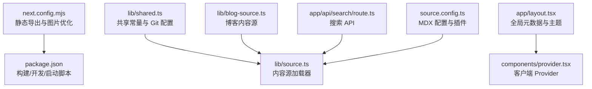
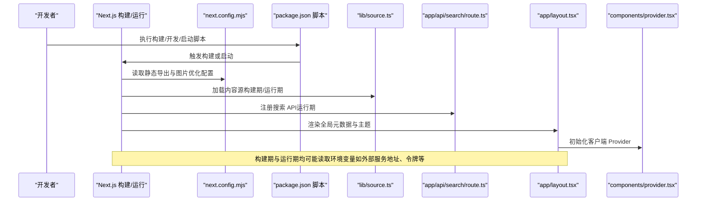
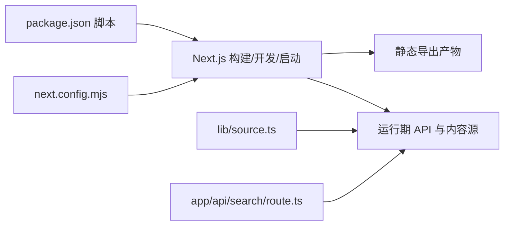

# 环境变量管理

<cite>
**本文引用的文件**
- [README.md](file://README.md)
- [next.config.mjs](file://next.config.mjs)
- [package.json](file://package.json)
- [tsconfig.json](file://tsconfig.json)
- [source.config.ts](file://source.config.ts)
- [lib/shared.ts](file://lib/shared.ts)
- [lib/source.ts](file://lib/source.ts)
- [lib/blog-source.ts](file://lib/blog-source.ts)
- [lib/layout.shared.tsx](file://lib/layout.shared.tsx)
- [components/provider.tsx](file://components/provider.tsx)
- [app/layout.tsx](file://app/layout.tsx)
- [app/api/search/route.ts](file://app/api/search/route.ts)
</cite>

## 目录
1. [引言](#引言)
2. [项目结构](#项目结构)
3. [核心组件](#核心组件)
4. [架构总览](#架构总览)
5. [详细组件分析](#详细组件分析)
6. [依赖分析](#依赖分析)
7. [性能考虑](#性能考虑)
8. [故障排查指南](#故障排查指南)
9. [结论](#结论)
10. [附录](#附录)

## 引言
本指南围绕 Next.js 应用中的环境变量管理展开，结合当前仓库的实际实现，系统阐述以下主题：
- Next.js 环境变量的加载机制与作用域（构建期 vs 运行期）
- 客户端与服务器端环境变量的差异与使用场景
- 开发、测试、生产三类环境的变量配置要点
- 敏感信息的安全存储与传输建议
- 构建期与运行期变量处理方式
- 常用变量配置模板与最佳实践
- 变量验证与错误处理策略
- 多环境部署的变量管理策略
- 变更的热重载与重启策略
- 调试与验证环境变量的实用工具与技巧

本项目采用静态导出模式，且未直接使用 Next.js 的内置环境变量读取 API，因此本文将基于现有代码与 Next.js 通用机制进行说明，并给出可落地的实践建议。

章节来源
- [README.md:1-48](file://README.md#L1-L48)

## 项目结构
该仓库为一个基于 Next.js 的文档站点，采用静态导出模式，主要涉及以下与环境变量相关的关键位置：
- 构建配置：next.config.mjs 中的输出模式与图片优化设置
- 依赖与脚本：package.json 中的构建、开发与启动脚本
- 内容源与路由：lib 下的内容加载器与共享常量
- API 路由：app/api/search/route.ts 使用内容源进行搜索索引构建
- 全局布局与元数据：app/layout.tsx 提供站点元信息与主题配置
- 组件层：components/provider.tsx 提供客户端上下文与主题能力

图表来源
- [next.config.mjs:1-15](file://next.config.mjs#L1-L15)
- [package.json:1-45](file://package.json#L1-L45)
- [lib/shared.ts:1-12](file://lib/shared.ts#L1-L12)
- [lib/source.ts:1-37](file://lib/source.ts#L1-L37)
- [lib/blog-source.ts:1-10](file://lib/blog-source.ts#L1-L10)
- [app/api/search/route.ts:1-12](file://app/api/search/route.ts#L1-L12)
- [app/layout.tsx:1-27](file://app/layout.tsx#L1-L27)
- [components/provider.tsx:1-36](file://components/provider.tsx#L1-L36)
- [source.config.ts:1-56](file://source.config.ts#L1-L56)

章节来源
- [next.config.mjs:1-15](file://next.config.mjs#L1-L15)
- [package.json:1-45](file://package.json#L1-L45)
- [lib/shared.ts:1-12](file://lib/shared.ts#L1-L12)
- [lib/source.ts:1-37](file://lib/source.ts#L1-L37)
- [lib/blog-source.ts:1-10](file://lib/blog-source.ts#L1-L10)
- [app/api/search/route.ts:1-12](file://app/api/search/route.ts#L1-L12)
- [app/layout.tsx:1-27](file://app/layout.tsx#L1-L27)
- [components/provider.tsx:1-36](file://components/provider.tsx#L1-L36)
- [source.config.ts:1-56](file://source.config.ts#L1-L56)

## 核心组件
- 构建与导出配置：next.config.mjs 指定静态导出模式与图片优化策略，影响构建期资源打包与运行期静态分发。
- 内容源与共享常量：lib/shared.ts 提供应用名称、路由前缀与 Git 仓库信息；lib/source.ts 与 lib/blog-source.ts 通过内容源加载器组织文档与博客数据。
- API 路由：app/api/search/route.ts 基于内容源创建搜索索引，体现运行期对内容源的访问。
- 全局布局与 Provider：app/layout.tsx 提供站点元信息；components/provider.tsx 提供客户端主题与国际化配置。
- MDX 配置：source.config.ts 定义文档集合与插件，间接影响内容渲染与构建流程。

章节来源
- [next.config.mjs:1-15](file://next.config.mjs#L1-L15)
- [lib/shared.ts:1-12](file://lib/shared.ts#L1-L12)
- [lib/source.ts:1-37](file://lib/source.ts#L1-L37)
- [lib/blog-source.ts:1-10](file://lib/blog-source.ts#L1-L10)
- [app/api/search/route.ts:1-12](file://app/api/search/route.ts#L1-L12)
- [app/layout.tsx:1-27](file://app/layout.tsx#L1-L27)
- [components/provider.tsx:1-36](file://components/provider.tsx#L1-L36)
- [source.config.ts:1-56](file://source.config.ts#L1-L56)

## 架构总览
下图展示从构建到运行期间，环境变量相关的关键路径与交互：

图表来源
- [package.json:5-11](file://package.json#L5-L11)
- [next.config.mjs:6-12](file://next.config.mjs#L6-L12)
- [lib/source.ts:1-10](file://lib/source.ts#L1-L10)
- [app/api/search/route.ts:1-12](file://app/api/search/route.ts#L1-L12)
- [app/layout.tsx:1-27](file://app/layout.tsx#L1-L27)
- [components/provider.tsx:19-35](file://components/provider.tsx#L19-L35)

## 详细组件分析

### 组件一：构建配置与静态导出
- 关键点
  - 静态导出模式影响产物结构与运行期资源分发策略。
  - 图片优化设置在静态导出场景下的行为需与 CDN 或托管平台配合。
- 环境变量关联
  - 若使用外部服务（如搜索、统计、CDN），可在构建期注入只读参数，避免在客户端暴露敏感信息。

章节来源
- [next.config.mjs:6-12](file://next.config.mjs#L6-L12)

### 组件二：内容源与共享常量
- 关键点
  - 共享常量集中定义应用名称、路由前缀与 Git 仓库信息，便于统一维护。
  - 内容源加载器负责从内容目录加载文档与博客数据，支持运行期动态查询。
- 环境变量关联
  - 对于需要区分不同内容源或远程数据源的场景，可通过环境变量控制源地址与鉴权信息。

章节来源
- [lib/shared.ts:1-12](file://lib/shared.ts#L1-L12)
- [lib/source.ts:1-10](file://lib/source.ts#L1-L10)
- [lib/blog-source.ts:1-10](file://lib/blog-source.ts#L1-L10)

### 组件三：搜索 API 路由
- 关键点
  - 基于内容源创建搜索索引，适合在运行期构建本地索引以提升检索性能。
  - revalidate 控制缓存策略，影响搜索结果的实时性与性能平衡。
- 环境变量关联
  - 外部搜索引擎或分词器配置可通过环境变量进行切换与参数化。

章节来源
- [app/api/search/route.ts:1-12](file://app/api/search/route.ts#L1-L12)

### 组件四：全局布局与客户端 Provider
- 关键点
  - 全局元数据与主题配置在客户端初始化 Provider，影响页面渲染与用户体验。
- 环境变量关联
  - 主题默认值、语言包等可通过环境变量进行差异化配置。

章节来源
- [app/layout.tsx:1-27](file://app/layout.tsx#L1-L27)
- [components/provider.tsx:19-35](file://components/provider.tsx#L19-L35)

### 组件五：MDX 配置与内容插件
- 关键点
  - MDX 插件链路影响内容渲染质量与性能，适合在构建期进行参数化配置。
- 环境变量关联
  - 可通过环境变量控制插件启用/禁用与语言设置。

章节来源
- [source.config.ts:1-56](file://source.config.ts#L1-L56)

## 依赖分析
- 构建与运行脚本
  - 构建：调用 Next.js 构建命令，生成静态产物。
  - 开发：启动 Next.js 开发服务器，支持热重载。
  - 启动：使用静态服务器分发已构建的静态产物。
- 依赖关系
  - 构建配置与脚本共同决定产物形态与运行方式。
  - 内容源与 API 路由在运行期协作，提供文档浏览与搜索功能。

图表来源
- [package.json:5-11](file://package.json#L5-L11)
- [next.config.mjs:6-12](file://next.config.mjs#L6-L12)
- [lib/source.ts:1-10](file://lib/source.ts#L1-L10)
- [app/api/search/route.ts:1-12](file://app/api/search/route.ts#L1-L12)

章节来源
- [package.json:5-11](file://package.json#L5-L11)
- [next.config.mjs:6-12](file://next.config.mjs#L6-L12)
- [lib/source.ts:1-10](file://lib/source.ts#L1-L10)
- [app/api/search/route.ts:1-12](file://app/api/search/route.ts#L1-L12)

## 性能考虑
- 构建期与运行期的负载分配
  - 将计算密集型任务（如全文索引构建）放在运行期，减少构建时间。
  - 对频繁变动的内容采用增量更新策略，降低运行期开销。
- 缓存与失效
  - 合理设置 revalidate 与缓存头，平衡实时性与性能。
- 资源优化
  - 在静态导出场景下，确保图片与静态资源的 CDN 分发策略一致。

## 故障排查指南
- 构建失败
  - 检查构建脚本与依赖版本是否匹配。
  - 确认静态导出配置与托管平台要求一致。
- 运行期异常
  - 核查内容源路径与权限，确认运行期可访问。
  - 检查 API 路由的 revalidate 设置与缓存策略。
- 客户端问题
  - 确认 Provider 初始化顺序与主题配置正确。
  - 排查国际化翻译与主题切换逻辑。

章节来源
- [package.json:5-11](file://package.json#L5-L11)
- [next.config.mjs:6-12](file://next.config.mjs#L6-L12)
- [app/api/search/route.ts:5-12](file://app/api/search/route.ts#L5-L12)
- [components/provider.tsx:19-35](file://components/provider.tsx#L19-L35)

## 结论
本项目采用静态导出模式，环境变量的使用应遵循“构建期注入只读参数、运行期按需访问”的原则。通过集中管理共享常量与内容源，结合合理的缓存与性能策略，可在不牺牲安全性的情况下实现高效稳定的交付。

## 附录

### 环境变量加载机制与作用域
- 构建期（Build-time）
  - 由构建脚本与配置驱动，读取只读环境变量，生成静态产物。
  - 适用于：站点基础配置、CDN 地址、只读开关等。
- 运行期（Runtime）
  - 在服务器或静态托管环境中生效，读取敏感或动态变量。
  - 适用于：第三方服务密钥、动态内容源、运行时开关等。

### 客户端与服务器端变量区别与使用场景
- 服务器端变量
  - 仅在服务端可用，适合处理敏感信息与后端接口。
  - 示例：数据库连接串、第三方 API 密钥、内部服务地址。
- 客户端变量
  - 通过构建期注入或运行期 API 获取，避免暴露敏感信息。
  - 示例：公开的 CDN 地址、公开的统计 ID、UI 开关。

### 开发/测试/生产环境配置示例
- 开发环境
  - 使用本地或沙箱服务地址，开启严格模式与详细日志。
- 测试环境
  - 使用隔离的测试数据源与最小权限密钥，启用缓存短周期。
- 生产环境
  - 使用强加密与最小权限原则，启用只读与安全头，定期轮换密钥。

### 敏感信息的安全存储与传输
- 存储
  - 使用平台提供的密钥管理服务（如 CI/CD 密钥库、平台环境变量）。
- 传输
  - 通过 HTTPS 与最小暴露面传输，避免在客户端直接暴露。
- 访问
  - 仅在服务端读取敏感变量，通过受控 API 暴露必要信息。

### 构建期与运行时处理方式
- 构建期
  - 注入只读参数，生成静态资源与路由。
- 运行时
  - 动态读取服务端变量，按需访问外部服务与内容源。

### 常用变量配置模板与最佳实践
- 模板字段
  - 站点基础：站点名称、元数据、默认主题。
  - 内容源：内容目录、远程源地址、鉴权令牌。
  - 搜索：搜索引擎类型、分词器、索引重建策略。
  - 第三方：统计 ID、分析服务、CDN 地址。
- 最佳实践
  - 区分只读与敏感变量，优先使用只读变量参与构建。
  - 为每类环境提供独立的变量集，避免混用。
  - 使用分组与命名规范，便于团队协作与审计。

### 变量验证与错误处理
- 验证
  - 在构建期与运行期分别校验必填项与格式，失败时快速失败。
- 错误处理
  - 提供降级方案（如离线模式、默认值），记录错误日志并告警。

### 多环境部署策略
- 环境隔离
  - 不同环境使用独立的变量集与密钥。
- 变更流程
  - 通过 CI/CD 自动化注入变量，避免手工修改。
- 回滚与审计
  - 记录变量变更历史，支持快速回滚与审计追踪。

### 变更的热重载与重启策略
- 构建期变量变更
  - 需要重新构建与发布，无法热重载。
- 运行期变量变更
  - 通过平台热更新或滚动重启，尽量减少停机时间。

### 调试与验证工具与技巧
- 工具
  - 构建日志与产物检查、运行期日志与指标监控。
- 技巧
  - 使用最小化复现步骤定位问题，优先验证关键变量与依赖链路。