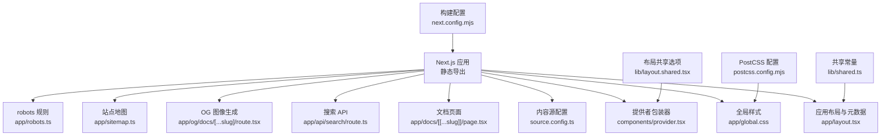
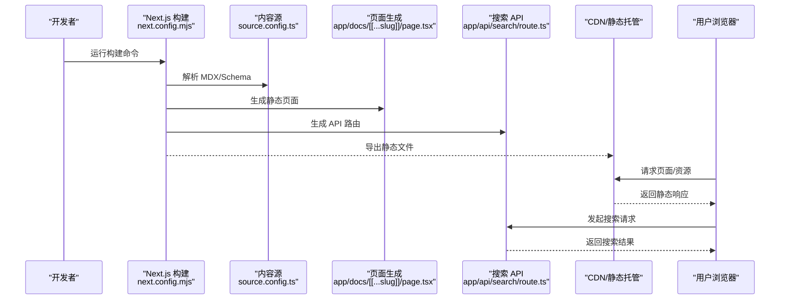
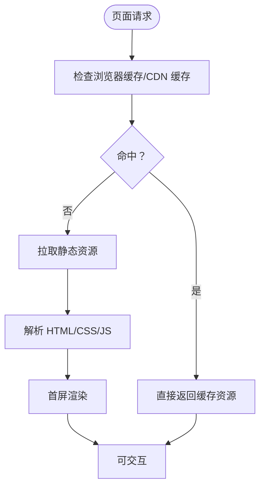
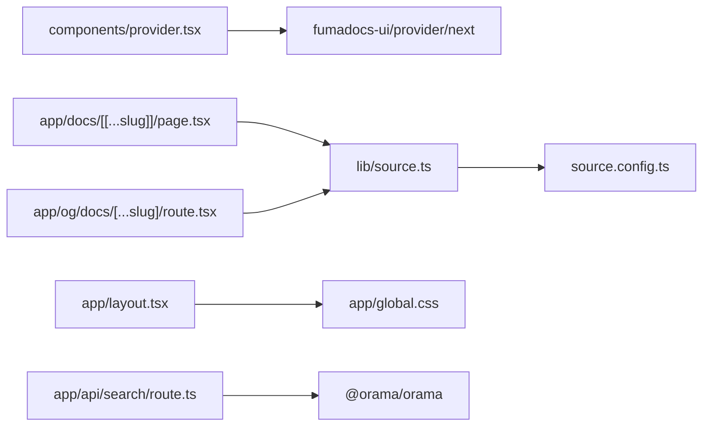
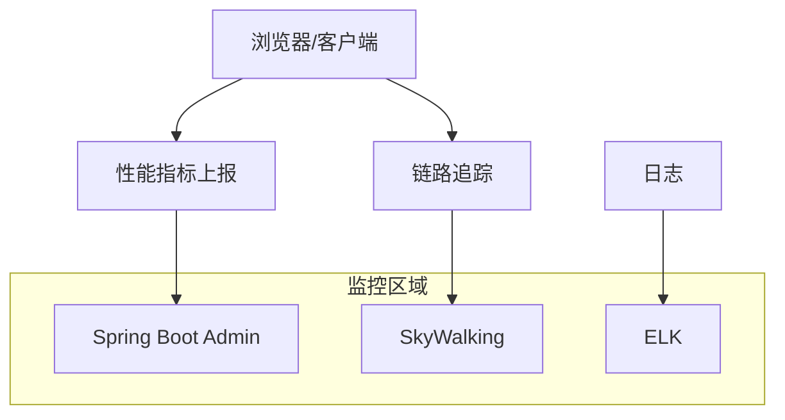

# 监控与性能优化

<cite>
**本文引用的文件**
- [README.md](file://README.md)
- [package.json](file://package.json)
- [next.config.mjs](file://next.config.mjs)
- [postcss.config.mjs](file://postcss.config.mjs)
- [app/layout.tsx](file://app/layout.tsx)
- [components/provider.tsx](file://components/provider.tsx)
- [source.config.ts](file://source.config.ts)
- [lib/shared.ts](file://lib/shared.ts)
- [lib/layout.shared.tsx](file://lib/layout.shared.tsx)
- [app/global.css](file://app/global.css)
- [app/sitemap.ts](file://app/sitemap.ts)
- [app/robots.ts](file://app/robots.ts)
- [app/docs/[[...slug]]/page.tsx](file://app/docs/[[...slug]]/page.tsx)
- [app/og/docs/[...slug]/route.tsx](file://app/og/docs/[...slug]/route.tsx)
- [app/api/search/route.ts](file://app/api/search/route.ts)
- [components/devsecops-cycle.tsx](file://components/devsecops-cycle.tsx)
</cite>

## 目录
1. [简介](#简介)
2. [项目结构](#项目结构)
3. [核心组件](#核心组件)
4. [架构总览](#架构总览)
5. [详细组件分析](#详细组件分析)
6. [依赖关系分析](#依赖关系分析)
7. [性能考量](#性能考量)
8. [故障排查指南](#故障排查指南)
9. [结论](#结论)
10. [附录](#附录)

## 简介
本指南面向静态站点（Next.js 静态导出）的监控与性能优化，结合当前仓库的配置与实现，给出可落地的指标监控、CDN 缓存优化、构建与运行时性能观测、错误追踪、A/B 测试与用户行为分析、性能预算与告警、内存与资源消耗监控、性能回归检测与自动化测试，以及优先级排序与渐进式改进策略。

## 项目结构
该项目基于 Next.js 16，采用静态导出模式，内容通过 Fumadocs 提供的 MDX 文档源进行管理，并使用 TailwindCSS 与自定义样式。整体结构围绕应用层、组件层、样式层与内容源配置展开。

图表来源
- [next.config.mjs:1-15](file://next.config.mjs#L1-L15)
- [postcss.config.mjs:1-8](file://postcss.config.mjs#L1-L8)
- [app/layout.tsx:1-28](file://app/layout.tsx#L1-L28)
- [app/global.css:1-286](file://app/global.css#L1-L286)
- [source.config.ts:1-56](file://source.config.ts#L1-L56)
- [components/provider.tsx:1-36](file://components/provider.tsx#L1-L36)
- [lib/shared.ts:1-12](file://lib/shared.ts#L1-L12)
- [lib/layout.shared.tsx:1-36](file://lib/layout.shared.tsx#L1-L36)
- [app/docs/[[...slug]]/page.tsx:21-68](file://app/docs/[[...slug]]/page.tsx#L21-L68)
- [app/api/search/route.ts](file://app/api/search/route.ts)
- [app/og/docs/[...slug]/route.tsx:1-28](file://app/og/docs/[...slug]/route.tsx#L1-L28)
- [app/sitemap.ts:1-27](file://app/sitemap.ts#L1-L27)
- [app/robots.ts:1-14](file://app/robots.ts#L1-L14)

章节来源
- [README.md:1-48](file://README.md#L1-L48)
- [next.config.mjs:1-15](file://next.config.mjs#L1-L15)
- [postcss.config.mjs:1-8](file://postcss.config.mjs#L1-L8)
- [app/layout.tsx:1-28](file://app/layout.tsx#L1-L28)
- [app/global.css:1-286](file://app/global.css#L1-L286)
- [source.config.ts:1-56](file://source.config.ts#L1-L56)
- [components/provider.tsx:1-36](file://components/provider.tsx#L1-L36)
- [lib/shared.ts:1-12](file://lib/shared.ts#L1-L12)
- [lib/layout.shared.tsx:1-36](file://lib/layout.shared.tsx#L1-L36)
- [app/docs/[[...slug]]/page.tsx:21-68](file://app/docs/[[...slug]]/page.tsx#L21-L68)
- [app/api/search/route.ts](file://app/api/search/route.ts)
- [app/og/docs/[...slug]/route.tsx:1-28](file://app/og/docs/[...slug]/route.tsx#L1-L28)
- [app/sitemap.ts:1-27](file://app/sitemap.ts#L1-L27)
- [app/robots.ts:1-14](file://app/robots.ts#L1-L14)

## 核心组件
- 构建与导出配置：静态导出、图片优化关闭、严格模式等，影响产物体积与运行时开销。
- 内容源与 MDX：通过 Fumadocs 的 source 配置与 schema 定义，控制文档与博客内容的解析与渲染。
- 布局与主题：全局样式与 Provider 包装器，统一主题切换与国际化。
- 文档页面：动态参数生成与元数据生成，支持 SEO 与 OG 图像。
- 搜索 API：基于 Orama 的全文检索接口，作为运行时性能观测点。
- Sitemap/Robots：搜索引擎可见性与索引策略，间接影响首屏与爬虫体验。

章节来源
- [next.config.mjs:1-15](file://next.config.mjs#L1-L15)
- [source.config.ts:1-56](file://source.config.ts#L1-L56)
- [app/layout.tsx:1-28](file://app/layout.tsx#L1-L28)
- [components/provider.tsx:1-36](file://components/provider.tsx#L1-L36)
- [app/docs/[[...slug]]/page.tsx:21-68](file://app/docs/[[...slug]]/page.tsx#L21-L68)
- [app/api/search/route.ts](file://app/api/search/route.ts)
- [app/sitemap.ts:1-27](file://app/sitemap.ts#L1-L27)
- [app/robots.ts:1-14](file://app/robots.ts#L1-L14)

## 架构总览
静态站点从构建到发布的关键路径如下：

图表来源
- [next.config.mjs:1-15](file://next.config.mjs#L1-L15)
- [source.config.ts:1-56](file://source.config.ts#L1-L56)
- [app/docs/[[...slug]]/page.tsx:21-68](file://app/docs/[[...slug]]/page.tsx#L21-L68)
- [app/api/search/route.ts](file://app/api/search/route.ts)

## 详细组件分析

### 页面与首屏渲染
- 首屏渲染时间通常受以下因素影响：静态资源体积、关键路径 CSS、字体与图标加载、首屏内容是否按需加载。
- 当前项目已启用静态导出，有利于降低服务器端负载；同时关闭了图片优化，减少运行时开销，但需确保资源体积与缓存策略得当。

图表来源
- [next.config.mjs:7-11](file://next.config.mjs#L7-L11)
- [app/layout.tsx:19-27](file://app/layout.tsx#L19-L27)
- [app/global.css:1-286](file://app/global.css#L1-L286)

章节来源
- [next.config.mjs:7-11](file://next.config.mjs#L7-L11)
- [app/layout.tsx:19-27](file://app/layout.tsx#L19-L27)
- [app/global.css:1-286](file://app/global.css#L1-L286)

### CDN 性能监控与缓存命中率优化
- 监控维度：缓存命中率、边缘节点响应时间、回源比例、带宽与请求数。
- 优化策略：
  - 合理设置静态资源缓存头（长缓存 + 文件名指纹）。
  - 对 HTML 设置较短缓存或协商缓存，确保内容更新及时。
  - 使用分层缓存（浏览器缓存 + CDN 缓存 + 边缘缓存）。
  - 将字体、图标等关键资源置于高命中区域，避免频繁回源。
  - 利用压缩与传输优化（Gzip/Brotli）、HTTP/2 或 HTTP/3。

### 构建性能优化与打包分析
- 关键点：
  - 减少包体：移除未使用依赖、拆分第三方库、按需引入组件。
  - 分析与可视化：使用打包分析工具定位大体积模块与重复依赖。
  - 并行与增量：利用现代构建器的并行能力，开启增量编译。
  - 资源优化：压缩 JS/CSS、内联关键 CSS、延迟加载非关键资源。
- 在当前项目中，静态导出与禁用图片优化有助于降低构建与运行时成本。

章节来源
- [next.config.mjs:1-15](file://next.config.mjs#L1-L15)
- [package.json:1-45](file://package.json#L1-L45)

### 运行时性能监控与错误追踪
- 运行时指标：
  - 首字节时间（TTFB）、首屏渲染时间（FCP/LCP）、交互时间（INP）、页面稳定（CLS）。
  - API 响应时间与错误率（如搜索 API）。
- 错误追踪：
  - 前端：记录 JavaScript 异常、网络错误、资源加载失败。
  - 后端：API 错误日志、超时与重试统计。
- 工具建议：Web Vitals 监控、Sentry/Axiom/LogRocket 等。

章节来源
- [app/api/search/route.ts](file://app/api/search/route.ts)

### A/B 测试与用户行为分析
- A/B 测试：
  - 通过实验分组对不同页面版本或功能进行对比，收集转化率、停留时长等指标。
  - 建议使用轻量 SDK 或平台服务，确保不影响首屏性能。
- 用户行为分析：
  - 埋点事件：点击、滚动、输入、页面访问、搜索行为。
  - 结合分析平台（如 GA4/自建埋点），注意隐私合规与最小化采集。

### 性能预算设定与告警机制
- 预算项（示例）：
  - 首屏渲染时间 ≤ 1.8s，TTFB ≤ 200ms，JS 体积 ≤ 200KB（关键路径）。
  - 缓存命中率 ≥ 90%，边缘回源率 ≤ 5%。
- 告警：
  - 基于阈值触发（如 LCP 超过预算、错误率上升、缓存命中骤降）。
  - 多层级告警（开发/预发/线上）与通知渠道（邮件/IM）。

### 内存使用与资源消耗监控
- 监控对象：主线程阻塞、堆内存增长、帧率波动、CPU 占用。
- 方法：浏览器性能面板、Web Vitals、服务端指标（若部署在 SSR/边缘函数）。
- 优化：减少大计算、拆分任务、使用 Web Workers、避免内存泄漏。

### 性能回归检测与自动化测试
- 回归检测：
  - 在 CI 中运行性能基准测试（Lighthouse/SpeedIndex/WebPageTest）。
  - 对比基线（主干/上个版本），识别显著退化。
- 自动化：
  - 将性能测试纳入流水线，失败即阻断发布。
  - 使用可视化差异与交互测试保障关键路径不退化。

## 依赖关系分析
- 组件耦合：
  - Provider 依赖 fumadocs-ui 提供的主题与国际化能力。
  - 文档页面依赖 source 配置与 MDX 渲染。
  - OG 图像生成依赖文档页面元信息。
- 外部依赖：
  - Next.js、TailwindCSS、Fumadocs、Orama 全文检索。
- 潜在风险：
  - 第三方库体积过大可能影响首屏；需定期审计依赖树。

图表来源
- [components/provider.tsx:1-36](file://components/provider.tsx#L1-L36)
- [app/docs/[[...slug]]/page.tsx:21-68](file://app/docs/[[...slug]]/page.tsx#L21-L68)
- [app/og/docs/[...slug]/route.tsx:1-28](file://app/og/docs/[...slug]/route.tsx#L1-L28)
- [source.config.ts:1-56](file://source.config.ts#L1-L56)
- [app/layout.tsx:1-28](file://app/layout.tsx#L1-28)
- [app/global.css:1-286](file://app/global.css#L1-L286)
- [app/api/search/route.ts](file://app/api/search/route.ts)

章节来源
- [components/provider.tsx:1-36](file://components/provider.tsx#L1-L36)
- [app/docs/[[...slug]]/page.tsx:21-68](file://app/docs/[[...slug]]/page.tsx#L21-L68)
- [app/og/docs/[...slug]/route.tsx:1-28](file://app/og/docs/[...slug]/route.tsx#L1-L28)
- [source.config.ts:1-56](file://source.config.ts#L1-L56)
- [app/layout.tsx:1-28](file://app/layout.tsx#L1-L28)
- [app/global.css:1-286](file://app/global.css#L1-L286)
- [app/api/search/route.ts](file://app/api/search/route.ts)

## 性能考量
- 构建阶段：
  - 使用静态导出减少运行时开销；禁用图片优化以简化流程。
  - 控制依赖体积，避免不必要的 polyfill 与大库。
- 运行阶段：
  - 首屏关键 CSS 内联，非关键 CSS 延迟加载。
  - 字体与图标资源尽量本地化或使用高性能 CDN。
  - API（如搜索）应具备缓存与降级策略，避免成为性能瓶颈。
- 监控与告警：
  - 建立 Web Vitals 与业务指标监控，设置阈值与告警。
  - 对 CDN 缓存命中率与回源率进行持续观察。

章节来源
- [next.config.mjs:7-11](file://next.config.mjs#L7-L11)
- [app/global.css:1-286](file://app/global.css#L1-L286)
- [app/api/search/route.ts](file://app/api/search/route.ts)

## 故障排查指南
- 首屏慢：
  - 检查关键 CSS 是否内联、字体加载策略、是否存在大体积 JS。
  - 使用浏览器性能面板与 Web Vitals 工具定位瓶颈。
- 缓存异常：
  - 核对 CDN 缓存头与静态资源指纹；确认 HTML 的缓存策略。
- 搜索 API 响应慢：
  - 检查 Orama 索引大小与查询复杂度；考虑分页与结果限制。
- SEO 与索引问题：
  - 确认 sitemap 与 robots 配置正确，确保搜索引擎可正常抓取。

章节来源
- [app/sitemap.ts:1-27](file://app/sitemap.ts#L1-L27)
- [app/robots.ts:1-14](file://app/robots.ts#L1-L14)
- [app/api/search/route.ts](file://app/api/search/route.ts)

## 结论
通过静态导出与合理的 CDN 缓存策略，结合构建优化与运行时监控，可有效提升静态站点的性能与稳定性。建议以 Web Vitals 与业务指标为核心，建立预算、告警与回归检测机制，持续迭代优化。

## 附录

### 监控体系与 DevSecOps 建议
- 可参考项目中的监控区域示意，将前端性能监控、APM 链路与日志系统整合，形成闭环。

图表来源
- [components/devsecops-cycle.tsx:158-346](file://components/devsecops-cycle.tsx#L158-L346)