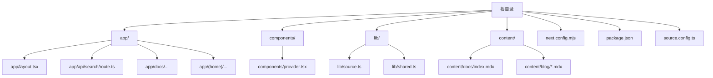
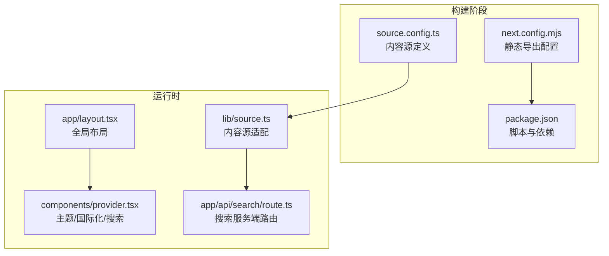
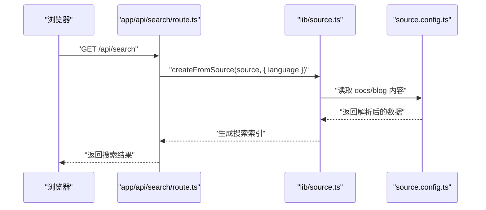
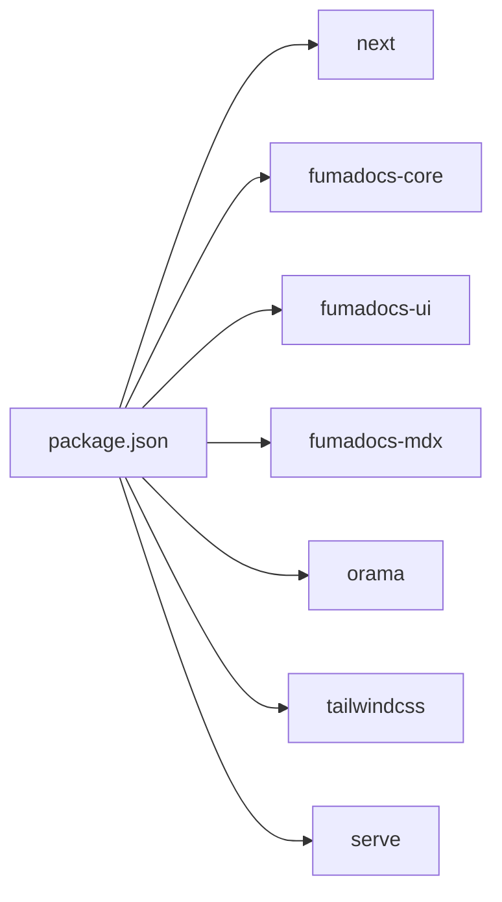

# 部署与运维

<cite>
**本文引用的文件**
- [README.md](file://README.md)
- [next.config.mjs](file://next.config.mjs)
- [package.json](file://package.json)
- [source.config.ts](file://source.config.ts)
- [lib/source.ts](file://lib/source.ts)
- [app/api/search/route.ts](file://app/api/search/route.ts)
- [components/provider.tsx](file://components/provider.tsx)
- [app/layout.tsx](file://app/layout.tsx)
</cite>

## 目录
1. [简介](#简介)
2. [项目结构](#项目结构)
3. [核心组件](#核心组件)
4. [架构总览](#架构总览)
5. [详细组件分析](#详细组件分析)
6. [依赖分析](#依赖分析)
7. [性能考虑](#性能考虑)
8. [故障排除指南](#故障排除指南)
9. [结论](#结论)
10. [附录](#附录)

## 简介
本指南面向运维人员与开发者，围绕该 Next.js 应用的部署与运维展开，重点覆盖以下方面：
- 静态导出配置的设置与优化
- CDN 部署最佳实践与配置要点
- 环境变量的配置与管理策略
- 不同部署平台的配置指引（Vercel、Netlify、GitHub Pages 等）
- 构建优化与性能调优
- 监控与日志记录
- 安全配置与 HTTPS 部署
- 备份与恢复策略
- 版本管理与回滚机制
- 故障排除与性能监控实用指南

该应用采用静态导出模式，适合在 CDN 或静态托管平台进行分发；同时集成了内容源适配器与站内搜索服务端路由，便于在静态站点中实现全文检索能力。

## 项目结构
该仓库为基于 Next.js 的文档型站点，采用 App Router 结构，并通过静态导出生成纯静态产物。关键目录与文件如下：
- app：页面与 API 路由所在目录
- components：UI 组件与全局 Provider
- lib：内容源适配与工具函数
- content：MDX 文档与博客内容
- 根目录配置：next.config.mjs、package.json、source.config.ts 等

图表来源
- [next.config.mjs:1-15](file://next.config.mjs#L1-L15)
- [package.json:1-39](file://package.json#L1-L39)
- [source.config.ts:1-47](file://source.config.ts#L1-L47)
- [lib/source.ts:1-37](file://lib/source.ts#L1-L37)
- [app/api/search/route.ts:1-10](file://app/api/search/route.ts#L1-L10)
- [components/provider.tsx:1-36](file://components/provider.tsx#L1-L36)
- [app/layout.tsx:1-13](file://app/layout.tsx#L1-L13)

章节来源
- [README.md:1-48](file://README.md#L1-L48)
- [next.config.mjs:1-15](file://next.config.mjs#L1-L15)
- [package.json:1-39](file://package.json#L1-L39)
- [source.config.ts:1-47](file://source.config.ts#L1-L47)
- [lib/source.ts:1-37](file://lib/source.ts#L1-L37)
- [app/api/search/route.ts:1-10](file://app/api/search/route.ts#L1-L10)
- [components/provider.tsx:1-36](file://components/provider.tsx#L1-L36)
- [app/layout.tsx:1-13](file://app/layout.tsx#L1-L13)

## 核心组件
- 静态导出配置：通过 next.config.mjs 将输出模式设为静态导出，并禁用图片优化以适配静态托管。
- 内容源适配：lib/source.ts 使用 fumadocs 的 loader 将 content/docs 与 content/blog 的内容暴露为可查询的数据源。
- 搜索服务端路由：app/api/search/route.ts 基于内容源生成搜索索引，支持语言配置与缓存控制。
- 全局 Provider：components/provider.tsx 提供主题、国际化与搜索对话框等全局能力。
- 页面布局：app/layout.tsx 设置语言、字体与全局样式，确保 SSR/Hydration 行为一致。

章节来源
- [next.config.mjs:1-15](file://next.config.mjs#L1-L15)
- [lib/source.ts:1-37](file://lib/source.ts#L1-L37)
- [app/api/search/route.ts:1-10](file://app/api/search/route.ts#L1-L10)
- [components/provider.tsx:1-36](file://components/provider.tsx#L1-L36)
- [app/layout.tsx:1-13](file://app/layout.tsx#L1-L13)

## 架构总览
该应用采用“静态导出 + CDN 分发”的架构，核心流程如下：
- 开发与构建：使用 Next.js 构建静态产物
- 内容加载：通过内容源适配器读取 content/docs 与 content/blog
- 搜索索引：在服务端路由中基于内容源生成搜索索引
- 部署：将静态产物部署到 CDN 或静态托管平台

图表来源
- [next.config.mjs:1-15](file://next.config.mjs#L1-L15)
- [package.json:1-39](file://package.json#L1-L39)
- [source.config.ts:1-47](file://source.config.ts#L1-L47)
- [lib/source.ts:1-37](file://lib/source.ts#L1-L37)
- [app/api/search/route.ts:1-10](file://app/api/search/route.ts#L1-L10)
- [components/provider.tsx:1-36](file://components/provider.tsx#L1-L36)
- [app/layout.tsx:1-13](file://app/layout.tsx#L1-L13)

## 详细组件分析

### 静态导出配置与优化
- 输出模式：静态导出，适合 CDN 与静态托管平台
- 图片处理：关闭图片优化，避免在静态托管环境中出现资源路径问题
- 构建命令：通过 package.json 中的 build 脚本触发 Next.js 构建
- 启动方式：本地开发使用 dev，生产静态服务器可使用 serve 命令启动

建议优化点
- 预渲染策略：根据内容规模评估预渲染页面数量，必要时拆分或延迟加载
- 资源压缩：结合 CDN 的 gzip/br 压缩与缓存策略提升首屏性能
- 路由重写：如需自定义 404/500 页面，可在静态导出后补充对应静态文件

章节来源
- [next.config.mjs:1-15](file://next.config.mjs#L1-L15)
- [package.json:1-39](file://package.json#L1-L39)

### 内容源适配与搜索
- 内容源：通过 source.config.ts 定义 docs 与 blog 的目录、schema 与后处理选项
- 数据加载：lib/source.ts 使用 loader 将内容源转换为可查询的数据结构
- 搜索索引：app/api/search/route.ts 基于内容源创建搜索索引，支持语言配置与缓存控制

图表来源
- [app/api/search/route.ts:1-10](file://app/api/search/route.ts#L1-L10)
- [lib/source.ts:1-37](file://lib/source.ts#L1-L37)
- [source.config.ts:1-47](file://source.config.ts#L1-L47)

章节来源
- [source.config.ts:1-47](file://source.config.ts#L1-L47)
- [lib/source.ts:1-37](file://lib/source.ts#L1-L37)
- [app/api/search/route.ts:1-10](file://app/api/search/route.ts#L1-L10)

### 全局 Provider 与主题/国际化
- 主题系统：启用系统主题、默认跟随系统，并通过 class 属性切换
- 国际化：提供中文翻译映射，用于搜索、目录、更新时间等文案
- 搜索对话框：集成搜索组件，支持站内检索

章节来源
- [components/provider.tsx:1-36](file://components/provider.tsx#L1-L36)

### 页面布局与 Hydration
- 语言与字体：在 html 标签上设置语言与字体，保证跨设备一致性
- 抑制水合警告：在开发环境下可抑制水合警告，减少调试噪音
- Provider 包裹：确保主题与国际化在页面层级生效

章节来源
- [app/layout.tsx:1-13](file://app/layout.tsx#L1-L13)

## 依赖分析
- 构建与运行
  - 构建：next build
  - 启动：本地 dev；生产静态服务器可用 serve 命令
- 关键依赖
  - next：框架核心
  - fumadocs-*：内容与 UI 生态
  - orama：全文检索
  - tailwindcss：样式工具链

图表来源
- [package.json:1-39](file://package.json#L1-L39)

章节来源
- [package.json:1-39](file://package.json#L1-L39)

## 性能考虑
- 构建优化
  - 静态导出：减少运行时开销，提升 CDN 分发效率
  - 图片优化：在静态导出模式下禁用自动优化，避免路径问题
- 资源与缓存
  - CDN 缓存策略：对静态资源设置长缓存，对 HTML 设置合理缓存
  - 压缩：开启 gzip/br 压缩，降低传输体积
- 搜索性能
  - 搜索索引：在服务端生成，避免客户端构建负担
  - 语言配置：针对目标语言优化索引与检索体验
- 渲染与交互
  - 主题与国际化：在 Provider 中集中配置，减少重复计算
  - 字体与排版：统一字体与字号，减少布局抖动

章节来源
- [next.config.mjs:1-15](file://next.config.mjs#L1-L15)
- [app/api/search/route.ts:1-10](file://app/api/search/route.ts#L1-L10)
- [components/provider.tsx:1-36](file://components/provider.tsx#L1-L36)

## 故障排除指南
- 静态导出相关
  - 图片路径异常：确认已禁用图片优化，检查资源引用是否为绝对路径
  - 动态路由缺失：静态导出会忽略动态路由，需改用静态页面或服务端路由
- 搜索功能异常
  - 搜索无结果：检查内容源配置与语言设置，确认服务端路由已正确生成索引
  - 缓存问题：适当调整 revalidate 策略或清理缓存
- 构建失败
  - 类型检查：执行类型检查脚本，修复类型错误
  - 依赖安装：使用包管理器安装依赖，确保版本兼容

章节来源
- [next.config.mjs:1-15](file://next.config.mjs#L1-L15)
- [app/api/search/route.ts:1-10](file://app/api/search/route.ts#L1-L10)
- [package.json:1-39](file://package.json#L1-L39)

## 结论
该应用通过静态导出与 CDN 分发实现了高可用、高性能的文档站点部署方案。配合内容源适配与搜索服务端路由，能够在静态环境中提供丰富的交互体验。建议在实际部署中结合平台特性完善缓存、压缩与监控策略，并建立完善的版本管理与回滚机制，以保障线上稳定性与可维护性。

## 附录

### 静态导出配置设置与优化
- 输出模式：静态导出
- 图片处理：禁用优化
- 构建与启动：使用构建脚本与静态服务器命令
- 参考路径
  - [next.config.mjs:1-15](file://next.config.mjs#L1-L15)
  - [package.json:1-39](file://package.json#L1-L39)

### CDN 部署最佳实践
- 缓存策略：静态资源长缓存，HTML 短缓存
- 压缩：启用 gzip/br
- HTTPS：强制 HTTPS，配置 HSTS
- 自定义域名：绑定 CNAME 并配置 DNS
- 参考路径
  - [next.config.mjs:1-15](file://next.config.mjs#L1-L15)

### 环境变量配置与管理
- 运行时变量：在构建与部署平台设置环境变量
- 内容源与搜索：根据部署环境调整基础 URL 与语言配置
- 参考路径
  - [lib/source.ts:1-37](file://lib/source.ts#L1-L37)
  - [app/api/search/route.ts:1-10](file://app/api/search/route.ts#L1-L10)

### 不同部署平台配置指引
- Vercel
  - 使用静态导出产物，自动识别输出目录
  - 配置环境变量与构建命令
- Netlify
  - 指定发布目录与函数目录
  - 配置重写规则与缓存头
- GitHub Pages
  - 使用子路径部署，配置基础路径
  - 在 CI 中生成静态产物并推送到 gh-pages 分支
- 参考路径
  - [next.config.mjs:1-15](file://next.config.mjs#L1-L15)
  - [package.json:1-39](file://package.json#L1-L39)

### 构建优化与性能调优
- 减少预渲染页面数量
- 合理使用 CDN 缓存与压缩
- 优化字体与资源加载顺序
- 参考路径
  - [next.config.mjs:1-15](file://next.config.mjs#L1-L15)

### 监控与日志记录
- CDN 访问日志：收集 4xx/5xx 与响应时间
- 应用埋点：在搜索与导航事件中添加埋点
- 日志聚合：将静态托管日志接入日志平台
- 参考路径
  - [app/api/search/route.ts:1-10](file://app/api/search/route.ts#L1-L10)

### 安全配置与 HTTPS 部署
- HTTPS 强制：CDN 与平台均启用 HTTPS
- 安全头：配置 CSP、HSTS、X-Frame-Options 等
- 访问控制：限制敏感路径访问
- 参考路径
  - [components/provider.tsx:1-36](file://components/provider.tsx#L1-L36)

### 备份与恢复策略
- 备份：定期备份静态产物与内容源
- 恢复：从备份快速恢复至 CDN 或托管平台
- 参考路径
  - [README.md:1-48](file://README.md#L1-L48)

### 版本管理与回滚机制
- 版本标签：使用 Git 标签管理发布版本
- 回滚：通过平台回滚到上一稳定版本
- 参考路径
  - [package.json:1-39](file://package.json#L1-L39)