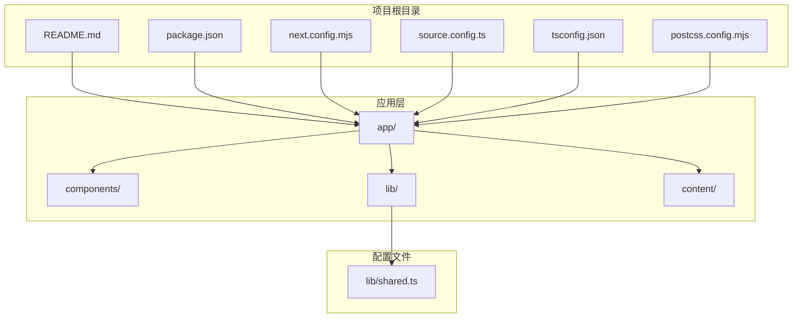
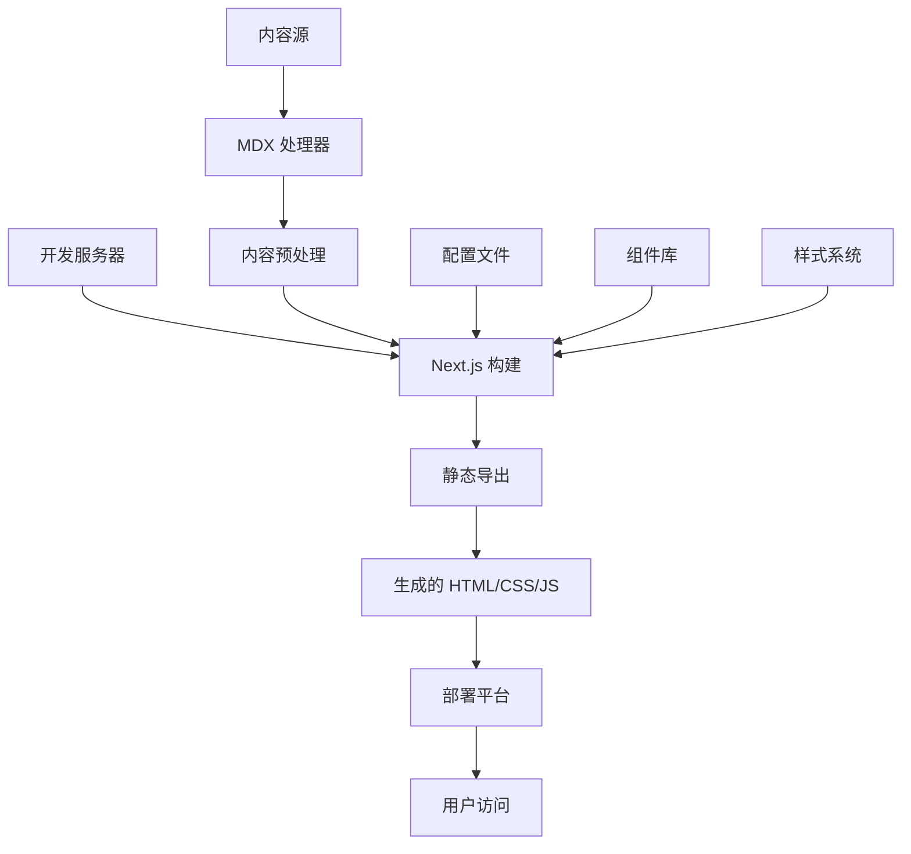
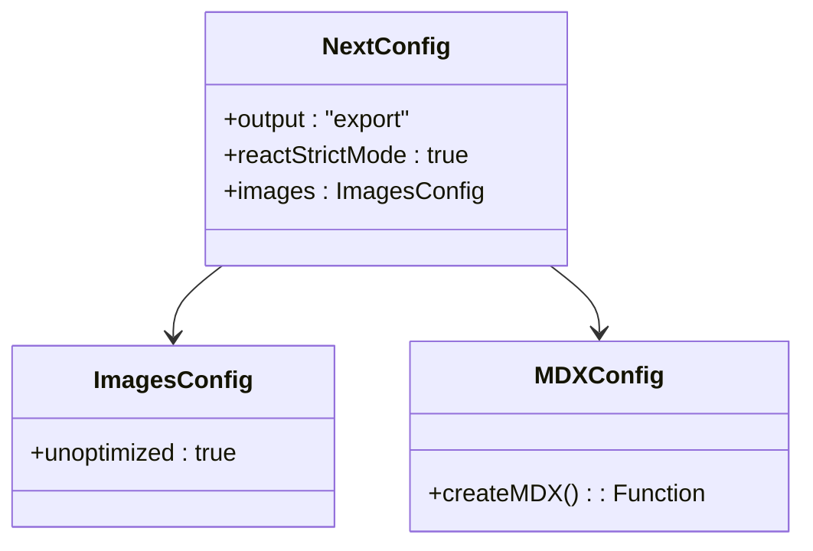
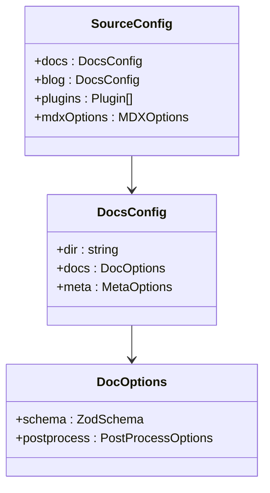
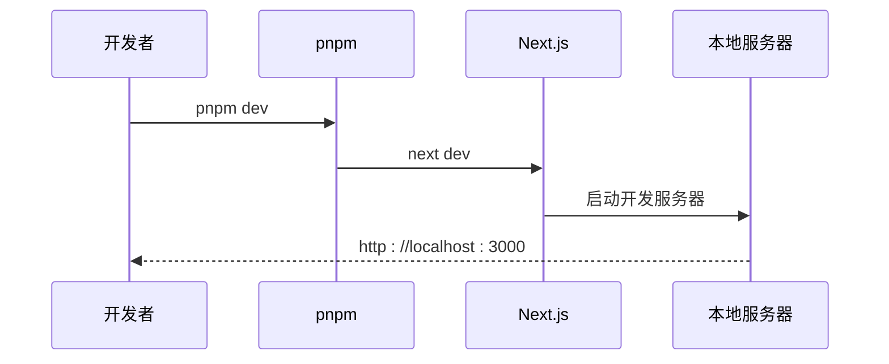

# 部署平台配置

<cite>
**本文档引用的文件**
- [README.md](file://README.md)
- [package.json](file://package.json)
- [next.config.mjs](file://next.config.mjs)
- [source.config.ts](file://source.config.ts)
- [tsconfig.json](file://tsconfig.json)
- [postcss.config.mjs](file://postcss.config.mjs)
- [lib/shared.ts](file://lib/shared.ts)
</cite>

## 目录
1. [简介](#简介)
2. [项目结构](#项目结构)
3. [核心组件](#核心组件)
4. [架构概览](#架构概览)
5. [详细组件分析](#详细组件分析)
6. [依赖关系分析](#依赖关系分析)
7. [性能考虑](#性能考虑)
8. [故障排除指南](#故障排除指南)
9. [结论](#结论)
10. [附录](#附录)

## 简介
本项目是一个基于 Next.js 的静态站点生成器，使用 Fumadocs 框架构建文档网站。项目通过静态导出（Static Export）模式构建，支持在多个平台上进行部署，包括 Vercel、Netlify、GitHub Pages 以及云平台如 AWS S3 + CloudFront、Google Cloud Run 等。

## 项目结构
项目采用 Next.js App Router 结构，主要包含以下关键目录和文件：
- app/: 应用程序的主要页面和路由
- components/: 可复用的 React 组件
- content/: 文档内容（MDX 格式）
- lib/: 工具函数和共享配置
- 其他配置文件：next.config.mjs、source.config.ts、tsconfig.json 等



**图表来源**
- [README.md](file://README.md)
- [package.json](file://package.json)
- [next.config.mjs](file://next.config.mjs)
- [source.config.ts](file://source.config.ts)
- [tsconfig.json](file://tsconfig.json)
- [postcss.config.mjs](file://postcss.config.mjs)
- [lib/shared.ts](file://lib/shared.ts)

**章节来源**
- [README.md](file://README.md)
- [package.json](file://package.json)
- [next.config.mjs](file://next.config.mjs)
- [source.config.ts](file://source.config.ts)
- [tsconfig.json](file://tsconfig.json)
- [postcss.config.mjs](file://postcss.config.mjs)
- [lib/shared.ts](file://lib/shared.ts)

## 核心组件
项目的核心配置集中在几个关键文件中：

### 构建配置
项目使用 Next.js 的静态导出模式，配置位于 next.config.mjs 中：
- output: 'export' - 启用静态导出
- images.unoptimized: true - 禁用 Next.js 图像优化
- 使用 MDX 支持通过 fumadocs-mdx

### 内容配置
source.config.ts 定义了文档内容源：
- 定义了 docs 和 blog 两个内容集合
- 配置了 Front Matter Schema
- 启用了 last-modified 插件
- 配置了数学公式渲染支持

### TypeScript 配置
tsconfig.json 提供了完整的 TypeScript 编译配置，包括路径映射和模块解析设置。

**章节来源**
- [next.config.mjs](file://next.config.mjs)
- [source.config.ts](file://source.config.ts)
- [tsconfig.json](file://tsconfig.json)

## 架构概览
项目采用静态站点生成架构，构建时将动态内容转换为静态 HTML 文件。



**图表来源**
- [next.config.mjs](file://next.config.mjs)
- [source.config.ts](file://source.config.ts)
- [package.json](file://package.json)

## 详细组件分析

### 构建系统配置
项目使用 Next.js 16.2.4 和 Fumadocs 16.8.5 框架，构建系统具有以下特点：

#### 静态导出配置


**图表来源**
- [next.config.mjs](file://next.config.mjs)

#### 内容管理系统


**图表来源**
- [source.config.ts](file://source.config.ts)

**章节来源**
- [next.config.mjs](file://next.config.mjs)
- [source.config.ts](file://source.config.ts)

### 开发工具链
项目使用现代化的开发工具链：

#### 包管理器配置
- 使用 pnpm 作为包管理器
- 支持 TypeScript 类型检查
- 集成了 Tailwind CSS 和 PostCSS

#### 构建脚本


**图表来源**
- [package.json](file://package.json)

**章节来源**
- [package.json](file://package.json)

## 依赖关系分析

### 核心依赖
项目的关键依赖包括：
- next: 16.2.4 - 主框架
- fumadocs-core: 16.8.5 - 文档框架核心
- fumadocs-mdx: 14.3.2 - MDX 支持
- @heroui/react: 3.0.3 - UI 组件库
- react: ^19.2.5 - React 框架
- tailwind-merge: 3.5.0 - Tailwind CSS 工具

### 开发依赖
- @types/react: 19.2.14 - React 类型定义
- typescript: 6.0.3 - TypeScript 编译器
- tailwindcss: 4.2.4 - CSS 框架
- serve: 14.2.6 - 本地静态服务器

```mermaid
graph LR
subgraph "运行时依赖"
A[next@16.2.4]
B[fumadocs-core@16.8.5]
C[fumadocs-mdx@14.3.2]
D[@heroui/react@3.0.3]
E[react@^19.2.5]
end
subgraph "开发依赖"
F[@types/react@19.2.14]
G[typescript@6.0.3]
H[tailwindcss@4.2.4]
I[serve@14.2.6]
end
A --> B
A --> C
A --> D
A --> E
F --> A
G --> A
H --> A
I --> A
```

**图表来源**
- [package.json](file://package.json)

**章节来源**
- [package.json](file://package.json)

## 性能考虑
由于项目采用静态导出模式，具有以下性能优势：

### 静态资源优化
- 所有资源在构建时生成，减少运行时开销
- 图片未优化配置适合静态部署场景
- CSS 通过 Tailwind CSS 动态生成，按需包含

### 加载性能
- 静态 HTML 文件直接由 CDN 分发
- 减少了服务器端渲染的复杂性
- 更好的缓存策略支持

## 故障排除指南

### 常见部署问题
1. **构建失败**
   - 检查 Node.js 版本兼容性
   - 确认所有依赖已正确安装
   - 验证 TypeScript 配置

2. **静态资源加载错误**
   - 确认 base path 配置正确
   - 检查 CDN 缓存设置
   - 验证文件路径映射

3. **MDX 内容渲染问题**
   - 检查 Front Matter Schema 配置
   - 验证 MDX 文件格式
   - 确认插件配置正确

**章节来源**
- [next.config.mjs](file://next.config.mjs)
- [source.config.ts](file://source.config.ts)
- [tsconfig.json](file://tsconfig.json)

## 结论
本项目提供了一个完整的静态文档网站解决方案，通过 Next.js 的静态导出功能和 Fumadocs 框架，实现了高性能、可扩展的文档站点。项目配置简洁明了，易于在各种部署平台上进行部署和维护。

## 附录

### 部署平台对比表

| 平台 | 部署方式 | 构建命令 | 输出目录 | 特色功能 |
|------|----------|----------|----------|----------|
| Vercel | 自动检测 | `next build` | `.next` | 一键部署、边缘网络、自动 HTTPS |
| Netlify | 静态部署 | `next build` | `out` | 拉取请求预览、表单处理 |
| GitHub Pages | 静态托管 | `next export` | `out` | 与 GitHub 无缝集成 |
| AWS S3 + CloudFront | 对象存储 | `next export` | `out` | 全球 CDN、自定义域名 |
| Google Cloud Run | 无服务器容器 | `next build` | 容器镜像 | 自动扩缩容、全球负载均衡 |

### 环境变量配置
- NEXT_PUBLIC_APP_NAME: 应用名称
- NEXT_PUBLIC_GITHUB_TOKEN: GitHub API 访问令牌
- NEXT_PUBLIC_BASE_PATH: 应用基础路径

### 安全配置建议
1. 启用 HTTPS 强制重定向
2. 配置安全响应头
3. 使用 CSP（内容安全策略）
4. 定期更新依赖包