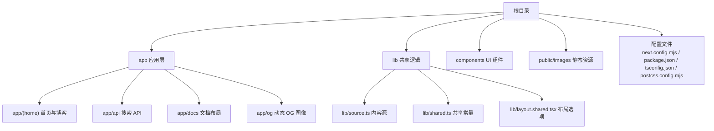
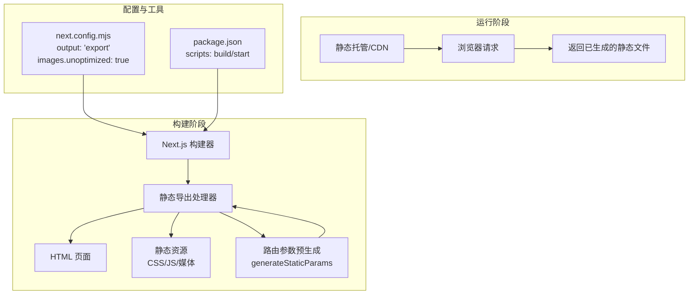
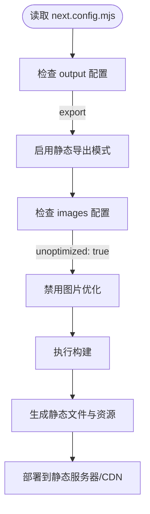
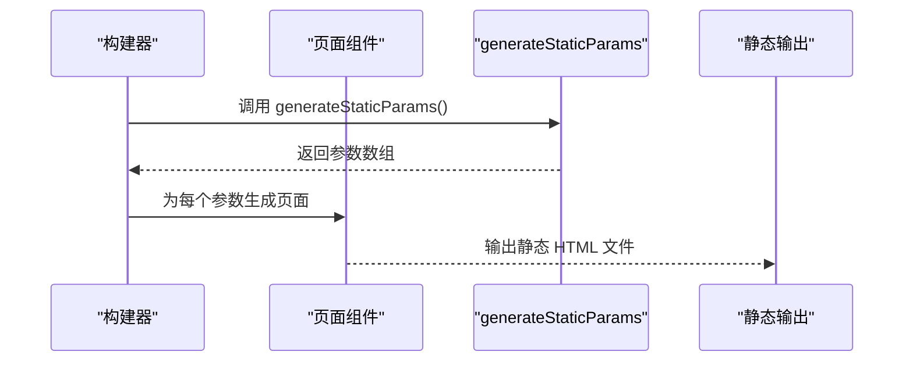
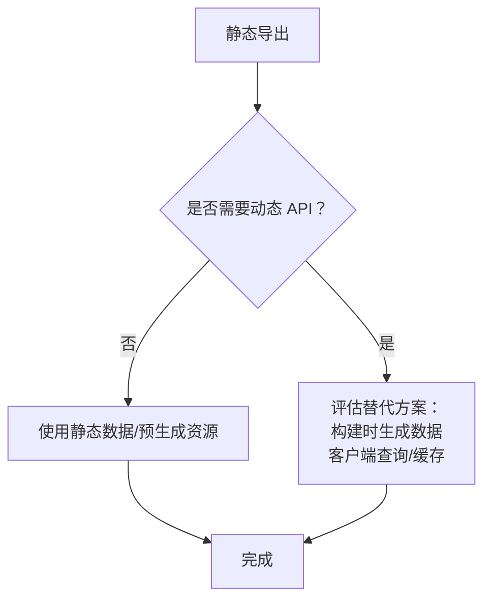
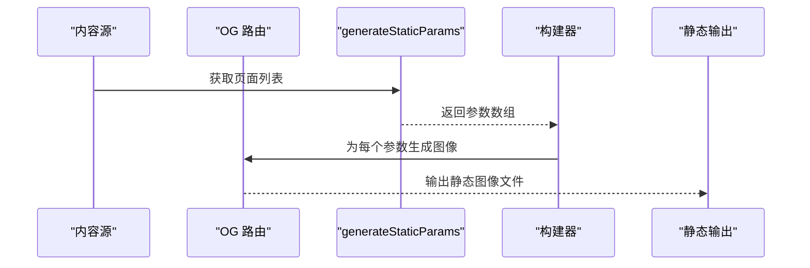
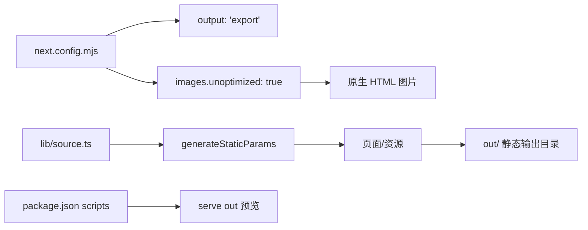

# 静态导出配置

<cite>
**本文档引用的文件**
- [next.config.mjs](file://next.config.mjs)
- [package.json](file://package.json)
- [README.md](file://README.md)
- [app/api/search/route.ts](file://app/api/search/route.ts)
- [app/og/docs/[...slug]/route.tsx](file://app/og/docs/[...slug]/route.tsx)
- [app/(home)/blog/[slug]/page.tsx](file://app/(home)/blog/[slug]/page.tsx)
- [lib/source.ts](file://lib/source.ts)
- [lib/shared.ts](file://lib/shared.ts)
- [.gitignore](file://.gitignore)
</cite>

## 目录
1. [简介](#简介)
2. [项目结构](#项目结构)
3. [核心组件](#核心组件)
4. [架构总览](#架构总览)
5. [详细组件分析](#详细组件分析)
6. [依赖关系分析](#依赖关系分析)
7. [性能考量](#性能考量)
8. [故障排除指南](#故障排除指南)
9. [结论](#结论)
10. [附录](#附录)

## 简介
本项目采用 Next.js 的静态导出（output: 'export'）模式，将应用构建为纯静态文件，可直接部署到任意静态托管服务（如静态文件服务器或 CDN）。该模式通过在构建时生成所有页面和资源，避免运行时渲染，从而获得更快的首屏加载速度和更低的运维复杂度。

静态导出的关键配置位于 next.config.mjs 中，核心包括：
- output: 'export'：启用静态导出，构建产物为可直接部署的静态文件。
- images.unoptimized: true：禁用 Next.js 图片优化，使用原生 HTML 图片标签以适配静态托管环境。

此外，项目脚本中包含一个启动静态服务器的命令，用于本地预览构建产物。

**章节来源**
- [next.config.mjs:1-15](file://next.config.mjs#L1-L15)
- [package.json:1-45](file://package.json#L1-L45)
- [README.md:1-48](file://README.md#L1-L48)

## 项目结构
项目采用 App Router 结构，主要目录与文件如下：
- app：应用页面与 API 路由
  - (home)：首页与博客等页面组
  - api：API 路由（如搜索）
  - docs：文档布局与页面
  - og：动态 OG 图像生成
- lib：内容源与共享配置
- components：UI 组件与 Provider
- public/images：公共资源
- 根目录配置：next.config.mjs、package.json、README.md、tsconfig.json、postcss.config.mjs

**图表来源**
- [next.config.mjs:1-15](file://next.config.mjs#L1-L15)
- [package.json:1-45](file://package.json#L1-L45)
- [lib/source.ts:1-36](file://lib/source.ts#L1-L36)
- [lib/shared.ts:1-12](file://lib/shared.ts#L1-L12)

**章节来源**
- [next.config.mjs:1-15](file://next.config.mjs#L1-L15)
- [package.json:1-45](file://package.json#L1-L45)
- [lib/source.ts:1-36](file://lib/source.ts#L1-L36)
- [lib/shared.ts:1-12](file://lib/shared.ts#L1-L12)

## 核心组件
本节聚焦静态导出相关的核心配置与实现要点：

- 静态导出配置
  - 在 next.config.mjs 中设置 output: 'export'，使构建产物为静态文件，无需 Node.js 运行时。
  - 同时设置 images.unoptimized: true，禁用 Next.js 图片优化，确保图片以原生 HTML 方式加载，兼容静态托管。
  - 使用 createMDX 包装器，保持 MDX 支持与静态导出兼容。

- 构建与预览脚本
  - package.json 中定义了 build、dev、start 等脚本。其中 start 使用 serve out 启动静态服务器，用于本地预览静态导出产物。
  - .gitignore 中忽略 out/ 目录，避免将构建产物提交到版本控制。

- 动态参数与静态生成
  - 多个页面实现了 generateStaticParams 函数，用于在构建时生成静态路由参数，确保每个动态路由都能被静态导出。
  - 示例：博客详情页、OG 图像路由等均通过 generateStaticParams 提前确定参数集合。

**章节来源**
- [next.config.mjs:1-15](file://next.config.mjs#L1-L15)
- [package.json:1-45](file://package.json#L1-L45)
- [.gitignore:1-26](file://.gitignore#L1-L26)
- [app/(home)/blog/[slug]/page.tsx:86-91](file://app/(home)/blog/[slug]/page.tsx#L86-L91)
- [app/og/docs/[...slug]/route.tsx:23-28](file://app/og/docs/[...slug]/route.tsx#L23-L28)

## 架构总览
静态导出模式下的系统架构强调“构建期生成 + 运行期分发”的分离。构建阶段生成所有页面与资源；运行阶段由静态服务器直接提供文件，不涉及后端逻辑。

**图表来源**
- [next.config.mjs:1-15](file://next.config.mjs#L1-L15)
- [package.json:1-45](file://package.json#L1-L45)

**章节来源**
- [next.config.mjs:1-15](file://next.config.mjs#L1-L15)
- [package.json:1-45](file://package.json#L1-L45)

## 详细组件分析

### 静态导出配置分析
静态导出的核心在于 next.config.mjs 中的两项配置：
- output: 'export'：强制构建器输出静态文件，移除对 Node.js 运行时的依赖。
- images.unoptimized: true：关闭 Next.js 图片优化，避免在静态托管环境中使用动态图片处理。

**图表来源**
- [next.config.mjs:1-15](file://next.config.mjs#L1-L15)

**章节来源**
- [next.config.mjs:1-15](file://next.config.mjs#L1-L15)

### 动态路由与静态生成
项目中的多个页面通过 generateStaticParams 实现静态参数预生成，确保在静态导出模式下仍能支持动态路由。

**图表来源**
- [app/(home)/blog/[slug]/page.tsx:86-91](file://app/(home)/blog/[slug]/page.tsx#L86-L91)
- [app/og/docs/[...slug]/route.tsx:23-28](file://app/og/docs/[...slug]/route.tsx#L23-L28)

**章节来源**
- [app/(home)/blog/[slug]/page.tsx:86-91](file://app/(home)/blog/[slug]/page.tsx#L86-L91)
- [app/og/docs/[...slug]/route.tsx:23-28](file://app/og/docs/[...slug]/route.tsx#L23-L28)

### API 路由与静态导出
项目包含 API 路由示例（如搜索），但静态导出模式下这些路由不会在运行时生效。需要特别注意：
- API 路由在静态导出模式下无法作为动态后端使用。
- 若需在静态导出中提供搜索能力，应结合静态生成策略（例如在构建时生成搜索索引数据）。

**图表来源**
- [app/api/search/route.ts:1-10](file://app/api/search/route.ts#L1-L10)

**章节来源**
- [app/api/search/route.ts:1-10](file://app/api/search/route.ts#L1-L10)

### OG 图像与静态导出
OG 图像路由通过 generateStaticParams 预先生成所有可能的图像参数，确保在静态导出模式下也能生成完整的 OG 图像集。

**图表来源**
- [app/og/docs/[...slug]/route.tsx:1-29](file://app/og/docs/[...slug]/route.tsx#L1-L29)
- [lib/source.ts:1-36](file://lib/source.ts#L1-L36)
- [lib/shared.ts:1-12](file://lib/shared.ts#L1-L12)

**章节来源**
- [app/og/docs/[...slug]/route.tsx:1-29](file://app/og/docs/[...slug]/route.tsx#L1-L29)
- [lib/source.ts:1-36](file://lib/source.ts#L1-L36)
- [lib/shared.ts:1-12](file://lib/shared.ts#L1-L12)

## 依赖关系分析
静态导出模式下的依赖关系主要围绕构建配置与页面生成策略：

**图表来源**
- [next.config.mjs:1-15](file://next.config.mjs#L1-L15)
- [lib/source.ts:1-36](file://lib/source.ts#L1-L36)
- [package.json:1-45](file://package.json#L1-L45)

**章节来源**
- [next.config.mjs:1-15](file://next.config.mjs#L1-L15)
- [lib/source.ts:1-36](file://lib/source.ts#L1-L36)
- [package.json:1-45](file://package.json#L1-L45)

## 性能考量
静态导出模式的性能优势主要体现在以下方面：
- 首屏加载：静态文件直接由 CDN 分发，减少服务器响应时间。
- 缓存友好：静态资源具备良好的缓存策略，提升重复访问性能。
- 低运维成本：无需 Node.js 运行时，简化部署与扩缩容。

优化建议：
- 将图片与媒体资源置于 CDN，利用静态托管的全球加速能力。
- 控制页面体积，拆分代码与懒加载非关键资源。
- 使用合适的构建与打包策略，减少不必要的依赖与冗余代码。

[本节为通用性能建议，不直接分析具体文件]

## 故障排除指南
常见问题与解决方案：
- 构建后页面空白或资源 404
  - 检查 next.config.mjs 是否正确设置 output: 'export' 与 images.unoptimized: true。
  - 确认 generateStaticParams 已为所有动态路由提供完整参数集合。
  - 验证构建输出目录 out/ 是否存在且可被静态服务器访问。
- API 路由在静态导出中不可用
  - 静态导出模式下 API 路由不会运行，需改用构建时生成数据或客户端查询方式。
- 图片显示异常
  - 确保使用原生 HTML 图片标签，并检查路径与部署后的相对路径一致性。

**章节来源**
- [next.config.mjs:1-15](file://next.config.mjs#L1-L15)
- [app/(home)/blog/[slug]/page.tsx:86-91](file://app/(home)/blog/[slug]/page.tsx#L86-L91)
- [app/og/docs/[...slug]/route.tsx:23-28](file://app/og/docs/[...slug]/route.tsx#L23-L28)
- [.gitignore:1-26](file://.gitignore#L1-L26)

## 结论
静态导出模式通过“构建期生成 + 运行期分发”的方式，显著简化了部署与提升了性能。在本项目中，通过 next.config.mjs 的 output: 'export' 与 images.unoptimized: true 配置，以及多处 generateStaticParams 的使用，确保了页面与资源的完整静态化。对于需要动态功能的场景，应提前规划构建时生成策略或客户端处理方案，以在静态导出模式下实现一致的用户体验。

[本节为总结性内容，不直接分析具体文件]

## 附录
- 与传统 SSR/SSG 的区别与选择标准
  - SSR：运行时按请求渲染，适合需要实时数据与复杂交互的场景，但部署与扩展更复杂。
  - SSG：构建时生成静态页面，适合内容稳定、追求极致性能与低成本的场景。
  - 静态导出：构建为纯静态文件，部署最简单，适合文档站、博客、企业官网等。
- 最佳实践
  - 对动态路由使用 generateStaticParams 提前生成参数。
  - 将图片与媒体资源置于 CDN，避免 Next.js 图片优化带来的运行时依赖。
  - 使用本地 serve out 预览构建产物，确保部署一致性。

[本节为概念性内容，不直接分析具体文件]