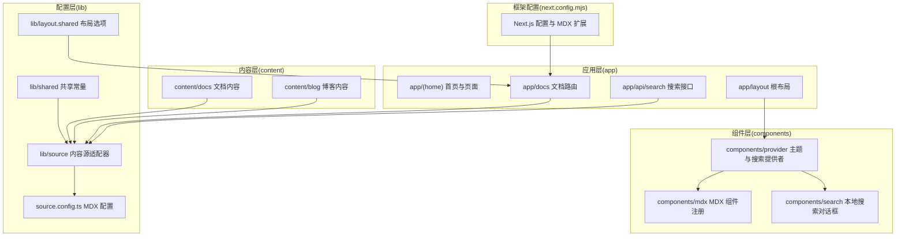
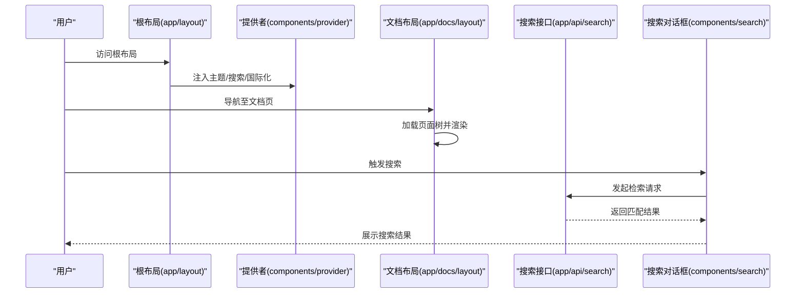
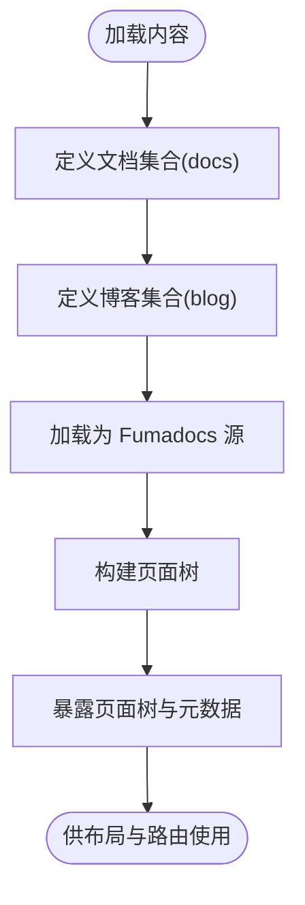
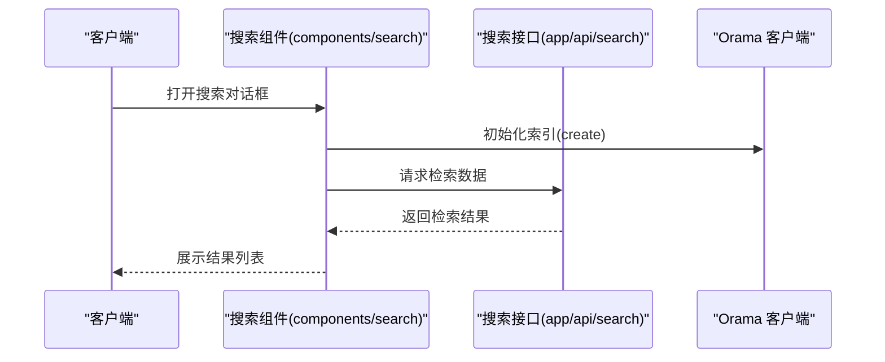
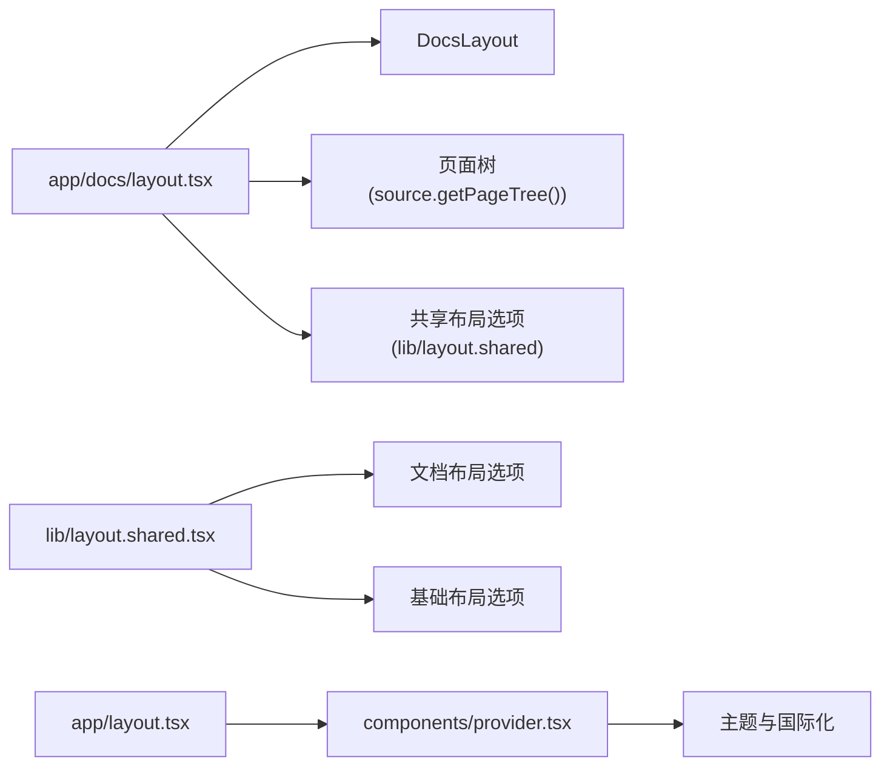
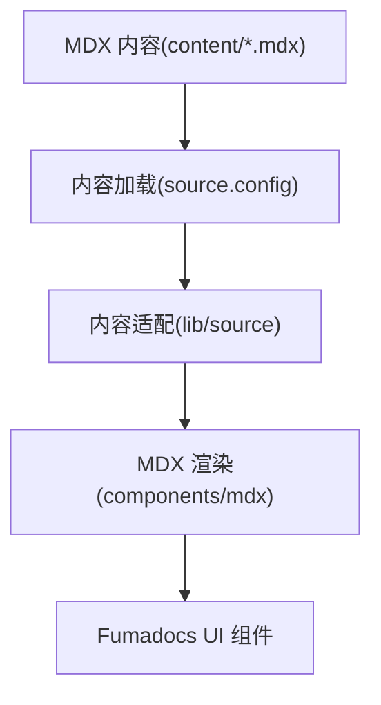
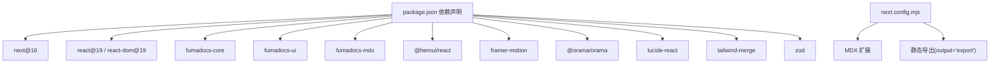

# 项目概述

<cite>
**本文引用的文件**
- [README.md](file://README.md)
- [package.json](file://package.json)
- [next.config.mjs](file://next.config.mjs)
- [source.config.ts](file://source.config.ts)
- [app/layout.tsx](file://app/layout.tsx)
- [components/provider.tsx](file://components/provider.tsx)
- [lib/source.ts](file://lib/source.ts)
- [lib/layout.shared.tsx](file://lib/layout.shared.tsx)
- [app/api/search/route.ts](file://app/api/search/route.ts)
- [app/docs/layout.tsx](file://app/docs/layout.tsx)
- [components/search.tsx](file://components/search.tsx)
- [components/mdx.tsx](file://components/mdx.tsx)
- [lib/shared.ts](file://lib/shared.ts)
- [content/docs/index.mdx](file://content/docs/index.mdx)
- [content/blog/202501150930-welcome-to-docme.mdx](file://content/blog/202501150930-welcome-to-docme.mdx)
</cite>

## 目录
1. [引言](#引言)
2. [项目结构](#项目结构)
3. [核心组件](#核心组件)
4. [架构总览](#架构总览)
5. [详细组件分析](#详细组件分析)
6. [依赖关系分析](#依赖关系分析)
7. [性能考量](#性能考量)
8. [故障排除指南](#故障排除指南)
9. [结论](#结论)
10. [附录](#附录)

## 引言
DocMe 是一个基于 Next.js 16 与 Fumadocs 构建的现代化文档站点生成器。其目标是通过简洁的配置与开箱即用的组件体系，帮助团队快速搭建美观、可扩展、具备全文搜索能力的文档与博客平台。项目采用静态导出部署方式，结合 MDX 内容模型与本地搜索索引，实现从内容到页面的一体化开发体验。

与传统文档系统相比，DocMe 的创新点在于：
- 基于 Next.js App Router 的现代路由与渲染模型
- 以 Fumadocs 为核心的内容与 UI 生态，提供统一的布局、导航与主题能力
- 将 MDX 与内容源解耦，便于扩展博客、文档等多类型内容
- 集成 Orama 全文搜索引擎，支持本地检索与国际化

## 项目结构
项目采用按功能分层与按路由分组相结合的组织方式：
- app：应用入口与路由定义，包含首页、文档、博客、API 等
- components：可复用 UI 组件与上下文提供者
- content：MDX 文档与博客内容
- lib：内容源适配器、共享配置与布局选项
- 根目录配置：Next.js、TypeScript、TailwindCSS、包管理等

图表来源
- [app/layout.tsx:1-13](file://app/layout.tsx#L1-L13)
- [components/provider.tsx:1-36](file://components/provider.tsx#L1-L36)
- [components/search.tsx:1-47](file://components/search.tsx#L1-L47)
- [components/mdx.tsx:1-16](file://components/mdx.tsx#L1-L16)
- [lib/source.ts:1-37](file://lib/source.ts#L1-L37)
- [lib/layout.shared.tsx:1-36](file://lib/layout.shared.tsx#L1-L36)
- [lib/shared.ts:1-12](file://lib/shared.ts#L1-L12)
- [source.config.ts:1-47](file://source.config.ts#L1-L47)
- [next.config.mjs:1-15](file://next.config.mjs#L1-L15)

章节来源
- [README.md:20-38](file://README.md#L20-L38)
- [next.config.mjs:1-15](file://next.config.mjs#L1-L15)

## 核心组件
- 内容源适配器：负责将 content/docs 与 content/blog 中的 MDX 内容转换为可被 UI 层消费的页面树与元数据，并提供图片与 Markdown 下载地址等辅助能力。
- 搜索服务：通过 Fumadocs 的 server 端搜索封装与 Orama 客户端索引，实现本地检索与国际化支持。
- 布局与导航：基于 Fumadocs 的 DocsLayout 与共享布局选项，提供文档子路由的侧边栏与全局导航。
- 主题与国际化：RootProvider 集成主题切换与中文文案翻译，支持系统主题与默认主题策略。
- MDX 组件注册：统一注入默认组件与用户自定义组件，确保文档渲染一致性。

章节来源
- [lib/source.ts:1-37](file://lib/source.ts#L1-L37)
- [app/api/search/route.ts:1-10](file://app/api/search/route.ts#L1-L10)
- [components/search.tsx:1-47](file://components/search.tsx#L1-L47)
- [app/docs/layout.tsx:1-14](file://app/docs/layout.tsx#L1-L14)
- [components/provider.tsx:1-36](file://components/provider.tsx#L1-L36)
- [components/mdx.tsx:1-16](file://components/mdx.tsx#L1-L16)

## 架构总览
DocMe 的整体架构围绕“内容源 → 适配器 → 路由与布局 → 搜索与主题”的链路展开。内容通过 source.config.ts 定义的文档集合与博客集合进行组织；lib/source.ts 将内容加载为页面树；app/docs/layout.tsx 使用 DocsLayout 渲染文档页面；搜索通过 app/api/search/route.ts 提供服务端检索接口，并在客户端通过 components/search.tsx 初始化 Orama 索引；components/provider.tsx 提供主题与国际化能力。

图表来源
- [app/layout.tsx:1-13](file://app/layout.tsx#L1-L13)
- [components/provider.tsx:1-36](file://components/provider.tsx#L1-L36)
- [app/docs/layout.tsx:1-14](file://app/docs/layout.tsx#L1-L14)
- [app/api/search/route.ts:1-10](file://app/api/search/route.ts#L1-L10)
- [components/search.tsx:1-47](file://components/search.tsx#L1-L47)

## 详细组件分析

### 内容源适配器与页面树
- 作用：将 content/docs 与 content/blog 的 MDX 内容转换为页面树，提供页面元数据、URL、图片与 Markdown 下载地址等。
- 关键点：通过 loader 与 docs.toFumadocsSource() 组合，配合 includeProcessedMarkdown 后处理选项，确保渲染时可访问已处理的 Markdown 文本。
- 复杂度：页面树构建与元数据解析的时间复杂度与内容数量线性相关；缓存与增量更新可通过 Fumadocs 的插件机制进一步优化。

图表来源
- [lib/source.ts:1-37](file://lib/source.ts#L1-L37)
- [source.config.ts:16-40](file://source.config.ts#L16-L40)

章节来源
- [lib/source.ts:1-37](file://lib/source.ts#L1-L37)
- [source.config.ts:1-47](file://source.config.ts#L1-L47)

### 搜索功能
- 服务端检索：app/api/search/route.ts 基于 createFromSource(source) 提供静态 GET 接口，支持语言配置。
- 客户端索引：components/search.tsx 使用 create 初始化 Orama 索引，结合 useDocsSearch 实现本地检索与加载状态管理。
- 数据流：服务端返回索引数据，客户端在首次打开搜索时初始化本地索引，后续查询优先走本地索引，提升响应速度。

图表来源
- [components/search.tsx:17-31](file://components/search.tsx#L17-L31)
- [app/api/search/route.ts:6-9](file://app/api/search/route.ts#L6-L9)

章节来源
- [app/api/search/route.ts:1-10](file://app/api/search/route.ts#L1-L10)
- [components/search.tsx:1-47](file://components/search.tsx#L1-L47)

### 布局与导航
- 文档布局：app/docs/layout.tsx 使用 DocsLayout 并传入页面树与共享布局选项，实现自动侧边栏与导航。
- 共享布局：lib/layout.shared.tsx 提供基础与文档专用两套布局选项，统一标题、链接与 GitHub 地址。
- 根布局：app/layout.tsx 设置全局样式、字体与 Provider 包裹，保证主题与国际化生效。

图表来源
- [app/docs/layout.tsx:1-14](file://app/docs/layout.tsx#L1-L14)
- [lib/layout.shared.tsx:1-36](file://lib/layout.shared.tsx#L1-L36)
- [app/layout.tsx:1-13](file://app/layout.tsx#L1-L13)
- [components/provider.tsx:1-36](file://components/provider.tsx#L1-L36)

章节来源
- [app/docs/layout.tsx:1-14](file://app/docs/layout.tsx#L1-L14)
- [lib/layout.shared.tsx:1-36](file://lib/layout.shared.tsx#L1-L36)
- [app/layout.tsx:1-13](file://app/layout.tsx#L1-L13)
- [components/provider.tsx:1-36](file://components/provider.tsx#L1-L36)

### MDX 组件与渲染
- 默认组件：components/mdx.tsx 注入 fumadocs-ui 的默认 MDX 组件，确保表格、代码块、卡片等常见元素的统一风格。
- 自定义扩展：可通过 getMDXComponents 注入额外组件，满足特定文档需求。
- 与内容源协作：source.config.ts 中的 docs/blog 集合均启用 includeProcessedMarkdown，使渲染时可直接使用已处理的 Markdown 文本。

图表来源
- [components/mdx.tsx:1-16](file://components/mdx.tsx#L1-L16)
- [source.config.ts:16-40](file://source.config.ts#L16-L40)
- [lib/source.ts:10-10](file://lib/source.ts#L10-L10)

章节来源
- [components/mdx.tsx:1-16](file://components/mdx.tsx#L1-L16)
- [source.config.ts:16-40](file://source.config.ts#L16-L40)
- [lib/source.ts:10-10](file://lib/source.ts#L10-L10)

### 主题与国际化
- 主题：components/provider.tsx 使用 RootProvider 配置 enableSystem 与默认主题，支持 class 切换与系统跟随。
- 国际化：提供中文翻译映射，覆盖搜索、目录、更新时间等文案，确保中文用户的阅读体验。

章节来源
- [components/provider.tsx:6-31](file://components/provider.tsx#L6-L31)

## 依赖关系分析
- 运行时依赖：Next.js 16、React 19、Fumadocs 生态（core/ui/mdx）、HeroUI、Framer Motion、Orama、Lucide React、Tailwind Merge、Zod。
- 开发依赖：TailwindCSS v4、PostCSS、TypeScript、serve、@types/*。
- 构建与导出：next.config.mjs 启用 MDX 扩展与静态导出输出，images.unoptimized=true 适配静态部署。

图表来源
- [package.json:12-26](file://package.json#L12-L26)
- [next.config.mjs:1-15](file://next.config.mjs#L1-L15)

章节来源
- [package.json:1-39](file://package.json#L1-L39)
- [next.config.mjs:1-15](file://next.config.mjs#L1-L15)

## 性能考量
- 静态导出：通过 output: 'export' 降低运行时成本，适合文档类站点的稳定发布。
- 本地搜索：客户端初始化 Orama 索引，减少网络往返；服务端检索接口支持预热与缓存策略。
- 图片优化：unoptimized=true 适配静态托管；如需 CDN 可替换为受控域名。
- 构建与类型：脚本包含类型生成与检查，建议在 CI 中执行以保障质量。

## 故障排除指南
- 搜索无结果或加载异常
  - 检查 app/api/search/route.ts 的 language 与 revalidate 配置是否符合预期
  - 在 components/search.tsx 中确认 initOrama 的 schema 与语言设置一致
- 页面树为空或导航缺失
  - 确认 source.config.ts 中 docs/blog 的 dir 与 schema 正确
  - 检查 lib/source.ts 的 baseUrl 与 getPageTree 调用
- 主题或国际化不生效
  - 确认 app/layout.tsx 已包裹 Provider
  - 检查 components/provider.tsx 的 i18n 与 theme 配置
- MDX 组件未生效
  - 确认 components/mdx.tsx 的 getMDXComponents 已在文档页面中使用

章节来源
- [app/api/search/route.ts:1-10](file://app/api/search/route.ts#L1-L10)
- [components/search.tsx:17-31](file://components/search.tsx#L17-L31)
- [source.config.ts:16-40](file://source.config.ts#L16-L40)
- [lib/source.ts:1-37](file://lib/source.ts#L1-L37)
- [components/provider.tsx:19-35](file://components/provider.tsx#L19-L35)
- [components/mdx.tsx:4-8](file://components/mdx.tsx#L4-L8)

## 结论
DocMe 通过 Next.js 16 与 Fumadocs 的组合，提供了从内容创作到页面渲染、从导航到搜索的完整解决方案。其模块化的组件与清晰的配置边界，使得文档站点的维护与扩展变得简单高效。对于初学者，可直接使用默认布局与 MDX 组件快速上手；对于有经验的开发者，可通过自定义组件、扩展内容源与优化搜索策略进一步深化定制。

## 附录
- 示例内容
  - 文档首页示例：content/docs/index.mdx
  - 博客公告示例：content/blog/202501150930-welcome-to-docme.mdx
- 常用路径
  - 文档路由：/docs
  - 博客路由：/blog
  - 搜索接口：/api/search
  - 页面图片：/og/docs
  - LLM 内容：/llms.mdx/docs

章节来源
- [content/docs/index.mdx:1-19](file://content/docs/index.mdx#L1-L19)
- [content/blog/202501150930-welcome-to-docme.mdx:1-42](file://content/blog/202501150930-welcome-to-docme.mdx#L1-L42)
- [lib/shared.ts:1-12](file://lib/shared.ts#L1-L12)